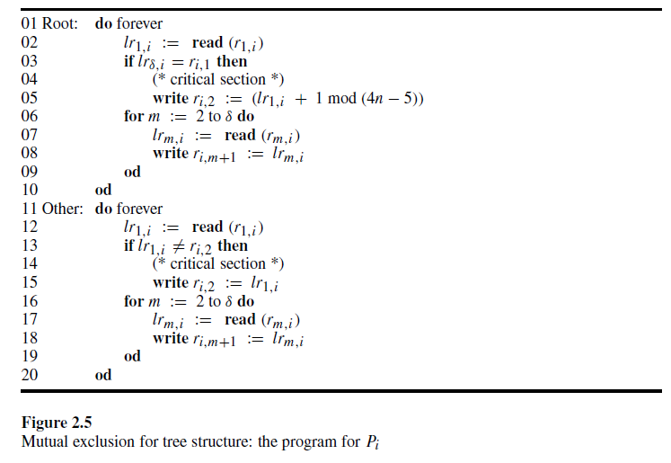

# 2 Definitions, Techniques, and Paradigms

This chapter is devoted to formalizing the distributed system, the basic assumptions, the requirements, and the complexity measures. The formal definitions are then used in the description of basic techniques and paradigms in the design of self-stabilizing algorithms and in proving their correctness.

本章致力于形式化分布式系统、基本假设、需求和复杂性度量。然后，这些形式化定义将用于描述自稳定算法设计中的基本技术和范式，并证明其正确性。

## 2.1 Definitions of the Computational Model

The term *distributed system* is used to describe communication networks, multiprocessor computers, and a multitasking single computer. All the above variants of distributed systems have similar fundamental coordination requirements among the communicating entities, whether they are computers, processors, or processes. Thus **an abstract model** that **ignores the specific setting** and captures the important characteristics of a distributed system is usually employed.

*分布式系统* 一词用于描述通信网络、多处理器计算机和多任务单计算机。上述所有分布式系统的变体在通信实体（无论是计算机、处理器还是进程）之间都有类似的基本协调需求。因此，通常采用一种**忽略具体设置**并捕捉分布式系统重要特征的**抽象模型**。

Each computer runs a program composed of executable statements. Each execution of a statement changes the content of the computer’s local memory, including the program counter. In other words, the computer changes state with each statement execution. An abstract way to model a computer that executes a program is to use the state machine model. **A distributed system is modeled by a set of $n$ state machines called processors that communicate with each other. We usually denote the $i$ th processor in the system by $P_i$ . Each processor can communicate with other processors, called its neighbors.** It is convenient to represent a distributed system by a communication graph in which each processor is represented by a node and every two neighboring processors are connected by a link of the communication graph.

每台计算机运行由可执行语句组成的程序。每次执行语句都会改变计算机本地内存的内容，包括程序计数器。换句话说，计算机在每次语句执行时都会改变状态。抽象地说，执行程序的计算机可以用状态机模型来表示。**分布式系统由一组称为处理器的 $n$ 个状态机组成，它们相互通信。我们通常用 $P_i$ 表示系统中的第 $i$ 个处理器。每个处理器可以与其他处理器（称为其邻居）通信。**用通信图表示分布式系统是很方便的，其中每个处理器用一个节点表示，每两个相邻的处理器通过通信图的一个链接连接。

**The communication between neighboring processors can be carried out by message passing or shared memory. Communication by writing in, and reading from, the shared memory usually fits systems with processors that are geographically close together, such as multiprocessor computers or processes executed by a multitasking single-processor computer. A message-passing distributed model fits both processors that are located close to each other and wide-area distributed systems, such as communication networks.**

**相邻处理器之间的通信可以通过消息传递或共享内存进行。通过写入和读取共享内存进行通信通常适用于地理位置接近的处理器系统，例如多处理器计算机或由多任务单处理器计算机执行的进程。消息传递分布式模型适用于彼此靠近的处理器和广域分布式系统，例如通信网络。**

In the message-passing model, neighbors communicate by sending and receiving messages. In asynchronous distributed systems, the speed of processors and message transmission can vary. First-in first-out (FIFO) queues are used to model asynchronous delivery of messages. A communication link is either unidirectional or bidirectional. **A unidirectional communication link from processor $P_i$ to processor $P_j$ transfers messages from $P_i$ to $P_j$ . The abstraction used for such a unidirectional link is a first-in first-out (FIFO) queue $q_{i,j}$ , that contains all messages sent by a processor $P_i$ to its neighbor $P_j$ that have not yet been received.** Whenever $P_i$ sends a message $m$ to $P_j$, the message is enqueued (added to the tail of the queue). $P_j$ may receive the message $m$ that is at the head of the queue; in such a case, the message $m$ is dequeued (removed from the front of the queue). The bidirectional communication link between processors $P_i$ and $P_j$ is modeled by two FIFO queues, one from $P_i$ to $P_j$ and the other from $P_j$ to $P_i$.

在消息传递模型中，相邻节点通过发送和接收消息进行通信。在异步分布式系统中，处理器的速度和消息传输的速度可以有所不同。先进先出（FIFO）队列用于模拟消息的异步传递。通信链路可以是单向的或双向的。**从处理器 $P_i$ 到处理器 $P_j$ 的单向通信链路将消息从 $P_i$ 传输到 $P_j$。用于这种单向链路的抽象是先进先出（FIFO）队列 $q_{i,j}$，它包含了所有由处理器 $P_i$ 发送给其邻居 $P_j$ 但尚未被接收的消息。**每当 $P_i$ 向 $P_j$ 发送消息 $m$ 时，该消息会被入队（添加到队列的尾部）。$P_j$ 可以接收位于队列头部的消息 $m$；在这种情况下，消息 $m$ 会被出队（从队列的前端移除）。处理器 $P_i$ 和 $P_j$ 之间的双向通信链路由两个 FIFO 队列建模，一个从 $P_i$ 到 $P_j$，另一个从 $P_j$ 到 $P_i$。

It is very convenient to identify the state of a computer or a distributed system at a given time, so that no additional information about the past of the computation is needed in order to predict the future behavior (state transitions) of the computer or the distributed system. **A full description of a message passing distributed system at a particular time consists of the state of every processor and the content of every queue (messages pending in the communication links). The term *system configuration* (or *configuration*) is used for such a description.** A configuration is denoted by $c = (s_1, s_2, ..., s_n, q_{1,2}, q_{1,3}, ..., q_{i,j}, ..., q_{n-1,n})$, where $s_i$, $1 ≤ i ≤ n$, is the state of $P_i$ and $q_{i,j}$, $i ≠ j$, is the queue of messages sent by $P_i$ to $P_j$ but not yet received.

在某个特定时间识别计算机或分布式系统的状态非常方便，这样就不需要额外的信息来预测计算机或分布式系统的未来行为（状态转换）。**在特定时间对消息传递分布式系统的完整描述包括每个处理器的状态和每个队列的内容（通信链路中未处理的消息）。这种描述称为系统配置（或配置）。**配置表示为 $c = (s_1, s_2, ..., s_n, q_{1,2}, q_{1,3}, ..., q_{i,j}, ..., q_{n-1,n})$，其中 $s_i$，$1 ≤ i ≤ n$，是 $P_i$ 的状态，$q_{i,j}$，$i ≠ j$，是 $P_i$ 发送给 $P_j$ 但尚未接收的消息队列。

**In the shared memory model, processors communicate by the use of shared communication registers (hereafter *registers*). Processors may write in a set of registers and may read from a possibly different set of registers. The configuration of the system consists of the state of all processors and the contents of the registers.** A configuration with $n$ processors and $m$ communication registers is denoted by $c = (s_1, s_2, ..., s_n; r_1, r_2, ..., r_m)$, where $s_i$, $1 ≤ i ≤ n$, is the state of $P_i$ and for $1 ≤ j ≤ m$, $r_j$ is the contents of a communication register.

**在共享内存模型中，处理器通过使用共享通信寄存器（以下简称 *寄存器*）进行通信。处理器可以写入一组寄存器，并且可以从可能不同的一组寄存器中读取。系统的配置包括所有处理器的状态和寄存器的内容。**具有 $n$ 个处理器和 $m$ 个通信寄存器的配置表示为 $c = (s_1, s_2, ..., s_n; r_1, r_2, ..., r_m)$，其中 $s_i$，$1 ≤ i ≤ n$，是 $P_i$ 的状态，对于 $1 ≤ j ≤ m$，$r_j$ 是通信寄存器的内容。

The future state transitions of a stand-alone computer that executes a (non-interactive) program can be deterministically predicted from its current state. Note that, for a stand-alone computer, the speed of the state transitions may not be fixed (in a multitasking computer environment, the period of time for which each task is executed may change over time); nevertheless, when the tasks are totally independent, we can predict the state of each task following the $i$ th state transition of this task. The situation in distributed systems is different. Nondeterminism due to different speeds of processors and of message delivery can result in totally different state transitions of processors from identical initial states. For example, a processor waiting to receive messages from one of each of its neighbors may act differently if a message from neighbor $P_i$ arrives before a message from $P_j$ , or vice versa. **In other words, scheduling of events in a distributed system influences the transitions made by the processors. The situation is even more complicated, since processors execute program statements in parallel at different rates.**

执行（非交互式）程序的独立计算机的未来状态转换可以从其当前状态确定性地预测。注意，对于独立计算机，状态转换的速度可能不是固定的（在多任务计算机环境中，每个任务执行的时间段可能会随时间变化）；尽管如此，当任务完全独立时，我们可以在该任务的第 $i$ 次状态转换后预测每个任务的状态。分布式系统中的情况则不同。由于处理器和消息传递速度的不同导致的不确定性可能会导致处理器从相同的初始状态进行完全不同的状态转换。例如，一个处理器等待从每个邻居接收消息时，如果来自邻居 $P_i$ 的消息先于来自 $P_j$ 的消息到达，或者反之亦然，它可能会有不同的行为。换句话说，**分布式系统中事件的调度会影响处理器的转换。情况更加复杂，因为处理器以不同的速率并行执行程序语句。**

**The interleaving model is used to reason about the behavior of the distributed system.** In this model it is assumed that, at each given time, only a single processor executes a *computation step* (also called an *atomic step*). **Each computation step consists of internal computation and a single communication operation: a send or receive in message passing systems and a write or read in shared memory systems.** Note that a computation step may consist of local computations (e.g., subtraction of the values of two local registers of the processors) in addition to the communication operation. Without loss of generality, the time at which all the local operations between two communication operations of a processor occur is assumed to be immediately before the second communication operation. Thus, **it is possible to assume that every state transition of a process is due to communication-step execution** (including all local computations that follow the previous step and precede the communication operation of the computation step).

**交错模型用于推理分布式系统的行为。**在该模型中，假设在每个给定时间，只有一个处理器执行一个 *计算步骤*（也称为 *原子步骤*）。**每个计算步骤包括内部计算和一个通信操作：在消息传递系统中是发送或接收，在共享内存系统中是写入或读取。**注意，计算步骤除了通信操作外，还可能包括本地计算（例如，处理器的两个本地寄存器值的减法）。在不失一般性的情况下，假设处理器的两个通信操作之间的所有本地操作发生的时间是紧接在第二个通信操作之前。因此，**可以假设进程的每个状态转换都是由于通信步骤的执行**（包括所有在前一步之后和计算步骤的通信操作之前的本地计算）。

Note that **a distributed system allows the processors to execute steps concurrently**; however, **when processors execute steps concurrently we assume that there is no influence of one step on the other**. This is clearly true for send and receive operations that are executed simultaneously, because a message sent cannot be received by a receive operation that is executed at the same time. As for shared memory, it is assumed that the communication register architecture guarantees serialization: the read and write operations can be ordered in a total order such that the result of a read operation from some register is the value that was written last before this read (according to the total order) in that register.

请注意，**分布式系统允许处理器并发执行步骤**；然而，**当处理器并发执行步骤时，我们假设一个步骤不会对另一个步骤产生影响。**这对于同时执行的发送和接收操作显然是正确的，因为发送的消息不能被同时执行的接收操作接收。对于共享内存，假设通信寄存器架构保证了序列化：读和写操作可以按总顺序排列，使得从某个寄存器进行的读操作的结果是该寄存器中在此读操作之前最后写入的值（根据总顺序）。

In what follows, we use the term *step* for a computation step and we **denote a step (together with the identity of the processor that executes it) by $a$.** Let $c_1$ and $c_2$ be two configurations of the system, **where $c_2$ is reached from $c_1$ by a single step $a$ of a processor; we denote this fact by $c_1 \xrightarrow{a} c_2$.** The step $a$ is *applicable* to a configuration $c$ if (and only if) there exists a configuration $c’$ such that $c \xrightarrow{a} c’$.

An execution $E = (c_1, a_1, c_2, a_2,···)$ (in the interleaving model) is **an alternating sequence of configurations and steps** such that $c_{i−1} \xrightarrow{a_{i−1}} c_i$ ($i > 1$); in other words, the configuration $c_i$ ($i > 1$) is obtained from $c_{i−1}$ by the execution of step $a_{i−1}$. For instance, if in step ai the processor $P_j$ writes the value $x$ to a register $r_k$ , then the only components that do not have identical values in $c_i$ and $c_{i+1}$ are the state of $P_j$ and the value of $r_k$ , which were changed according to $a_i$. A *fair* execution is **an execution in which every step that is applicable infinitely often is executed infinitely often**. In particular, if (infinitely often) a processor has a step to execute then the processor executes this step (infinitely often).

在下文中，我们使用术语 *步骤* 来表示计算步骤，并**用 $a$ 表示一个步骤**（以及执行该步骤的处理器的身份）。设 $c_1$ 和 $c_2$ 是系统的两个配置，**其中 $c_2$ 通过处理器的单个步骤 $a$ 从 $c_1$ 达到；我们用 $c_1 \xrightarrow{a} c_2$ 表示这一事实**。当且仅当存在一个配置 $c'$ 使得 $c \xrightarrow{a} c'$ 时，步骤 $a$ 才 *适用* 于配置 $c$。

一个执行 $E = (c_1, a_1, c_2, a_2,···)$（在交错模型中）是**配置和步骤的交替序列**，使得 $c_{i−1} \xrightarrow{a_{i−1}} c_i \, (i>1)$；换句话说，配置 $c_i \, (i>1)$ 是通过执行步骤 $a_{i−1}$ 从 $c_{i−1}$ 获得的。例如，如果在步骤 $a_i$ 中处理器 $P_j$ 将值 $x$ 写入寄存器 $r_k$，那么在 $c_i$ 和 $c_{i+1}$ 中唯一不具有相同值的组件是 $P_j$ 的状态和 $r_k$ 的值，它们根据 $a_i$ 发生了变化。*公平* 执行是指**每个无限次适用的步骤都被无限次执行的执行**。特别地，如果（无限次）一个处理器有一个步骤要执行，那么处理器就会执行这个步骤（无限次）。

In a **message-passing system**, it is possible that a message will be lost during the execution of the algorithm; the reason is unreliable communication media that may lose or corrupt messages in transit. Error-detection codes are used to identify and discard corrupted messages, and these messages can be considered lost messages. To model such systems, we extend the definition of a step to include *environment steps* of type $loss_{i,j}(m)$.

The environment step $loss_{i,j}(m)$ is applicable to a configuration $c_k$ in which the queue $q_{i,j}$ contains the message $m$. The application of $loss_{i,j}(m)$ to $c_k$ results in a configuration $c_{k+1}$ in which $m$ is **removed** from $q_{i,j}$ , and $c_k$ and $c_{k+1}$ are identical in the rest of their components.

Unlike steps executed by processors, we do not require that, in every infinite fair execution, the environment steps that are applicable infinitely often will be executed infinitely often. **We do require that, in a fair execution in which a message is sent infinitely often, the message must be received infinitely often.** To satisfy fairness the receive step must be executed infinitely often, while the loss step should not be executed infinitely often.

在**消息传递系统**中，算法执行过程中可能会丢失消息；原因是通信介质不可靠，可能会在传输过程中丢失或损坏消息。错误检测码用于识别和丢弃损坏的消息，这些消息可以被视为丢失的消息。为了对这种系统建模，我们扩展了步骤的定义，包括类型为 $loss_{i,j}(m)$ 的环境步骤。

环境步骤 $loss_{i,j}(m)$ 适用于队列 $q_{i,j}$ 包含消息 $m$ 的配置 $c_k$*将 $loss_{i,j}(m)$ 应用于 $c_k$ 会导致配置 $c_{k+1}$，其中 $m$ 从 $q_{i,j}$ 中**移除**，$c_k$ 和 $c_{k+1}$ 在其余组件中是相同的。

与处理器执行的步骤不同，我们不要求在每个无限公平执行中，无限次适用的环境步骤将被无限次执行。**我们确实要求，在一个消息无限次发送的公平执行中，该消息必须被无限次接收。**为了满足公平性，接收步骤必须被无限次执行，而丢失步骤不应被无限次执行。

Up to this stage, we have presented the class of distributed systems called *asynchronous* distributed systems. The experience of distributed algorithm designers is that algorithms designed for asynchronous systems perform well in communication networks and multiprocessor systems. **Yet there is a class of distributed algorithms designed for *synchronous* distributed systems in which a *global clock pulse* (or simply a *pulse*) triggers a simultaneous step of every processor in the system.** This class of synchronous algorithms fits multiprocessor systems in which the processors are located close to each other and can therefore be efficiently connected to a common clock pulse. Next we describe the assumptions concerning the steps of the processors in synchronous message-passing and shared-memory systems.

到目前为止，我们已经介绍了称为 *异步* 分布式系统的分布式系统类别。分布式算法设计者的经验是，为异步系统设计的算法在通信网络和多处理器系统中表现良好。然而，还有一类**为 *同步* 分布式系统设计的分布式算法**，其中 ***全局时钟脉冲*（或简称 *脉冲*）触发系统中每个处理器的同步步骤**。这类同步算法适用于处理器彼此靠近并且可以高效连接到公共时钟脉冲的多处理器系统。接下来，我们描述同步消息传递和共享内存系统中处理器步骤的假设。

The following actions are performed between each successive pulses of a synchronous message-passing system: the pulse triggers message send operations of every processor to every one of its neighbors, then every message is received by its destination. In the shared memory system, a pulse triggers each processor to read all the registers of its neighbors. Once every processor has finished reading, the processors can write into their registers. Thus, since all the processors execute a step simultaneously, **the execution of a synchronous system $E = (c_1, c_2,···)$ is totally defined by $c_1$, the first configuration in $E$.**

在同步消息传递系统的每个连续脉冲之间执行以下操作：脉冲触发每个处理器向其所有邻居发送消息操作，然后每条消息被其目的地接收。在共享内存系统中，脉冲触发每个处理器读取其所有邻居的寄存器。一旦每个处理器完成读取，处理器就可以写入它们的寄存器。因此，由于所有处理器同时执行一个步骤，**同步系统的执行 $E = (c_1, c_2,···)$ 完全由 $c_1$（即 $E$ 中的第一个配置）定义。**

## 2.2 Self-Stabilization Requirements

**A self-stabilizing system can be started in any arbitrary configuration and will eventually exhibit a desired “legal” behavior.**

**We define the desired legal behavior by a set of legal executions denoted $LE$.** A set of legal executions is defined for a particular system and a particular task. **Every system execution of a self-stabilizing system should have a suffix that appears in $LE$.** For instance, when the task is *mutual exclusion*, the task is defined by the set of legal executions in which, in every configuration, there is at most one processor in the critical section, and in which every processor is in the critical section in an infinite number of configurations of the execution.

**A configuration $c$ is *safe* with regard to a task $LE$ and an algorithm if every fair execution of the algorithm that starts from $c$ belongs to $LE$.**

**An algorithm is *self-stabilizing* for a task $LE$ if every fair execution of the algorithm reaches a safe configuration with relation to $LE$.**

**自稳定系统可以从任何任意配置开始，并最终表现出期望的“合法”行为。**

**我们通过一组合法执行（记为 $LE$）来定义期望的合法行为。**对于特定系统和特定任务，定义了一组合法执行。**自稳定系统的每个系统执行都应该有一个后缀出现在 $LE$ 中。**例如，当任务是 *互斥* 时，该任务由一组合法执行定义，在每个配置中，最多只有一个处理器在临界区，并且每个处理器在执行的无限多个配置中都在临界区。

**对于任务 $LE$ 和算法，如果从配置 $c$ 开始的算法的每个公平执行都属于 $LE$，则配置 $c$ 对该任务是安全的。**

**如果算法的每个公平执行都达到与任务 $LE$ 相关的安全配置，则该算法对任务 $LE$ 是 *自稳定* 的。**

## 2.3 Complexity Measures

The complexity measures used to evaluate an algorithm include time complexity and space (memory) complexity. At first glance, the attempt to define the time complexity of asynchronous systems may seem to contradict the asynchronous nature of the system. By the definition of asynchronous systems, there is no bound on the rate/speed of step-executions/message-arrivals. However, in order to evaluate and compare different asynchronous algorithms, it is convenient to use the number of *asynchronous rounds* to measure the time complexity of a particular execution. The first *asynchronous round* (or *round*) in an execution $E$ is the shortest prefix $E'$ of E **such that each processor executes at least one step in $E’$**. Let $E''$ be the suffix of $E$ that follows $E’$, $E = E'E''$. The second round of $E$ is the first round of $E''$, and so on. The number of rounds in the execution of an algorithm is used to measure the time complexity of the algorithm.

用于评估算法的复杂度度量包括时间复杂度和空间（内存）复杂度。乍一看，试图定义异步系统的时间复杂度似乎与系统的异步性质相矛盾。根据异步系统的定义，步骤执行/消息到达的速率/速度没有上限。然而，为了评估和比较不同的异步算法，使用 *异步轮* 数来衡量特定执行的时间复杂度是很方便的。执行 $E$ 中的第一个 *异步轮*（或 *轮*）是 $E$ 的最短前缀 $E'$，使得**每个处理器在 $E'$ 中至少执行一步**。设 $E''$ 为 $E$ 的后缀，紧随 $E'$ 之后，$E = E'E''$。$E$ 的第二轮是 $E''$ 的第一轮，依此类推。算法执行中的轮数用于衡量算法的时间复杂度。

Intuitively, **the definition of an asynchronous round nullifies the speed differences of the processors by stretching the round to be long enough to include a step (including a communication operation) of the slowest processor in this execution segment. Thus, information can be transferred through the slowest processor even if that processor resides in a node that can separate the communication graph.** Moreover, if the speeds of the processors are identical and the speeds of message transmission are also identical, every asynchronous round elapses in the same constant time interval.

直观地说，**异步轮的定义通过将轮延长到足够长，以包括此执行段中最慢处理器的一步（包括通信操作），从而消除了处理器速度的差异。因此，即使该处理器位于可以分隔通信图的节点中，信息也可以通过最慢的处理器传输。**此外，如果处理器的速度相同且消息传输的速度也相同，则每个异步轮在相同的恒定时间间隔内经过。

**A self-stabilizing algorithm never terminates, and processors must repeatedly communicate with their neighbors.** In the shared-memory model, processors must repeatedly read the registers of their neighbors and in the message passing model, processors must continue to send and receive messages forever.

The following argument is used to explain why termination cannot be achieved: assume that every processor $P_i$ has a state $s_i$ in which $P_i$ is **terminated**. By the self-stabilizing property of the algorithm, the system must reach a safe configuration from any initial configuration. When the system is started in a configuration $c$ in which every processor $P_i$ is in state $s_i$, no processor executes any step, and thus $c$ must be a safe configuration. Therefore the task of the algorithm is achieved when every processor $P_i$ has only one state, namely the state $s_i$. Obviously, such tasks do not require any communication between the processors and the “algorithm” that is used is not a distributed algorithm.

**自稳定算法永不终止，处理器必须反复与其邻居通信。**在共享内存模型中，处理器必须反复读取其邻居的寄存器；在消息传递模型中，处理器必须不断发送和接收消息。

以下论点用于解释为什么无法实现终止：假设每个处理器 $P_i$ 有一个状态 $s_i$，其中 $P_i$ **终止**。根据算法的自稳定性，系统必须从任何初始配置达到安全配置。当系统在配置 $c$ 中启动时，其中每个处理器 $P_i$ 都处于状态 $s_i$，没有处理器执行任何步骤，因此 $c$ 必须是一个安全配置。因此，当每个处理器 $P_i$ 只有一个状态，即状态 $s_i$ 时，算法的任务就完成了。显然，这样的任务不需要处理器之间的任何通信，并且所使用的“算法”不是分布式算法。

The non-termination property can be easily identified in the code of a self-stabilizing algorithm: this code is usually a do forever loop that contains communication operations with the neighbors. For example, **in the shared memory case, the code of the algorithm for a processor $P_i$ usually starts with read operations of the communication registers of $P_i$ and then local computations that are followed by write operations in the communication registers of  $P_i$. The number of steps required to execute a single iteration of such a do forever loop is $O(\triangle)$, where $\triangle$ is an upper bound on the degree (number of neighbors) of  $P_i$**. In some of the proofs, it is very convenient to consider the configuration that follows at least one complete execution of an iteration of the do forever loop by every processor. **Note that a processor can be started in (a state in which it is in) the middle of executing an iteration of the do forever loop. However, if $x$ is the number of steps required to complete an iteration of the do forever loop, then fewer than $2x$ steps are required to complete an iteration of the loop (from the beginning of the loop to its end) when $P_i$ is started in an arbitrary state.**

自稳定算法的非终止特性可以很容易地在代码中识别出来：这段代码通常是一个包含与邻居通信操作的永久循环。例如，**在共享内存情况下，处理器 $P_i$ 的算法代码通常以读取 $P_i$ 的通信寄存器操作开始，然后是本地计算，接着是写入 $P_i$ 的通信寄存器操作。执行这样一个永久循环的单次迭代所需的步骤数是 $O(\triangle)$，其中 $\triangle$ 是 $P_i$ 的度（邻居数量）的上限。**在一些证明中，考虑每个处理器至少完整执行一次永久循环迭代后的配置是非常方便的。注意，**处理器可以在执行永久循环迭代的中间状态启动。然而，如果完成永久循环迭代所需的步骤数为 $x$，那么当 $P_i$ 从任意状态启动时，完成循环迭代（从循环的开始到结束）所需的步骤数少于 $2x$。**

For the sake of readability, we extend the definition of an asynchronous round to an asynchronous *cycle* when convenient. **The first *asynchronous cycle* (or *cycle*) in an execution $E$ is the shortest prefix $E'$ of $E$ such that each processor executes at least one complete iteration of its do forever loop in $E'$. Let $E''$ be the suffix of $E$ that follows $E'$, $E = E'E''$. The second cycle of $E$ is the first cycle of $E'$, and so on.**

为了便于阅读，我们在方便时将异步轮的定义扩展为异步 *周期*。**执行 $E$ 中的第一个 *异步周期*（或 *周期*）是 $E$ 的最短前缀 $E'$，使得每个处理器在 $E'$ 中至少执行一次其永久循环的完整迭代。设 $E''$ 为 $E$ 的后缀，紧随 $E'$ 之后，$E = E'E''$。$E$ 的第二个周期是 $E''$ 的第一个周期，依此类推。**

Note that if the do forever iteration consists of reading the communication registers of the neighbors, local computations, and writing to the communication registers, then each cycle spans $O(\triangle)$ rounds.

请注意，如果永久循环的迭代包括读取邻居的通信寄存器、本地计算和写入通信寄存器，那么每个周期跨越 $O(\triangle)$ 轮。

The time complexity of a synchronous algorithm is the number of pulses in the execution (which corresponds to the number of rounds).

同步算法的时间复杂度是执行中的脉冲数（对应于轮数）。

The space complexity of an algorithm is the total number of (local and shared) memory bits used to implement the algorithm.

算法的空间复杂度是用于实现算法的（本地和共享）内存位的总数。

## 2.4 Randomized Self-Stabilization

随机自稳定

So far we have not concerned ourselves with randomized algorithms — i.e., those that use coin-toss or random-function results to determine their actions. An important subject in self-stabilization research is the study of randomized self-stabilizing algorithms. Breaking symmetry is sometimes impossible without using randomization.

In order to define the requirements for randomized self-stabilizing algorithms, we use the following assumptions and definitions. Processor activity is managed by a scheduler. The scheduler is merely an abstraction of the assumption made for the interleaving model, that at most one step is executed in every given time. In any given configuration, the scheduler activates a single processor, which executes a single step. To ensure correctness of the algorithms, we regard the scheduler as an adversary. The scheduler is assumed to have unlimited resources and chooses the next activated processor *on line*, using all the information about the execution so far. A scheduler $S$ is *fair* if, for any configuration $c$ with probability 1, an execution starting from $c$ in which processors are activated by $S$ is fair.

Finally, an algorithm is *randomized self-stabilizing* for a task $LE$ if, starting with any system configuration and considering any fair scheduler, the algorithm reaches a safe configuration within an expected number of rounds that is bounded by some constant $k$ ($k$ may depend on $n$, the number of processors in the system).

Randomized algorithms are often used to break symmetry in a system of totally identical processors in which processors do not have unique identifiers. The terms *uniform* or *anonymous system* are used for such systems.

到目前为止，我们还没有涉及随机算法——即使用抛硬币或随机函数结果来决定其动作的算法。自稳定研究中的一个重要课题是随机自稳定算法的研究。在某些情况下，不使用随机化是无法打破对称性的。

为了定义随机自稳定算法的要求，我们使用以下假设和定义。处理器活动由调度器管理。调度器只是交错模型假设的抽象，即在任何给定时间内最多执行一个步骤。在任何给定配置中，调度器激活一个处理器，该处理器执行一个步骤。为了确保算法的正确性，我们将调度器视为对手。假设调度器拥有无限资源，并 *在线* 选择下一个激活的处理器，使用到目前为止的所有执行信息。如果对于任何配置 $c$，以概率 1 从 $c$ 开始的执行中，调度器 $S$ 激活处理器是公平的，则称调度器 $S$ 是 *公平* 的。

最后，如果对于任务 $LE$，从任何系统配置开始并考虑任何公平调度器，算法在期望的轮数内达到安全配置，并且该期望轮数由某个常数 $k$（$k$ 可能依赖于系统中的处理器数量 $n$）界定，则该算法是 *随机自稳定* 的。

随机算法通常用于在完全相同的处理器系统中打破对称性，这些处理器没有唯一标识符。对于这样的系统，使用 *统一* 或 *匿名系统* 术语。

## 2.5 Example: Spanning-Tree Construction

例子：生成树构造

To demonstrate the use of our definition and requirements, we present a simple self-stabilizing algorithm for marking a breadth-first search (*BFS*) spanning tree over the communication graph of the distributed system $G(V, E)$. Each node $v_i ∈ V$ represents the processor $P_i$, and each edge $(v_i, v_j) ∈ E$ indicates that $P_i$ and $P_j$ are neighbors; i.e., they can communicate with each other. For this example we use the shared memory model. A processor $P_i$ communicates with its neighbor $P_j$ by writing in the communication register $r_{ij}$ and reading from $r_{ji}$. A processor $P_i$ owns the register in which $P_i$ writes; i.e., for every neighboring processor $P_k$, the register $r_{ik}$ is owned by $P_i$.

为了展示我们定义和要求的使用，我们提出了一个简单的自稳定算法，用于标记分布式系统 $G(V, E)$ 的通信图上的广度优先搜索（*BFS*）生成树。每个节点 $v_i ∈ V$ 代表处理器 $P_i$，每条边 $(v_i, v_j) ∈ E$ 表示 $P_i$ 和 $P_j$ 是邻居；即它们可以相互通信。在这个例子中，我们使用共享内存模型。处理器 $P_i$ 通过在通信寄存器 $r_{ij}$ 中写入和从 $r_{ji}$ 中读取来与其邻居 $P_j$ 通信。处理器 $P_i$ 拥有 $P_i$ 写入的寄存器；即对于每个邻近的处理器 $P_k$，寄存器 $r_{ik}$ 由 $P_i$ 拥有。

The system consists of $n$ processors $P_1, P_2,··· , P_n$, where $P_2,··· , P_n$ run similar programs while $P_1$ is a special processor that runs a different program. $P_1$ is called the *root* processor of the tree. There is a single program that every non-root processor runs. The program has an input parameter that is the number of adjacent links of the processor. Thus, all two (non-root) processors with the same number of neighbors are identical — they run identical programs.

系统由 $n$ 个处理器 $P_1, P_2,··· , P_n$ 组成，其中 $P_2,··· , P_n$ 运行相似的程序，而 $P_1$ 是一个特殊的处理器，运行不同的程序。$P_1$ 被称为树的 *根* 处理器。每个非根处理器运行一个相同的程序。该程序有一个输入参数，即处理器的相邻链接数。因此，所有具有相同邻居数量的两个（非根）处理器是相同的——它们运行相同的程序。

Essentially **the algorithm is a distributed *BFS* algorithm**. Each processor is continuously trying to compute its distance from the root and to report this distance to all its neighbors by writing the distance in its registers. At the beginning of an arbitrary execution, the only processor guaranteed to compute the right distance is the root itself. Once this distance is written in all the root’s registers, the value stored in these registers will never be changed. **Once all processors at distance $x$ from the root have completed computing their distance from the root correctly and have written it in all their registers, their registers remain constant throughout execution**, and processors at distance $x + 1$ from the root are ready to compute their own distance from the root, and so forth.

本质上，该算法是一个**分布式的 *BFS* 算法**。每个处理器不断尝试计算其与根的距离，并通过将距离写入其寄存器来将此距离报告给所有邻居。在任意执行的开始，唯一保证能计算出正确距离的处理器是根处理器本身。**一旦这个距离被写入所有根处理器的寄存器，这些寄存器中存储的值将永远不会改变。一旦所有距离根为 $x$ 的处理器完成了与根的距离计算并将其写入所有寄存器，它们的寄存器在整个执行过程中将保持不变**，距离根为 $x + 1$ 的处理器将准备好计算它们与根的距离，依此类推。

The output tree is encoded by means of the registers as follows: each register $r_{ij}$, in which $P_i$ writes and from which $P_j$ reads, contains a binary parent field denoted by $r_{ij}.parent$. If $P_j$ is the parent of $P_i$ in the *BFS* tree, then the value of $r_{ij}.parent$ is 1; otherwise the value of $r_{ij}.parent$ is 0. In addition, each register $r_{ij}$ has a $distance$ field, denoted by $r_{ij}.dis$, that holds the distance from the root to $P_i$ . The maximal value that can be stored in the $distance$ field is $N$, where $N$ is an upper bound on the number of processors in the system. An attempt to assign a value larger than $N$ to the $distance$ field results in the assignment of $N$.

输出树通过寄存器进行编码，如下所示：每个寄存器 $r_{ij}$，其中 $P_i$ 写入并且 $P_j$ 读取，包含一个二进制的父字段，表示为 $r_{ij}.parent$。如果 $P_j$ 是 $P_i$ 在 *BFS* 树中的父节点，那么 $r_{ij}.parent$ 的值为 1；否则 $r_{ij}.parent$ 的值为 0。此外，每个寄存器 $r_{ij}$ 还有一个 $distance$ 字段，表示为 $r_{ij}.dis$，它保存从根到 $P_i$ 的距离。$distance$ 字段中可以存储的最大值是 $N$，其中 $N$ 是系统中处理器数量的上限。尝试将大于 $N$ 的值赋给 $distance$ 字段将导致该字段被赋值为 $N$。

The code of the algorithm, for the root and for the other processors, appears in figure 2.1. In this code the number of the processor’s neighbors is given by the parameter $δ$.

The program for the root is very simple: it keeps “telling” all its neighbors that it is the root by repeatedly writing the values $<0, 0>$ in all of its registers. The first 0 tells each neighbor that it is not the parent of the root, the second 0 is the distance from the root to itself.

The program for a normal processor consists of a single loop. In this loop, the processor reads all the registers of its neighbors. Processor $P_i$ , which has $δ$ neighbors, keeps $δ$ internal variables corresponding to the $δ$ registers from which $P_i$ reads. The local variable corresponding to register $r_{ji}$, ${lr}_{ji}$, stores the last value of $r_{ji}$ read by $P_i$. Its two fields are denoted by ${lr}_{ji}.parent$ and ${lr}_{ji}.dis$, respectively. Once all these registers are read, $P_i$ computes a value for the variable $dist$ that represents $P_i$’s current idea of its distance from the root. The purpose of the boolean variable $FirstFound$ is to make sure that by the end of each pass of the loop each processor has a single parent. The minimum in line 7 is taken over $m$, $1 ≤ m ≤ δ$.

算法的代码，如图 2.1 所示，分别针对根处理器和其他处理器。在此代码中，处理器的邻居数量由参数 $δ$ 给出。

根处理器的程序非常简单：它通过在所有寄存器中反复写入值 $<0, 0>$ 来不断“告诉”所有邻居它是根。第一个 0 告诉每个邻居它不是根的父节点，第二个 0 是根到自身的距离。

普通处理器的程序由一个单一的循环组成。在这个循环中，处理器读取其所有邻居的寄存器。具有 $δ$ 个邻居的处理器 $P_i$ 保留了对应于 $P_i$ 读取的 $δ$ 个寄存器的 $δ$ 个内部变量。对应于寄存器 $r_{ji}$ 的局部变量 ${lr}_{ji}$ 存储了 $P_i$ 最后读取的 $r_{ji}$ 的值。它的两个字段分别表示为 ${lr}_{ji}.parent$ 和 ${lr}_{ji}.dis$。一旦读取了所有这些寄存器，$P_i$ 就会计算一个变量 $dist$ 的值，该值表示 $P_i$ 当前认为的它与根的距离。布尔变量 $FirstFound$ 的目的是确保在每次循环结束时每个处理器都有一个单一的父节点。第 7 行的最小值取自 $m$，$1 ≤ m ≤ δ$。

In figure 2.1 we use a program to define implicitly the set of states and the transition function of a processor. The state of a processor consists of the value of the program counter and the values of the internal variables: $m$, ${lr}_{ji}$ (for every $1 ≤ j ≤ δ$), $FirstFound$, and $dist$.

A computation step of the root processor starts with local computations that update the value of m (increment the value of $m$ by one if $m ≤ δ$, or assign $m$ := 1 otherwise). The single communication operation that is executed in a computation step of the root is a write operation of $<0, 0>$ in $r_{im}$ (where the value of $m$ is defined by the preceding local computations). The computation steps end with this write operation. The next computation step starts with the local computation that immediately follows the last write operation, and so on.

Similarly, a computation step of the non-root processor terminates in one of the three communication operations ($\text{read}(r_{mi}), \text{write}(r_{im}) := <1, dis>$ or $\text{write}(r_{im}) := <0, dis>$), and the next computation starts immediately following this communication operation.

One can argue that, in the context of self-stabilization, the value of the program counter can be arbitrary in the first system configuration and not restricted to the first local computation that follows a communication operation. Thus, it is possible that, in line 10 of the code, a $dist$ value that was not computed in line 7 is used. However, following the first computation step every computation step is well structured: it starts immediately following a communication operation and ends with the next communication operation.

在图 2.1 中，我们使用一个程序隐式地定义了处理器的状态集合和转换函数。处理器的状态包括程序计数器的值和内部变量的值：$m$，${lr}_{ji}$（对于每个 $1 ≤ j ≤ δ$），$FirstFound$ 和 $dist$。

根处理器的计算步骤从更新 $m$ 的值的本地计算开始（如果 $m ≤ δ$，则将 $m$ 的值加一，否则将 $m$ 赋值为 1）。根处理器在计算步骤中执行的唯一通信操作是在 $r_{im}$ 中写入 $<0, 0>$（其中 $m$ 的值由前面的本地计算定义）。计算步骤以此写操作结束。下一计算步骤从紧接上次写操作后的本地计算开始，依此类推。

类似地，非根处理器的计算步骤在三种通信操作之一结束（$\text{read}(r_{mi})$，$\text{write}(r_{im}) := <1, dis>$ 或 $\text{write}(r_{im}) := <0, dis>$），下一计算步骤紧接着此通信操作开始。

可以认为，在自稳定的上下文中，程序计数器的值在第一个系统配置中可以是任意的，而不局限于通信操作后的第一个本地计算。因此，在代码的第 10 行中，可能会使用第 7 行中未计算的 $dist$ 值。然而，在第一次计算步骤之后，每个计算步骤都是结构良好的：它从通信操作后立即开始，并以下一次通信操作结束。

The value of each communication register is a combination of a binary value (for the $parent$ field) and an integer (no larger than $N$ for the $dis$ field). A configuration of the system is a vector of the processor states and a vector of communication register values.

每个通信寄存器的值是二进制值（用于 $parent$ 字段）和整数（用于 $dis$ 字段，且不大于 $N$）的组合。系统的配置是处理器状态向量和通信寄存器值向量的组合。

**The task $ST$ of legitimate sequences is defined as the set of all configuration sequences in which every configuration encodes a *BFS* tree of the communication graph. In fact, a particular *BFS* tree called the *first BFS tree* is encoded.** Let $α = (α_1, α_2, ...α_n)$ be the arbitrary ordering of the edges incident to each node $v_i ∈ V$. The first *BFS* tree of a communication graph $G$ is uniquely defined by the choice of the root $v_1$ and $α$. When a node $v_i$ of distance $x +1$ from $v_1$ has more than a single neighbor of distance $x$ from $v_1$, **$v_i$ is connected to its first neighbor according to $α_i$**, whose distance from $v_1$ is $x$. In the lemma below, we use the definition of the first *BFS* tree to characterize the set of safe configurations for the algorithm.

**合法序列任务 $ST$ 定义为所有配置序列的集合，其中每个配置都编码了通信图的一个 *BFS* 树。实际上，编码的是一个特定的 *BFS* 树，称为 *第一个 BFS 树*。**设 $α = (α_1, α_2, ...α_n)$ 为每个节点 $v_i ∈ V$ 的边的任意排序。通信图 $G$ 的 *第一个 BFS 树* 由根 $v_1$ 和 $α$ 唯一定义。当距离 $v_1$ 为 $x + 1$ 的节点 $v_i$ 有多个距离 $v_1$ 为 $x$ 的邻居时，**$v_i$ 根据 $α_i$ 连接到其第一个邻居**，该邻居距离 $v_1$ 为 $x$。在下面的引理中，我们使用第一个 *BFS* 树的定义来描述算法的一组安全配置。

The lemma below shows that, in every execution, a safe configuration is reached. **We use $\triangle$ to denote the maximum number of links adjacent to a processor**, and use the following definitions of *floating distances* and *smallest floating distance* in our proof.

下面的引理表明，在每次执行中，都会达到一个安全配置。**我们用 $\triangle$ 表示与处理器相邻的最大链接数**，并在证明中使用以下 *浮动距离* 和 *最小浮动距离* 的定义。

---

> DEFINITION 2.1: A floating distance in some configuration c is a value in a register $r_{ij}.dis$ that is smaller than the distance of $P_i$ from the root. The smallest floating distance in some configuration $c$ is the smallest value among the floating distances.
>
> 定义 2.1：在某个配置 $c$ 中，浮动距离是寄存器 $r_{ij}.dis$ 中的一个值，该值小于 $P_i$ 到根的距离。在某个配置 $c$ 中，最小浮动距离是浮动距离中的最小值。

---

> LEMMA 2.1: For every $k > 0$ and for every configuration that follows $\triangle+ 4k\triangle$ rounds, it holds that:
>
> *Assertion 1:* If there exists a floating distance, then the value of the smallest floating distance is at least $k$.
>
> *Assertion 2:* The value in the registers of every processor that is within distance $k$ from the root is equal to its distance from the root.
>
> 引理 2.1：对于每个 $k > 0$ 和每个经过 $\triangle+ 4k\triangle$ 轮次后的配置，满足以下条件：
>
> *断言 1：*如果存在浮动距离，那么最小浮动距离的值至少为 $k$。
>
> *断言 2：*每个距离根为 $k$ 以内的处理器的寄存器中的值等于其与根的距离。

*Proof:*

Note that in every $2\triangle$ successive rounds, each processor reads the registers of all its neighbors and writes to each of its registers. We prove the lemma by induction over $k$.

*Base case:*

(proof for $k = 1$) Distances stored in the registers and internal variables are non-negative; thus the value of the smallest floating distance is at least 0 in the first configuration. During the first $2\triangle$ rounds, each non-root processor $P_i$ computes the value of the variable $dist$ (line 7 of the code in figure 2.1). The result of each such computation must be greater than or equal to 1. Let $c_2$ be the configuration reached following the first computation of the value of $dist$ by each processor. Each non-root processor writes to each of its registers the computed value of $dist$ during the $2\triangle$ rounds that follow $c_2$. Thus, in every configuration that follows the first $4\triangle$ rounds there is no non-root processor with value 0 in its registers. The above proves assertion 1.

To prove assertion 2, note that the root repeatedly writes the distance 0 to its registers in every $\triangle$ rounds. Let $c_1$ be the configuration reached after these $\triangle$ rounds. Each processor reads the registers of the root and then writes to its own registers during the $4\triangle$ rounds that follow $c_1$. In this write operation the processor assigns 1 to its own registers. Any further read of the root registers returns the value 0; therefore, the value of the registers of each neighbor of the root is 1 following the first $\triangle+ 4\triangle$ rounds. Thus, assertion 2 holds as well.

*Induction step:*

(assume correctness for $k ≥ 0$ and prove for $k + 1$) Let $m ≥ k$ be the smallest floating distance in the configuration $c_{4k}$ that follows the first $\triangle+ 4k\triangle$ rounds. During the $4\triangle$ rounds that follow $c_{4k}$, each processor that reads $m$ and chooses $m$ as the smallest value assigns $m + 1$ to its distance and writes this value. Therefore, the smallest floating distance value is $m +1$ in the configuration $c_{4(k+1)}$. This proves assertion 1.

Since the smallest floating distance is $m ≥ k$, it is clear that each processor reads the distance of a neighboring processor of distance $k$ and assigns $k + 1$ to its distance. (End)

*证明：*

注意，在每 $2\triangle$ 连续轮次中，每个处理器读取其所有邻居的寄存器并写入其每个寄存器。我们通过对 $k$ 进行归纳来证明这个引理。

*基本情况：*

（证明 $k = 1$）寄存器和内部变量中存储的距离是非负的；因此，在第一个配置中，最小浮动距离的值至少为 0。在前 $2\triangle$ 轮次中，每个非根处理器 $P_i$ 计算变量 $dist$ 的值（图 2.1 中代码的第 7 行）。每次这样的计算结果必须大于或等于 1。设 $c_2$ 为每个处理器首次计算 $dist$ 值后的配置。在 $c_2$ 之后的 $2\triangle$ 轮次中，每个非根处理器将计算出的 $dist$ 值写入其每个寄存器。因此，在前 $4\triangle$ 轮次之后的每个配置中，没有非根处理器的寄存器值为 0。以上证明了断言 1。

为了证明断言 2，注意根在每 $\triangle$ 轮次中反复将距离 0 写入其寄存器。设 $c_1$ 为这些 $\triangle$ 轮次后的配置。每个处理器读取根的寄存器，然后在 $c_1$ 之后的 $4\triangle$ 轮次中将其写入自己的寄存器。在此写操作中，处理器将 1 赋给其自己的寄存器。任何进一步读取根寄存器的操作都会返回值 0；因此，在前 $\triangle+ 4\triangle$ 轮次之后，每个根邻居的寄存器值为 1。因此，断言 2 也成立。

*归纳步骤：*

（假设 $k ≥ 0$ 时正确，并证明 $k + 1$ 时正确）设 $m ≥ k$ 为前 $\triangle+ 4k\triangle$ 轮次后的配置 $c_{4k}$ 中的最小浮动距离。在 $c_{4k}$ 之后的 $4\triangle$ 轮次中，每个读取 $m$ 并选择 $m$ 作为最小值的处理器将 $m + 1$ 赋给其距离并写入该值。因此，在配置 $c_{4(k+1)}$ 中，最小浮动距离值为 $m +1$。这证明了断言 1。

由于最小浮动距离为 $m ≥ k$，显然每个处理器读取距离为 $k$ 的邻居处理器的距离并将其距离赋值为 $k + 1$。（完）

---

The next corollary is implied by lemma 2.1. Note that once the value in the registers of every processor is equal to its distance from the root, a processor $P_i$ chooses its parent to be the parent in the first *BFS* tree — $P_i$ chooses the first neighbor according to $α_i$, with distance smaller than its own.

下一个推论由引理 2.1 推导得出。注意，一旦每个处理器的寄存器中的值等于其与根的距离，处理器 $P_i$ 会选择其父节点为第一个 *BFS* 树中的父节点——$P_i$ 根据 $α_i$ 选择第一个距离小于其自身距离的邻居。

---

> COROLLARY 2.1: The algorithm presented above is self-stabilizing for $ST$.
>
> 推论 2.1：上述算法对于 $ST$ 是自稳定的。

## 2.6 Example: Mutual Exclusion

Dijkstra, in his  pioneering work, presented three elegant, self-stabilizing algorithms for mutual exclusion on a ring. Dijkstra’s work is considered to be the first to introduce and demonstrate the self-stabilization concept.

Dijkstra 在他的开创性工作中，提出了三个用于环形结构互斥的优雅的自稳定算法。Dijkstra 的工作被认为是首次引入和展示自稳定概念的研究。

The algorithms presented by Dijkstra are for a system in which **processors are activated by a scheduler called *central daemon*, which activates one processor at a time to execute an *aggregate step* consisting of several communication operations**. For simplicity we assume that the central daemon is *fair*, activating each processor infinitely often in every infinite execution. The activated processor uses its own state and the states of its neighbors to compute its next state. In other words, the central daemon chooses one processor at a time and lets this processor read the state (that is written in the registers) of its neighbors and change the state (write the new state in the communication registers). Thus, when describing a system configuration there is no need to consider local variables that store the values read from neighbors — the state transition is made according to the values stored in the registers of the neighbors when the (single) processor is scheduled.

Dijkstra 提出的算法适用于由称为 ***中央守护进程* 的调度程序激活处理器的系统**，该调度程序**一次激活一个处理器以执行由多个通信操作组成的 *聚合步骤***。为简单起见，我们假设中央守护进程是 *公平* 的，在每个无限执行中无限次激活每个处理器。被激活的处理器使用自己的状态和其邻居的状态来计算其下一个状态。换句话说，中央守护进程一次选择一个处理器，并让该处理器读取其邻居的状态（写在寄存器中）并改变状态（将新状态写入通信寄存器）。因此，在描述系统配置时，无需考虑存储从邻居读取值的局部变量——状态转换是根据调度时邻居寄存器中存储的值进行的。

The system consists of $n$ processors $P_1, P_2,··· , P_n$ that are connected in a ring. Each processor has a *left* and a *right* neighbor. The left neighbor of every processor $P_i$, $1 < i ≤ n$, is  $P_{i −1}$ and the left neighbor of $P_1$ is $P_n$. Similarly, the right neighbor of every processor $P_i$ , $1 ≤ i < n$, is  $P_{i +1}$ and the right neighbor of $P_n$ is $P_1$.

系统由 $n$ 个处理器 $P_1, P_2,··· , P_n$ 组成，这些处理器连接成一个环。每个处理器都有一个左邻居和一个右邻居。每个处理器 $P_i$ 的左邻居（$1 < i ≤ n$）是 $P_{i−1}$，而 $P_1$ 的左邻居是 $P_n$。同样，每个处理器 $P_i$ 的右邻居（$1 ≤ i < n$）是 $P_{i+1}$，而 $P_n$ 的右邻居是 $P_1$。

Each processor $P_i$ has a variable $x_i$ that stores an integer value that is no smaller than 0 and no larger than $n$. The transition functions of the processors $P_2,··· , P_n$ are identical, while the transition function of $P_1$ is distinct. We call $P_1$ the *special processor*. The transition functions (or programs) of $P_1$ and the other processors $P_i$ ($2 ≤ i ≤ n$) appear in figure 2.2.

每个处理器 $P_i$ 有一个变量 $x_i$，该变量存储一个不小于 0 且不大于 $n$ 的整数。处理器 $P_2,··· , P_n$ 的转换函数是相同的，而 $P_1$ 的转换函数是不同的。我们称 $P_1$ 为 *特殊处理器*。$P_1$ 和其他处理器 $P_i$（$2 ≤ i ≤ n$）的转换函数（或程序）如图 2.2 所示。

A configuration of the system is a vector of $n$ integer values, one value for each $x$ variable. A computation step of a processor $P_i$ consists of reading the $x$ variable of the left neighbor and using the value obtained together with the value of xi to compute a new value for $x_i$. **At any given time, only a single processor is executing a computation step.** A processor $P_i$ *can change its state* in a particular configuration $c$ if the next computation step of $P_i$ (when started in $c$) changes the value of $x_i$; i.e., $x_i \neq x_{i−1}$ in $c$, or $x_1 = x_n$ in $c$.

系统的配置是一个包含 $n$ 个整数值的向量，每个 $x$ 变量对应一个值。处理器 $P_i$ 的计算步骤包括读取左邻居的 $x$ 变量，并使用获得的值与 $x_i$ 的值一起计算 $x_i$ 的新值。**在任何给定时间，只有一个处理器在执行计算步骤。**如果处理器 $P_i$ 的下一个计算步骤（从配置 $c$ 开始时）改变了 $x_i$ 的值，则处理器 $P_i$ 可以在特定配置 $c$ 中 *改变其状态*；即在配置 $c$ 中，$x_i \neq x_{i−1}$，或 $x_1 = x_n$。

The task $ME$ is defined by the set of all configuration sequences in which exactly one processor can change its state in any configuration and every processor can change its state in infinitely many configurations in every sequence in $ME$. Note that this definition differs from the traditional definition of mutual exclusion that allows processors to be in the reminder section (possibly forever) as long as they do not try to enter the critical section.

**任务 $ME$ 的定义是：它是满足这样一些要求的，所有的配置序列的集合，其中在任何配置中恰好有一个处理器可以改变其状态，并且在 $ME$ 中的每个序列中，每个处理器都可以在无限多个配置中改变其状态。**请注意，这一定义不同于传统的互斥定义，传统定义允许处理器在提醒区（可能永远）中，只要它们不尝试进入临界区。

A safe configuration for $ME$ and Dijkstra’s algorithm (figure 2.2) is a configuration in which all the $x$ variables have the same value. This is only one example of a safe configuration, but sufficient for what we need. The next lemma proves that, indeed, every fair execution that starts with such a safe configuration belongs to $ME$.

对于任务 $ME$ 和 Dijkstra 的算法（图 2.2），一个安全配置是所有 $x$ 变量具有相同值的配置。这只是一个安全配置的例子，但足以满足我们的需要。下一个引理证明，确实，每个从这种安全配置开始的公平执行都属于 $ME$。

---

> LEMMA 2.2: A configuration $c$ in which all the $x$ variables have the same value is a safe configuration for $ME$ and Dijkstra’s algorithm.
>
> **引理 2.2**：在配置 $c$ 中，如果所有 $x$ 变量具有相同的值，则该配置对于 $ME$ 和 Dijkstra 算法来说是安全的配置。

*Proof:*

Clearly the only processor $P_i$ that is able to change the value of $x_i$ in $c$ is $P_1$. $P_1$ is activated infinitely often in every fair execution that starts in c. Once $P_1$ is activated, $P_1$ assigns $x_1$ a value that does not exist in any other variable. Let $c_1$ be the configuration that immediately follows the assignment of this new value in $x_1$. Clearly, $P_1$ cannot change the value of $x_1$ until $x_n$ holds the new value as well.

Every other processor $P_i$ cannot change the value of $x_i$ unless $x_{i−1} \neq x_i$. Thus, the only processor $P_i$ that can change the value of $x_i$ is $P_2$. $P_2$ is activated infinitely often in every fair execution, and in particular it is activated infinitely often following $c_1$ of every fair execution.

Let $c_2$ be the configuration reached immediately after $P_2$ changes the value of $x_2$. In $c_2$, it holds that $x_1 = x_2$, $x_2 \neq x_3$, and $x_3 = x_4 = ··· = x_n$. Thus, the only processor that is able to change a state is $P_3$.

In general, in $c_i$ , $1 ≤ i < n$, it holds that $x_1 = x_2 = ··· = x_i$, $x_i \neq x_{i+1}$, and $x_{i+1} = x_{i+2} = ··· = x_n$. Thus, the only processor that is able to change the value of its variable is  $P_{i +1}$.

Therefore, in $c_{n−1}$, only $P_n$ is able to change the value of its variable and, once it is activated, a configuration $c_n$ is reached in which the values of all the variables are the same. Note that in every execution that starts in $c$ and ends in $c_n$ exactly one processor is able to change the value of its variable and each processor changes the value of its variable exactly once.

Exactly the same arguments can be applied to $c_n$; thus it is clear that, in every fair execution, every processor changes the value of its variable infinitely often and, in every execution, there is exactly one processor that can change its state. (End)

*证明：*

显然，在配置 $c$ 中，唯一能够改变 $x_i$ 值的处理器 $P_i$ 是 $P_1$。在每个从 $c$ 开始的公平执行中，$P_1$ 被无限次激活。一旦 $P_1$ 被激活，$P_1$ 会为 $x_1$ 分配一个在其他变量中不存在的值。设 $c_1$ 为在 $x_1$ 分配新值后立即跟随的配置。显然，$P_1$ 不能改变 $x_1$ 的值，直到 $x_n$ 也持有新值。

每个其他处理器 $P_i$ 不能改变 $x_i$ 的值，除非 $x_{i−1} \neq x_i$。因此，唯一能够改变 $x_i$ 值的处理器 $P_i$ 是 $P_2$。在每个公平执行中，$P_2$ 被无限次激活，特别是在每个公平执行的 $c_1$ 之后无限次激活。

设 $c_2$ 为 $P_2$ 改变 $x_2$ 值后立即达到的配置。在 $c_2$ 中，$x_1 = x_2$，$x_2 \neq x_3$，并且 $x_3 = x_4 = ··· = x_n$。因此，唯一能够改变状态的处理器是 $P_3$。

一般来说，在 $c_i$ 中，$1 ≤ i < n$，有 $x_1 = x_2 = ··· = x_i$，$x_i \neq x_{i+1}$，并且 $x_{i+1} = x_{i+2} = ··· = x_n$。因此，唯一能够改变其变量值的处理器是 $P_{i +1}$。

因此，在 $c_{n−1}$ 中，只有 $P_n$ 能够改变其变量的值，一旦它被激活，就会达到一个配置 $c_n$，其中所有变量的值都相同。注意，在每个从 $c$ 开始并以 $c_n$ 结束的执行中，只有一个处理器能够改变其变量的值，并且每个处理器恰好改变其变量的值一次。

完全相同的论点可以应用于 $c_n$；因此显然，在每个公平执行中，每个处理器无限次地改变其变量的值，并且在每个执行中，恰好有一个处理器能够改变其状态。（完）

---

To prove that Dijkstra’s algorithm is self-stabilizing for $ME$, we need to show that, in every fair execution, a safe configuration relative to $ME$ is reached after a finite number of rounds. We first observe that, in any possible configuration, at least one possible value for the $x$ variables does not exist. In fact, the observation that in any configuration at least one value is missing is used in what follows. We call this concept the *missing value* or *missing label concept*.

为了证明 Dijkstra 算法对 $ME$ 是自稳定的，我们需要证明在每个公平执行中，相对于 $ME$ 的安全配置在有限轮次后达到。我们首先观察到，**在任何可能的配置中，至少有一个 $x$ 变量的可能值不存在。**事实上，接下来将使用这一观察，即在任何配置中至少缺少一个值。我们称这一概念为 *缺失值* 或 *缺失标签概念*。

---

> LEMMA 2.3: For every possible configuration $c$, there exists at least one integer $0 ≤ j ≤ n$ such that for every $1 ≤ i ≤ n$, $x_i \neq j$ in $c$.
>
> **引理 2.3**：对于每一个可能的配置 $c$，存在至少一个整数 $0 ≤ j ≤ n$，使得对于每一个 $1 ≤ i ≤ n$，在配置 $c$ 中 $x_i \neq j$。

*Proof:*

There are at most $n$ distinct values in the $x$ variables in $c$, a distinct value for each processor $P_i$. There are $n + 1$ possible values that can be stored in each of the $x$ variables. Thus, an integer $j$ must exist that does not appear in any $x_i$. (End)

*证明：*

在配置 $c$ 中，$x$ 变量中最多有 $n$ 个不同的值，每个处理器 $P_i$ 对应一个不同的值。每个 $x$ 变量可以存储 $n + 1$ 个可能的值。因此，必须存在一个整数 $j$，它不会出现在任何 $x_i$ 中。（完）

---

The next observation is also simple, claiming that the special processor $P_1$ changes the value of $x_1$ infinitely often in every fair execution.

下一个观察也很简单，声称**特殊处理器 $P_1$ 在每个公平执行中无限次地改变 $x_1$ 的值**。

---

> LEMMA 2.4: For every possible configuration $c$, in every fair execution that starts in $c$, the special processor $P_1$ changes the value of $x_1$ at least once in every $n$ rounds.
>
> **引理 2.4**：对于每一个可能的配置 $c$，在每个从 $c$ 开始的公平执行中，特殊处理器 $P_1$ 在每 $n$ 轮中至少改变一次 $x_1$ 的值。

*Proof:*

Assume that there exists a configuration $c$ and a fair execution that starts in $c$ and in which $P_1$ does not change the value of $x_1$ during the first $n$ rounds.

- Let $c_2$ be the configuration that immediately follows the first time $P_2$ executes a computation step during the first round. Clearly, $x_1 = x_2$ in $c_2$ and in every configuration that follows $c_2$ in the next $n − 1$ rounds.
- Let $c_3$ be the configuration that immediately follows the first time $P_3$ executes a computation step during the second round. It holds in $c_3$ that $x_1 = x_2 = x_3$.
- The same argument repeats itself until we arrive at the configuration $c_n$, which is reached in the ($n − 1$) th round and in which $x_1 = x_2 =···= x_n$.

In the $n$ th round, $P_1$ is activated and changes the value of $x_1$, a contradiction. (End)

*证明：*

**假设**存在一个配置 $c$ 和一个从 $c$ 开始的公平执行，在该执行中 $P_1$ 在前 $n$ 轮中没有改变 $x_1$ 的值。

- 设 $c_2$ 为 $P_2$ 在第一轮中第一次执行计算步骤后立即跟随的配置。显然，在 $c_2$ 中 $x_1 = x_2$，并且在接下来的 $n − 1$ 轮中每个跟随 $c_2$ 的配置中也是如此。
- 设 $c_3$ 为 $P_3$ 在第二轮中第一次执行计算步骤后立即跟随的配置。在 $c_3$ 中，$x_1 = x_2 = x_3$。
- 同样的论点重复，直到我们到达配置 $c_n$，该配置在第 ($n − 1$) 轮中达到，并且在该配置中 $x_1 = x_2 =···= x_n$。

在第 $n$ 轮中，$P_1$ 被激活并改变 $x_1$ 的值，这与假设矛盾。（完）

---

**We are now ready to prove the main theorem.**

我们现在准备证明主要定理。

---

> THEOREM 2.1: For every possible configuration $c$, every fair execution that starts in $c$ reaches a safe configuration with relation to $ME$ within $O(n^2)$ rounds.
>
> **定理 2.1**：对于每一个可能的配置 $c$，每个从 $c$ 开始的公平执行在 $O(n^2)$ 轮内达到相对于 $ME$ 的安全配置。

*Proof:*

In accordance with lemma 2.3, for every possible configuration $c$ there exists at least one integer $0 ≤ j ≤ n$ such that, for every $1 ≤ i ≤ n$, $x_i \neq j$ in $c$.

In accordance with lemma 2.4, for every possible configuration $c$, in every fair execution that starts in $c$, the special processor $P_1$ changes the value of $x_1$ in every $n$ rounds.

Every time $P_1$ changes the value of $x_1$, $P_1$ increments the value of $x_1$ modulo $n + 1$.

Thus, it must hold that every possible value, and in particular the value $j$, is assigned to $x_1$ during any fair execution that starts in $c$. Let $c_j$ be the configuration that immediately follows the first assignment of $j$ in $x_1$.

Every processor $P_i (2 ≤ i ≤ n)$ copies the value of $x_{i−1}$ to $x_i$ . Thus, it holds for $1 ≤ i ≤ n$ that $x_i \neq j$ in every configuration that follows $c$ and precedes $c_j$; it also holds that in $c_j$ , the only $x$ variable that holds the value $j$ is $x_1$. $P_1$ does not change the value of $x_1$ until $x_n = j$.

The only possible sequence of changes of the values of the $x$ variables to the value $j$ is: $P_2$ changes $x_2$ to the value of $x_1$ (which is $j$), then $P_3$ changes the value of $x_3$ to $j$ and so on until $P_n$ changes the value of $x_n$ to $j$. Only at this stage is $P_1$ able to change value again (following $c_j$). Let $c_n$ be the configuration reached following the assignment of $x_n := j$. $c_n$ is a safe configuration.

In accordance with lemma 2.4, $P_1$ must assign $j$ to $x_1$ in every $n^2$ rounds. Thus a safe configuration must be reached in $n^2 + n$ rounds. (End)

*证明：*

根据引理 2.3，对于每一个可能的配置 $c$，存在至少一个整数 $0 ≤ j ≤ n$，使得对于每一个 $1 ≤ i ≤ n$，在配置 $c$ 中 $x_i \neq j$。

根据引理 2.4，对于每一个可能的配置 $c$，在每个从 $c$ 开始的公平执行中，特殊处理器 $P_1$ 在每 $n$ 轮中改变一次 $x_1$ 的值。

每次 $P_1$ 改变 $x_1$ 的值时，$P_1$ 将 $x_1$ 的值按模 $n + 1$ 增加。

因此，在从 $c$ 开始的任何公平执行中，$x_1$ 必定会被分配到每一个可能的值，特别是值 $j$。设 $c_j$ 为 $x_1$ 首次分配值 $j$ 后立即跟随的配置。

每个处理器 $P_i$ ($2 ≤ i ≤ n$) 将 $x_{i−1}$ 的值复制到 $x_i$。因此，对于 $1 ≤ i ≤ n$，在每个跟随 $c$ 并先于 $c_j$ 的配置中，$x_i \neq j$；在 $c_j$ 中，唯一持有值 $j$ 的 $x$ 变量是 $x_1$。$P_1$ 不会改变 $x_1$ 的值，直到 $x_n = j$。

唯一可能的将 $x$ 变量的值改变为 $j$ 的序列是：$P_2$ 将 $x_2$ 的值改变为 $x_1$ 的值（即 $j$），然后 $P_3$ 将 $x_3$ 的值改变为 $j$，依此类推，直到 $P_n$ 将 $x_n$ 的值改变为 $j$。只有在这个阶段，$P_1$ 才能再次改变值（跟随 $c_j$）。设 $c_n$ 为 $x_n := j$ 分配后的配置。$c_n$ 是一个安全配置。

根据引理 2.4，$P_1$ 必须在每 $n^2$ 轮中将 $j$ 分配给 $x_1$。因此，安全配置必须在 $n^2 + n$ 轮内达到。（完）

---

In fact, Dijkstra’s algorithm stabilizes when the number of possible values for the $x$ variable is $n$. The reason is that, if no possible value is missing in the first configuration, then $x_1$ has a distinct value; thus, stabilization is guaranteed. Otherwise, at least one possible value is missing in the first configuration and theorem 2.1 holds.

事实上，当 $x$ 变量的可能值数量为 $n$ 时，Dijkstra 算法会稳定下来。原因是，如果在初始配置中没有缺失的可能值，那么 $x_1$ 就有一个独特的值；因此，稳定性是有保证的。否则，在初始配置中至少缺少一个可能值，并且定理 2.1 成立。

Moreover, a similar argument holds when the number of possible values for the x variables is $n − 1$. In this case, a configuration must be reached in which $x_n = x_1$ (just before the first time $P_1$ changes the value of $x_1$). Call this configuration $c$. If in c every processor $P_i$, $1 ≤ i ≤ n − 1$, does not hold a distinct value in xi , then a missing value $j$ must exist and the stabilization is proved by a proof similar to that of theorem 2.1. Otherwise, each $P_i$, $1 ≤ i ≤ n − 1$, holds a distinct value in $c$. Let $j'$ be the value of $x_1$ in $c$ and consider the first configuration $c'$ that follows c and in which $P_1$ is able to change the value of $x_1$. Consider the following three cases for the first computation step that follows $c$.

Case 1: a processor $P_i$, $2 ≤ i ≤ n − 1$, copies the value of $x_{i−1}$ to $x_i$ and, at the same time, eliminates the distinct value stored in xi from the system.

Case 2: $P_n$ copies the distinct value of $x_{n−1}$ to $x_n$, leaving $x_1$ with a distinct value.

Case 3: $P_1$ changes the value of $x_1$ to $k = (j'+1) \mod (n−1)$; thus, the only x variable that holds $j'$ is $x_n$. However, $P_n$ must copy the value $k$ within the next $n$ rounds (before $P_1$ changes the value of $x_1$ again), eliminating $j'$ from the system.

此外，当 $x$ 变量的可能值数量为 $n − 1$ 时，类似的论点也成立。在这种情况下，必须达到一个配置，其中 $x_n = x_1$（就在 $P_1$ 第一次改变 $x_1$ 的值之前）。称此配置为 $c$。如果在 $c$ 中，每个处理器 $P_i$（$1 ≤ i ≤ n − 1$）在 $x_i$ 中没有持有一个独特的值，那么必须存在一个缺失值 $j$，并且通过类似于定理 2.1 的证明可以证明稳定性。否则，每个 $P_i$（$1 ≤ i ≤ n − 1$）在 $c$ 中持有一个独特的值。设 $j'$ 为 $c$ 中 $x_1$ 的值，并考虑紧随 $c$ 之后的第一个配置 $c'$，在该配置中 $P_1$ 能够改变 $x_1$ 的值。考虑以下三种情况，作为紧随 $c$ 之后的第一个计算步骤。

情况 1：处理器 $P_i$（$2 ≤ i ≤ n − 1$）将 $x_{i−1}$ 的值复制到 $x_i$，同时从系统中消除存储在 $x_i$ 中的独特值。

情况 2：$P_n$ 将 $x_{n−1}$ 的独特值复制到 $x_n$，使 $x_1$ 保持一个独特的值。

情况 3：$P_1$ 将 $x_1$ 的值改变为 $k = (j'+1) \mod (n−1)$；因此，唯一持有 $j'$ 的 $x$ 变量是 $x_n$。然而，$P_n$ 必须在接下来的 $n$ 轮内复制值 $k$（在 $P_1$ 再次改变 $x_1$ 的值之前），从系统中消除 $j'$。

Will Dijkstra’s algorithm stabilize when the number of possible values for the $x$ variables is $n − 2$ ? Let $c$ = {0, 0, 2, 1, 0} be a system configuration. An execution that starts in $c$ and repeatedly activates $P_1$, $P_5$, $P_4$, $P_3$, $P_2$, in this order, does not reach a safe configuration:

Dijkstra 算法是否会在 $x$ 变量的可能值数量为 $n − 2$ 时稳定？设 $c$ = {0, 0, 2, 1, 0} 为一个系统配置。从 $c$ 开始并按顺序重复激活 $P_1$、$P_5$、$P_4$、$P_3$、$P_2$ 的执行不会达到安全配置：

{0, 0, 2, 1, 0}→{1, 0, 2, 1, 0}→{1, 0, 2, 1, 1}→{1, 0, 2, 2, 1}→{1, 0, 0, 2, 1}→{1, 1, 0, 2, 1}···

Note that the configuration {1, 1, 0, 2, 1}is obtained by incrementing every value in {0, 0, 2, 1, 0} by 1, where the increment operation is done modulo $n − 2 = 3$, and therefore the configuration {0, 0, 2, 1, 0} is reached again after activating each processor $n − 2 = 3$ times when the processors are repeatedly activated in the order specified above. Thus, there exists an infinite execution in which more than one processor can change a state in every configuration. This execution has no suffix in $ME$, and therefore the algorithm is not self stabilizing with relation to $ME$.

注意，配置 {1, 1, 0, 2, 1} 是通过将 {0, 0, 2, 1, 0} 中的每个值增加 1 获得的，其中增加操作是以模 $n − 2 = 3$ 进行的，因此在按上述顺序重复激活每个处理器 $n − 2 = 3$ 次后，配置 {0, 0, 2, 1, 0} 再次达到。因此，存在一个无限执行，其中在每个配置中有多个处理器可以改变状态。这个执行在 $ME$ 中没有后缀，因此该算法相对于 $ME$ 不是自稳定的。

It seems at first glance that the powerful central daemon scheduler guarantees some sort of mutual exclusion by activating one processor at a time. One can ask whether an algorithm in which every processor $P_i$ executes the critical section (whenever the central daemon activates $P_i$) is a mutual exclusion algorithm.

听起来强大的中央守护进程调度器通过每次激活一个处理器来保证某种互斥。有人可能会问，一个算法中，每当中央守护进程激活处理器 $P_i$ 时，该处理器 $P_i$ 执行临界区，这是否是一个互斥算法。

To answer the above question, let us consider a multitasking single-processor computer in which, at any given time, exactly one process is executed by the single processor. In such settings, one of the processes $P_i$ may enter the critical section (e.g., may start using a resource such as the printer). $P_i$ may be suspended while it is in the critical section by the operating system, due to task switching. We would not want any other process to enter the critical section (and, say, start printing) as long as $P_i$ is in the critical section. Clearly, Dijkstra’s algorithm can be used to coordinate the activity of the processes in such a system in the following way: the single process $P_i$ that can change a state is the one that may access the critical section. Only when process $P_i$ is finished with the critical section does it change the value of $x_i$.

要回答上述问题，让我们考虑一个多任务单处理器计算机，在任何给定时间内，单处理器只执行一个进程。在这种情况下，某个进程 $P_i$ 可能会进入临界区（例如，开始使用资源如打印机）。$P_i$ 可能会因为操作系统的任务切换而在临界区内被挂起。当 $P_i$ 在临界区时，我们不希望任何其他进程进入临界区（例如，开始打印）。显然，Dijkstra 的算法可以用来协调这样一个系统中的进程活动：可以改变状态的单个进程 $P_i$ 是唯一可以访问临界区的进程。只有当进程 $P_i$ 完成临界区的操作后，它才会改变 $x_i$ 的值。

On the negative side, we demonstrate that Dijkstra’s algorithm needs more states to work if steps consists of only one communication operation, read or write. (The term *read/write* *atomicity* describes the operations in such a system.) To do this we introduce an internal variable ${lx}_i$ for every processor $P_i$ in which is stored the last value read by $P_i$ from the $x$ variable of the left neighbor of $P_i$. Note that the existence of such a variable is enforced by the new atomicity, since a write operation is not executed in the same atomic step as a read operation and the value written is a function of the last value read. Now a possible configuration is a vector  $c = \{({lx}_1, x1), ({lx}_2, x2),··· , ({lx}_n, xn)\}$. A read operation of $P_i$, $1 < i ≤ n$, copies the value of $x_{i−1}$ into ${lx}_i$; a read operation of $P_1$ copies the value of $x_n$ into ${lx}_1$. A write operation of $P_i$, $1 < i ≤ n$, copies the value of ${lx}_i$ into $x_i$; a write operation of $P_1$ assigns $({lx}_1 + 1) \mod K$ to $x_1$, where, from our previous discussion, $K > (n − 2)$. If we reexamine the operation of every processor in the read/write atomicity model, we discover that the n−processor ring in this model is identical to a ring of $2n$ processors in a system with a central daemon. A read operation is essentially a copy of the value of the left neighbor. A write operation by every processor $P_i$, $i \neq 1$, is also a copy operation from ${lx}_i$ to $x_i$. $x_1$ is the only variable that is incremented modulo $K$ during a write operation. Thus, we can apply our previous proofs and discussion to conclude that $K$ must be greater than $2n − 2$.

在负面方面，我们证明了如果步骤仅由一个通信操作（读取或写入）组成，Dijkstra 算法需要更多的状态才能工作。（术语 *读/写原子性* 描述了这种系统中的操作。）为此，我们为每个处理器 $P_i$ 引入一个内部变量 ${lx}_i$，其中存储了 $P_i$ 从其左邻居的 $x$ 变量中读取的最后一个值。注意，这种变量的存在是由新的原子性强制要求的，因为写操作并不是在与读操作相同的原子步骤中执行的，并且写入的值是最后读取值的函数。现在，可能的配置是一个向量 $c = \{({lx}_1, x_1), ({lx}_2, x_2),··· , ({lx}_n, x_n)\}$。$P_i$ 的读操作，$1 < i ≤ n$，将 $x_{i−1}$ 的值复制到 ${lx}_i$；$P_1$ 的读操作将 $x_n$ 的值复制到 ${lx}_1$。$P_i$ 的写操作，$1 < i ≤ n$，将 ${lx}_i$ 的值复制到 $x_i$；$P_1$ 的写操作将 $({lx}_1 + 1) \mod K$ 赋给 $x_1$，根据我们之前的讨论，$K > (n − 2)$。如果我们重新检查在读/写原子性模型中每个处理器的操作，我们会发现该模型中的 $n$ 处理器环与带有中央守护进程的系统中的 $2n$ 处理器环是相同的。读操作本质上是左邻居值的复制。每个处理器 $P_i$（$i \neq 1$）的写操作也是从 ${lx}_i$ 到 $x_i$ 的复制操作。$x_1$ 是唯一在写操作期间以模 $K$ 增加的变量。因此，我们可以应用之前的证明和讨论，得出 $K$ 必须大于 $2n − 2$。

In figure 2.3 circles represent processors and rectangles represent communication registers. The left portion of figure 2.3 represents a system for which read/write atomicity is assumed. The arrows in the left portion denote the ability of $P_i$ to write (the value of ${lx}_i$, if $i \neq 1$) in $x_i$ and read the value of $x_{i−1}$  (into ${lx}_i$). The right portion of figure 2.3 represents a system for which a central daemon is assumed. The arrows in this portion denote the ability of $P_i$ to use the state of its left neighbor together with its own state for its transition function. Note that there is no need to store a value read from a (register of a) processor in a local variable. Whenever the central daemon schedules a processor to execute a step, the state of the left neighbor (the value read from the left neighbor) is used by $P_i$ in the very same (aggregate) step to compute its next state.

在图 2.3 中，圆圈表示处理器，矩形表示通信寄存器。图 2.3 的左部分表示假定具有读/写原子性的一种系统。左部分中的箭头表示 $P_i$ 能够在 $x_i$ 中写入值（${lx}_i$ 的值，如果 $i \neq 1$）并读取 $x_{i−1}$ 的值（到 ${lx}_i$ 中）。图 2.3 的右部分表示假定具有中心守护进程的一种系统。此部分中的箭头表示 $P_i$ 能够使用其左邻居的状态及其自身的状态来进行状态转换函数。请注意，不需要将从（一个处理器的寄存器）读取的值存储在局部变量中。每当中心守护进程安排处理器执行一个步骤时，左邻居的状态（从左邻居读取的值）在同一个（聚合）步骤中由 $P_i$ 使用来计算其下一个状态。

## 2.7 Fair Composition of Self-Stabilizing Algorithms

Several techniques have been proposed for designing, analyzing, and proving the correctness of self-stabilizing algorithms. In this section, we introduce the technique of fair composition of self-stabilizing algorithms. The idea is to compose self-stabilizing algorithms $\mathcal{AL}_1,\mathcal{AL}_2, · · · ,\mathcal{AL}_k$ so that the stabilized behavior (roughly speaking, output) of $\mathcal{AL}_1,\mathcal{AL}_2, · · · ,\mathcal{AL}_i$ is used (as an input) by $\mathcal{AL}_{i+1}$. The algorithms are executed in a fair fashion—each processor executes a step of each algorithm infinitely often. $\mathcal{AL}_{i+1}$ cannot detect whether the algorithms $\mathcal{AL}_1$ to $\mathcal{AL}_i$ have stabilized, but $\mathcal{AL}_{i+1}$ is executed as if these algorithms $\mathcal{AL}_1$ to $\mathcal{AL}_i$ have done so. Thus, when every algorithm up to the $i$ th algorithm has stabilized, $\mathcal{AL}_{i+1}$ is in an arbitrary state from which it starts converging to a legal behavior.

已经提出了几种设计、分析和证明自稳定算法正确性的方法。在本节中，我们介绍了自稳定算法的公平组合技术。其思想是将自稳定算法 $\mathcal{AL}_1,\mathcal{AL}_2, · · · ,\mathcal{AL}_k$ 组合起来，使得 $\mathcal{AL}_1,\mathcal{AL}_2, · · · ,\mathcal{AL}_i$ 的稳定行为（粗略地说，输出）被 $\mathcal{AL}_{i+1}$ 用作输入。这些算法以公平的方式执行——每个处理器无限次地执行每个算法的一步。$\mathcal{AL}_{i+1}$ 无法检测 $\mathcal{AL}_1$ 到 $\mathcal{AL}_i$ 是否已经稳定，但 $\mathcal{AL}_{i+1}$ 的执行方式就像这些算法 $\mathcal{AL}_1$ 到 $\mathcal{AL}_i$ 已经稳定一样。因此，当每个算法直到第 $i$ 个算法都已稳定时，$\mathcal{AL}_{i+1}$ 处于一个任意状态，从该状态开始收敛到合法行为。

The technique is described for $k = 2$ (i.e., composition of two self-stabilizing algorithms), and the generalization to $k > 2$ is obvious. Two simple algorithms, called a *server* algorithm and a *client* algorithm, are combined to obtain a more complex algorithm. The server algorithm ensures that some properties will hold, and these properties are later used by the client algorithm.

该技术针对 $k = 2$（即两个自稳定算法的组合）进行了描述，并且推广到 $k > 2$ 是显而易见的。两个简单的算法，称为 *服务器* 算法和 *客户端* 算法，被组合以获得一个更复杂的算法。服务器算法确保某些属性将保持，这些属性随后被客户端算法使用。

Assume that the server algorithm $\mathcal{AL}_1$ is for a task defined by the set of legal executions $\mathcal{T}_1$, and that the client algorithm $\mathcal{AL}_2$ is for a task defined by the set of legal executions $\mathcal{T}_2$. A processor $P_i$ runs the two algorithms $\mathcal{AL}_1$ and $\mathcal{AL}_2$ in alternation, one step of $\mathcal{AL}_1$ and then a step of $\mathcal{AL}_2$, and so on. Let $A_i$ be the state set of $P_i$ in $\mathcal{AL}_1$ and $S_i = A_i × B_i$ the state set of $P_i$ in $\mathcal{AL}_2$, where, whenever $P_i$ executes $\mathcal{AL}_2$, it modifies only the $B_i$ components of $A_i×B_i$ (for simplicity we assume that the communication registers in which a processor writes are parts of the processor state). In other words, whenever $P_i$ executes a step in $\mathcal{AL}_1$, it uses its state in $\mathcal{AL}_1$, ignoring the portion of the state that is modified in the steps of $\mathcal{AL}_2$. Whenever $P_i$ executes a step in $\mathcal{AL}_2$, it uses its state in $\mathcal{AL}_1$ and $\mathcal{AL}_2$ to compute its new $B_i$ portion of its state in $\mathcal{AL}_2$.

假设服务器算法 $\mathcal{AL}_1$ 是为由合法执行集 $\mathcal{T}_1$ 定义的任务设计的，而客户端算法 $\mathcal{AL}_2$ 是为由合法执行集 $\mathcal{T}_2$ 定义的任务设计的。处理器 $P_i$ 交替运行两个算法 $\mathcal{AL}_1$ 和 $\mathcal{AL}_2$，即 $\mathcal{AL}_1$ 的一步，然后是 $\mathcal{AL}_2$ 的一步，依此类推。设 $A_i$ 是 $P_i$ 在 $\mathcal{AL}_1$ 中的状态集，$S_i = A_i × B_i$ 是 $P_i$ 在 $\mathcal{AL}_2$ 中的状态集，其中，每当 $P_i$ 执行 $\mathcal{AL}_2$ 时，它只修改 $A_i×B_i$ 的 $B_i$ 组件（为简化起见，我们假设处理器写入的通信寄存器是处理器状态的一部分）。换句话说，每当 $P_i$ 在 $\mathcal{AL}_1$ 中执行一步时，它使用其在 $\mathcal{AL}_1$ 中的状态，忽略在 $\mathcal{AL}_2$ 的步骤中修改的状态部分。每当 $P_i$ 在 $\mathcal{AL}_2$ 中执行一步时，它使用其在 $\mathcal{AL}_1$ 和 $\mathcal{AL}_2$ 中的状态来计算其在 $\mathcal{AL}_2$ 中的新 $B_i$ 状态部分。

The following definitions formalize the concept of an execution of the client algorithm, which assumes self-stabilized execution of the server algorithm. Let $S_i$, $A_i$, $B_i$, $\mathcal{AL}_2$ and $\mathcal{T}_1$ be as above, where $\mathcal{T}_1$ is defined using the $A_i$ portion of the states of every processor $P_i$ . For a configuration $c$, $c ∈ S_1×...×S_n$, define the *A-projection* of $c$ as the configuration $({ap}_1, ..., {ap}_n) ∈ A_1 × ... × A_n$. The *A-projection* of an execution is defined analogously to consist of the *A-projection* of every configuration of the execution.

以下定义形式化了客户端算法执行的概念，该算法假设服务器算法的自稳定执行。设 $S_i$、$A_i$、$B_i$、$\mathcal{AL}_2$ 和 $\mathcal{T}_1$ 如上，其中 $\mathcal{T}_1$ 是使用每个处理器 $P_i$ 的状态的 $A_i$ 部分定义的。对于配置 $c$，$c ∈ S_1×...×S_n$，定义 $c$ 的 *A-投影* 为配置 $({ap}_1, ..., {ap}_n) ∈ A_1 × ... × A_n$。执行的 *A-投影* 类似地定义为执行的每个配置的 *A-投影*。

We say that *algorithm $\mathcal{AL}_2$ is self-stabilizing for task $\mathcal{T}_2$ given task  $\mathcal{T}_1$* if any fair execution of $\mathcal{AL}_2$ that has an *A-projection* in $\mathcal{T}_1$ has a suffix in $\mathcal{T}_2$. Finally, an algorithm $\mathcal{AL}$ is a *fair composition* of $\mathcal{AL}_1$ and $\mathcal{AL}_2$ if, in $\mathcal{AL}$, every processor execute steps of $\mathcal{AL}_1$ and $\mathcal{AL}_2$ alternately. In fact it is sufficient that every processor executes steps of $\mathcal{AL}_1$ and $\mathcal{AL}_2$ infinitely often. Note that, for an execution $E$ of $\mathcal{AL}$, the *A-projection* of $E$ is a sub-execution of E corresponding to a fair execution of the server algorithm $\mathcal{AL}_1$.

我们说 *算法 $\mathcal{AL}_2$ 在任务 $\mathcal{T}_1$ 给定的情况下是自稳定的，用于任务 $\mathcal{T}_2$*，如果 $\mathcal{AL}_2$ 的任何公平执行在 $\mathcal{T}_1$ 中有一个 *A-投影*，则它在 $\mathcal{T}_2$ 中有一个后缀。最后，如果在算法 $\mathcal{AL}$ 中，每个处理器交替执行 $\mathcal{AL}_1$ 和 $\mathcal{AL}_2$ 的步骤，那么算法 $\mathcal{AL}$ 是 $\mathcal{AL}_1$ 和 $\mathcal{AL}_2$ 的 *公平组合*。实际上，只要每个处理器无限次地执行 $\mathcal{AL}_1$ 和 $\mathcal{AL}_2$ 的步骤就足够了。注意，对于 $\mathcal{AL}$ 的执行 $E$，$E$ 的 *A-投影* 是 $E$ 的一个子执行，对应于服务器算法 $\mathcal{AL}_1$ 的公平执行。

The following theorem gives sufficient conditions under which the composition of two self-stabilizing algorithms is also self-stabilizing.

以下定理给出了两个自稳定算法的组合也是自稳定的充分条件。

---

> THEOREM 2.2: Assume that $\mathcal{AL}_2$ is self-stabilizing for a task $\mathcal{T}_2$ given task $\mathcal{T}_1$ If $\mathcal{AL}_1$ is self-stabilizing for $\mathcal{T}_1$, then the fair composition of $\mathcal{AL}_1$ and $\mathcal{AL}_2$ is self-stabilizing for $\mathcal{T}_2$.
>
> 定理 2.2：假设 $\mathcal{AL}_2$ 在任务 $\mathcal{T}_1$ 给定的情况下是自稳定的，用于任务 $\mathcal{T}_2$。如果 $\mathcal{AL}_1$ 是 $\mathcal{T}_1$ 的自稳定算法，那么 $\mathcal{AL}_1$ 和 $\mathcal{AL}_2$ 的公平组合是 $\mathcal{T}_2$ 的自稳定算法。

*Proof:*

Consider any execution $E$ of $\mathcal{AL}$, the fair composition of $\mathcal{AL}_1$ and $\mathcal{AL}_2$. By the self-stabilization of $\mathcal{AL}_1$, $E$ has a suffix $E'$ such that the *A-projection* of $E'$ is in $\mathcal{T}_1$. By the assumption that $\mathcal{AL}_2$ is self-stabilizing given $\mathcal{T}_1$, $E$ has a suffix in $\mathcal{T}_2$. (End)

*证明：*

考虑 $\mathcal{AL}$ 的任何执行 $E$，即 $\mathcal{AL}_1$ 和 $\mathcal{AL}_2$ 的公平组合。根据 $\mathcal{AL}_1$ 的自稳定性，$E$ 有一个后缀 $E'$，使得 $E'$ 的 *A-投影* 在 $\mathcal{T}_1$ 中。根据假设 $\mathcal{AL}_2$ 在 $\mathcal{T}_1$ 给定的情况下是自稳定的，$E$ 在 $\mathcal{T}_2$ 中有一个后缀。（完）

---

Theorem 2.2 provides a general methodology for constructing self-stabilizing algorithms for complex tasks. Given a task $\mathcal{T}_2$ for which we wish to construct such an algorithm, first define a task  $\mathcal{T}_1$ and construct an algorithm $\mathcal{AL}_2$ that is self-stabilizing for $\mathcal{T}_2$ given $\mathcal{T}_1$, and then construct an algorithm $\mathcal{AL}_1$ that is self-stabilizing for $\mathcal{T}_1$. The fair composition of $\mathcal{AL}_1$ and $\mathcal{AL}_2$ is the desired algorithm. Note that this methodology does not require that the algorithm $\mathcal{AL}_1$ reach a “steady state” in which the communication registers (or any other component in the state ${ap}_i$ of processor $P_i$) are never changed. Moreover, the fair-composition methodology can be used for message-passing systems. For example, $\mathcal{AL}_1$ can be a self-stabilizing data-link algorithm that uses retransmissions to guarantee that, from some point on, every message sent from one processor to its neighbor reaches its destination. $\mathcal{AL}_2$ can be a self-stabilizing end-to-end algorithm that guarantees that, from some point on, every message sent from one processor in the network to another processor reaches its destination under the assumption that the data-link service is reliable. Clearly $\mathcal{AL}_2$ will not operate correctly until $\mathcal{AL}_1$ is stabilized and operating as it should. Eventually $\mathcal{AL}_1$ reaches a safe configuration with relation to $\mathcal{T}_1$; in this configuration, the $B_i$ components of the state of $P_i$ are arbitrary. Fortunately, $\mathcal{AL}_2$ is self-stabilizing when $\mathcal{AL}_1$ is already stabilized. Therefore a safe configuration for $\mathcal{AL}_2$ with relation to $\mathcal{T}_2$ is reached.

定理 2.2 提供了一种构建复杂任务的自稳定算法的一般方法。给定一个任务 $\mathcal{T}_2$，我们希望为其构建这样的算法，首先定义一个任务 $\mathcal{T}_1$ 并构建一个在 $\mathcal{T}_1$ 给定的情况下对 $\mathcal{T}_2$ 自稳定的算法 $\mathcal{AL}_2$，然后构建一个对 $\mathcal{T}_1$ 自稳定的算法 $\mathcal{AL}_1$。$\mathcal{AL}_1$ 和 $\mathcal{AL}_2$ 的公平组合就是所需的算法。注意，这种方法不要求算法 $\mathcal{AL}_1$ 达到“稳定状态”，即通信寄存器（或处理器 $P_i$ 状态中的任何其他组件）从未改变。此外，公平组合方法可以用于消息传递系统。例如，$\mathcal{AL}_1$ 可以是一个自稳定的数据链路算法，该算法使用重传来保证从某个时刻起，从一个处理器发送到其邻居的每条消息都能到达目的地。$\mathcal{AL}_2$ 可以是一个自稳定的端到端算法，在假设数据链路服务可靠的情况下，保证从某个时刻起，从网络中的一个处理器发送到另一个处理器的每条消息都能到达目的地。显然，$\mathcal{AL}_2$ 在 $\mathcal{AL}_1$ 稳定并正常运行之前不会正确运行。最终，$\mathcal{AL}_1$ 达到与 $\mathcal{T}_1$ 相关的安全配置；在这种配置中，$P_i$ 的状态的 $B_i$ 组件是任意的。幸运的是，当 $\mathcal{AL}_1$ 已经稳定时，$\mathcal{AL}_2$ 是自稳定的。因此，$\mathcal{AL}_2$ 达到了与 $\mathcal{T}_2$ 相关的安全配置。

### Example: Mutual Exclusion for General Communication Graphs

To demonstrate the power of the fair-composition method, let us compose the spanning-tree construction algorithm of section 2.5 with the mutual exclusion algorithm presented in section 2.6. The combination of these algorithms is a self-stabilizing algorithm for mutual exclusion in systems with general communication graphs. The spanning-tree construction is the server algorithm and the mutual exclusion is the client algorithm.

为了展示公平组合方法的强大功能，让我们将第 2.5 节的生成树构造算法与第 2.6 节介绍的互斥算法组合起来。这些算法的组合是一个在具有一般通信图的系统中用于互斥的自稳定算法。生成树构造是服务器算法，互斥是客户端算法。

The mutual exclusion algorithm presented in figure 2.2 is designed for a system in the shape of a ring, assuming that a powerful scheduler schedules the steps of the processors. Note that a slight modification of the algorithm can be applied to systems that support only read/write atomicity as presented in section 2.6. In figure 2.5 we present a version of the mutual exclusion algorithm of figure 2.2 that is designed to stabilize in a system in which a rooted spanning tree exists and in which only read/write atomicity is assumed.

图 2.2 中介绍的互斥算法是为环形系统设计的，假设一个强大的调度器调度处理器的步骤。请注意，该算法的稍微修改版本可以应用于仅支持读/写原子性的系统，如第 2.6 节所述。在图 2.5 中，我们展示了图 2.2 中互斥算法的一个版本，该版本旨在稳定在存在根生成树并且仅假设读/写原子性的系统中。

One key observation used to apply the mutual exclusion algorithm to a rooted spanning-tree system is the fact that a Euler tour on a spanning tree defines a (virtual) ring. For example, consider a rooted tree of four processors, where $P_1$ is the root and $P_4$, $P_2$, and $P_3 $are $P_1$’s children, ordered according to an arbitrary but fixed order chosen by $P_1$. In this case, the sequence ${lx}_1, x_1, {lx}_2, x_2, · · ·$ presented in section 2.6 corresponds to ${lr}_{4,1}, r_{1,2}, {lr}_{1,2}, r_{2,1}, {lr}_{2,1}, r_{1,3}, {lr}_{1,3}, r_{3,1}, {lr}_{3,1}, r_{1,4}, {lr}_{1,4}, r_{4,1}$. Figure 2.4 depicts the virtual ring embedded in the above rooted tree, where $P_1$ acts as three processors in the ring (one for each attached link). In particular, $P_1$ acts as the special processor using ${lr}_{4,1}$ and $r_{1,2}$ — whenever ${lr}_{4,1}$ equals $r_{1,2}$, $P_1$ increments the value in $r_{1,2}$ modulo $4n − 5$.

应用互斥算法到根生成树系统的一个关键观察是，生成树上的欧拉巡游定义了一个（虚拟）环。例如，考虑一个有四个处理器的根树，其中 $P_1$ 是根，$P_4$、$P_2$ 和 $P_3$ 是 $P_1$ 的子节点，按照 $P_1$ 选择的任意但固定的顺序排列。在这种情况下，第 2.6 节中提出的序列 ${lx}_1, x_1, {lx}_2, x_2, · · ·$ 对应于 ${lr}_{4,1}, r_{1,2}, {lr}_{1,2}, r_{2,1}, {lr}_{2,1}, r_{1,3}, {lr}_{1,3}, r_{3,1}, {lr}_{3,1}, r_{1,4}, {lr}_{1,4}, r_{4,1}$。图 2.4 描绘了嵌入上述根树中的虚拟环，其中 $P_1$ 在环中充当三个处理器（每个连接的链路一个）。特别地，$P_1$ 作为使用 ${lr}_{4,1}$ 和 $r_{1,2}$ 的特殊处理器——每当 ${lr}_{4,1}$ 等于 $r_{1,2}$ 时，$P_1$ 将 $r_{1,2}$ 的值按模 $4n − 5$ 增加。

In general, let $α_i = i_1, i_2, · · · , i_δ$ be the arbitrary ordering of the tree edges incident to a non-root node $v_i ∈ V$, where the first edge is the edge leading to the parent of vi in the tree. For the sake of readability let us use the index $j$ for $i_j$, resulting in $α_i = 1, 2, · · · , δ$. Pi repeatedly executes steps in which $P_i$ reads the register $r_{1,i}$ into ${lr}_{1,i}$, then writes the value of ${lr}_{1,i}$ into $r_{i,2}$, and then reads the register ${lr}_{2,i}$ and writes to $r_{i,3}$, and so on, until it writes the value of ${lr}_{δ,i}$ to $r_{i,1}$. The above read/write pattern is repeated. Roughly speaking, $P_i$ plays the role of $δ$ processors in the (virtual) ring. To avoid multiple entries to the critical section, each emulated processor $P_i$ enters the critical section only when the value of ${lr}_{1,i}$ is not equal to the value of $r_{i,2}$. In contrast, the root processor (i.e., the special processor) enters the critical section whenever the value of ${lr}_{δ,i}$ is equal to the value of $r_{i,1}$. The mutual-exclusion algorithm for a spanning-tree system appears in figure 2.5. The indices of $r_{i,m+1}$ are computed modulo $δ$.

一般来说，设 $α_i = i_1, i_2, · · · , i_δ$ 为与非根节点 $v_i ∈ V$ 相邻的树边的任意顺序，其中第一条边是通向树中 $v_i$ 父节点的边。为了便于阅读，我们使用索引 $j$ 表示 $i_j$，结果是 $α_i = 1, 2, · · · , δ$。$P_i$ 重复执行以下步骤：$P_i$ 将寄存器 $r_{1,i}$ 读入 ${lr}_{1,i}$，然后将 ${lr}_{1,i}$ 的值写入 $r_{i,2}$，然后读取寄存器 ${lr}_{2,i}$ 并写入 $r_{i,3}$，依此类推，直到将 ${lr}_{δ,i}$ 的值写入 $r_{i,1}$。上述读/写模式重复进行。粗略地说，$P_i$ 在（虚拟）环中扮演 $δ$ 个处理器的角色。为了避免多次进入临界区，每个模拟处理器 $P_i$ 只有在 ${lr}_{1,i}$ 的值不等于 $r_{i,2}$ 的值时才进入临界区。相比之下，根处理器（即特殊处理器）每当 ${lr}_{δ,i}$ 的值等于 $r_{i,1}$ 的值时进入临界区。生成树系统的互斥算法如图 2.5 所示。$r_{i,m+1}$ 的索引按模 $δ$ 计算。

The mutual-exclusion algorithm can be applied to a spanning tree of the system using the ring defined by the Euler tour on the tree. However, the mutual exclusion algorithm cannot be applied to a system with a general graph in which a spanning tree is not defined. Fortunately, the value of the parent fields of the server algorithm eventually defines the parent of each processor in the tree, and hence defines the children of each processor as well.

互斥算法可以应用于系统的生成树，使用树上的欧拉巡游定义的环。然而，互斥算法不能应用于没有定义生成树的一般图系统。幸运的是，服务器算法的父字段的值最终定义了树中每个处理器的父节点，从而也定义了每个处理器的子节点。

In the composition of the algorithms, each processor alternately executes a step of each of the composed algorithms. Let us consider a particular way to implement such a composition, where an internal binary variable called ${turn}_i$ is used by each processor $P_i$ to indicate which of the algorithms is to be executed next. $P_i$ maintains a program counter for each of the algorithms. Whenever $P_i$ is scheduled to execute a step and ${turn}_i = 0$ (${turn}_i = 1$, respectively), $P_i$ executes the next step of the spanning-tree construction (the mutual exclusion, respectively) algorithm and assigns ${turn}_i := 1−{turn}_i$. Each processor executes an atomic step infinitely often in every fair execution. This fact, to gether with the use of the ${turn}_i$ variable, ensures that every processor executes an atomic step of each of the composed algorithms infinitely often.

在算法的组合中，每个处理器交替执行每个组合算法的一步。让我们考虑一种实现这种组合的特定方法，其中每个处理器 $P_i$ 使用一个内部二进制变量 ${turn}_i$ 来指示下一个要执行的算法。$P_i$ 为每个算法维护一个程序计数器。每当 $P_i$ 被调度执行一步且 ${turn}_i = 0$（分别为 ${turn}_i = 1$）时，$P_i$ 执行生成树构造算法（分别为互斥算法）的下一步，并将 ${turn}_i := 1−{turn}_i$。每个处理器在每次公平执行中无限次地执行一个原子步骤。这个事实，加上使用 ${turn}_i$ 变量，确保每个处理器无限次地执行每个组合算法的原子步骤。

The fact that each processor executes the spanning-tree construction infinitely often implies that, at some point of the execution, a fixed spanning tree is defined by the value of the distance fields of the communication registers. When a processor executes the mutual-exclusion algorithm, it uses the value of the parent fields of the tree-construction algorithm for the definition of the tree links that are attached to it. Therefore, when the server algorithm is not yet stabilized the mutual-exclusion algorithm may be executed over a non-tree structure. Hence, it is possible that the execution of the mutual-exclusion algorithm, during the convergence period of the tree construction algorithm, is not an execution that was considered when the self-stabilizing mutual-exclusion algorithm was designed. Consequently, once the tree is fixed, the self-stabilizing mutual-exclusion algorithm is in an arbitrary state from which it converges to reach a safe configuration.

每个处理器无限次地执行生成树构造算法这一事实意味着，在执行的某个时刻，通信寄存器的距离字段的值定义了一个固定的生成树。当处理器执行互斥算法时，它使用树构造算法的父字段的值来定义附加到它的树链接。因此，当服务器算法尚未稳定时，互斥算法可能在非树结构上执行。因此，在树构造算法的收敛期间，互斥算法的执行可能不是设计自稳定互斥算法时考虑的执行。因此，一旦树固定，自稳定互斥算法处于一个任意状态，从该状态开始收敛以达到安全配置。

A different example, demonstrating the applicability of the fair composition technique for the case in which the output of the server is not fixed, is a server algorithm that implements a powerful scheduler— the central daemon. The composition of the previous two algorithms ensures that exactly one processor is executing the critical section and each processor executes the critical section infinitely often. Therefore the composed algorithm can implement a powerful scheduler that chooses one processor at a time to be activated. Again, it is possible that, during the convergence of the server algorithm, several processors are activated simultaneously. However, once the server algorithm stabilizes, only a single processor is activated at a time, ensuring the stabilization of a client algorithm that stabilizes (only) in the presence of such a powerful scheduler (more details are given in section 4.1).

另一个例子，展示了公平组合技术在服务器输出不固定情况下的适用性，是一个实现强大调度器——中央守护进程的服务器算法。前面两个算法的组合确保只有一个处理器在执行临界区，并且每个处理器无限次地执行临界区。因此，组合算法可以实现一个强大的调度器，每次选择一个处理器进行激活。同样，在服务器算法的收敛期间，可能会有多个处理器同时被激活。然而，一旦服务器算法稳定，每次只激活一个处理器，从而确保客户端算法在这种强大调度器存在的情况下稳定（更多细节见第 4.1 节）。

## 2.9 Proof Techniques

This section describes and demonstrates several basic proof techniques, techniques that we use in subsequent chapters to prove correctness of the self-stabilizing algorithms. Proof techniques demonstrate the difficulties of designing self-stabilizing algorithms and how to cope with them.

本节描述并演示了几种基本的证明技术，这些技术将在后续章节中用于证明自稳定算法的正确性。证明技术展示了设计自稳定算法的难点以及如何应对这些难点。

### Variant Function

The variant function (or potential function) technique is used for proving convergence. The basic idea is to use a function over the configuration set, whose value is bounded, to prove that this function monotonically decreases (or increases) when processors execute a step, and to show that after the function reaches a certain threshold, the system is in a safe configuration.

The above property of the variant function can be used to estimate the maximal number of steps required to reach a safe configuration. In some cases the choice of the variant function is intricate, as the following example indicates.

变元函数（或势函数）技术用于证明收敛性。其基本思想是使用一个在配置集上的函数，该函数的值是有界的，以证明当处理器执行一步时，该函数单调递减（或递增），并且在函数达到某个阈值后，系统处于安全配置中。

变元函数的上述性质可用于估计达到安全配置所需的最大步骤数。在某些情况下，变元函数的选择是复杂的，正如以下示例所示。

### Example: Self-Stabilizing Maximal Matching

In the maximal matching algorithm, every processor Pi tries to find a matching neighbor $P_j$. Assume that each processor $P_i$ has a pointer that either points to one of its neighbors or has a null value. The maximal matching algorithm should reach a configuration $c_l$ in which the existence of a pointer of $P_i$ that points to $P_j$ implies the existence of a pointer of $P_j$ that points to $P_i$. In addition, assume that in $c_l$ there are no two neighboring processors $P_i$ and $P_j$, such that both have null pointers. The first condition is the core requirement for matching, while the second requirement guarantees that the solution is maximal.

在最大匹配算法中，每个处理器 $P_i$ 尝试找到一个匹配的邻居 $P_j$。假设每个处理器 $P_i$ 有一个指针，该指针要么指向其一个邻居，要么为空值。最大匹配算法应达到一个配置 $c_l$，在该配置中，$P_i$ 的指针指向 $P_j$ 意味着 $P_j$ 的指针也指向 $P_i$。此外，假设在 $c_l$ 中没有两个相邻的处理器 $P_i$ 和 $P_j$ 都有空指针。第一个条件是匹配的核心要求，而第二个条件保证了解决方案是最大的。

Our concern in this example is to demonstrate the variant function technique. To simplify the discussion, let us assume the existence of a central daemon that activates one processor at a time; the activated processor reads the state of all its neighbors and changes state accordingly. Only when the activated processor finishes executing the above operations is another processor activated. The algorithm is presented in figure 2.8.

在这个示例中，我们关注的是演示变元函数技术。为了简化讨论，假设存在一个中央守护进程，该进程一次激活一个处理器；被激活的处理器读取其所有邻居的状态并相应地改变状态。只有当被激活的处理器完成上述操作后，另一个处理器才会被激活。算法如图 2.8 所示。

The set of legal executions $MM$ for the maximal matching task includes every execution in which the values of the pointers of all the processors are fixed and form a maximal matching. Given a configuration $c_l$, we say that a processor $P_i$ is:

- $matched$ in $c_l$, if $P_i$ has a neighbor $P_j$ such that ${pointer}_i = j$ and ${pointer}_j = i$.
- $single$ in $c_l$, if ${pointer}_i = null$ and every neighbor of $P_i$ is matched.
- $waiting$ in $c_l$, if $P_i$ has a neighbor $P_j$ such that ${pointer}_i = j$ and ${pointer}_j = null$.
- $free$ in $c_l$, if ${pointer}_i = null$ and there exists a neighbor $P_j$, such that $P_j$ is not matched.
- $chaining$ in $c_l$, if there exists a neighbor $P_j$ for which ${pointer}_i = j$ and ${pointer}_j = k, k \neq i$.

最大匹配任务的合法执行集 $MM$ 包括所有处理器的指针值固定并形成最大匹配的每次执行。给定一个配置 $c_l$，我们说处理器 $P_i$ 是：

- 在 $c_l$ 中是 $matched$，如果 $P_i$ 有一个邻居 $P_j$，使得 ${pointer}_i = j$ 且 ${pointer}_j = i$。
- 在 $c_l$ 中是 $single$，如果 ${pointer}_i = null$ 且 $P_i$ 的每个邻居都是匹配的。
- 在 $c_l$ 中是 $waiting$，如果 $P_i$ 有一个邻居 $P_j$，使得 ${pointer}_i = j$ 且 ${pointer}_j = null$。
- 在 $c_l$ 中是 $free$，如果 ${pointer}_i = null$ 且存在一个邻居 $P_j$，使得 $P_j$ 没有匹配。
- 在 $c_l$ 中是 $chaining$，如果存在一个邻居 $P_j$，使得 ${pointer}_i = j$ 且 ${pointer}_j = k, k \neq i$。

The correctness proof of the algorithm presented in figure 2.8 uses the variant function $V F(c)$, which returns a vector $(m + s,w, f, c)$, where $m$, $s$, $w$, $f$, and c are the total number of matched, single, waiting, free, and chaining processors, respectively, in $c_l$. Values of $V F$ are compared lexicographically: for example, $(5, 3, 4, 7)$ is greater than $(5, 3, 3, 8)$.

图 2.8 中所示算法的正确性证明使用了变元函数 $V F(c)$，该函数返回一个向量 $(m + s,w, f, c)$，其中 $m$、$s$、$w$、$f$ 和 $c$ 分别是 $c_l$ 中匹配的、单独的、等待的、空闲的和链式的处理器的总数。$V F$ 的值按字典顺序进行比较：例如，$(5, 3, 4, 7)$ 大于 $(5, 3, 3, 8)$。

Note that every configuration $c_l$ for which $V F(c) = (n, 0, 0, 0)$ is a safe configuration with relation to $MM$ and to our algorithm; also for every safe configuration $c_l$, $V F(c) = (n, 0, 0, 0)$. Once the system reaches a safe configuration, no processor changes the value of its pointer, while in every non-safe configuration, there exists at least one processor that can change the value of its pointer when it is activated by the central daemon. Next we show that every change of a pointer value increases the value of $V F$.

注意，对于每个配置 $c_l$，如果 $V F(c) = (n, 0, 0, 0)$，则该配置相对于 $MM$ 和我们的算法是一个安全配置；同样，对于每个安全配置 $c_l$，$V F(c) = (n, 0, 0, 0)$。一旦系统达到安全配置，没有处理器会改变其指针的值，而在每个非安全配置中，至少存在一个处理器在被中央守护进程激活时可以改变其指针的值。接下来我们将展示每次指针值的变化都会增加 $V F$ 的值。

An assignment in line 3 of the code reduces the number of free processors and waiting processors by 1 and increments the number of matched processors by 2. An assignment in line 6 of the code reduces the number of free processors by 1 and increments the number of waiting processors by 1. The assignment in line 8 is executed when $P_i$ is chaining. Two cases are considered: first, if no neighboring processor points to $P_i$. In this case, $P_i$ changes status to free if there exists an unmatched neighbor, or to single if all neighbors are matched. Therefore, the number of chaining processors is reduced by 1 and the number of free or single processors is incremented by 1. In the second case, when at least one neighbor $P_k$ points toward $P_i$, the status of $P_i$ is changed to free and the status of $P_k$ is changed from chaining to waiting. Hence the number of chaining processors is reduced by 2, while the number of both free and waiting processors is incremented by 1. Thus each of the above assignments increments the value of $V F$. The system stabilizes once it reaches a configuration in which no increment is possible, which is a safe configuration.

代码第 3 行的赋值操作将空闲处理器和等待处理器的数量减少 1，并将匹配处理器的数量增加 2。代码第 6 行的赋值操作将空闲处理器的数量减少 1，并将等待处理器的数量增加 1。第 8 行的赋值操作在 $P_i$ 处于链式状态时执行。考虑两种情况：首先，如果没有邻居处理器指向 $P_i$。在这种情况下，如果存在未匹配的邻居，$P_i$ 的状态变为空闲；如果所有邻居都已匹配，则状态变为单独。因此，链式处理器的数量减少 1，空闲或单独处理器的数量增加 1。在第二种情况下，当至少有一个邻居 $P_k$ 指向 $P_i$ 时，$P_i$ 的状态变为空闲，$P_k$ 的状态从链式变为等待。因此，链式处理器的数量减少 2，而空闲和等待处理器的数量各增加 1。因此，上述每个赋值操作都会增加 $V F$ 的值。一旦系统达到无法再增加的配置，即为安全配置，系统就会稳定下来。

We can conclude that, indeed, every change in a pointer value increments the value of $V F$. The number of such pointer-value changes is bounded by the number of all possible vector values. The fact that $m + s + w + f + c = n$ implies that the number of possible vector values is $O(n^3)$. A rough analysis uses the following argument. One can choose $n + 1$ possible values for $m + s$ and then $n+1$ values for $w$ and $f$. The value of $n$ and the first three elements of the vector $(m + s,w, f, c)$ imply the value of $c$. Therefore the system reaches a safe configuration within $O(n^3)$ pointer-value changes.

我们可以得出结论，确实，每次指针值的变化都会增加 $V F$ 的值。这种指针值变化的次数受所有可能向量值数量的限制。由于 $m + s + w + f + c = n$，这意味着可能的向量值数量是 $O(n^3)$。粗略分析使用以下论点。可以为 $m + s$ 选择 $n + 1$ 个可能值，然后为 $w$ 和 $f$ 选择 $n + 1$ 个值。向量 $(m + s,w, f, c)$ 的值 $n$ 和前三个元素决定了 $c$ 的值。因此，系统在 $O(n^3)$ 次指针值变化内达到安全配置。

### Convergence Stairs

It is possible to prove the correctness of a self-stabilizing algorithm by proving that it converges to fulfill $k > 1$ predicates $\mathcal{A}_1,\mathcal{A}_2, · · · ,\mathcal{A}_k$ such that, for every $1 ≤ i < k$, $\mathcal{A}_{i+1}$ is a refinement of $\mathcal{A}_i$. Here a predicate $\mathcal{A}_{i+1}$ refines the predicate $\mathcal{A}_i$ if $\mathcal{A}_i$ holds whenever $\mathcal{A}_{i+1}$ holds. The term attractor is often used for each such $\mathcal{A}_i$ predicate. The proof is done in “stairs” by proving that, from some point of the execution, every configuration satisfies $\mathcal{A}_1$ and then proving that an execution in which $\mathcal{A}_1$ holds reaches a configuration after which every configuration satisfies $\mathcal{A}_2$ and, in general, proving that $\mathcal{A}_{i+1}$ holds after $\mathcal{A}_i$ does. The goal is to prove that the system reaches a configuration in which the last predicate $\mathcal{A}_k$ holds, which is a predicate for a safe configuration. The method is demonstrated by a self-stabilizing leader-election algorithm. Leader election is a fundamental task in distributed computing: often a distributed task can be performed by electing a leader and then using a centralized computation by that leader.

可以通过证明自稳定算法收敛以满足 $k > 1$ 个谓词 $\mathcal{A}_1,\mathcal{A}_2, · · · ,\mathcal{A}_k$ 来证明其正确性，其中对于每个 $1 ≤ i < k$，$\mathcal{A}_{i+1}$ 是 $\mathcal{A}_i$ 的细化。这里，如果 $\mathcal{A}_{i+1}$ 成立，则 $\mathcal{A}_i$ 也成立，则谓词 $\mathcal{A}_{i+1}$ 细化了谓词 $\mathcal{A}_i$。术语吸引子通常用于每个这样的 $\mathcal{A}_i$ 谓词。证明是通过“阶梯”完成的，首先证明从执行的某个点开始，每个配置都满足 $\mathcal{A}_1$，然后证明在 $\mathcal{A}_1$ 成立的执行中达到一个配置，此后每个配置都满足 $\mathcal{A}_2$，一般来说，证明 $\mathcal{A}_{i+1}$ 在 $\mathcal{A}_i$ 之后成立。目标是证明系统达到一个配置，其中最后一个谓词 $\mathcal{A}_k$ 成立，这是一个安全配置的谓词。该方法通过一个自稳定的领导者选举算法来演示。领导者选举是分布式计算中的一项基本任务：通常可以通过选举一个领导者来执行分布式任务，然后由该领导者进行集中计算。

### Example: Leader Election in a General Communication Network

A self-stabilizing algorithm for this task assumes that every processor has a unique identifier in the range 1 to $N$, where $N$ is an upper bound on the number of processors in the system. The leader election task is to inform every processor of the identifier of a single processor in the system. This single processor with the elected identifier is the leader. Usually the processor with the minimal (or maximal) identifier is elected to be the leader.

一个自稳定算法假设每个处理器都有一个唯一的标识符，范围在 1 到$N$之间，其中$N$是系统中处理器数量的上限。领导者选举任务是通知每个处理器系统中某个处理器的标识符。这个具有被选标识符的处理器是领导者。通常，具有最小（或最大）标识符的处理器被选为领导者。

The following simple (non-terminating) algorithm elects a leader in a non-stabilizing manner. Each processor $P_i$ has a candidate for a leader; in the beginning, the candidate is $P_i$ itself. $P_i$ repeatedly communicates the identifier $x$ of its current candidate to its neighbors. Whenever $P_i$ receives an identifier $y$ of a candidate of a neighbor, if $x > y$, $P_i$ changes its candidate to be the processor with identifier $y$.

以下简单的（非终止）算法以非稳定的方式选举领导者。每个处理器 $P_i$ 都有一个领导者候选人；一开始，候选人是 $P_i$ 自己。$P_i$ 反复将其当前候选人的标识符 $x$ 传达给其邻居。每当 $P_i$ 收到邻居候选人的标识符 $y$ 时，如果 $x > y$，$P_i$ 会将其候选人更改为标识符为 $y$ 的处理器。

The above algorithm is not self-stabilizing, since it is possible that the minimal identifier $z$—which is a candidate in the first (arbitrary) configuration of the system—is not an identifier of a processor in the system. Nevertheless, eventually every processor declares that $z$ is the identifier of the leader. The term *floating identifier* is used to describe an identifier that appears in the initial configuration, when no processor in the system with this identifier appears in the system.

上述算法不是自稳定的，因为在系统的第一个（任意）配置中，最小标识符 $z$ 可能不是系统中某个处理器的标识符。然而，最终每个处理器都会声明 $z$ 是领导者的标识符。术语 *浮动标识符* 用于描述在初始配置中出现的标识符，而系统中没有处理器具有该标识符。

We use distance variables and the bound $N$ on the number of processors to eliminate floating identifiers. Each processor $P_i$ has a candidate for a leader ${leader}_i$ and a value for the distance from this leader ${dis}_i$. The program for $P_i$ appears in figure 2.9. A processor $P_i$ repeatedly reads the identifiers chosen by its neighbors for the identifier of the leader. $P_i$ chooses the identifier $x$ that is the smallest among the read values, such that the distance to $x$ is less than $N$. If $y$ is the minimal distance read from a neighbor together with the identifier $x$, then $P_i$ assigns $y + 1$ to its distance field.

我们使用距离变量和处理器数量的上限 $N$ 来消除浮动标识符。每个处理器 $P_i$ 都有一个领导者候选人 ${leader}_i$ 和一个从该领导者的距离值 ${dis}_i$。$P_i$ 的程序如图 2.9 所示。处理器 $P_i$ 反复读取其邻居为领导者选择的标识符。$P_i$ 选择读取值中最小的标识符 $x$，使得到 $x$ 的距离小于 $N$。如果 $y$ 是从邻居读取的最小距离以及标识符 $x$，那么 $P_i$ 将 $y + 1$ 分配给其距离字段。

The proof of correctness uses two convergence stairs. The first convergence stair is a predicate $\mathcal{A}_1$ on system configurations verifying that no floating identifier exists. The second convergence stair is a predicate $\mathcal{A}_2$ for a safe configuration — a predicate that verifies that every processor chooses the minimal identifier of a processor in the system as the identifier of the leader.

正确性证明使用了两个收敛阶梯。第一个收敛阶梯是系统配置上的谓词 $\mathcal{A}_1$，用于验证不存在浮动标识符。第二个收敛阶梯是安全配置的谓词 $\mathcal{A}_2$，用于验证每个处理器选择系统中处理器的最小标识符作为领导者的标识符。

The value of a floating identifier can appear in the local arrays of every processor $P_i$, $l_i [1..δ]$, in the $candidate$ local variable, and in the field ${leader}_i$ of the communication register. The $distance$ of *a floating identifier* appearing in $l_i [ j ]$, $candidate$, or ${leader}_i$ is $d_i [ j ]$, $distance$, or ${dis}_i$, respectively.

浮动标识符的值可以出现在每个处理器 $P_i$ 的本地数组 $l_i [1..δ]$ 中，在 $candidate$ 局部变量中，以及在通信寄存器的字段 ${leader}_i$ 中。出现在 $l_i [ j ]$、$candidate$ 或 ${leader}_i$ 中的浮动标识符的 $distance$ 分别是 $d_i [ j ]$、$distance$ 或 ${dis}_i$。

To show that the first attractor holds, we argue that, if a floating identifier exists, then during any $O(\triangle)$ rounds, the minimal distance of a floating identifier increases.

为了证明第一个吸引子成立，我们论证，如果存在浮动标识符，那么在任何 $O(\triangle)$ 轮次中，浮动标识符的最小距离都会增加。

---

> LEMMA 2.5: Every fair execution that starts from any arbitrary configuration has a suffix in which no floating identifier exists.
>
> 引理 2.5：每个从任意配置开始的公平执行都有一个后缀，其中不存在浮动标识符。

*Proof:*

To prove the lemma, we first show that, as long as a floating identifier exists, the minimal distance of a floating identifier increases during any $O(\triangle)$ rounds. Let $P_i$ be a processor that holds in its local variables or in its communication registers a floating identifier with the minimal distance. Once $P_i$ starts executing the do forever loop, it must choose (either its own identifier for ${leader}_i$ or) a distance that is at least one greater than the distance read from a neighbor (line 8 of the code). Thus, if $P_i$ chooses to assign a floating identifier to ${leader}_i$, it must choose a distance that is greater by one than the distance it read. Once the minimal distance of a floating identifier reaches $N$, all processors do not choose a floating identifier. Therefore, all the floating identifiers are eventually eliminated. (End)

*证明：*

为了证明这个引理，我们首先展示，只要存在浮动标识符，在任何 $O(\triangle)$ 轮次中，浮动标识符的最小距离都会增加。设 $P_i$ 是一个在其局部变量或通信寄存器中持有最小距离浮动标识符的处理器。一旦 $P_i$ 开始执行 do forever 循环，它必须选择（要么是其自己的标识符作为 ${leader}_i$，要么是）一个至少比从邻居读取的距离大一的距离（代码第 8 行）。因此，如果 $P_i$ 选择将浮动标识符分配给 ${leader}_i$，它必须选择一个比读取的距离大一的距离。一旦浮动标识符的最小距离达到 $N$，所有处理器都不会选择浮动标识符。因此，所有浮动标识符最终都会被消除。

---

The fact that the first predicate $\mathcal{A}_1$ holds from some configuration of the system lets us prove the next theorem using arguments similar to those used for the non-stabilizing algorithm.

由于第一个谓词 $\mathcal{A}_1$ 在系统的某些配置中成立，我们可以使用类似于非稳定算法的论证来证明下一个定理。

---

> THEOREM 2.3: Every fair execution that starts from any arbitrary configuration reaches a safe configuration.
>
> 定理 2.3：每个从任意配置开始的公平执行都会达到一个安全配置。

### Scheduler-Luck Game

The analysis of the time complexity (measured in rounds) of distributed randomized algorithms is often a very complicated task. It is especially hard in self-stabilizing algorithms in which no assumptions are made on the initial state of the processors. In this section we describe a useful tool, the *sl-game method*, for proving upper bounds on the time complexity of randomized distributed algorithms, and demonstrate it on self-stabilizing algorithms. The *sl-game* approach tries to avoid considering every possible outcome of the random function used by a randomized algorithm. In fact, it fixes the outcome of the random function, so that the proof arguments are similar to the simpler case of proving correctness of non-randomized algorithms.

分布式随机算法的时间复杂度分析（以轮次为单位）通常是一项非常复杂的任务。在自稳定算法中，这尤其困难，因为对处理器的初始状态没有任何假设。在本节中，我们描述了一种有用的工具，即 *sl-game 方法*，用于证明随机分布式算法时间复杂度的上限，并在自稳定算法上进行演示。*sl-game* 方法试图避免考虑随机算法使用的随机函数的每一种可能结果。事实上，它固定了随机函数的结果，使得证明论证类似于证明非随机算法正确性的简单情况。

Given a randomized algorithm $\mathcal{AL}$, we define a game between two players, *scheduler* and *luck*. The goal of the scheduler is to prevent the algorithm $\mathcal{AL}$ from fulfilling its task; the scheduler can choose the activation interleaving of the processors. The opposing player, luck, may determine the result of the randomized function invoked. The idea is to show that, if luck has a strategy that forces the algorithm to converge to a safe configuration when the game is started in any initial configuration, then the algorithm stabilizes. We show that there is a relationship between the expected time to reach a safe configuration in the game and the expected time to reach a legal behavior when the algorithm is executed.

给定一个随机算法 $\mathcal{AL}$，我们定义一个由两个玩家参与的游戏，分别是 *调度器* 和 *运气*。调度器的目标是阻止算法 $\mathcal{AL}$ 完成其任务；调度器可以选择处理器的激活交错。对手玩家运气可以决定调用的随机函数的结果。这个想法是，如果运气有一种策略，可以在游戏从任何初始配置开始时迫使算法收敛到一个安全配置，那么算法就是稳定的。我们展示了在游戏中达到安全配置的预期时间与算法执行时达到合法行为的预期时间之间的关系。

In each turn of the game, the scheduler chooses the next processor to be activated, which then makes a step. If, during this step, the activated processor uses a random function, then luck may *intervene* — i.e., luck may determine the result (or some subset of the desired results) of the random function. If luck intervenes and fixes the result to be any of g values from the possible h results, then the probability of this intervention is $p = g/h$. Note that luck may choose not to intervene even though the activated processor calls the random function; in this case each possible result has an equal probability of occurrence. Both players are assumed to have unlimited computational resources, and their decisions are based on the history of the game so far. When the step of the activated processor ends, a new turn begins.

在游戏的每一轮中，调度器选择下一个要激活的处理器，然后该处理器执行一步。如果在这一步中，激活的处理器使用了随机函数，那么运气可能会 *干预* —— 即运气可以决定随机函数的结果（或期望结果的某个子集）。如果运气干预并将结果固定为可能的 $h$ 个结果中的任意 $g$ 个值，那么这种干预的概率为 $p = g/h$。请注意，即使激活的处理器调用了随机函数，运气也可以选择不干预；在这种情况下，每个可能的结果都有相同的发生概率。假设两个玩家都有无限的计算资源，并且他们的决策基于迄今为止的游戏历史。当激活的处理器的步骤结束时，新的一轮开始。

If luck intervenes several times, say f times, in order to force the system to reach a safe configuration, and if the probability of the $i$ th intervention is $p_i$, then the combined probability of these interventions is $cp = \prod^f_{i=1} p_i$. Luck has a $(cp,r)-strategy$ to win the game if it has a strategy to reach a safe configuration in the game in an expected number of at most r rounds, and with interventions that yield a combined probability of no more than cp. We claim that the existence of a $(cp,r)-strategy$ implies that the algorithm reaches a safe configuration within $r/cp$ expected number of rounds.

如果运气干预了几次，比如说 $f$ 次，以迫使系统达到安全配置，并且第 $i$ 次干预的概率是 $p_i$，那么这些干预的综合概率是 $cp = \prod^f_{i=1} p_i$。如果运气有一个 $(cp,r)$-策略来赢得游戏，即它有一个策略在预期不超过 $r$ 轮的游戏中达到安全配置，并且干预的综合概率不超过 $cp$，那么我们声称 $(cp,r)$-策略的存在意味着算法在 $r/cp$ 的预期轮数内达到安全配置。

We give only an informal proof of our claim. When the algorithm is executed it is possible that the results of the random function invocations may differ from the results luck chooses in the *sl-game*. Following such undesired results, the system may reach an arbitrary state. Fortunately, a new *sl-game* can be started from this arbitrary configuration, in which a safe configuration may be reached within $r$ expected rounds and with probability $cp$. The probability that the second try is successful (in having the results luck chooses) but the first try is not is $(1−cp) · cp$. In general, the probability that the $i$ th try succeeds is $(1 − cp)^{i−1} · cp$. Thus, the expected number of tries until a safe configuration is reached is $\sum^∞_{i=1} i · (1 − cp)^{i−1} · cp = 1/cp$. Note that the expected number of rounds in each such try is $r$.

我们仅给出我们的主张的非正式证明。当算法执行时，随机函数调用的结果可能与运气在 *sl-game* 中选择的结果不同。由于这些不期望的结果，系统可能会达到一个任意状态。幸运的是，可以从这个任意配置开始一个新的 *sl-game*，在预期的 $r$ 轮内并以概率 $cp$ 达到一个安全配置。第二次尝试成功（即结果符合运气的选择）而第一次尝试不成功的概率是 $(1−cp) · cp$。一般来说，第 $i$ 次尝试成功的概率是 $(1 − cp)^{i−1} · cp$。因此，直到达到安全配置的预期尝试次数是 $\sum^∞_{i=1} i · (1 − cp)^{i−1} · cp = 1/cp$。请注意，每次尝试的预期轮数是 $r$。

Since the expectation of a sum is the sum of the expectations, the expected number of rounds in an execution until a safe configuration is reached is $r/cp$. The above discussion is summarized by the following theorem.

由于和的期望是期望的和，在执行中达到安全配置的预期轮数是 $r/cp$。上述讨论总结如下定理。

---

> THEOREM 2.4: If luck has an $(cp,r)-strategy$, then $\mathcal{AL}$ reaches a safe configuration within, at most, $r/cp$ expected number of rounds.
>
> 定理 2.4：如果运气有一个 $(cp,r)$-策略，那么 $\mathcal{AL}$ 在最多 $r/cp$ 的预期轮数内达到一个安全配置。

### Example: Self-Stabilizing Leader Election in Complete Graphs

An algorithm that solves the leader election task requires that, when its execution terminates, a single processor be designated as a $leader$, and every processor know whether it is a leader or not. By definition, whenever a leader election algorithm terminates successfully, the system is in a nonsymmetric configuration. Any leader-election algorithm that has a symmetric initial state requires some means of symmetry-breaking. In *id-based* systems, each processor has a unique identifier called its *id*; thus, the system has no symmetric configuration. In *uniform* (or *anonymous*) systems all processors are identical. Randomization is often used to break symmetry in such systems.

解决领导者选举任务的算法要求在其执行终止时，单个处理器被指定为 $leader$，并且每个处理器都知道自己是否是领导者。根据定义，每当领导者选举算法成功终止时，系统处于非对称配置中。任何具有对称初始状态的领导者选举算法都需要某种对称性破坏手段。在 *基于标识符* 的系统中，每个处理器都有一个称为 *id* 的唯一标识符；因此，系统没有对称配置。在 *统一*（或 *匿名*）系统中，所有处理器都是相同的。随机化通常用于在此类系统中打破对称性。

A simple randomized leader election algorithm that stabilizes within an exponential expected number of rounds is presented here. The algorithm works in complete graph systems in which every processor can communicate with every other processor via shared memory. It can be argued that the complete graph topology is too simple. In the id-based model, there exists a trivial self-stabilizing leader-election algorithm for this topology in which each processor repeatedly appoints the processor with maximal *id* as a leader. As often happens, it turns out that the intricacy of the problem depends on the exact system settings. Uniform self-stabilizing algorithms are more subtle than non-stabilizing algorithms, even in such simple topologies.

这里介绍了一种简单的随机领导者选举算法，该算法在指数预期轮数内稳定。该算法适用于完全图系统，其中每个处理器可以通过共享内存与其他处理器通信。可以认为完全图拓扑过于简单。在基于标识符的模型中，对于这种拓扑结构，存在一个简单的自稳定领导者选举算法，其中每个处理器反复任命具有最大 *id* 的处理器为领导者。通常情况下，问题的复杂性取决于具体的系统设置。即使在如此简单的拓扑结构中，统一的自稳定算法也比非稳定算法更微妙。

It is worth mentioning that a simple deterministic (i.e., non-randomized) self-stabilizing algorithm exists for leader election in a complete graph uniform system when the existence of the powerful central daemon scheduler is assumed. Say that a group of people is gathered in a circle and that each person can be either sitting or standing. The goal is to reach a situation in which a single person is standing while all others are sitting. A scheduler chooses one person at a time and lets this person look at all the other people and decide to stand up or sit down. A person decides to stand up if no other person is standing; otherwise the person sits down. Clearly there is at least one person standing following the first choice of the central daemon. If more than one person is standing after this first choice—say there are $x$ people standing—then, once $x − 1$ of them are scheduled by the central daemon, a situation in which exactly one person is standing is reached. From this point on, every person except this single person is sitting.

值得一提的是，在假设存在强大的中央守护进程调度器的情况下，完全图统一系统中存在一个简单的确定性（即非随机）自稳定算法用于领导者选举。假设一群人围成一个圈，每个人可以坐着或站着。目标是达到一种只有一个人站着而其他人都坐着的情况。调度器一次选择一个人，让这个人观察其他所有人并决定站起来或坐下。如果没有其他人站着，这个人决定站起来；否则，这个人坐下。显然，在中央守护进程的第一次选择之后，至少有一个人站着。如果在第一次选择后有多于一个人站着——假设有 $x$ 个人站着——那么，一旦中央守护进程调度了其中的 $x − 1$ 人，就会达到一种只有一个人站着的情况。从此时起，除了这个人以外的所有人都坐着。

On the other hand, if no central daemon exists, then it is possible to let all the participants find out that no one is standing, decide to stand up (according to their common deterministic algorithm), and then stand up. Once every person is standing, it is possible to let each of the participants find out that they should sit and let them sit. This behavior can be repeated forever. Thus, there is no self-stabilizing uniform leader election algorithm without a central daemon.

另一方面，如果不存在中央守护进程，那么可以让所有参与者发现没有人站着，决定站起来（根据他们的共同确定性算法），然后站起来。一旦每个人都站起来，就可以让每个参与者发现他们应该坐下并让他们坐下。这种行为可以永远重复。因此，没有中央守护进程就没有自稳定的统一领导者选举算法。

Our simple randomized self-stabilizing leader-election algorithm does not assume the existence of a central daemon. The settings presented in section 2.1 of this chapter are assumed: each step consists of a single read or a single write operation. Each processor communicates with all other processors using a single-writer multi-reader binary register called the leader register, where ${leader}_i$ denotes the $leader$ register of processor $P_i$. The random function used simulates a coin toss and returns *heads* or *tails* with equal probability. One can assume that heads is mapped to 1 and tails to 0. The algorithm in figure 2.10 is correct in the presence of *coarse atomicity* that assumes a coin toss is an internal operation that is not separable from the next read or write operation. Starting the system with any possible combination of binary values of the $leader$ registers, the algorithm eventually fixes all the $leader$ registers except one to hold 0. The single processor whose $leader$ value is 1 is the elected leader. The algorithm is straightforward: each processor $P_i$ repeatedly reads all $leader$ registers; if no single leader exists, $P_i$ decides whether it is a candidate for a leader and, if it is, tosses a coin and assigns its value to its register.

我们的简单随机自稳定领导者选举算法不假设中央守护进程的存在。假设本章第 2.1 节中提出的设置：每一步由单个读取或单个写入操作组成。每个处理器使用一个称为领导者寄存器的单写多读二进制寄存器与所有其他处理器通信，其中 ${leader}_i$ 表示处理器 $P_i$ 的 $leader$ 寄存器。所使用的随机函数模拟掷硬币，并以相等的概率返回 *正面* 或 *反面*。可以假设正面映射为 1，反面映射为 0。图 2.10 中的算法在存在 *粗粒度原子性*的情况下是正确的，假设掷硬币是一个内部操作，不可与下一个读取或写入操作分离。系统以 $leader$ 寄存器的任何可能的二进制值组合开始，算法最终将所有 $leader$ 寄存器固定为 0，除了一个。其 $leader$ 值为 1 的单个处理器是被选举的领导者。该算法很简单：每个处理器 $P_i$ 反复读取所有 $leader$ 寄存器；如果不存在单个领导者，$P_i$ 决定它是否是领导者候选人，如果是，则掷硬币并将其值分配给其寄存器。。

We define the task $LE$ to be the set of executions in which there exists a single fixed leader throughout the execution. We define a configuration to be safe if it satisfies the following:

- For exactly one processor, say $P_i \, , {leader}_i = 1$ and $∀ j \neq i \,\, l_i[j] = 0$.
- For every other processor, $P_j \neq P_i$, ${leader}_j = 0$ and $l_j[i] = 1$.

It is easy to verify that in any (fair) execution $E$ that starts with a safe configuration, as defined above, $P_i$ is a single leader, and thus $E ∈ LE$.

The stabilization time of the algorithm is exponential, as shown in the next two lemmas.

我们将任务 $LE$ 定义为在执行过程中存在单个固定领导者的执行集合。我们定义一个配置是安全的，如果它满足以下条件：

- 对于确切的一个处理器，例如 $P_i \, , {leader}_i = 1$ 并且 $∀ j \neq i \,\, l_i[j] = 0$。
- 对于每个其他处理器，$P_j \neq P_i$，${leader}_j = 0$ 并且 $l_j[i] = 1$。

很容易验证，在任何从上述定义的安全配置开始的（公平）执行 $E$ 中，$P_i$ 是单个领导者，因此 $E ∈ LE$。

如接下来的两个引理所示，算法的稳定时间是指数级的。

---

> LEMMA 2.6: The algorithm stabilizes within $2^{O(n)}$ expected number of rounds.
>
> 引理 2.6：算法在期望的 $2^{O(n)}$ 轮内稳定。

*Proof:*

We use theorem 2.4 to show that the expected number of rounds before the algorithm stabilizes is bounded from above by $2n2^n$. To do this, we present an $(1/2^n, 2n)$-strategy for luck to win the *sl-game* defined by the algorithm, the set of all possible configurations, and the set of all safe configurations.

Luck’s strategy is as follows: whenever some processor $P_i$ tosses a coin, luck intervenes; if for all $j \neq i$, ${leader}_j = 0$, then luck fixes the coin toss to be 1; otherwise, it fixes the coin toss to be 0. Since we assume coarse atomicity, the algorithm implies that, at the end of this atomic step, ${leader}_i$ holds the result of the coin toss. The correctness of this strategy follows from the following observations.

The first observation is that, within less than $2n$ successive rounds, every processor $P_i$ reads all the $leader$ registers, and then, if needed, it tosses a coin and writes the outcome in ${leader}_i$. Therefore, if within the first $2n$ rounds no processor tosses a coin, the system reaches a safe configuration. The reason is that no processor writes in its $leader$ register during these $2n$ rounds; therefore every processor reads the fixed value of the $leader$ variables during the $2n$ rounds. A processor $P_i$ with ${leader}_i = 0$ must find another processor $P_j$ with ${leader}_j = 1$, and a processor with ${leader}_j = 1$ must find that it is the only processor with ${leader}_j = 1$.

If there is a processor that does toss a coin, then, in accordance with luck’s strategy, it is the case that, after the first coin toss, there is at least one $leader$ register whose value is 1. Moreover, once ${leader}_j = 1$ for some $j$, there exists a $k$ such that ${leader}_k = 1$ throughout the rest of the execution. To see this, let $S$ be the set of processors whose $leader$ register holds 1 after the first coin toss. If there exists a processor $P_k ∈ S$ that never tosses a coin again, then ${leader}_k = 1$ forever. Otherwise, every processor in $S$ tosses a coin; in this case, we take $P_k$ to be the last processor in $S$ that tosses a coin. Luck’s strategy guarantees that, during Pk ’s coin toss, all the remaining $leader$ values are 0, and hence luck sets the result of $P_k$ ’s coin toss to 1. From now on, ${leader}_k = 1$ and for $j \neq k$, ${leader}_j = 0$.

Next we compute the combined probability of luck’s strategy. Every processor $P_i$ may toss a coin at most once: if the outcome of $P_i$ ’s first coin toss is set by luck to 0, then, in all successive readings, $P_i$ finds out that ${leader}_k = 1$ (where $P_k$ is the $leader$ in the safe configuration reached) and hence will not toss a coin again. If the outcome of $P_i$ ’s first coin toss was set to 1, the leader values of all other processors are 0. After this atomic step, $P_i$ finds out that it is the only processor whose $leader$ value is 1, and thus it will not toss a coin in this case as well. Therefore, the combined probability of the strategy of luck is at least $1/2^n$.

Thus we conclude that, after a maximum of $2n$ rounds, every processor $P_i$ does not toss a coin anymore; moreover, that during these $2n$ rounds, $P_i$ can toss a coin at most once. Therefore luck wins the game within $2n$ rounds and with $1/2^n$ combined probability. (End)

*证明：*

我们使用定理 2.4 来证明算法稳定之前的期望轮数上界为 $2n2^n$。为此，我们提出了一个 $(1/2^n, 2n)$ 策略，使运气赢得由算法、所有可能配置集合和所有安全配置集合定义的 *sl-game*。

运气的策略如下：每当某个处理器 $P_i$ 掷硬币时，运气介入；如果对于所有 $j \neq i$，${leader}_j = 0$，那么运气将硬币结果固定为 1；否则，将硬币结果固定为 0。由于我们假设粗粒度原子性，算法意味着在这个原子步骤结束时，${leader}_i$ 持有硬币结果。该策略的正确性来自以下观察。

第一个观察是，在少于 $2n$ 连续轮次内，每个处理器 $P_i$ 读取所有 $leader$ 寄存器，然后在需要时掷硬币并将结果写入 ${leader}_i$。因此，如果在前 $2n$ 轮内没有处理器掷硬币，系统达到安全配置。原因是，在这 $2n$ 轮内没有处理器在其 $leader$ 寄存器中写入；因此，每个处理器在这 $2n$ 轮内读取 $leader$ 变量的固定值。${leader}_i = 0$ 的处理器 $P_i$ 必须找到另一个 ${leader}_j = 1$ 的处理器 $P_j$，而 ${leader}_j = 1$ 的处理器必须发现它是唯一一个 ${leader}_j = 1$ 的处理器。

如果有处理器掷硬币，那么根据运气的策略，在第一次掷硬币后，至少有一个 $leader$ 寄存器的值为 1。此外，一旦某个 $j$ 的 ${leader}_j = 1$，则存在一个 $k$ 使得在整个执行过程中 ${leader}_k = 1$。为此，设 $S$ 为第一次掷硬币后 $leader$ 寄存器值为 1 的处理器集合。如果存在一个处理器 $P_k ∈ S$ 再也不掷硬币，那么 ${leader}_k = 1$ 永远保持不变。否则，$S$ 中的每个处理器都掷硬币；在这种情况下，我们将 $P_k$ 视为 $S$ 中最后一个掷硬币的处理器。运气的策略保证，在 $P_k$ 掷硬币期间，所有剩余的 $leader$ 值为 0，因此运气将 $P_k$ 的硬币结果设置为 1。从现在起，${leader}_k = 1$，对于 $j \neq k$，${leader}_j = 0$。

接下来我们计算运气策略的综合概率。每个处理器 $P_i$ 最多可以掷一次硬币：如果 $P_i$ 的第一次掷硬币结果被运气设置为 0，那么在所有后续读取中，$P_i$ 发现 ${leader}_k = 1$（其中 $P_k$ 是达到的安全配置中的领导者），因此不会再掷硬币。如果 $P_i$ 的第一次掷硬币结果被设置为 1，所有其他处理器的领导者值为 0。在这个原子步骤之后，$P_i$ 发现它是唯一一个 ${leader}$ 值为 1 的处理器，因此在这种情况下也不会再掷硬币。因此，运气策略的综合概率至少为 $1/2^n$。

因此，我们得出结论，在最多 $2n$ 轮后，每个处理器 $P_i$ 不再掷硬币；此外，在这 $2n$ 轮内，$P_i$ 最多掷一次硬币。因此，运气在 $2n$ 轮内以 $1/2^n$ 的综合概率赢得游戏。（完）

---

We have presented a simple proof, using the *sl-game* method, that the algorithm stabilizes within a maximum expected $2n2^n$ rounds. We conclude this section by proving, in the next lemma, that the algorithm does not stabilize under fine atomicity, in which a coin-toss is a separate atomic step. We present a winning strategy for the scheduler, guaranteeing that the obtained schedule is a fair schedule with probability 1.

我们使用 *sl-game*方法提出了一个简单的证明，证明算法在期望的最多 $2n2^n$ 轮内稳定。我们在接下来的引理中证明，在细粒度原子性下，算法不会稳定，其中掷硬币是一个单独的原子步骤。我们提出了一个调度程序的获胜策略，保证获得的调度是概率为 1 的公平调度。。

---

> LEMMA 2.7: The algorithm is not self-stabilizing under fine atomicity.
>
> 引理 2.7：在细粒度原子性下，算法不是自稳定的。

*Proof:*

The following scheduler strategy ensures that the algorithm never stabilizes under fine atomicity. Start the system in a configuration in which all $leader$ registers hold 1. Let one processor notice that it must toss a coin. If the coin toss result is 1, let this processor toss a coin again until the coin toss result is 0. Now, stop the processor before it writes 0 in its $leader$ register, and activate another processor in the same way. Once all processors are about to write 0, let them all write. Now, all the $leader$ registers hold 0 and the scheduler can force all processors to write 1 in their registers in a similar way, and so on. This strategy thus ensures that the system never stabilizes. (End)

*证明：*

以下调度策略确保算法在细粒度原子性下永远不会稳定。将系统启动在所有 $leader$ 寄存器都为 1 的配置中。让一个处理器注意到它必须掷硬币。如果掷硬币结果为 1，让这个处理器再次掷硬币，直到掷硬币结果为 0。现在，在处理器将 0 写入其 $leader$ 寄存器之前停止它，并以相同的方式激活另一个处理器。一旦所有处理器都准备写 0，让它们全部写入。现在，所有 $leader$ 寄存器都为 0，调度程序可以以类似的方式强制所有处理器在其寄存器中写 1，依此类推。因此，这种策略确保系统永远不会稳定。（完）

---

In what follows we give more examples that uses the *sl-game* proof technique to prove the correctness of more complicated randomized self-stabilizing algorithms.

在下文中，我们将提供更多使用 *sl-game* 证明技术来证明更复杂的随机自稳定算法正确性的例子。

### Neighborhood Resemblance

In this section we present a technique used to prove memory lower bounds. In contrast to the scheduler-luck game, which can be used to prove correctness of a self-stabilizing randomized algorithm, the results obtained by the neighborhood-resemblance technique are of the nature of impossibility results—proving that it is impossible to achieve certain tasks with less than a certain amount of memory.

The technique can be applied to a set of self-stabilizing algorithms called *silent self-stabilizing* algorithms. Roughly speaking, a self-stabilizing algorithm is silent if the communication between the processors is fixed from some point of the execution.

We start by defining silent self-stabilizing algorithms for the shared memory model. A self-stabilizing algorithm is silent if the value stored in every communication register $r_i$ is fixed in every execution that starts in a safe configuration. Note that this definition allows the processors to change state repeatedly. In particular, a processor may repeatedly read and verify that the contents of the registers are not changed due to transient faults. One example of an algorithm in this class is the spanning-tree construction presented in section 2.5. In the message passing case, a self-stabilizing algorithm is silent if, in every execution, each processor $P_i$ repeatedly sends the same message $m_{ij}$ to each neighbor $P_j$ .

The neighborhood-resemblance technique uses a configuration $c_0$ that is claimed to be a safe configuration and constructs a non-safe configuration $c_1$ in which every processor has the same neighborhood and therefore cannot distinguish $c_0$ from $c_1$.

在本节中，我们介绍了一种用于证明内存下界的技术。与可以用于证明自稳定随机算法正确性的调度 - 运气游戏不同，通过邻域相似性技术获得的结果具有不可能性结果的性质——证明在少于一定量的内存下无法完成某些任务。

该技术可以应用于一组称为 *静默自稳定* 算法的自稳定算法。大致来说，如果从执行的某个时刻起处理器之间的通信是固定的，那么自稳定算法就是静默的。

我们首先为共享内存模型定义静默自稳定算法。如果在每次从安全配置开始的执行中，每个通信寄存器 $r_i$ 中存储的值都是固定的，那么自稳定算法就是静默的。请注意，这一定义允许处理器反复更改状态。特别是，处理器可以反复读取并验证寄存器的内容是否由于瞬态故障而未更改。该类算法的一个例子是第 2.5 节中介绍的生成树构造。在消息传递情况下，如果在每次执行中，每个处理器 $P_i$ 反复向每个邻居 $P_j$ 发送相同的消息 $m_{ij}$，那么自稳定算法就是静默的。

邻域相似性技术使用一个被称为安全配置的配置 $c_0$，并构造一个非安全配置 $c_1$，其中每个处理器具有相同的邻域，因此无法区分 $c_0$ 和 $c_1$。

### Example: Spanning-Tree Construction

We are now familiar with the self-stabilizing spanning-tree construction algorithm of section 2.5, which assumes the existence of a special processor, the root, and an arbitrary communication graph. Let us just remind ourselves that, in this rooted spanning-tree algorithm, every processor repeatedly computes its distance from the root and chooses its parent to be a neighbor with the minimal distance from the root. Once the system stabilizes, the contents of the communication registers are fixed. Thus, the spanning-tree algorithm is in fact a silent self-stabilizing algorithm. To implement the distance field, every communication register must be of $\Omega$ ($\log d$) bits, where $d$ is the diameter of the system. One would like to devise an algorithm that uses fewer resources—an algorithm that uses only a constant number of bits per communication register. This constant number of bits is not a function of the size of the system; in particular, it is not a function of the number of the processors or the diameter of the system. The neighborhood resemblance technique is used to prove that no such silent algorithm exists.

我们现在已经熟悉了第 2.5 节中的自稳定生成树构造算法，该算法假设存在一个特殊的处理器，即根节点，以及一个任意的通信图。让我们提醒自己，在这个有根生成树算法中，每个处理器反复计算它与根节点的距离，并选择其父节点为距离根节点最近的邻居。一旦系统稳定，通信寄存器的内容就固定了。因此，生成树算法实际上是一种静默自稳定算法。为了实现距离字段，每个通信寄存器必须有 $\Omega$ ($\log d$) 位，其中 $d$ 是系统的直径。人们希望设计一种使用更少资源的算法——一种每个通信寄存器只使用常数位数的算法。这个常数位数不是系统大小的函数；特别地，它不是处理器数量或系统直径的函数。邻域相似性技术用于证明不存在这样的静默算法。

Figure 2.11 demonstrates the use of the neighborhood resemblance technique. A communication graph of triangles, connected by edges, with a node chosen to be the root, is shown in the left portion of figure 2.11. This particular choice of graph implies that exactly one edge of every triangle is not a spanning-tree edge and every edge connecting two triangles is a spanning-tree edge. A possible tree structure appears in the portion of figure 2.11 entitled *Tree*. Every two neighboring processors (processors connected by an edge of the communication graph) communicate by two communication registers. Examine the contents of the communication registers of the edges connecting triangles (the contents of the communication registers of such an edge $e_i$ are denoted $a_i$ and $b_i$ in the Tree portion of figure 2.11).

图 2.11 展示了邻域相似性技术的使用。图 2.11 左侧部分显示了一个由边连接的三角形通信图，其中一个节点被选为根节点。这种特定的图选择意味着每个三角形恰好有一条边不是生成树边，并且每条连接两个三角形的边都是生成树边。图 2.11 标题为 *Tree*的部分显示了一个可能的树结构。每两个相邻的处理器（由通信图的边连接的处理器）通过两个通信寄存器进行通信。检查连接三角形的边的通信寄存器的内容（图 2.11 的 Tree 部分中这样的边 $e_i$ 的通信寄存器内容分别标记为 $a_i$ 和 $b_i$）。。

Let $x$ be the (constant) number of values that can be stored in each register. In every graph of $x^2 + 2$ triangles, there are $x^2 + 1$ edges that connect triangles. The contents of the registers of at least two such edges are identical. In figure 2.11, $e_i$ and $e_j$ are the two edges with identical register contents. The existence of $e_i$ and $e_j$ is used to construct a silent non-tree graph with no special processor. Let $P_1$, $P_2$ be the two processors attached to $e_i$ such that the value stored in the register in which $P_1$ writes is $a_i$ and the value stored in the register in which $P_2$ writes is $b_i$. $Q_1$ and $Q_2$ are defined analogously for $e_j$. The neighborhood of every processor in the *Non-tree without special processor* graph in figure 2.11 is identical to the neighborhood of the corresponding processor in the tree. In other words, the state of every processor and the values that the processor can read are the same in both cases. This is clear for every processor different from $P_2$ and $Q_1$, since their neighborhood is not changed. It is also clear for $P_2$, since the value ai read from the register of $P_1$ is now read from the register of $Q_1$. Similarly, the neighborhood of $Q_2$ is not changed.

设 $x$ 为每个寄存器中可以存储的值的（常数）数量。在每个包含 $x^2 + 2$ 个三角形的图中，有 $x^2 + 1$ 条边连接三角形。至少有两条这样的边的寄存器内容是相同的。在图 2.11 中，$e_i$ 和 $e_j$ 是两条具有相同寄存器内容的边。$e_i$ 和 $e_j$ 的存在用于构造一个没有特殊处理器的静默非树图。设 $P_1$ 和 $P_2$ 为连接到 $e_i$ 的两个处理器，其中 $P_1$ 写入的寄存器中的值为 $a_i$，$P_2$ 写入的寄存器中的值为 $b_i$。$Q_1$ 和 $Q_2$ 类似地定义于 $e_j$。图 2.11 中 *无特殊处理器的非树* 图中每个处理器的邻域与树中相应处理器的邻域相同。换句话说，每个处理器的状态和处理器可以读取的值在两种情况下都是相同的。对于 $P_2$ 和 $Q_1$ 以外的每个处理器来说，这一点是显而易见的，因为它们的邻域没有改变。对于 $P_2$ 来说也是显而易见的，因为从 $P_1$ 的寄存器中读取的值 $a_i$ 现在从 $Q_1$ 的寄存器中读取。类似地，$Q_2$ 的邻域没有改变。

At this stage we can conclude that the contents of the registers in the *Non-tree without special processor* graph remains constant, since the registers written and read by every processor have a value identical to their value in a safe configuration for the tree. Can we conclude that every algorithm that uses a constant number of bits per register in order to construct a rooted spanning tree is not stabilizing? The answer is negative, since the *Non-tree without special processor* is not a configuration of a system that fulfills the assumption of the algorithm: that a root processor exists.

在这个阶段，我们可以得出结论：*无特殊处理器的非树* 图中的寄存器内容保持不变，因为每个处理器写入和读取的寄存器的值与树的安全配置中的值相同。我们能否得出结论：每个使用常数位数的寄存器来构造有根生成树的算法都不是稳定的？答案是否定的，因为 *无特殊处理器的非树* 不是一个满足算法假设的系统配置：即存在一个根处理器。

To complete the proof and show that no such silent self-stabilizing algorithm for tree construction exists, we need one additional step. Let $e_k$ be an edge of a triangle that is not a tree edge in the *Non-tree without special processor* graph. Let $R_1$ and $R_2$ be the two processors attached to $e_k$. A silent configuration that encodes a non-tree with a special processor is achieved by connecting the *Non-tree without special processor* with the *Tree* in a way that preserves the neighborhood of every processor (see the right portion of figure 2.11).We have reached a silent configuration in which there are processors that are not and never will be connected to the spanning tree of the root.

为了完成证明并表明不存在这样的用于树构造的静默自稳定算法，我们需要一个额外的步骤。设 $e_k$ 为 *无特殊处理器的非树* 图中一个不是树边的三角形边。设 $R_1$ 和 $R_2$ 为连接到 $e_k$ 的两个处理器。通过将 *无特殊处理器的非树* 与 *树*连接，以保持每个处理器的邻域，从而实现编码非树的静默配置（见图 2.11 的右侧部分）。我们已经达到了一个静默配置，其中有些处理器未连接且永远不会连接到根的生成树。。
