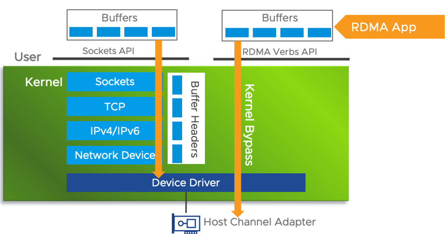
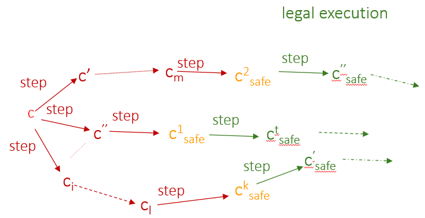

# 2_1_概念

包含 2.1- 2.3 章，以及 PPT 上内容。

## 分布式系统抽象模型

分布式系统是抽象模型。

分布式系统由一组称为处理器的 $n$ 个状态机组成，它们相互通信。我们通常用 $P_i$ 表示系统中的第 $i$ 个处理器。每个处理器可以与其他处理器（称为其邻居）通信。

## 通信方式

> 相邻处理器之间的通信可以通过消息传递或共享内存进行。通过写入和读取共享内存进行通信通常适用于地理位置接近的处理器系统，例如多处理器计算机或由多任务单处理器计算机执行的进程。消息传递分布式模型适用于彼此靠近的处理器和广域分布式系统，例如通信网络。

两种通信方式：

- 共享内存：通过写入和读取共享内存进行通信通常适用于地理位置接近的处理器系统，例如多处理器计算机或由多任务单处理器计算机执行的进程。
- 消息传递：消息传递分布式模型适用于彼此靠近的处理器和广域分布式系统，例如通信网络。

### 消息传递队列

> 从处理器 $P_i$ 到处理器 $P_j$ 的单向通信链路将消息从 $P_i$ 传输到 $P_j$。用于这种单向链路的抽象是先进先出（FIFO）队列 $q_{i,j}$，它包含了所有由处理器 $P_i$ 发送给其邻居 $P_j$ 但尚未被接收的消息。

消息传递：异步分布式系统中——先进先出队列 $q_{i,j}$。

## 配置概念

配置的定义：

- 在消息传递模型中：在特定时间对消息传递分布式系统的完整描述包括每个处理器的状态和每个队列的内容（通信链路中未处理的消息）。这种描述称为系统配置（或配置）。
  - 配置表示为 $c = (s_1, s_2, ..., s_n, q_{1,2}, q_{1,3}, ..., q_{i,j}, ..., q_{n-1,n})$，其中 $s_i$，$1 ≤ i ≤ n$，是 $P_i$ 的状态，$q_{i,j}$，$i ≠ j$，是 $P_i$ 发送给 $P_j$ 但尚未接收的消息队列。
- 在共享内存模型中：处理器通过使用共享通信寄存器（以下简称寄存器）进行通信。处理器可以写入一组寄存器，并且可以从可能不同的一组寄存器中读取。系统的配置包括所有处理器的状态和寄存器的内容。
  - 具有 $n$ 个处理器和 $m$ 个通信寄存器的配置表示为 $c = (s_1, s_2, ..., s_n; r_1, r_2, ..., r_m)$，其中 $s_i$，$1 ≤ i ≤ n$，是 $P_i$ 的状态，对于 $1 ≤ j ≤ m$，$r_j$ 是通信寄存器的内容。

## 交错模型 - 计算步骤

> 执行（非交互式）程序的独立计算机的未来状态转换可以从其当前状态确定性地预测。分布式系统中事件的调度会影响处理器的转换。情况更加复杂，因为处理器以不同的速率并行执行程序语句。
>
> 交错模型用于推理分布式系统的行为。在该模型中，假设在每个给定时间，只有一个处理器执行一个计算步骤（也称为原子步骤）。每个计算步骤包括内部计算和一个通信操作：在消息传递系统中是发送或接收，在共享内存系统中是写入或读取。
>
> 注意，计算步骤除了通信操作外，还可能包括本地计算（例如，处理器的两个本地寄存器值的减法）。在不失一般性的情况下，假设处理器的两个通信操作之间的所有本地操作发生的时间是紧接在第二个通信操作之前。因此，可以假设进程的每个状态转换都是由于通信步骤的执行（包括所有在前一步之后和计算步骤的通信操作之前的本地计算）。

计算步骤（原子步骤）构成：

- 内部计算（本地计算）：例如，处理器的两个本地寄存器值的减法。
- 通信操作：在消息传递系统中是发送或接收，在共享内存系统中是写入或读取。

关键假定：**可以假设进程的每个状态转换都是由于通信步骤的执行。**

### 假设并发不会影响

请注意，分布式系统允许处理器并发执行步骤；然而，当处理器并发执行步骤时，我们假设一个步骤不会对另一个步骤产生影响。这对于同时执行的发送和接收操作显然是正确的，因为发送的消息不能被同时执行的接收操作接收。对于共享内存，假设通信寄存器架构保证了序列化：读和写操作可以按总顺序排列，使得从某个寄存器进行的读操作的结果是该寄存器中在此读操作之前最后写入的值（根据总顺序）。

## 术语表示

### 步骤

- 用 $a$ 表示一个步骤（以及执行该步骤的处理器的身份）。
- 设 $c_1$ 和 $c_2$ 是系统的两个配置，其中 $c_2$ 通过处理器的单个步骤 $a$ 从 $c_1$ 达到；我们用 $c_1 \xrightarrow{a} c_2$ 表示这一事实。
- 当且仅当存在一个配置 $c'$ 使得 $c \xrightarrow{a} c'$ 时，步骤 $a$ 才适用于配置 $c$。

### 执行，以及公平执行

一个执行 $E = (c_1, a_1, c_2, a_2,···)$（在交错模型中）是**配置和步骤的交替序列**，使得 $c_{i−1} \xrightarrow{a_{i−1}} c_i$（$i > 1$）；换句话说，配置 $c_i$（$i > 1$）是通过执行步骤 $a_{i−1}$ 从 $c_{i−1}$ 获得的。

公平执行是指**每个无限次适用的步骤都被无限次执行的执行**。特别地，如果（无限次）一个处理器有一个步骤要执行，那么处理器就会执行这个步骤（无限次）。

### 环境步骤

在**消息传递系统**中，算法执行过程中可能会丢失消息；原因是通信介质不可靠，可能会在传输过程中丢失或损坏消息。错误检测码用于识别和丢弃损坏的消息，这些消息可以被视为丢失的消息。为了对这种系统建模，我们扩展了步骤的定义，包括类型为 $loss_{i,j}(m)$ 的环境步骤。

环境步骤 $loss_{i,j}(m)$ 适用于队列 $q_{i,j}$ 包含消息 $m$ 的配置 $c_k$。将 $loss_{i,j}(m)$ 应用于 $c_k$ 会导致配置 $c_{k+1}$，其中 $m$ 从 $q_{i,j}$ 中**移除**，$c_k$ 和 $c_{k+1}$ 在其余组件中是相同的。

与处理器执行的步骤不同，我们不要求在每个无限公平执行中，无限次适用的环境步骤将被无限次执行。**我们确实要求，在一个消息无限次发送的公平执行中，该消息必须被无限次接收。**为了满足公平性，接收步骤必须被无限次执行，而丢失步骤不应被无限次执行。

## 关于公平执行的拓展解释

### The Communication Fairness (FC) Property 通信公平性

The Communication Fairness (FC) Property

- Communication Fairness: if a message is sent infinitely often, that message is received infinitely often
  - FC holds even if an infinite num. message are lost eventually 
  - Between any two successful deliveries, only a finite num messages may be lost, otherwise, the communication channel is faulty.

- 通信公平性：如果一个消息被无限频繁地发送，那么该消息被无限频繁地接收。
  - 即使最终丢失无限条消息，通信公平性也会保持，
  - 任意两次成功下发之间，只会有一定数量的消息丢失，否则通信通道故障。

### Node Failures 节点故障

A processor that, eventually, **stops taking steps forever** is said to be **crashed**.

But how to distinguish, asynchronous networks, between a slow processor and a crashed one?

What is the maximum power we can grant to the adversary in “slowing down” processors without allowing the adversary to render a slow processor to be completely nonfunctional?

Every step that is applicable infinitely often is executed infinitely often. In other words, even if the HP Frontier is an exponentially growing number of steps more than the Arduino, the execution is still fair.

However, if any set of processors takes an infinite number of steps while the HP Frontier (or Arduino) takes no step, then the HP Frontier (respectively, Arduino) is crashed.

最终**永远停止**执行步骤的处理器被称为**崩溃**。

但是如何在区分异步网络中区分慢速处理器和崩溃的处理器呢？（回答：在异步网络中，区分一个慢速处理器和一个崩溃处理器是有挑战的，因为两者可能都表现得没有响应。关键区别在于，慢速处理器最终会执行步骤，尽管非常缓慢，而崩溃处理器则完全不会执行任何步骤。）

在“减慢”处理器速度的情况下，我们可以授予对手的最大能力是多少，而不允许对手使慢速处理器完全无法正常工作？

无限适用的每一步都被无限频繁地执行。换句话说，即使某些处理器（如 HP Frontier）比其他处理器（如 Arduino）快得多，执行仍然是公平的。 

但是，**如果任何一组处理器执行了无限多的步骤，而另一个处理器（例如 HP Frontier或 Arduino）没有执行任何步骤，那么后者被认为是崩溃的。**

## 同步消息传递和共享内存系统

有一类**为同步分布式系统设计的分布式算法**，其中**全局时钟脉冲（或简称脉冲）触发系统中每个处理器的同步步骤**。这类同步算法适用于处理器彼此靠近并且可以高效连接到公共时钟脉冲的多处理器系统。接下来，我们描述同步消息传递和共享内存系统中处理器步骤的假设。

在同步消息传递系统的每个连续脉冲之间执行以下操作：脉冲触发每个处理器向其所有邻居发送消息操作，然后每条消息被其目的地接收。在共享内存系统中，脉冲触发每个处理器读取其所有邻居的寄存器。一旦每个处理器完成读取，处理器就可以写入它们的寄存器。因此，由于所有处理器同时执行一个步骤，**同步系统的执行 $E = (c_1, c_2,···)$ 完全由 $c_1$（即 $E$ 中的第一个配置）定义。**

### RDMA(Remote Direct Memory Access) 远程直接内存访问

Typical latency numbers for RDMA and socket-based communication can vary significantly based on various factors, including hardware, network conditions, and the specific use case. However, some rough estimation can give you a general idea of the differences in latency.

1. **RDMA Latency is in microseconds Range:** RDMA can achieve extremely low latencies in the range of microseconds (μs). Latencies as low as 1-2 μs are possible with RDMA, especially when using high-performance network technologies like InfiniBand or RoCE.

2. **Socket-Based Communication Latency is in milliseconds Range:** Socket-based communication typically has higher latencies compared to RDMA. In a typical Ethernet-based network, socket communication latencies can be in the range of milliseconds (ms) or more, especially in scenarios with network congestion or when communication involves multiple layers of software.

It is important to note that these latency numbers are very rough estimates and can vary widely depending on the specific hardware, software stack, and network conditions. Additionally, advancements in both RDMA and socket-based communication technologies may lead to improvements or changes in these latency figures over time.

典型的 RDMA 和基于套接字的通信延迟数字可能会因各种因素而显著变化，包括硬件、网络条件和具体使用情况。然而，一些粗略的估计可以让你大致了解延迟的差异。

1. **RDMA 延迟在微秒范围内：** RDMA 可以实现极低的延迟，范围在微秒（μs）级别。使用高性能网络技术如 InfiniBand 或 RoCE 时，延迟可以低至 1-2 微秒。
2. **基于套接字的通信延迟在毫秒范围内：** 与RDMA相比，基于套接字的通信通常具有更高的延迟。在典型的以太网网络中，套接字通信的延迟可以在毫秒（ms）级别或更高，特别是在网络拥塞或通信涉及多个软件层的情况下。

需要注意的是，这些延迟数字是非常粗略的估计，可能会因具体的硬件、软件栈和网络条件而有很大差异。此外，RDMA 和基于套接字的通信技术的进步可能会导致这些延迟数字随时间而改善或变化。

## 合法执行、安全配置、自稳定算法

### Arbitrary Transient Faults 任意瞬态故障

- They represent any violation of the assumptions according to which the system and network were designed to behave
  - One may assume that CRC-codes always detect memory/messages corruption
  - If such corruption is undetected, stale info will propagate in the network 

- An arbitrary combination of such failures can leave the network in an arbitrary state. 

- If a network starts in an arbitrary configuration, how can the algorithm make the network present a legal behavior?
  - –*i.e.*, satisfy the problem definition?

- 它们代表了任何违反系统和网络设计行为假设的情况
  - 可以假设 CRC 码总是能检测到内存/消息的损坏
  - 如果这种损坏未被检测到，陈旧的信息将会在网络中传播
- 这种故障的任意组合可能会使网络处于任意状态
- 如果网络从任意配置开始，算法如何使网络呈现合法行为？
  - *即，满足问题定义？*

### 合法执行 & 安全配置 & 自稳定算法

- 自稳定系统可以从任何任意配置开始，并最终表现出期望的“合法”行为。
- 我们通过一组合法执行（记为 $LE$）来定义期望的合法行为。
- 自稳定系统的每个系统执行都应该有一个**后缀**出现在 $LE$ 中。
  - 在这里，后缀指的是一个执行序列的最后一部分。自稳定系统的每个执行序列都应该有一个后缀出现在 $LE$ 中，这意味着无论系统如何开始，最终都会表现出合法行为。
- 对于任务 $LE$ 和算法，如果从配置 $c$ 开始的算法的每个公平执行都属于 $LE$，则配置 $c$ 对该任务是安全的。
  - 也就是说，从这个配置开始，系统不会进入非法状态。
- 如果算法的每个公平执行都达到与任务 $LE$ 相关的安全配置，则该算法对任务 $LE$ 是自稳定的。
  - 这意味着该算法能够确保系统最终会达到合法状态。

## 算法的复杂度评估

主要是在讨论时间复杂度。

### 异步轮

为了评估和比较不同的异步算法，使用异步轮数来衡量特定执行的时间复杂度是很方便的。执行 $E$ 中的第一个异步轮（或轮）是 $E$ 的最短前缀 $E'$，使得每个处理器在 $E'$ 中**至少执行一步**。设 $E''$ 为 $E$ 的后缀，紧随 $E'$ 之后，$E = E'E''$。$E$ 的第二轮是 $E''$ 的第一轮，依此类推。算法执行中的轮数用于衡量算法的时间复杂度。

异步轮的定义通过将轮延长到足够长，以包括此执行段中最慢处理器的一步（包括通信操作），从而消除了处理器速度的差异。因此，即使该处理器位于可以分隔通信图的节点中，信息也可以通过最慢的处理器传输。

### 永不停止，反复通信

**自稳定算法永不终止，处理器必须反复与其邻居通信。**在共享内存模型中，处理器必须反复读取其邻居的寄存器；在消息传递模型中，处理器必须不断发送和接收消息。

在共享内存情况下，处理器 $P_i$ 的算法代码通常以读取 $P_i$ 的通信寄存器操作开始，然后是本地计算，接着是写入 $P_i$ 的通信寄存器操作。执行这样一个永久循环的单次迭代所需的步骤数是 $O(\triangle)$，其中 $\triangle$ 是 $P_i$ 的度（邻居数量）的上限。

处理器可以在执行永久循环迭代的中间状态启动。然而，如果完成永久循环迭代所需的步骤数为 $x$，那么当 $P_i$ 从任意状态启动时，完成循环迭代（从循环的开始到结束）所需的步骤数少于 $2x$。

### 异步周期

执行 $E$ 中的第一个异步周期（或周期）是 $E$ 的最短前缀 $E'$，使得每个处理器在 $E'$ 中**至少执行一次其永久循环的完整迭代**。设 $E''$ 为 $E$ 的后缀，紧随 $E'$ 之后，$E = E'E''$。$E$ 的第二个周期是 $E''$ 的第一个周期，依此类推。