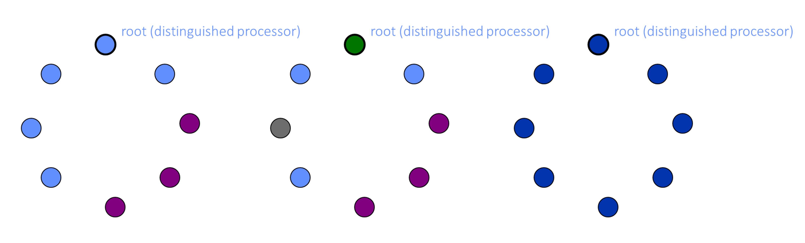

# 2_2_互斥自稳定算法

## Dijkstra 算法

The system consists of $n$ processors $P_1, P_2,··· , P_n$ that are connected in a ring. Each processor has a *left* and a *right* neighbor. The left neighbor of every processor $P_i$, $1 < i ≤ n$, is  $P_{i −1}$ and the left neighbor of $P_1$ is $P_n$. Similarly, the right neighbor of every processor $P_i$ , $1 ≤ i < n$, is  $P_{i +1}$ and the right neighbor of $P_n$ is $P_1$.

系统由 $n$ 个处理器 $P_1, P_2,··· , P_n$ 组成，这些处理器连接成一个环。每个处理器都有一个左邻居和一个右邻居。每个处理器 $P_i$ 的左邻居（$1 < i ≤ n$）是 $P_{i−1}$，而 $P_1$ 的左邻居是 $P_n$。同样，每个处理器 $P_i$ 的右邻居（$1 ≤ i < n$）是 $P_{i+1}$，而 $P_n$ 的右邻居是 $P_1$。

Each processor $P_i$ has a variable $x_i$ that stores an integer value that is no smaller than 0 and no larger than $n$. The transition functions of the processors $P_2,··· , P_n$ are identical, while the transition function of $P_1$ is distinct. We call $P_1$ the special processor. The transition functions (or programs) of $P_1$ and the other processors $P_i$ ($2 ≤ i ≤ n$) appear in figure 2.2.

每个处理器 $P_i$ 有一个变量 $x_i$，该变量存储一个不小于 0 且不大于 $n$ 的整数。处理器 $P_2,··· , P_n$ 的转换函数是相同的，而 $P_1$ 的转换函数是不同的。我们称 $P_1$ 为特殊处理器。$P_1$ 和其他处理器 $P_i$（$2 ≤ i ≤ n$）的转换函数（或程序）如图 2.2 所示。

## Token Ring 算法（自稳定版本）

**令牌环算法**主要用于网络通信中，确保只有一个节点在任何给定时间内可以发送数据，从而避免数据碰撞。它通过**一个唯一的令牌**在节点之间传递来实现这一点。

**Dijkstra 的自稳定算法**则是一种分布式算法，旨在使系统在任意初始状态下能够在有限步数内达到合法状态，并且在没有外部干预的情况下保持稳定。自稳定算法的关键特性是，无论系统从何种状态开始，它都能自动恢复到一个合法状态。

在令牌环的自稳定版本中，算法会确保即使在出现错误（如令牌丢失或重复）后，系统也能**自动恢复到只有一个令牌的合法状态**。这种自稳定特性使得系统更具鲁棒性和可靠性，特别是在分布式网络环境中。

### Objective

The goal of this algorithm is to maintain a stable token ring network where a token circulates among a set of interconnected nodes, allowing them to perform distributed tasks or access shared resources in a coordinated manner.

### Assumptions

1. Nodes in the token ring network are interconnected in a circular topology, i.e., the network topology is of a clock-wise directed ring with a distinguished processor, called the root.
2. Initially, the token ring system may be in an arbitrary or inconsistent state due to transient faults or other issues.

### Token Circulation

1. Whenever any of the if-statement conditions in lines 02 and 05 holds, that processor is said to hold the token.
2. It clock-wise forwards the token by executing the then-clause of the if-statement.

### 理解

题目就是数 token。

除了 root 外，和上一个不一样就持有一个 token；root 则是和 n 一样那么就持有一个 token。

（从左往右数，顺时针看）

第一个图：root，第三个，第六个。共三个持有 token。

第二个图：第二个，第三个，第六个，第七个，第八个。共五个持有 token。

第三个图：只有 root 持有 token。

## 顺序

Dijkstra 的自稳定算法并不要求处理器必须按照严格的 1, 2, 3, 4, … 到 n 的顺序循环激活。关键在于**公平性假设**，即在任何无限长的执行过程中，每个处理器都会被激活无限多次。

Dijkstra 的自稳定算法的设计目的是确保系统能够从任何初始状态恢复到一个合法状态，并在合法状态中保持稳定。为了实现这一目标，算法依赖于公平性假设，而不是严格的处理器激活顺序。

### 公平性假设的具体含义

- **灵活的激活顺序**：处理器可以按照任意顺序被激活，只要每个处理器在合理的时间内都有机会执行其计算步骤。
- **确保进展**：这种设计确保了系统不会陷入停滞状态，每个处理器都有机会在有限时间内改变其状态，从而推动系统向前进展。

### 实际执行中的顺序

在实际执行中，处理器的激活顺序可以是：

- 循环顺序（例如 1, 2, 3, …, $n$，然后再从 1 开始）
- 随机顺序
- 其他任意顺序，只要满足公平性假设

## 任务 $ME$

The task $ME$ is defined by the set of all configuration sequences in which exactly one processor can change its state in any configuration and every processor can change its state in infinitely many configurations in every sequence in $ME$. Note that this definition differs from the traditional definition of mutual exclusion that allows processors to be in the reminder section (possibly forever) as long as they do not try to enter the critical section.

**任务 $ME$ 的定义是：它是满足这样一些要求的，所有的配置序列的集合，其中在任何配置中恰好有一个处理器可以改变其状态，并且在 $ME$ 中的每个序列中，每个处理器都可以在无限多个配置中改变其状态。**请注意，这一定义不同于传统的互斥定义，传统定义允许处理器在提醒区（可能永远）中，只要它们不尝试进入临界区。

## 引理定理合集

- A configuration $c$ in which all the $x$ variables have the same value is a safe configuration for $ME$ and Dijkstra’s algorithm. (Lemma 2.2)
- For every possible configuration $c$, there exists at least one integer $0 ≤ j ≤ n$ such that for every $1 ≤ i ≤ n$, $x_i \neq j$ in $c$. (Lemma 2.3)
- For every possible configuration $c$, in every fair execution that starts in $c$, the special processor $P_1$ changes the value of $x_1$ at least once in every $n$ rounds. (Lemma 2.4)
- For every possible configuration $c$, every fair execution that starts in $c$ reaches a safe configuration with relation to $ME$ within $O(n^2)$ rounds. (Theorem 2.1)

---

- 引理 2.2：在配置 $c$ 中，如果所有 $x$ 变量具有相同的值，则该配置对于 $ME$ 和 Dijkstra 算法来说是安全的配置。

- 引理 2.3：对于每一个可能的配置 $c$，存在至少一个整数 $0 ≤ j ≤ n$，使得对于每一个 $1 ≤ i ≤ n$，在配置 $c$ 中 $x_i \neq j$。
- 引理 2.4：对于每一个可能的配置 $c$，在每个从 $c$ 开始的公平执行中，特殊处理器 $P_1$ 在每 $n$ 轮中至少改变一次 $x_1$ 的值。
- 定理 2.1：对于每一个可能的配置 $c$，每个从 $c$ 开始的公平执行在 $O(n^2)$ 轮内达到相对于 $ME$ 的安全配置。

## 引理 2.2

> LEMMA 2.2: A configuration $c$ in which all the $x$ variables have the same value is a safe configuration for $ME$ and Dijkstra’s algorithm.
>
> **引理 2.2**：在配置 $c$ 中，如果所有 $x$ 变量具有相同的值，则该配置对于 $ME$ 和 Dijkstra 算法来说是安全的配置。

其实证明过程并不难，就是在进一步**理解定义**。

> 对于任务 $LE$ 和算法，如果从配置 $c$ 开始的算法的每个公平执行都属于 $LE$，则配置 $c$ 对该任务是安全的。

意思就是要证明，从 $c$ 开始的每个公平执行，它们都属于任务 $ME$。

好吧，这里任务 $ME$ 定义是：在任何配置中恰好有一个处理器可以改变其状态，并且在 $ME$ 中的每个序列中，每个处理器都可以在无限多个配置中改变其状态。

然后你去看证明过程，确实是每一步之后得到的配置都只有一个处理器可以改变其状态，也确实是每个处理器在 这 $n$ 轮里都能变化一次，这说明在无限次的步骤后（也就是配置中）能改变其状态。

（看吧，文字游戏）

## 引理 2.3

> LEMMA 2.3: For every possible configuration $c$, there exists at least one integer $0 ≤ j ≤ n$ such that for every $1 ≤ i ≤ n$, $x_i \neq j$ in $c$.
>
> **引理 2.3**：对于每一个可能的配置 $c$，存在至少一个整数 $0 ≤ j ≤ n$，使得对于每一个 $1 ≤ i ≤ n$，在配置 $c$ 中 $x_i \neq j$。

证明非常简单，这里可能就是把定义细细的读一下就知道。

$x$ 是什么？可以是不小于 0 且不大于 $n$ 的整数，也就是说可能的值有 $n + 1$ 个。

我们有多少个处理器？$n$ 个。

那么在什么样的配置中，$x$ 变量中最多有多少个不同的值？答案是每个处理器都有一个不一样的值的时候，此时$x$ 变量中最多有 $n$ 个不同的值。但是也最多只有 $n$ 个了。

所以必然有一个整数 $j$，他不会出现在任何 $x$ 中。

### The Pigeonhole Principle 鸽子洞原理（抽屉原理）

- Suppose *n* items are put into *m*<*n* containers,
  - at least one container contains more than one item
- Also called the Dirichlet's box principle

鸽子洞原理（也称为抽屉原理）是一个简单但非常有用的数学原理。它的基本思想是：如果有 ( $n$ ) 只鸽子和 ( $m$ ) 个鸽洞，并且 ( $n > m$ )，那么至少有一个鸽洞里会有多于一只鸽子。

假设我们有 ( $n$ ) 个物品和 ( $m$ ) 个容器。如果 ( $n > m$ )，那么根据鸽子洞原理，至少有一个容器会包含多于一个物品。这是因为如果每个容器最多只能包含一个物品，那么最多只能容纳 ( $m$ ) 个物品，而我们有 ( $n$ ) 个物品，所以至少有一个容器必须包含多于一个物品。

## 引理 2.4

> LEMMA 2.4: For every possible configuration $c$, in every fair execution that starts in $c$, the special processor $P_1$ changes the value of $x_1$ at least once in every $n$ rounds.
>
> **引理 2.4**：对于每一个可能的配置 $c$，在每个从 $c$ 开始的公平执行中，特殊处理器 $P_1$ 在每 $n$ 轮中至少改变一次 $x_1$ 的值。

证明过程是反证法。

引理 2.4 指明了一个很关键的事情： $p_1$ 的 $x_1$ 会永无止境的变化。具体来说就是每 $n$ 轮变化一次。

## 定理 2.1

> THEOREM 2.1: For every possible configuration $c$, every fair execution that starts in $c$ reaches a safe configuration with relation to $ME$ within $O(n^2)$ rounds.
>
> **定理 2.1**：对于每一个可能的配置 $c$，每个从 $c$ 开始的公平执行在 $O(n^2)$ 轮内达到相对于 $ME$ 的安全配置。

证明过程

1. **引理 2.3 的应用**：
   - 根据引理 2.3，对于每一个可能的配置 $c$，存在至少一个整数 $0 \leq j \leq n$，使得对于每一个 $1 \leq i \leq n$，在配置 $c$ 中 $x_i \neq j$。
   - 这意味着在初始配置 $c$ 中，所有的 $x_i$ 都不等于 $j$。
2. **引理 2.4 的应用**：
   - 根据引理 2.4，对于每一个可能的配置 $c$，在每个从 $c$ 开始的公平执行中，特殊处理器 $P_1$ 在每 $n$ 轮中改变一次 $x_1$ 的值。
   - 每次 $P_1$ 改变 $x_1$ 的值时，$P_1$ 将 $x_1$ 的值按模 $n + 1$ 增加。
3. **值 $j$ 的分配**：
   - 因此，在从 $c$ 开始的任何公平执行中，$x_1$ 必定会被分配到每一个可能的值，特别是值 $j$。
   - 设 $c_j$ 为 $x_1$ 首次分配值 $j$ 后立即跟随的配置。
4. **值的传播**：
   - 每个处理器 $P_i$ ($2 \leq i \leq n$) 将 $x_{i-1}$ 的值复制到 $x_i$。
   - 因此，对于 $1 \leq i \leq n$，在每个跟随 $c$ 并先于 $c_j$ 的配置中，$x_i \neq j$；
     - 注：这句话的意思就是 $2$ 到 $n$ 的处理器的值都是从上一个复制来的，同时这段时间内 $x_1$ 也不会是 $j$（毕竟都说了 $c_j$ 是 $x_1$ 首次拿到 $j$）
   - 在 $c_j$ 中，唯一持有值 $j$ 的 $x$ 变量是 $x_1$。
     - 注：因为 $x_1$ 拿到 $j$ 是赋值来的而不是复制来的，所以必然是它首先有 $j$，故而配置 $c_j$ 这个瞬间，只有 $x_1$ 持有 $j$。
   - $P_1$ 不会改变 $x_1$ 的值，直到 $x_n = j$。
     - 注：这句话说的是 $c_j$ 之后，只有 $x_n = j$ 了才会修改 $x_1$ 的值。
5. **值 $j$ 的传播序列**：
   - 唯一可能的将 $x$ 变量的值改变为 $j$ 的序列是：$P_2$ 将 $x_2$ 的值改变为 $x_1$ 的值（即 $j$），然后 $P_3$ 将 $x_3$ 的值改变为 $j$，依此类推，直到 $P_n$ 将 $x_n$ 的值改变为 $j$。
   - 只有在这个阶段，$P_1$ 才能再次改变值（跟随 $c_j$）。设 $c_n$ 为 $x_n := j$ 分配后的配置。$c_n$ 是一个安全配置。
     - 注：这里 $c_n$ 很明显就是所有处理器都是相同的值 $j$，那么根据引理 2.2，它是一个安全配置。
6. **时间复杂度**：
   - 根据引理 2.4，$P_1$ 必须在每 $n^2$ 轮中将 $j$ 分配给 $x_1$。
     - 注：这里取的是一个上限，即 $n^2$ 内必然能做到。极限的情况就是一开始是 0，然后 $j$ 是 $n$（因为 $x_1$ 是 $n+1$ 的模数，不会超过 $n$），那么在 $n$ 次变化后，$x_1$ 就能得到 $j$。并且 $x+1$ 又是每 $n$ 轮变化一次，故而就是 $n^2$。
   - 因此，安全配置必须在 $n^2 + n$ 轮内达到。
