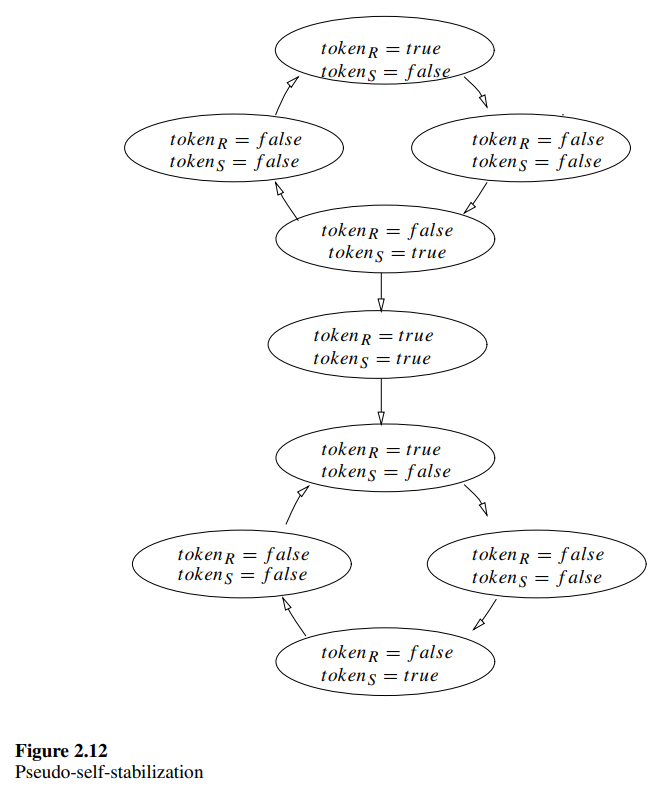
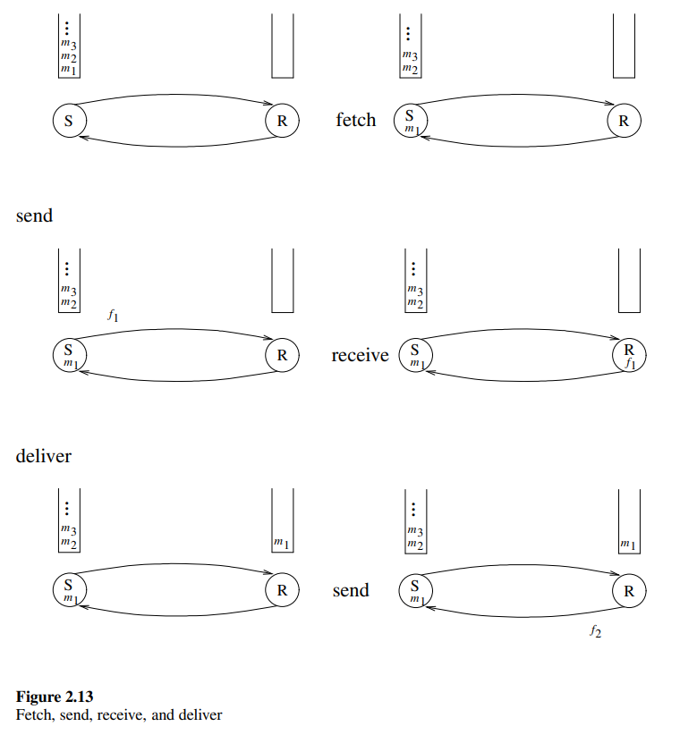
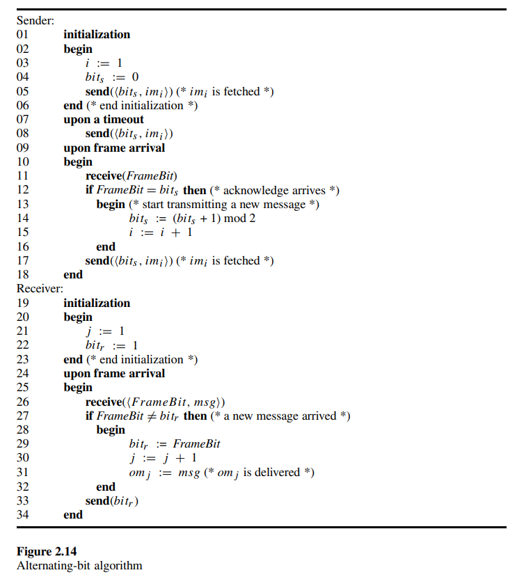

# 2.10 Pseudo-Self-Stabilization

To describe the pseudo-self-stabilizing concept, let us start with an example. A computer company found a new technology for personal computers. The cost of a computer produced by this company is much lower than that of other computers. However, the computer has one drawback: it is possible that it will spontaneously turn itself off during operation. The company guarantees that the number of shutdowns is limited to seven, but does not promise if and when they will take place. The customer might choose such a cheap computer because the electricity power supply is not in any case reliable and cannot guarantee continuous operation. Analogously, pseudo self-stabilizing algorithms converge from any initial state to execution, in which they exhibit a legal behavior; but they still may deviate from this legal behavior a finite number of times. A more formal treatment of the pseudo-self stabilizing concept follows.

为了描述伪自稳定的概念，让我们从一个例子开始。一家计算机公司发现了一项用于个人计算机的新技术。该公司生产的计算机成本远低于其他计算机。然而，这种计算机有一个缺点：在操作过程中可能会自发地关闭。公司保证关闭次数限制在七次以内，但不保证何时会发生。客户可能会选择这种便宜的计算机，因为电力供应本身就不可靠，无法保证持续运行。同样地，伪自稳定算法从任何初始状态收敛到执行状态，在该状态下它们表现出合法行为；但它们仍可能在有限次数内偏离这种合法行为。伪自稳定概念的更正式处理如下。

We defined a self-stabilizing algorithm as an algorithm for which every fair execution must reach a safe configuration. Since every execution that starts in a safe configuration is a legal execution belonging to $LE$, it is the case that, once a safe configuration is reached, the system behaves as desired.

我们将自稳定算法定义为每次公平执行都必须达到安全配置的算法。由于每次从安全配置开始的执行都是属于 $LE$ 的合法执行，因此一旦达到安全配置，系统就会按预期运行。

The set of legal executions $LE$ defines the desired behavior of the system. In fact, defining the requirements by a set of executions $LE$ is sometimes too restrictive. $A$ task $T$ may be defined in a more abstract way, avoiding the definitions and the description of the implementation details. The variables used by the specific distributed algorithm to achieve the task are not part of this task specification. An *abstract task* is defined by a set of variables and a set of restrictions on their values. For example, let us define the token passing abstract task $\mathcal{AT}$ for a system of two processors: the sender $S$ and the receiver $R$. $S$ has a boolean variable ${token}_S$ and R has a boolean variable ${token}_R$.

合法执行集 $LE$ 定义了系统的期望行为。事实上，通过一组执行 $LE$ 来定义需求有时过于严格。任务 $T$ 可以以更抽象的方式定义，避免定义和描述实现细节。用于实现任务的特定分布式算法所使用的变量不是该任务规范的一部分。*抽象任务* 由一组变量和一组对其值的限制定义。例如，让我们为一个由两个处理器组成的系统定义令牌传递抽象任务 $\mathcal{AT}$：发送者 $S$ 和接收者 $R$。$S$ 有一个布尔变量 ${token}_S$，$R$ 有一个布尔变量 ${token}_R$。

Recall that a system execution is a sequence of configurations such that every configuration $c_{i+1}$ is obtained from the immediately preceding configuration $c_i$ by a single atomic step $a_i$ of a processor. The steps of the processors are defined by the distributed algorithm that the system runs. Given an execution of the system $E = (c_1, a_1, c_2, a_2,···)$, one may consider only the values of ${token}_S$ and ${token}_R$ in every configuration $c_i$ to check whether the token-passing task is achieved. Let $c_i|tkns$ be the values of the boolean variables $({token}_S, {token}_R)$ in $c_i$, and let $E|tkns$ be $(c_1|tkns, c_2|tkns, c_3|tkns,···)$. The abstract task $\mathcal{AT}$ can be defined by $E|tkns$ as follows: there is no $c_i|tkns$ for which ${token}_S = {token}_R = true$, and there are infinitely many is such that ${token}_S = true$ in $c_i|tkns$, and infinitely many $j$ s such that ${token}_R = true$ in $c_j|tkns$. In other words, each of the processors holds the token infinitely many times, but the processors never hold tokens simultaneously.

回想一下，系统执行是一个配置序列，其中每个配置 $c_{i+1}$ 是由处理器的单个原子步骤 $a_i$ 从前一个配置 $c_i$ 获得的。处理器的步骤由系统运行的分布式算法定义。给定系统的执行 $E = (c_1, a_1, c_2, a_2,···)$，可以仅考虑每个配置 $c_i$ 中 ${token}_S$ 和 ${token}_R$ 的值来检查是否实现了令牌传递任务。令 $c_i|tkns$ 为配置 $c_i$ 中布尔变量 $({token}_S, {token}_R)$ 的值，令 $E|tkns$ 为 $(c_1|tkns, c_2|tkns, c_3|tkns,···)$。抽象任务 $\mathcal{AT}$ 可以通过 $E|tkns$ 定义如下：不存在 $c_i|tkns$ 使得 ${token}_S = ${token}_R = true，并且有无限多个 $i$ 使得 ${token}_S = true$ 在 $c_i|tkns$ 中，并且有无限多个 $j$ 使得 ${token}_R = true$ 在 $c_j|tkns$ 中。换句话说，每个处理器无限次地持有令牌，但处理器从不同时持有令牌。

The above specification of the abstract task $\mathcal{AT}$ is a more general specification of the token-passing task than a definition by a legal set of executions $LE$; the reason is that $LE$ is defined for a specific distributed algorithm. On the other hand, it is impossible to define a safe configuration in terms of $c|tkns$. For instance, we cannot tell whether a configuration in which ${token}_S = true$ and ${token}_R = false$ is safe. The reason is that we ignore, say, the state variables of $R$ that specify whether $R$ is about to execute a step in which ${token}_R$ is assigned to true, while ${token}_S$ remains unchanged.

上述抽象任务 $\mathcal{AT}$ 的规范比通过合法执行集 $LE$ 的定义更为一般；原因是 $LE$ 是为特定分布式算法定义的。另一方面，不可能根据 $c|tkns$ 定义安全配置。例如，我们无法判断 ${token}_S = true$ 和 ${token}_R = false$ 的配置是否安全。原因是我们忽略了 $R$ 的状态变量，这些变量指定了 $R$ 是否即将执行一个步骤，在该步骤中 ${token}_R$ 被赋值为 true，而 ${token}_S$ 保持不变。

An algorithm is *pseudo-self-stabilizing* for an abstract task $\mathcal{AT}$ if every infinite execution of the algorithm has a suffix satisfying the restrictions of $\mathcal{AT}$.

一个算法对于抽象任务 $\mathcal{AT}$ 是*伪自稳定的*，如果该算法的每个无限执行都有一个后缀满足 $\mathcal{AT}$ 的限制。

Clearly a self-stabilizing algorithm for a task $LE$ such that every execution in $LE$ fulfills the restrictions of $\mathcal{AT}$ is pseudo-self-stabilizing. However, a pseudo self-stabilizing algorithm may not be self-stabilizing, since it may not reach a configuration such that for *every* execution that starts in it, the restrictions of $\mathcal{AT}$ hold.

显然，对于任务 $LE$ 的自稳定算法，如果 $LE$ 中的每个执行都满足 $\mathcal{AT}$ 的限制，那么它是伪自稳定的。然而，伪自稳定算法可能不是自稳定的，因为它可能无法达到一个配置，使得从该配置开始的*每个*执行都满足 $\mathcal{AT}$ 的限制。

Figure 2.12 depicts such a situation: nine configurations and the transitions between them are described. The upper four configurations form a cycle that corresponds to a possible infinite legal execution relative to the abstract task of token-passing. Each of the processors holds a token infinitely often, and at most one processor holds the token at a time. Similarly, the lower cycle of the four configurations in figure 2.12 also corresponds to an infinite legal execution. The configuration in the center of the figure is illegal, since both the processors have a token at the same time. The transition to this configuration may arise from, say, a message loss: only if a message is lost is the transition to the configuration in which both the sender and the receiver hold the token possible. In other words, if no message is lost, the execution depicted by the upper cycle is an infinite legal execution relative to the abstract task $\mathcal{AT}$. Yet the system is not in a safe configuration, and there is no time bound for reaching a safe configuration. Only after a message is lost does the system reach the lower cycle of figure 2.12 and, indeed, a safe configuration.

图 2.12 描述了这种情况：描述了九个配置及其之间的转换。上面的四个配置形成一个循环，对应于相对于令牌传递抽象任务的可能的无限合法执行。每个处理器无限次地持有令牌，并且一次最多只有一个处理器持有令牌。同样，图 2.12 中下面的四个配置的循环也对应于一个无限合法执行。图中央的配置是非法的，因为两个处理器同时持有令牌。到这个配置的转换可能是由于消息丢失：只有在消息丢失的情况下，才可能转换到发送者和接收者同时持有令牌的配置。换句话说，如果没有消息丢失，上面循环所描绘的执行是相对于抽象任务 $\mathcal{AT}$ 的无限合法执行。然而，系统并不处于安全配置中，并且没有时间限制来达到安全配置。只有在消息丢失后，系统才会达到图 2.12 中的下一个循环，并且确实达到安全配置。

To demonstrate pseudo-self-stabilization, we use the famous alternating-bit algorithm, one of the most basic data-link algorithms used for message transfer over a communication link. The common communication link is unreliable and may lose or corrupt messages. It is assumed that error-detection codes are used to identify and eliminate corrupted messages. We view each such discarded corrupted message as a lost message. The alternating-bit algorithm uses retransmission of messages to cope with message loss. When every corrupted message is identified and the communication links are FIFO (first-in first-out), the alternating-bit algorithm guarantees reliable delivery of (higher-level) messages over such an unreliable communication link. The term *frame* is used to distinguish the higher-level messages that must be transferred from the messages that are actually sent in order to transfer the higher-level messages; frames are the messages that are actually sent between the sender and the receiver. The algorithm is designed for a system consisting of two processors $S$ and $R$ that are connected by two communication links: one transfers frames from $S$ to $R$, and the other from $R$ to $S$.

为了演示伪自稳定性，我们使用著名的交替位算法，这是用于通过通信链路传输消息的最基本的数据链路算法之一。常见的通信链路是不可靠的，可能会丢失或损坏消息。假设使用错误检测码来识别和消除损坏的消息。我们将每个被丢弃的损坏消息视为丢失的消息。交替位算法使用消息重传来应对消息丢失。当每个损坏的消息都被识别并且通信链路是 FIFO（先进先出）时，交替位算法保证在这种不可靠的通信链路上可靠地传输（高层）消息。术语 *帧* 用于区分必须传输的高层消息与实际发送以传输高层消息的消息；帧是发送方和接收方之间实际发送的消息。该算法设计用于由两个处理器 $S$ 和 $R$ 组成的系统，这两个处理器通过两条通信链路连接：一条从 $S$ 向 $R$ 传输帧，另一条从 $R$ 向 $S$ 传输帧。

The task of delivering a message from one processor in the network to another remote processor is sophisticated. It is usually partitioned into several layers of algorithms and abstractions: an algorithm of a certain layer uses the services of a lower-level algorithm. The lowest layer is the physical layer for which the concern is how the physical device connecting to neighboring processors is used to transmit bits from a processor to its neighbor. Usually the physical layer can ensure transmission of bits with a certain (small) error probability that each bit is corrupted. The next layer is the *data-link layer*, which assumes the existence of a (physical layer) procedure that transmits bits. The task of the data-link layer is to transmit messages from a processor to its neighbor. The data-link layer uses error-detection codes and retransmissions to cope with the probability of bit corruption (introduced by the physical communication device). The *network layer* task is to direct messages sent from one processor to a remote (non-neighboring) processor. Routing algorithms are used to maintain routing databases (routing tables). Whenever a processor must forward an arriving message, it consults the routing database to identify the outgoing link on which the message should be sent; then the data-link procedure of the chosen link is used. Several messages that have to be forwarded may arrive at a processor simultaneously (through its input communication ports). The arriving messages may be stored in input buffers (on a disk) and then *fetched* by the data-link layer algorithm. The data-link algorithm uses *frames* to *send* the fetched message. The data-link algorithm portion that is executed at the receiver receives the sent frames (and sends acknowledgment frames). When the data-link algorithm executed at the receiver side is convinced that the message is received, it *delivers* the message to be handled by the network layer algorithm at the receiver, which in turn consults its routing database.

在网络中将消息从一个处理器传递到另一个远程处理器的任务是复杂的。通常将其划分为多个算法层和抽象层：某一层的算法使用低层算法的服务。最低层是物理层，其关注的是如何使用连接到相邻处理器的物理设备将比特从一个处理器传输到其邻居。通常物理层可以确保比特传输时每个比特被损坏的概率很小。下一层是 *数据链路层*，它假设存在一个传输比特的（物理层）过程。数据链路层的任务是将消息从一个处理器传输到其邻居。数据链路层使用错误检测码和重传来应对比特损坏的概率（由物理通信设备引入）。*网络层* 的任务是将从一个处理器发送的消息引导到远程（非邻居）处理器。路由算法用于维护路由数据库（路由表）。每当处理器必须转发到达的消息时，它会查询路由数据库以确定消息应发送的输出链路；然后使用所选链路的数据链路过程。多个需要转发的消息可能同时到达处理器（通过其输入通信端口）。到达的消息可以存储在输入缓冲区（在磁盘上），然后由数据链路层算法*获取*。数据链路算法使用 *帧* 来 *发送* 获取的消息。在接收方执行的数据链路算法部分接收发送的帧（并发送确认帧）。当接收方执行的数据链路算法确信消息已接收时，它会*传递*消息以由接收方的网络层算法处理，后者会查询其路由数据库。

Figure 2.13 describes the *fetch*, *send*, *receive*, and *deliver* operations. A queue of messages $(m_1, m_2, m_3, ···)$ stored in a non-volatile memory are to be transmitted from the sender to the receiver. A fetch operation executed by the sender removes the first message of the queue and stores it in the (volatile) memory of the sender. Then the sender must transfer $m_1$ to the receiver. In the particular example in figure 2.13, the sender sends $m_1$ in the frame $f_1$. This is only one possibility; in fact, other data-link algorithms may send only partial information concerning $m_1$ in $f_1$. Note that in addition to the contents of $m_1$, $f_1$ may include control information, for example the label of the alternating-bit algorithm. Once the receiver receives $f_1$, it delivers $m_1$ to the output queue. Finally, the receiver sends the frame $f_2$ to the sender in order to notify it sender that a new message can be fetched.

图 2.13 描述了*获取*、*发送*、*接收*和*传递*操作。存储在非易失性存储器中的消息队列 $(m_1, m_2, m_3, ···)$ 将从发送方传输到接收方。发送方执行的获取操作移除队列中的第一条消息并将其存储在发送方的（易失性）存储器中。然后发送方必须将 $m_1$ 传输到接收方。在图 2.13 的特定示例中，发送方在帧 $f_1$ 中发送 $m_1$。这只是其中一种可能性；实际上，其他数据链路算法可能仅在 $f_1$ 中发送有关 $m_1$ 的部分信息。请注意，除了 $m_1$ 的内容外，$f_1$ 还可能包含控制信息，例如交替位算法的标签。一旦接收方接收到 $f_1$，它会将 $m_1$ 传递到输出队列。最后，接收方向发送方发送帧 $f_2$ 以通知发送方可以获取新消息。

The abstract task of the alternating-bit algorithm can be defined as follows. The sender $S$ has an infinite queue of input messages $({im}_1, {im}_2, ···)$ that should be transferred to the receiver in the same order without duplications, reordering, or omissions. The receiver has an output queue of messages $({om}_1, {om}_2, ···)$. The sequence of messages in the output queue of the receiver should always be a prefix of the sequence of messages in the input queue of the sender. Moreover, to eliminate solutions in which no input message is transfered to the receiver, we require that infinitely often a new message is included in the output queue.

交替位算法的抽象任务可以定义如下。发送方 $S$ 有一个无限的输入消息队列 $({im}_1, {im}_2, ···)$，这些消息应按顺序传输到接收方，不得有重复、重新排序或遗漏。接收方有一个输出消息队列 $({om}_1, {om}_2, ···)$。接收方输出队列中的消息序列应始终是发送方输入队列中消息序列的前缀。此外，为了消除没有输入消息传输到接收方的解决方案，我们要求输出队列中无限次包含新消息。

The alternating-bit algorithm in figure 2.14 is not a self-stabilizing algorithm: it is assumed that both the sender and the receiver perform the initialization instructions (lines 1 to 6 and 19 to 23) when the system starts operating. During the initialization the sender fetches the first message ${im}_1$ from the buffer of the networks layer, and sends a frame with this message together with label 0 (the value of ${bit}_s$) to the receiver. A timeout mechanism copes with frame loss triggering frame retransmission (lines 7 and 8). Once the receiver executes the initialization procedure, it waits for a frame with label 0 (line 27) while acknowledging arriving frames. When a frame with a (new) label different from the current value of ${bit}_r$ arrives at the receiver, the receiver delivers the message of this frame to the network layer (line 31). The indices $i$ (line 15) and $j$ (line 30) are used only to describe the interface with the network layer. In fact, the input buffer from which ${im}_i$ is fetched is a queue from which messages are fetched without identifying their index. The first fetch operation (implicitly executed in line 5) fetches the first message in the input queue, the second fetch (implicitly executed in line 17) operation fetches the second message in this queue, and so on. Similarly, the first deliver operation (line 31) delivers the first message to the output queue, the second deliver operation (line 31) delivers the second message, and so on.

图 2.14 中的交替位算法不是自稳定算法：假设系统开始运行时，发送方和接收方都执行初始化指令（第 1 到 6 行和第 19 到 23 行）。在初始化期间，发送方从网络层的缓冲区中获取第一条消息 ${im}_1$，并将带有此消息和标签 0（${bit}_s$ 的值）的帧发送给接收方。超时机制应对帧丢失，触发帧重传（第 7 和 8 行）。一旦接收方执行初始化程序，它会等待带有标签 0 的帧（第 27 行），同时确认到达的帧。当带有与当前 ${bit}_r$ 值不同的新标签的帧到达接收方时，接收方将该帧的消息传递到网络层（第 31 行）。索引 $i$（第 15 行）和 $j$（第 30 行）仅用于描述与网络层的接口。实际上，从中获取 ${im}_i$ 的输入缓冲区是一个队列，从中获取消息时不识别其索引。第一次获取操作（隐式执行于第 5 行）获取输入队列中的第一条消息，第二次获取操作（隐式执行于第 17 行）获取该队列中的第二条消息，依此类推。同样，第一次传递操作（第 31 行）将第一条消息传递到输出队列，第二次传递操作（第 31 行）传递第二条消息，依此类推。

Roughly speaking, the abstract task of a self-stabilizing alternating-bit (data-link) algorithm $\mathcal{DL}$ is eventually to guarantee exactly-once message delivery without reordering. More formally, there must exist a suffix of the queue of input messages $I = ({im}_j, {im}_{j+1}, ···)$ and a $k$ such that the suffix of the output that starts following the first $k−1$ messages, $O = ({om}_k, {om}_{k+1}, ···)$, is always a prefix of $I$. Furthermore, a new message is included in $O$ infinitely often.

粗略地说，自稳定交替位（数据链路）算法 $\mathcal{DL}$ 的抽象任务最终是保证消息不重排序且仅传递一次。更正式地说，必须存在输入消息队列 $I = ({im}_j, {im}_{j+1}, ···)$ 的后缀和一个 $k$，使得从第 $k−1$ 条消息之后开始的输出后缀 $O = ({om}_k, {om}_{k+1}, ···)$ 始终是 $I$ 的前缀。此外，输出队列中无限次包含新消息。

More formally, once the system is in a safe configuration, the value of the labels in the sequence $ \mathcal{L} = {bit}_s, q_{s,r}, {bit}_r, q_{r,s}$ is in $[0^∗ 1^∗, 1^∗ 0^∗]$. Roughly speaking, we say that a single *border* between the labels of value 0 and the labels of value 1 slides from the sender to the receiver and back to the sender. For example, let us consider a particular execution that starts in a configuration with the sequence $0^k$; for some integer $k$, the sender receives a frame with sequence number 0 (acknowledgment) and assigns 1 to ${bit}_s$. The resulting sequence is $\mathcal{L} = 10^{k−2}$. From this configuration, in our particular choice of execution, the sender sends a frame with label 1. At this stage, the sequence is $\mathcal{L} = 1^2 0^{k−2}$. Continuing in the same fashion, we reach a configuration in which $\mathcal{L} = 1^i 0^{k−i}$ for $2 \leq i \leq k$. In the particular execution we have chosen, neither retransmission due to timeout and nor message loss occurs. Given a configuration with $\mathcal{L} = x^i (1−x)^j$, where x is either 0 or 1, the sequence $\mathcal{L}$ that is the result of retransmission due to a timeout is $\mathcal{L} = x^{i+1} (1−x)^j$. Similarly, the sequence that is the result of losing a frame with, say, label $(1−x)$ is $\mathcal{L} = x^i (1−x)^{j−1}$.

更正式地说，一旦系统处于安全配置中，序列 $ \mathcal{L} = {bit}_s, q_{s,r}, {bit}_r, q_{r,s}$ 中标签的值在 $[0^∗ 1^∗, 1^∗ 0^∗]$ 范围内。粗略地说，我们说值为 0 的标签和值为 1 的标签之间的单个 *边界* 从发送方滑动到接收方，然后再滑动回发送方。例如，让我们考虑一个以序列 $0^k$ 配置开始的特定执行；对于某个整数 $k$，发送方接收到带有序列号 0（确认）的帧，并将 ${bit}_s$ 赋值为 1。结果序列为 $\mathcal{L} = 10^{k−2}$。从这个配置开始，在我们选择的特定执行中，发送方发送带有标签 1 的帧。在此阶段，序列为 $\mathcal{L} = 1^2 0^{k−2}$。以同样的方式继续，我们达到一个配置，其中 $\mathcal{L} = 1^i 0^{k−i}$，其中 $2 \leq i \leq k$。在我们选择的特定执行中，没有发生由于超时导致的重传，也没有消息丢失。给定一个配置 $\mathcal{L} = x^i (1−x)^j$，其中 x 为 0 或 1，由于超时导致的重传结果序列为 $\mathcal{L} = x^{i+1} (1−x)^j$。同样，丢失带有标签 $(1−x)$ 的帧的结果序列为 $\mathcal{L} = x^i (1−x)^{j−1}$。

Let us conclude with the following observation: once a safe configuration is reached, there is at most one *border* in $\mathcal{L}$, where a border is two labels $x$ and $x−1$ that appear one immediately after the other in $\mathcal{L}$.

让我们以以下观察结论：一旦达到安全配置，在 $\mathcal{L}$ 中最多只有一个*边界*，其中边界是 $\mathcal{L}$ 中紧接在一起出现的两个标签 $x$ 和 $x−1$。

More than a single border can exist in $\mathcal{L}$ in an arbitrary non-safe configuration. For example, there are eight borders in $\mathcal{L} = 110001001101001$. Denote the sequence $\mathcal{L}$ of the configuration ci by $\mathcal{L}(c_i)$. A loaded configuration $c_i$ is a configuration in which the first and last values in $\mathcal{L}(c_i)$ are equal; for example, $\mathcal{L}(c_i) = 00110001001101000$. Consider all the loaded configurations $c_{i_1}, c_{i_2}, · · ·, c_{i_k}, i_j < i_{j+1}$ in an infinite execution $E$. Note that, in an infinite execution, there must be an infinite number of loaded configurations, since the sender receives infinitely often an acknowledgment with a label equal to ${bit}_s$.

在任意非安全配置中，$\mathcal{L}$ 中可以存在多个边界。例如，在 $\mathcal{L} = 110001001101001$ 中有八个边界。将配置 $c_i$ 的序列 $\mathcal{L}$ 表示为 $\mathcal{L}(c_i)$。加载配置 $c_i$ 是指 $\mathcal{L}(c_i)$ 中的第一个和最后一个值相等的配置；例如，$\mathcal{L}(c_i) = 00110001001101000$。考虑无限执行 $E$ 中的所有加载配置 $c_{i_1}, c_{i_2}, ···, c_{i_k}, i_j < i_{j+1}$。注意，在无限执行中，必须存在无限多个加载配置，因为发送方无限次接收到标签等于 ${bit}_s$ 的确认。

We next show that the number of borders in $c_{i_{j+1}}$ is less than or equal to the number of borders in $c_{i_j}$. Consider an execution $E'$ that starts in $c_{i_j}$ and ends in $c_{i_{j+1}}$. First let us convince ourselves that any $loss$ operation during $E'$ cannot increase the number of borders. This is clear when the lost frame has at least one neighboring frame with the same label value — the loss of a label from a pair 00 or 11 does not change the number of borders. Moreover, the loss of a frame that has no neighboring frame with the same label value reduces the number of borders. The only step that can increment the number of borders is one in which the sender changes the value of ${bit}_s$. This change increments the number of borders by 1. Without loss of generality, we assume that ${bit}_s = 0$ immediately before the sender changes the value of ${bit}_s$. The sender receives an acknowledgment with label 0 and changes the value of ${bit}_s$ to 1. The value of ${bit}_s$ is 1 until the next loaded configuration is reached; the loaded configuration is reached when the last sequence of frames with label 0 in $\mathcal{L}$ is removed. Therefore, the number of borders is increased by 1 and reduced by 1 because the sender changed the value of ${bit}_s$ between every two successive loaded configurations. We can conclude that the number of borders in the loaded configurations can only be reduced.

接下来我们展示 $c_{i_{j+1}}$ 中的边界数量小于或等于 $c_{i_j}$ 中的边界数量。考虑一个从 $c_{i_j}$ 开始并在 $c_{i_{j+1}}$ 结束的执行 $E'$。首先让我们确信在 $E'$ 期间的任何 $loss$ 操作都不会增加边界数量。当丢失的帧至少有一个具有相同标签值的相邻帧时，这一点很明显——从一对 00 或 11 中丢失一个标签不会改变边界数量。此外，丢失没有相同标签值的相邻帧的帧会减少边界数量。唯一可以增加边界数量的步骤是发送方改变 ${bit}_s$ 的值。这一变化将边界数量增加 1。一般情况下，我们假设发送方在改变 ${bit}_s$ 的值之前 ${bit}_s = 0$。发送方接收到带有标签 0 的确认，并将 ${bit}_s$ 的值改为 1。${bit}_s$ 的值为 1，直到达到下一个加载配置；当 $\mathcal{L}$ 中最后一个带有标签 0 的帧序列被移除时，加载配置就达到了。因此，边界数量增加 1 并减少 1，因为发送方在每两个连续的加载配置之间改变了 ${bit}_s$ 的值。我们可以得出结论，加载配置中的边界数量只能减少。

This is the key observation for claiming that the alternating-bit algorithm is pseudo self-stabilizing for $\mathcal{DL}$. From any arbitrary configuration, the number of borders in loaded configurations can be reduced only a finite number of times, but there is no limit on the length of the execution for such a reduction to occur. In fact, it is possible that the number of borders in the loaded configurations will be greater than 0 forever.

这是声称交替位算法对 $\mathcal{DL}$ 伪自稳定的关键观察。从任意配置开始，加载配置中的边界数量只能减少有限次数，但这种减少发生的执行长度没有限制。事实上，加载配置中的边界数量可能永远大于 0。

Let us describe a specific execution in which the number of borders in the loaded configurations is fixed. Starting in a configuration $c$, with $\mathcal{L}= 0^∗ 1^∗ 0^∗$, the sender receives an acknowledgment with label 0, changes the value of ${bit}_s$ to 1, and starts sending the message ${im}_j$ with the label ${bit}_s = 1$. The resulting value of $\mathcal{L}$ is $1 0^∗ 1^∗ 0^∗$. Next the sender receives all the acknowledgments with label 0 until a configuration in which $\mathcal{L} = 1^∗ 0^∗ 1^∗$ is reached. Note that every frame sent following $c$ carries the message ${im}_j$. Let us use the notation $\mathcal{L} = (1, {im}_j)^∗ 0^∗ 1^∗$ to denote that the frames with label 1 in the beginning of $\mathcal{L}$ carries the message ${im}_j$ or an acknowledgment for ${im}_j$. Since the number of borders is not reduced, the value of $\mathcal{L}$ in the next loaded configuration is $\mathcal{L} = (0, {im}_{j+1})^∗ (1, {im}_j)^∗$, $0^∗$ and $\mathcal{L} = (1, {im}_{j+2})^∗ (0, {im}_{j+1})^∗ (1, {im}_j)^∗$ in the following loaded configuration. In such an execution, every input message is output by the receiver exactly once. However, since the number of borders is greater than 0, it is possible that messages will be lost at some point in the execution due to the loss of several frames. For example, if all the frames with label 0 are lost from $\mathcal{L} = (1, {im}_{k+2})^∗ (0, {im}_{k+1})^∗ (1, {im}_k)^∗$ before they reach the receiver, the messages ${im}_{k+1}$ and ${im}_{k+2}$ will be lost, since they have label 1; hence the receiver will not identify these messages as new messages.

让我们描述一个加载配置中边界数量固定的特定执行。从配置 $c$ 开始，$\mathcal{L}= 0^∗ 1^∗ 0^∗$，发送方接收到带有标签 0 的确认，将 ${bit}_s$ 的值改为 1，并开始发送带有标签 ${bit}_s = 1$ 的消息 ${im}_j$。结果 $\mathcal{L}$ 的值为 $1 0^∗ 1^∗ 0^∗$。接下来，发送方接收到所有带有标签 0 的确认，直到达到 $\mathcal{L} = 1^∗ 0^∗ 1^∗$ 的配置。注意，紧随 $c$ 之后发送的每个帧都携带消息 ${im}_j$。我们用 $\mathcal{L} = (1, {im}_j)^∗ 0^∗ 1^∗$ 表示 $\mathcal{L}$ 开头带有标签 1 的帧携带消息 ${im}_j$ 或 ${im}_j$ 的确认。由于边界数量没有减少，下一加载配置中的 $\mathcal{L}$ 的值为 $\mathcal{L} = (0, {im}_{j+1})^∗ (1, {im}_j)^∗$，$0^∗$ 和 $\mathcal{L} = (1, {im}_{j+2})^∗ (0, {im}_{j+1})^∗ (1, {im}_j)^∗$ 在随后的加载配置中。在这样的执行中，每条输入消息都由接收方准确地输出一次。然而，由于边界数量大于 0，可能在执行的某个时刻由于丢失多个帧而丢失消息。例如，如果所有带有标签 0 的帧在到达接收方之前从 $\mathcal{L} = (1, {im}_{k+2})^∗ (0, {im}_{k+1})^∗ (1, {im}_k)^∗$ 中丢失，消息 ${im}_{k+1}$ 和 ${im}_{k+2}$ 将丢失，因为它们带有标签 1；因此接收方不会将这些消息识别为新消息。

To summarize, the alternating-bit algorithm is pseudo self-stabilizing for the data-link task, guaranteeing that the number of messages that are lost during infinite execution is bounded, and the performance between any such two losses is according to the abstract task of the data-link.

总而言之，交替位算法对数据链路任务是伪自稳定的，保证在无限执行期间丢失的消息数量是有限的，并且在任何两次丢失之间的性能符合数据链路的抽象任务。
