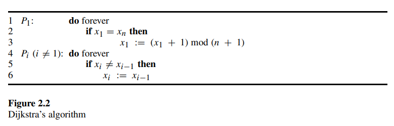
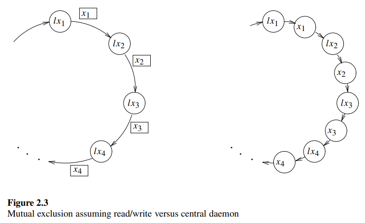

# 2.6 Example: Mutual Exclusion

Dijkstra, in his  pioneering work, presented three elegant, self-stabilizing algorithms for mutual exclusion on a ring. Dijkstra's work is considered to be the first to introduce and demonstrate the self-stabilization concept.

Dijkstra 在他的开创性工作中，提出了三个用于环形结构互斥的优雅的自稳定算法。Dijkstra 的工作被认为是首次引入和展示自稳定概念的研究。

The algorithms presented by Dijkstra are for a system in which **processors are activated by a scheduler called *central daemon*, which activates one processor at a time to execute an *aggregate step* consisting of several communication operations**. For simplicity we assume that the central daemon is *fair*, activating each processor infinitely often in every infinite execution. The activated processor uses its own state and the states of its neighbors to compute its next state. In other words, the central daemon chooses one processor at a time and lets this processor read the state (that is written in the registers) of its neighbors and change the state (write the new state in the communication registers). Thus, when describing a system configuration there is no need to consider local variables that store the values read from neighbors — the state transition is made according to the values stored in the registers of the neighbors when the (single) processor is scheduled.

Dijkstra 提出的算法适用于由称为 ***中央守护进程* 的调度程序激活处理器的系统**，该调度程序**一次激活一个处理器以执行由多个通信操作组成的 *聚合步骤***。为简单起见，我们假设中央守护进程是 *公平* 的，在每个无限执行中无限次激活每个处理器。被激活的处理器使用自己的状态和其邻居的状态来计算其下一个状态。换句话说，中央守护进程一次选择一个处理器，并让该处理器读取其邻居的状态（写在寄存器中）并改变状态（将新状态写入通信寄存器）。因此，在描述系统配置时，无需考虑存储从邻居读取值的局部变量——状态转换是根据调度时邻居寄存器中存储的值进行的。

The system consists of $n$ processors $P_1, P_2, ···, P_n$ that are connected in a ring. Each processor has a *left* and a *right* neighbor. The left neighbor of every processor $P_i$, $1 < i \leq n$, is  $P_{i-1}$ and the left neighbor of $P_1$ is $P_n$. Similarly, the right neighbor of every processor $P_i$, $1 \leq i < n$, is  $P_{i+1}$ and the right neighbor of $P_n$ is $P_1$.

系统由 $n$ 个处理器 $P_1, P_2, ···, P_n$ 组成，这些处理器连接成一个环。每个处理器都有一个左邻居和一个右邻居。每个处理器 $P_i$ 的左邻居（$1 < i \leq n$）是 $P_{i-1}$，而 $P_1$ 的左邻居是 $P_n$。同样，每个处理器 $P_i$ 的右邻居（$1 \leq i < n$）是 $P_{i+1}$，而 $P_n$ 的右邻居是 $P_1$。

Each processor $P_i$ has a variable $x_i$ that stores an integer value that is no smaller than 0 and no larger than $n$. The transition functions of the processors $P_2, ···, P_n$ are identical, while the transition function of $P_1$ is distinct. We call $P_1$ the *special processor*. The transition functions (or programs) of $P_1$ and the other processors $P_i$ ($2 \leq i \leq n$) appear in figure 2.2.

每个处理器 $P_i$ 有一个变量 $x_i$，该变量存储一个不小于 0 且不大于 $n$ 的整数。处理器 $P_2, ···, P_n$ 的转换函数是相同的，而 $P_1$ 的转换函数是不同的。我们称 $P_1$ 为 *特殊处理器*。$P_1$ 和其他处理器 $P_i$（$2 \leq i \leq n$）的转换函数（或程序）如图 2.2 所示。

A configuration of the system is a vector of $n$ integer values, one value for each $x$ variable. A computation step of a processor $P_i$ consists of reading the $x$ variable of the left neighbor and using the value obtained together with the value of xi to compute a new value for $x_i$. **At any given time, only a single processor is executing a computation step.** A processor $P_i$ *can change its state* in a particular configuration $c$ if the next computation step of $P_i$ (when started in $c$) changes the value of $x_i$; i.e., $x_i \neq x_{i-1}$ in $c$, or $x_1 = x_n$ in $c$.

系统的配置是一个包含 $n$ 个整数值的向量，每个 $x$ 变量对应一个值。处理器 $P_i$ 的计算步骤包括读取左邻居的 $x$ 变量，并使用获得的值与 $x_i$ 的值一起计算 $x_i$ 的新值。**在任何给定时间，只有一个处理器在执行计算步骤。**如果处理器 $P_i$ 的下一个计算步骤（从配置 $c$ 开始时）改变了 $x_i$ 的值，则处理器 $P_i$ 可以在特定配置 $c$ 中 *改变其状态*；即在配置 $c$ 中，$x_i \neq x_{i-1}$，或 $x_1 = x_n$。

The task $ME$ is defined by the set of all configuration sequences in which exactly one processor can change its state in any configuration and every processor can change its state in infinitely many configurations in every sequence in $ME$. Note that this definition differs from the traditional definition of mutual exclusion that allows processors to be in the reminder section (possibly forever) as long as they do not try to enter the critical section.

**任务 $ME$ 的定义是：它是满足这样一些要求的，所有的配置序列的集合，其中在任何配置中恰好有一个处理器可以改变其状态，并且在 $ME$ 中的每个序列中，每个处理器都可以在无限多个配置中改变其状态。**请注意，这一定义不同于传统的互斥定义，传统定义允许处理器在提醒区（可能永远）中，只要它们不尝试进入临界区。

A safe configuration for $ME$ and Dijkstra's algorithm (figure 2.2) is a configuration in which all the $x$ variables have the same value. This is only one example of a safe configuration, but sufficient for what we need. The next lemma proves that, indeed, every fair execution that starts with such a safe configuration belongs to $ME$.

对于任务 $ME$ 和 Dijkstra 的算法（图 2.2），一个安全配置是所有 $x$ 变量具有相同值的配置。这只是一个安全配置的例子，但足以满足我们的需要。下一个引理证明，确实，每个从这种安全配置开始的公平执行都属于 $ME$。

---

> LEMMA 2.2: A configuration $c$ in which all the $x$ variables have the same value is a safe configuration for $ME$ and Dijkstra's algorithm.
>
> **引理 2.2**：在配置 $c$ 中，如果所有 $x$ 变量具有相同的值，则该配置对于 $ME$ 和 Dijkstra 算法来说是安全的配置。

*Proof:*

Clearly the only processor $P_i$ that is able to change the value of $x_i$ in $c$ is $P_1$. $P_1$ is activated infinitely often in every fair execution that starts in c. Once $P_1$ is activated, $P_1$ assigns $x_1$ a value that does not exist in any other variable. Let $c_1$ be the configuration that immediately follows the assignment of this new value in $x_1$. Clearly, $P_1$ cannot change the value of $x_1$ until $x_n$ holds the new value as well.

Every other processor $P_i$ cannot change the value of $x_i$ unless $x_{i-1} \neq x_i$. Thus, the only processor $P_i$ that can change the value of $x_i$ is $P_2$. $P_2$ is activated infinitely often in every fair execution, and in particular it is activated infinitely often following $c_1$ of every fair execution.

Let $c_2$ be the configuration reached immediately after $P_2$ changes the value of $x_2$. In $c_2$, it holds that $x_1 = x_2$, $x_2 \neq x_3$, and $x_3 = x_4 = ··· = x_n$. Thus, the only processor that is able to change a state is $P_3$.

In general, in $c_i$, $1 \leq i < n$, it holds that $x_1 = x_2 = ··· = x_i$, $x_i \neq x_{i+1}$, and $x_{i+1} = x_{i+2} = ··· = x_n$. Thus, the only processor that is able to change the value of its variable is  $P_{i +1}$.

Therefore, in $c_{n-1}$, only $P_n$ is able to change the value of its variable and, once it is activated, a configuration $c_n$ is reached in which the values of all the variables are the same. Note that in every execution that starts in $c$ and ends in $c_n$ exactly one processor is able to change the value of its variable and each processor changes the value of its variable exactly once.

Exactly the same arguments can be applied to $c_n$; thus it is clear that, in every fair execution, every processor changes the value of its variable infinitely often and, in every execution, there is exactly one processor that can change its state. (End)

*证明：*

显然，在配置 $c$ 中，唯一能够改变 $x_i$ 值的处理器 $P_i$ 是 $P_1$。在每个从 $c$ 开始的公平执行中，$P_1$ 被无限次激活。一旦 $P_1$ 被激活，$P_1$ 会为 $x_1$ 分配一个在其他变量中不存在的值。设 $c_1$ 为在 $x_1$ 分配新值后立即跟随的配置。显然，$P_1$ 不能改变 $x_1$ 的值，直到 $x_n$ 也持有新值。

每个其他处理器 $P_i$ 不能改变 $x_i$ 的值，除非 $x_{i-1} \neq x_i$。因此，唯一能够改变 $x_i$ 值的处理器 $P_i$ 是 $P_2$。在每个公平执行中，$P_2$ 被无限次激活，特别是在每个公平执行的 $c_1$ 之后无限次激活。

设 $c_2$ 为 $P_2$ 改变 $x_2$ 值后立即达到的配置。在 $c_2$ 中，$x_1 = x_2$，$x_2 \neq x_3$，并且 $x_3 = x_4 = ··· = x_n$。因此，唯一能够改变状态的处理器是 $P_3$。

一般来说，在 $c_i$ 中，$1 \leq i < n$，有 $x_1 = x_2 = ··· = x_i$，$x_i \neq x_{i+1}$，并且 $x_{i+1} = x_{i+2} = ··· = x_n$。因此，唯一能够改变其变量值的处理器是 $P_{i+1}$。

因此，在 $c_{n-1}$ 中，只有 $P_n$ 能够改变其变量的值，一旦它被激活，就会达到一个配置 $c_n$，其中所有变量的值都相同。注意，在每个从 $c$ 开始并以 $c_n$ 结束的执行中，只有一个处理器能够改变其变量的值，并且每个处理器恰好改变其变量的值一次。

完全相同的论点可以应用于 $c_n$；因此显然，在每个公平执行中，每个处理器无限次地改变其变量的值，并且在每个执行中，恰好有一个处理器能够改变其状态。（完）

---

To prove that Dijkstra's algorithm is self-stabilizing for $ME$, we need to show that, in every fair execution, a safe configuration relative to $ME$ is reached after a finite number of rounds. We first observe that, in any possible configuration, at least one possible value for the $x$ variables does not exist. In fact, the observation that in any configuration at least one value is missing is used in what follows. We call this concept the *missing value* or *missing label concept*.

为了证明 Dijkstra 算法对 $ME$ 是自稳定的，我们需要证明在每个公平执行中，相对于 $ME$ 的安全配置在有限轮次后达到。我们首先观察到，**在任何可能的配置中，至少有一个 $x$ 变量的可能值不存在。**事实上，接下来将使用这一观察，即在任何配置中至少缺少一个值。我们称这一概念为 *缺失值* 或 *缺失标签概念*。

---

> LEMMA 2.3: For every possible configuration $c$, there exists at least one integer $0 \leq j \leq n$ such that for every $1 \leq i \leq n$, $x_i \neq j$ in $c$.
>
> **引理 2.3**：对于每一个可能的配置 $c$，存在至少一个整数 $0 \leq j \leq n$，使得对于每一个 $1 \leq i \leq n$，在配置 $c$ 中 $x_i \neq j$。

*Proof:*

There are at most $n$ distinct values in the $x$ variables in $c$, a distinct value for each processor $P_i$. There are $n + 1$ possible values that can be stored in each of the $x$ variables. Thus, an integer $j$ must exist that does not appear in any $x_i$. (End)

*证明：*

在配置 $c$ 中，$x$ 变量中最多有 $n$ 个不同的值，每个处理器 $P_i$ 对应一个不同的值。每个 $x$ 变量可以存储 $n + 1$ 个可能的值。因此，必须存在一个整数 $j$，它不会出现在任何 $x_i$ 中。（完）

---

The next observation is also simple, claiming that the special processor $P_1$ changes the value of $x_1$ infinitely often in every fair execution.

下一个观察也很简单，声称**特殊处理器 $P_1$ 在每个公平执行中无限次地改变 $x_1$ 的值**。

---

> LEMMA 2.4: For every possible configuration $c$, in every fair execution that starts in $c$, the special processor $P_1$ changes the value of $x_1$ at least once in every $n$ rounds.
>
> **引理 2.4**：对于每一个可能的配置 $c$，在每个从 $c$ 开始的公平执行中，特殊处理器 $P_1$ 在每 $n$ 轮中至少改变一次 $x_1$ 的值。

*Proof:*

Assume that there exists a configuration $c$ and a fair execution that starts in $c$ and in which $P_1$ does not change the value of $x_1$ during the first $n$ rounds.

- Let $c_2$ be the configuration that immediately follows the first time $P_2$ executes a computation step during the first round. Clearly, $x_1 = x_2$ in $c_2$ and in every configuration that follows $c_2$ in the next $n - 1$ rounds.
- Let $c_3$ be the configuration that immediately follows the first time $P_3$ executes a computation step during the second round. It holds in $c_3$ that $x_1 = x_2 = x_3$.
- The same argument repeats itself until we arrive at the configuration $c_n$, which is reached in the ($n - 1$) th round and in which $x_1 = x_2 =···= x_n$.

In the $n$ th round, $P_1$ is activated and changes the value of $x_1$, a contradiction. (End)

*证明：*

**假设**存在一个配置 $c$ 和一个从 $c$ 开始的公平执行，在该执行中 $P_1$ 在前 $n$ 轮中没有改变 $x_1$ 的值。

- 设 $c_2$ 为 $P_2$ 在第一轮中第一次执行计算步骤后立即跟随的配置。显然，在 $c_2$ 中 $x_1 = x_2$，并且在接下来的 $n - 1$ 轮中每个跟随 $c_2$ 的配置中也是如此。
- 设 $c_3$ 为 $P_3$ 在第二轮中第一次执行计算步骤后立即跟随的配置。在 $c_3$ 中，$x_1 = x_2 = x_3$。
- 同样的论点重复，直到我们到达配置 $c_n$，该配置在第 ($n - 1$) 轮中达到，并且在该配置中 $x_1 = x_2 =···= x_n$。

在第 $n$ 轮中，$P_1$ 被激活并改变 $x_1$ 的值，这与假设矛盾。（完）

---

**We are now ready to prove the main theorem.**

我们现在准备证明主要定理。

---

> THEOREM 2.1: For every possible configuration $c$, every fair execution that starts in $c$ reaches a safe configuration with relation to $ME$ within $O(n^2)$ rounds.
>
> **定理 2.1**：对于每一个可能的配置 $c$，每个从 $c$ 开始的公平执行在 $O(n^2)$ 轮内达到相对于 $ME$ 的安全配置。

*Proof:*

In accordance with lemma 2.3, for every possible configuration $c$ there exists at least one integer $0 \leq j \leq n$ such that, for every $1 \leq i \leq n$, $x_i \neq j$ in $c$.

In accordance with lemma 2.4, for every possible configuration $c$, in every fair execution that starts in $c$, the special processor $P_1$ changes the value of $x_1$ in every $n$ rounds.

Every time $P_1$ changes the value of $x_1$, $P_1$ increments the value of $x_1$ modulo $n + 1$.

Thus, it must hold that every possible value, and in particular the value $j$, is assigned to $x_1$ during any fair execution that starts in $c$. Let $c_j$ be the configuration that immediately follows the first assignment of $j$ in $x_1$.

Every processor $P_i (2 \leq i \leq n)$ copies the value of $x_{i-1}$ to $x_i$. Thus, it holds for $1 \leq i \leq n$ that $x_i \neq j$ in every configuration that follows $c$ and precedes $c_j$; it also holds that in $c_j$, the only $x$ variable that holds the value $j$ is $x_1$. $P_1$ does not change the value of $x_1$ until $x_n = j$.

The only possible sequence of changes of the values of the $x$ variables to the value $j$ is: $P_2$ changes $x_2$ to the value of $x_1$ (which is $j$), then $P_3$ changes the value of $x_3$ to $j$ and so on until $P_n$ changes the value of $x_n$ to $j$. Only at this stage is $P_1$ able to change value again (following $c_j$). Let $c_n$ be the configuration reached following the assignment of $x_n := j$. $c_n$ is a safe configuration.

In accordance with lemma 2.4, $P_1$ must assign $j$ to $x_1$ in every $n^2$ rounds. Thus a safe configuration must be reached in $n^2 + n$ rounds. (End)

*证明：*

根据引理 2.3，对于每一个可能的配置 $c$，存在至少一个整数 $0 \leq j \leq n$，使得对于每一个 $1 \leq i \leq n$，在配置 $c$ 中 $x_i \neq j$。

根据引理 2.4，对于每一个可能的配置 $c$，在每个从 $c$ 开始的公平执行中，特殊处理器 $P_1$ 在每 $n$ 轮中改变一次 $x_1$ 的值。

每次 $P_1$ 改变 $x_1$ 的值时，$P_1$ 将 $x_1$ 的值按模 $n + 1$ 增加。

因此，在从 $c$ 开始的任何公平执行中，$x_1$ 必定会被分配到每一个可能的值，特别是值 $j$。设 $c_j$ 为 $x_1$ 首次分配值 $j$ 后立即跟随的配置。

每个处理器 $P_i$ ($2 \leq i \leq n$) 将 $x_{i-1}$ 的值复制到 $x_i$。因此，对于 $1 \leq i \leq n$，在每个跟随 $c$ 并先于 $c_j$ 的配置中，$x_i \neq j$；在 $c_j$ 中，唯一持有值 $j$ 的 $x$ 变量是 $x_1$。$P_1$ 不会改变 $x_1$ 的值，直到 $x_n = j$。

唯一可能的将 $x$ 变量的值改变为 $j$ 的序列是：$P_2$ 将 $x_2$ 的值改变为 $x_1$ 的值（即 $j$），然后 $P_3$ 将 $x_3$ 的值改变为 $j$，依此类推，直到 $P_n$ 将 $x_n$ 的值改变为 $j$。只有在这个阶段，$P_1$ 才能再次改变值（跟随 $c_j$）。设 $c_n$ 为 $x_n := j$ 分配后的配置。$c_n$ 是一个安全配置。

根据引理 2.4，$P_1$ 必须在每 $n^2$ 轮中将 $j$ 分配给 $x_1$。因此，安全配置必须在 $n^2 + n$ 轮内达到。（完）

---

In fact, Dijkstra's algorithm stabilizes when the number of possible values for the $x$ variable is $n$. The reason is that, if no possible value is missing in the first configuration, then $x_1$ has a distinct value; thus, stabilization is guaranteed. Otherwise, at least one possible value is missing in the first configuration and theorem 2.1 holds.

事实上，当 $x$ 变量的可能值数量为 $n$ 时，Dijkstra 算法会稳定下来。原因是，如果在初始配置中没有缺失的可能值，那么 $x_1$ 就有一个独特的值；因此，稳定性是有保证的。否则，在初始配置中至少缺少一个可能值，并且定理 2.1 成立。

Moreover, a similar argument holds when the number of possible values for the x variables is $n - 1$. In this case, a configuration must be reached in which $x_n = x_1$ (just before the first time $P_1$ changes the value of $x_1$). Call this configuration $c$. If in c every processor $P_i$, $1 \leq i \leq n - 1$, does not hold a distinct value in $x_i$, then a missing value $j$ must exist and the stabilization is proved by a proof similar to that of theorem 2.1. Otherwise, each $P_i$, $1 \leq i \leq n-1$, holds a distinct value in $c$. Let $j'$ be the value of $x_1$ in $c$ and consider the first configuration $c'$ that follows c and in which $P_1$ is able to change the value of $x_1$. Consider the following three cases for the first computation step that follows $c$.

Case 1: a processor $P_i$, $2 \leq i \leq n - 1$, copies the value of $x_{i-1}$ to $x_i$ and, at the same time, eliminates the distinct value stored in xi from the system.

Case 2: $P_n$ copies the distinct value of $x_{n-1}$ to $x_n$, leaving $x_1$ with a distinct value.

Case 3: $P_1$ changes the value of $x_1$ to $k = (j'+1) \mod (n-1)$; thus, the only x variable that holds $j'$ is $x_n$. However, $P_n$ must copy the value $k$ within the next $n$ rounds (before $P_1$ changes the value of $x_1$ again), eliminating $j'$ from the system.

此外，当 $x$ 变量的可能值数量为 $n-1$ 时，类似的论点也成立。在这种情况下，必须达到一个配置，其中 $x_n = x_1$（就在 $P_1$ 第一次改变 $x_1$ 的值之前）。称此配置为 $c$。如果在 $c$ 中，每个处理器 $P_i$（$1 \leq i \leq n-1$）在 $x_i$ 中没有持有一个独特的值，那么必须存在一个缺失值 $j$，并且通过类似于定理 2.1 的证明可以证明稳定性。否则，每个 $P_i$（$1 \leq i \leq n-1$）在 $c$ 中持有一个独特的值。设 $j'$ 为 $c$ 中 $x_1$ 的值，并考虑紧随 $c$ 之后的第一个配置 $c'$，在该配置中 $P_1$ 能够改变 $x_1$ 的值。考虑以下三种情况，作为紧随 $c$ 之后的第一个计算步骤。

情况 1：处理器 $P_i$（$2 \leq i \leq n-1$）将 $x_{i-1}$ 的值复制到 $x_i$，同时从系统中消除存储在 $x_i$ 中的独特值。

情况 2：$P_n$ 将 $x_{n-1}$ 的独特值复制到 $x_n$，使 $x_1$ 保持一个独特的值。

情况 3：$P_1$ 将 $x_1$ 的值改变为 $k = (j'+1) \mod (n-1)$；因此，唯一持有 $j'$ 的 $x$ 变量是 $x_n$。然而，$P_n$ 必须在接下来的 $n$ 轮内复制值 $k$（在 $P_1$ 再次改变 $x_1$ 的值之前），从系统中消除 $j'$。

Will Dijkstra's algorithm stabilize when the number of possible values for the $x$ variables is $n-2$? Let $c$ = {0, 0, 2, 1, 0} be a system configuration. An execution that starts in $c$ and repeatedly activates $P_1$, $P_5$, $P_4$, $P_3$, $P_2$, in this order, does not reach a safe configuration:

Dijkstra 算法是否会在 $x$ 变量的可能值数量为 $n - 2$ 时稳定？设 $c$ = {0, 0, 2, 1, 0} 为一个系统配置。从 $c$ 开始并按顺序重复激活 $P_1$、$P_5$、$P_4$、$P_3$、$P_2$ 的执行不会达到安全配置：

{0, 0, 2, 1, 0}→{1, 0, 2, 1, 0}→{1, 0, 2, 1, 1}→{1, 0, 2, 2, 1}→{1, 0, 0, 2, 1}→{1, 1, 0, 2, 1}···

Note that the configuration {1, 1, 0, 2, 1}is obtained by incrementing every value in {0, 0, 2, 1, 0} by 1, where the increment operation is done modulo $n - 2 = 3$, and therefore the configuration {0, 0, 2, 1, 0} is reached again after activating each processor $n - 2 = 3$ times when the processors are repeatedly activated in the order specified above. Thus, there exists an infinite execution in which more than one processor can change a state in every configuration. This execution has no suffix in $ME$, and therefore the algorithm is not self stabilizing with relation to $ME$.

注意，配置 {1, 1, 0, 2, 1} 是通过将 {0, 0, 2, 1, 0} 中的每个值增加 1 获得的，其中增加操作是以模 $n - 2 = 3$ 进行的，因此在按上述顺序重复激活每个处理器 $n - 2 = 3$ 次后，配置 {0, 0, 2, 1, 0} 再次达到。因此，存在一个无限执行，其中在每个配置中有多个处理器可以改变状态。这个执行在 $ME$ 中没有后缀，因此该算法相对于 $ME$ 不是自稳定的。

It seems at first glance that the powerful central daemon scheduler guarantees some sort of mutual exclusion by activating one processor at a time. One can ask whether an algorithm in which every processor $P_i$ executes the critical section (whenever the central daemon activates $P_i$) is a mutual exclusion algorithm.

听起来强大的中央守护进程调度器通过每次激活一个处理器来保证某种互斥。有人可能会问，一个算法中，每当中央守护进程激活处理器 $P_i$ 时，该处理器 $P_i$ 执行临界区，这是否是一个互斥算法。

To answer the above question, let us consider a multitasking single-processor computer in which, at any given time, exactly one process is executed by the single processor. In such settings, one of the processes $P_i$ may enter the critical section (e.g., may start using a resource such as the printer). $P_i$ may be suspended while it is in the critical section by the operating system, due to task switching. We would not want any other process to enter the critical section (and, say, start printing) as long as $P_i$ is in the critical section. Clearly, Dijkstra's algorithm can be used to coordinate the activity of the processes in such a system in the following way: the single process $P_i$ that can change a state is the one that may access the critical section. Only when process $P_i$ is finished with the critical section does it change the value of $x_i$.

要回答上述问题，让我们考虑一个多任务单处理器计算机，在任何给定时间内，单处理器只执行一个进程。在这种情况下，某个进程 $P_i$ 可能会进入临界区（例如，开始使用资源如打印机）。$P_i$ 可能会因为操作系统的任务切换而在临界区内被挂起。当 $P_i$ 在临界区时，我们不希望任何其他进程进入临界区（例如，开始打印）。显然，Dijkstra 的算法可以用来协调这样一个系统中的进程活动：可以改变状态的单个进程 $P_i$ 是唯一可以访问临界区的进程。只有当进程 $P_i$ 完成临界区的操作后，它才会改变 $x_i$ 的值。

On the negative side, we demonstrate that Dijkstra's algorithm needs more states to work if steps consists of only one communication operation, read or write. (The term *read/write* *atomicity* describes the operations in such a system.) To do this we introduce an internal variable ${lx}_i$ for every processor $P_i$ in which is stored the last value read by $P_i$ from the $x$ variable of the left neighbor of $P_i$. Note that the existence of such a variable is enforced by the new atomicity, since a write operation is not executed in the same atomic step as a read operation and the value written is a function of the last value read. Now a possible configuration is a vector  $c = \{({lx}_1, x1), ({lx}_2, x2), ···, ({lx}_n, xn)\}$. A read operation of $P_i$, $1 < i \leq n$, copies the value of $x_{i-1}$ into ${lx}_i$; a read operation of $P_1$ copies the value of $x_n$ into ${lx}_1$. A write operation of $P_i$, $1 < i \leq n$, copies the value of ${lx}_i$ into $x_i$; a write operation of $P_1$ assigns $({lx}_1 + 1) \mod K$ to $x_1$, where, from our previous discussion, $K > (n-2)$. If we reexamine the operation of every processor in the read/write atomicity model, we discover that the n-processor ring in this model is identical to a ring of $2n$ processors in a system with a central daemon. A read operation is essentially a copy of the value of the left neighbor. A write operation by every processor $P_i$, $i \neq 1$, is also a copy operation from ${lx}_i$ to $x_i$. $x_1$ is the only variable that is incremented modulo $K$ during a write operation. Thus, we can apply our previous proofs and discussion to conclude that $K$ must be greater than $2n-2$.

在负面方面，我们证明了如果步骤仅由一个通信操作（读取或写入）组成，Dijkstra 算法需要更多的状态才能工作。（术语 *读/写原子性* 描述了这种系统中的操作。）为此，我们为每个处理器 $P_i$ 引入一个内部变量 ${lx}_i$，其中存储了 $P_i$ 从其左邻居的 $x$ 变量中读取的最后一个值。注意，这种变量的存在是由新的原子性强制要求的，因为写操作并不是在与读操作相同的原子步骤中执行的，并且写入的值是最后读取值的函数。现在，可能的配置是一个向量 $c = \{({lx}_1, x_1), ({lx}_2, x_2), ···, ({lx}_n, x_n)\}$。$P_i$ 的读操作，$1 < i \leq n$，将 $x_{i-1}$ 的值复制到 ${lx}_i$；$P_1$ 的读操作将 $x_n$ 的值复制到 ${lx}_1$。$P_i$ 的写操作，$1 < i \leq n$，将 ${lx}_i$ 的值复制到 $x_i$；$P_1$ 的写操作将 $({lx}_1 + 1) \mod K$ 赋给 $x_1$，根据我们之前的讨论，$K > (n - 2)$。如果我们重新检查在读/写原子性模型中每个处理器的操作，我们会发现该模型中的 $n$ 处理器环与带有中央守护进程的系统中的 $2n$ 处理器环是相同的。读操作本质上是左邻居值的复制。每个处理器 $P_i$（$i \neq 1$）的写操作也是从 ${lx}_i$ 到 $x_i$ 的复制操作。$x_1$ 是唯一在写操作期间以模 $K$ 增加的变量。因此，我们可以应用之前的证明和讨论，得出 $K$ 必须大于 $2n - 2$。

In figure 2.3 circles represent processors and rectangles represent communication registers. The left portion of figure 2.3 represents a system for which read/write atomicity is assumed. The arrows in the left portion denote the ability of $P_i$ to write (the value of ${lx}_i$, if $i \neq 1$) in $x_i$ and read the value of $x_{i-1}$  (into ${lx}_i$). The right portion of figure 2.3 represents a system for which a central daemon is assumed. The arrows in this portion denote the ability of $P_i$ to use the state of its left neighbor together with its own state for its transition function. Note that there is no need to store a value read from a (register of a) processor in a local variable. Whenever the central daemon schedules a processor to execute a step, the state of the left neighbor (the value read from the left neighbor) is used by $P_i$ in the very same (aggregate) step to compute its next state.

在图 2.3 中，圆圈表示处理器，矩形表示通信寄存器。图 2.3 的左部分表示假定具有读/写原子性的一种系统。左部分中的箭头表示 $P_i$ 能够在 $x_i$ 中写入值（${lx}_i$ 的值，如果 $i \neq 1$）并读取 $x_{i-1}$ 的值（到 ${lx}_i$ 中）。图 2.3 的右部分表示假定具有中心守护进程的一种系统。此部分中的箭头表示 $P_i$ 能够使用其左邻居的状态及其自身的状态来进行状态转换函数。请注意，不需要将从（一个处理器的寄存器）读取的值存储在局部变量中。每当中心守护进程安排处理器执行一个步骤时，左邻居的状态（从左邻居读取的值）在同一个（聚合）步骤中由 $P_i$ 使用来计算其下一个状态。

