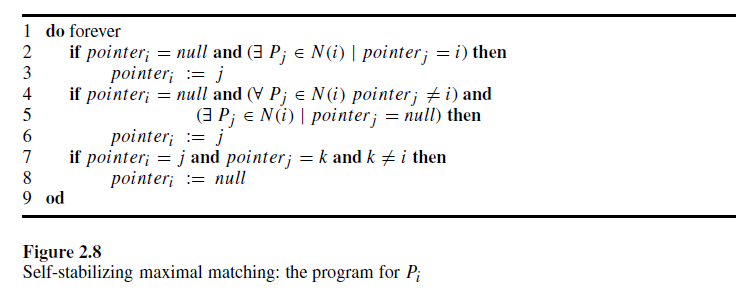
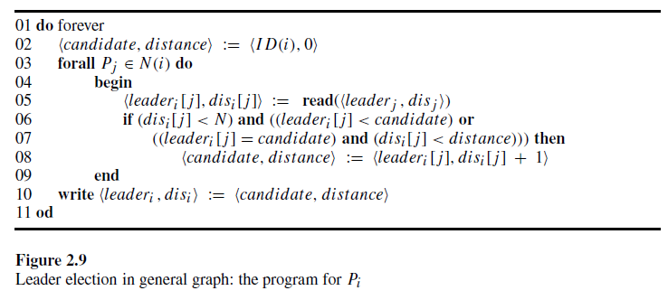
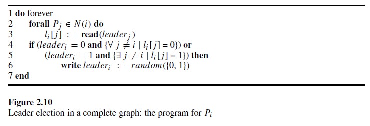
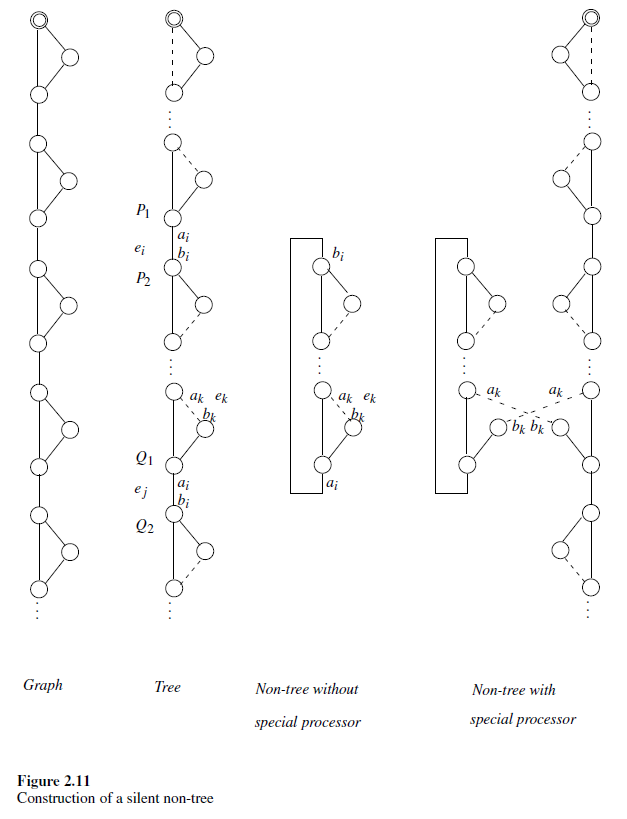

# 2.9 Proof Techniques

This section describes and demonstrates several basic proof techniques, techniques that we use in subsequent chapters to prove correctness of the self-stabilizing algorithms. Proof techniques demonstrate the difficulties of designing self-stabilizing algorithms and how to cope with them.

本节描述并演示了几种基本的证明技术，这些技术将在后续章节中用于证明自稳定算法的正确性。证明技术展示了设计自稳定算法的难点以及如何应对这些难点。

## Variant Function

The variant function (or potential function) technique is **used for proving convergence**. The basic idea is to use a function over the configuration set, whose value is bounded, to prove that this function **monotonically** decreases (or increases) when processors execute a step, and to show that after the function reaches a certain threshold, the system is in a safe configuration.

The above property of the variant function can be used to estimate the maximal number of steps required to reach a safe configuration. In some cases the choice of the variant function is intricate, as the following example indicates.

变元函数（或势函数）技术用于**证明收敛性**。其基本思想是使用一个在配置集上的函数，该函数的值是有界的，以证明当处理器执行一步时，该函数**单调**递减（或递增），并且在函数达到某个阈值后，系统处于安全配置中。

变元函数的上述性质可用于估计达到安全配置所需的最大步骤数。在某些情况下，变元函数的选择是复杂的，正如以下示例所示。

## Example: Self-Stabilizing Maximal Matching

In the maximal matching algorithm, every processor Pi tries to find a matching neighbor $P_j$. Assume that each processor $P_i$ has a pointer that either points to one of its neighbors or has a null value. The maximal matching algorithm should reach **a configuration $c_l$ in which the existence of a pointer of $P_i$ that points to $P_j$ implies the existence of a pointer of $P_j$ that points to $P_i$. In addition, assume that in $c_l$ there are no two neighboring processors $P_i$ and $P_j$, such that both have null pointers. The first condition is the core requirement for matching, while the second requirement guarantees that the solution is maximal**.

在极大匹配算法中，每个处理器 $P_i$ 尝试找到一个匹配的邻居 $P_j$。假设每个处理器 $P_i$ 有一个指针，该指针要么指向其一个邻居，要么为空值。极大匹配算法应达到一个配置 $c_l$，**在该配置中，$P_i$ 的指针指向 $P_j$ 意味着 $P_j$ 的指针也指向 $P_i$。此外，假设在 $c_l$ 中没有两个相邻的处理器 $P_i$ 和 $P_j$ 都有空指针。第一个条件是匹配的核心要求，而第二个条件保证了解决方案是最大的**。

Our concern in this example is to demonstrate the variant function technique. To simplify the discussion, let us assume the existence of a central daemon that activates one processor at a time; the activated processor reads the state of all its neighbors and changes state accordingly. Only when the activated processor finishes executing the above operations is another processor activated. The algorithm is presented in figure 2.8.

在这个示例中，我们关注的是演示变元函数技术。为了简化讨论，假设存在一个中央守护进程，该进程一次激活一个处理器；被激活的处理器读取其所有邻居的状态并相应地改变状态。只有当被激活的处理器完成上述操作后，另一个处理器才会被激活。算法如图 2.8 所示。

The set of legal executions $MM$ for the maximal matching task includes every execution in which the values of the pointers of all the processors are **fixed and form a maximal matching**. Given a configuration $c_l$, we say that a processor $P_i$ is:

- $matched$ in $c_l$, if $P_i$ has a neighbor $P_j$ such that ${pointer}_i = j$ and ${pointer}_j = i$.
- $single$ in $c_l$, if ${pointer}_i = null$ and every neighbor of $P_i$ is matched.
- $waiting$ in $c_l$, if $P_i$ has a neighbor $P_j$ such that ${pointer}_i = j$ and ${pointer}_j = null$.
- $free$ in $c_l$, if ${pointer}_i = null$ and there exists a neighbor $P_j$, such that $P_j$ is not matched.
- $chaining$ in $c_l$, if there exists a neighbor $P_j$ for which ${pointer}_i = j$ and ${pointer}_j = k, k \neq i$.

极大匹配任务的合法执行集 $MM$ 包括所有处理器的指针值**固定并形成极大匹配**的每次执行。给定一个配置 $c_l$，我们说处理器 $P_i$ 是：

- 在 $c_l$ 中是 $matched$，如果 $P_i$ 有一个邻居 $P_j$，使得 ${pointer}_i = j$ 且 ${pointer}_j = i$。
- 在 $c_l$ 中是 $single$，如果 ${pointer}_i = null$ 且 $P_i$ 的每个邻居都是 matched 的。
- 在 $c_l$ 中是 $waiting$，如果 $P_i$ 有一个邻居 $P_j$，使得 ${pointer}_i = j$ 且 ${pointer}_j = null$。
- 在 $c_l$ 中是 $free$，如果 ${pointer}_i = null$ 且存在一个邻居 $P_j$，使得 $P_j$ 没有 matched。
- 在 $c_l$ 中是 $chaining$，如果存在一个邻居 $P_j$，使得 ${pointer}_i = j$ 且 ${pointer}_j = k, k \neq i$。

The correctness proof of the algorithm presented in figure 2.8 uses the variant function $VF(c)$, which returns a vector $(m+s, w, f, c)$, where $m$, $s$, $w$, $f$, and c are the total number of matched, single, waiting, free, and chaining processors, respectively, in $c_l$. Values of $VF$ are compared lexicographically: for example, $(5, 3, 4, 7)$ is greater than $(5, 3, 3, 8)$.

图 2.8 中所示算法的正确性证明使用了变元函数 $VF(c)$，该函数返回一个向量 $(m+s, w, f, c)$，其中 $m$、$s$、$w$、$f$ 和 $c$ 分别是 $c_l$ 中 matched、single、waiting、free 和 chaining 处理器的总数。$VF$ 的值按字典顺序进行比较：例如，$(5, 3, 4, 7)$ 大于 $(5, 3, 3, 8)$。

Note that every configuration $c_l$ for which $VF(c) = (n, 0, 0, 0)$ is a safe configuration with relation to $MM$ and to our algorithm; also for every safe configuration $c_l$, $VF(c) = (n, 0, 0, 0)$. Once the system reaches a safe configuration, no processor changes the value of its pointer, **while in every non-safe configuration, there exists at least one processor that can change the value of its pointer when it is activated by the central daemon**. Next we show that **every change of a pointer value increases the value of $VF$**.

注意，对于每个配置 $c_l$，如果 $VF(c) = (n, 0, 0, 0)$，则该配置相对于 $MM$ 和我们的算法是一个安全配置；同样，对于每个安全配置 $c_l$，$VF(c) = (n, 0, 0, 0)$。一旦系统达到安全配置，没有处理器会改变其指针的值，**而在每个非安全配置中，至少存在一个处理器在被中央守护进程激活时可以改变其指针的值**。接下来我们将展示**每次指针值的变化都会增加 $VF$ 的值**。

An assignment in line 3 of the code reduces the number of free processors and waiting processors by 1 and increments the number of matched processors by 2.

An assignment in line 6 of the code reduces the number of free processors by 1 and increments the number of waiting processors by 1.

The assignment in line 8 is executed when $P_i$ is chaining. Two cases are considered:

- first, if no neighboring processor points to $P_i$. In this case, $P_i$ changes status to free if there exists an unmatched neighbor, or to single if all neighbors are matched. Therefore, the number of chaining processors is reduced by 1 and the number of free or single processors is incremented by 1.
- In the second case, when at least one neighbor $P_k$ points toward $P_i$, the status of $P_i$ is changed to free and the status of $P_k$ is changed from chaining to waiting. Hence the number of chaining processors is reduced by 2, while the number of both free and waiting processors is incremented by 1.

Thus each of the above assignments increments the value of $VF$. The system stabilizes once it reaches a configuration in which no increment is possible, which is a safe configuration.

代码第 3 行的赋值操作将 free 处理器和 waiting 处理器的数量减少 1，并将 matched 处理器的数量增加 2。

代码第 6 行的赋值操作将 free 处理器的数量减少 1，并将 waiting 处理器的数量增加 1。

第 8 行的赋值操作在 $P_i$ 处于 chaining 状态时执行。考虑两种情况：

- 首先，如果没有邻居处理器指向 $P_i$。在这种情况下，如果存在未匹配的邻居，$P_i$ 的状态变为 free；如果所有邻居都 matched，则状态变为 single。因此，chaining 处理器的数量减少 1，free 或 single 处理器的数量增加 1。
- 在第二种情况下，当至少有一个邻居 $P_k$ 指向 $P_i$ 时，$P_i$ 的状态变为 free，$P_k$ 的状态从 chaining 变为 waiting。因此，chaining 处理器的数量减少 2，而 free 和 waiting 处理器的数量各增加 1。

因此，上述每个赋值操作都会增加 $VF$ 的值。一旦系统达到无法再增加的配置，即为安全配置，系统就会稳定下来。

We can conclude that, indeed, every change in a pointer value increments the value of $VF$. The number of such pointer-value changes is bounded by the number of all possible vector values. The fact that $m + s + w + f + c = n$ implies that **the number of possible vector values is $O(n^3)$**. A rough analysis uses the following argument. One can choose $n + 1$ possible values for $m + s$ and then $n+1$ values for $w$ and $f$. The value of $n$ and the first three elements of the vector $(m+s, w, f, c)$ imply the value of $c$. Therefore the system reaches a safe configuration within $O(n^3)$ pointer-value changes.

我们可以得出结论，确实，每次指针值的变化都会增加 $VF$ 的值。这种指针值变化的次数受所有可能向量值数量的限制。由于 $m + s + w + f + c = n$，这意味着**可能的向量值数量是 $O(n^3)$**。粗略分析使用以下论点。可以为 $m+s$ 选择 $n+1$ 个可能值，然后为 $w$ 和 $f$ 选择 $n + 1$ 个值。向量 $(m + s, w, f, c)$ 的值 $n$ 和前三个元素决定了 $c$ 的值。因此，系统在 $O(n^3)$ 次指针值变化内达到安全配置。

## Convergence Stairs

It is possible to prove the correctness of a self-stabilizing algorithm by proving that it converges to fulfill $k > 1$ predicates $\mathcal{A}_1,\mathcal{A}_2, · · · ,\mathcal{A}_k$ such that, for every $1 ≤ i < k$, $\mathcal{A}_{i+1}$ is a *refinement* of $\mathcal{A}_i$. Here a predicate $\mathcal{A}_{i+1}$ *refines* the predicate $\mathcal{A}_i$ if $\mathcal{A}_i$ holds whenever $\mathcal{A}_{i+1}$ holds. The term *attractor* is often used for each such $\mathcal{A}_i$ predicate. The proof is done in “stairs” by proving that, from some point of the execution, every configuration satisfies $\mathcal{A}_1$ and then proving that an execution in which $\mathcal{A}_1$ holds reaches a configuration after which every configuration satisfies $\mathcal{A}_2$ and, in general, proving that $\mathcal{A}_{i+1}$ holds after $\mathcal{A}_i$ does. The goal is to prove that the system reaches a configuration in which the last predicate $\mathcal{A}_k$ holds, which is a predicate for a safe configuration. The method is demonstrated by a self-stabilizing leader-election algorithm. Leader election is a fundamental task in distributed computing: often a distributed task can be performed by electing a leader and then using a centralized computation by that leader.

可以通过证明自稳定算法收敛以满足 $k > 1$ 个谓词 $\mathcal{A}_1,\mathcal{A}_2, · · · ,\mathcal{A}_k$ 来证明其正确性，其中对于每个 $1 ≤ i < k$，$\mathcal{A}_{i+1}$ 是 $\mathcal{A}_i$ 的 *细化*。这里，如果 $\mathcal{A}_{i+1}$ 成立，则 $\mathcal{A}_i$ 也成立，则谓词 $\mathcal{A}_{i+1}$ *细化* 了谓词 $\mathcal{A}_i$。术语 *吸引子* 通常用于每个这样的 $\mathcal{A}_i$ 谓词。证明是通过“阶梯”完成的，首先证明从执行的某个点开始，每个配置都满足 $\mathcal{A}_1$，然后证明在 $\mathcal{A}_1$ 成立的执行中达到一个配置，此后每个配置都满足 $\mathcal{A}_2$，一般来说，证明 $\mathcal{A}_{i+1}$ 在 $\mathcal{A}_i$ 之后成立。目标是证明系统达到一个配置，其中最后一个谓词 $\mathcal{A}_k$ 成立，这是一个安全配置的谓词。该方法通过一个自稳定的领导者选举算法来演示。领导者选举是分布式计算中的一项基本任务：通常可以通过选举一个领导者来执行分布式任务，然后由该领导者进行集中计算。

## Example: Leader Election in a General Communication Network

A self-stabilizing algorithm for this task assumes that every processor has a unique identifier in the range 1 to $N$, where $N$ is an upper bound on the number of processors in the system. The leader election task is to inform every processor of the identifier of a single processor in the system. This single processor with the elected identifier is the leader. Usually the processor with the minimal (or maximal) identifier is elected to be the leader.

一个自稳定算法假设每个处理器都有一个唯一的标识符，范围在 1 到 $N$ 之间，其中 $N$ 是系统中处理器数量的上限。领导者选举任务是通知每个处理器系统中某个处理器的标识符。这个具有被选标识符的处理器是领导者。通常，具有最小（或最大）标识符的处理器被选为领导者。

The following simple (non-terminating) algorithm elects a leader in a non-stabilizing manner.

- Each processor $P_i$ has a candidate for a leader; in the beginning, the candidate is $P_i$ itself.
- $P_i$ repeatedly communicates the identifier $x$ of its current candidate to its neighbors.
- Whenever $P_i$ receives an identifier $y$ of a candidate of a neighbor, if $x > y$, $P_i$ changes its candidate to be the processor with identifier $y$.

以下简单的（非终止）算法以非稳定的方式选举领导者。

- 每个处理器 $P_i$ 都有一个领导者候选人；一开始，**候选人是 $P_i$ 自己**。
- $P_i$ 反复将其当前候选人的标识符 $x$ 传达给其邻居。
- 每当 $P_i$ 收到邻居候选人的标识符 $y$ 时，如果 $x > y$，$P_i$ 会将其候选人更改为标识符为 $y$ 的处理器。

The above algorithm is not self-stabilizing, since it is possible that the minimal identifier $z$—which is a candidate in the first (arbitrary) configuration of the system—is not an identifier of a processor in the system. Nevertheless, eventually every processor declares that $z$ is the identifier of the leader. **The term *floating identifier* is used to describe an identifier that appears in the initial configuration**, when no processor in the system with this identifier appears in the system.

上述算法不是自稳定的，因为在系统的第一个（任意）配置中，最小标识符 $z$ 可能不是系统中某个处理器的标识符。然而，最终每个处理器都会声明 $z$ 是领导者的标识符。**术语 *浮动标识符* 用于描述在初始配置中出现的标识符，而系统中没有处理器具有该标识符**。

We use distance variables and the bound $N$ on the number of processors to eliminate floating identifiers. Each processor $P_i$ has a candidate for a leader ${leader}_i$ and a value for the distance from this leader ${dis}_i$. The program for $P_i$ appears in figure 2.9. A processor $P_i$ repeatedly reads the identifiers chosen by its neighbors for the identifier of the leader. $P_i$ chooses the identifier $x$ that is the smallest among the read values, such that the distance to $x$ is less than $N$. If $y$ is the minimal distance read from a neighbor together with the identifier $x$, then $P_i$ assigns $y + 1$ to its distance field.

我们使用距离变量和处理器数量的上限 $N$ 来消除浮动标识符。每个处理器 $P_i$ 都有一个领导者候选人 ${leader}_i$ 和一个从该领导者的距离值 ${dis}_i$。$P_i$ 的程序如图 2.9 所示。处理器 $P_i$ 反复读取其邻居为领导者选择的标识符。$P_i$ 选择读取值中最小的标识符 $x$，使得到 $x$ 的距离小于 $N$。如果 $y$ 是从邻居读取的最小距离以及标识符 $x$，那么 $P_i$ 将 $y+1$ 分配给其距离字段。

The proof of correctness uses two convergence stairs.

- The first convergence stair is a predicate $\mathcal{A}_1$ on system configurations verifying that no floating identifier exists.
- The second convergence stair is a predicate $\mathcal{A}_2$ for a safe configuration — a predicate that verifies that every processor chooses the minimal identifier of a processor in the system as the identifier of the leader.

正确性证明使用了两个收敛阶梯。

- 第一个收敛阶梯是系统配置上的谓词 $\mathcal{A}_1$，用于验证不存在浮动标识符。
- 第二个收敛阶梯是安全配置的谓词 $\mathcal{A}_2$，用于验证每个处理器选择系统中处理器的最小标识符作为领导者的标识符。

The value of a floating identifier can appear in the local arrays of every processor $P_i$, $l_i [1..δ]$, in the $candidate$ local variable, and in the field ${leader}_i$ of the communication register. The $distance$ of *a floating identifier* appearing in $l_i [ j ]$, $candidate$, or ${leader}_i$ is $d_i [ j ]$, $distance$, or ${dis}_i$, respectively.

浮动标识符的值可以出现在每个处理器 $P_i$ 的本地数组 $l_i [1..δ]$ 中，在 $candidate$ 局部变量中，以及在通信寄存器的字段 ${leader}_i$ 中。出现在 $l_i [j]$、$candidate$ 或 ${leader}_i$ 中的浮动标识符的 $distance$ 分别是 $d_i [j]$、$distance$ 或 ${dis}_i$。

To show that the first attractor holds, we argue that, if a floating identifier exists, then during any $O(\triangle)$ rounds, the minimal distance of a floating identifier increases.

为了证明第一个吸引子成立，我们论证，如果存在浮动标识符，那么在任何 $O(\triangle)$ 轮次中，浮动标识符的最小距离都会增加。

---

> LEMMA 2.5: Every fair execution that starts from any arbitrary configuration has a suffix in which no floating identifier exists.
>
> 引理 2.5：每个从任意配置开始的公平执行都有一个后缀，其中不存在浮动标识符。

*Proof:*

To prove the lemma, we first show that, as long as a floating identifier exists, the minimal distance of a floating identifier increases during any $O(\triangle)$ rounds. Let $P_i$ be a processor that holds in its local variables or in its communication registers a floating identifier with the minimal distance. Once $P_i$ starts executing the do forever loop, it must choose (either its own identifier for ${leader}_i$ or) a distance that is at least one greater than the distance read from a neighbor (line 8 of the code). Thus, if $P_i$ chooses to assign a floating identifier to ${leader}_i$, it must choose a distance that is greater by one than the distance it read. Once the minimal distance of a floating identifier reaches $N$, all processors do not choose a floating identifier. Therefore, all the floating identifiers are eventually eliminated. (End)

*证明：*

为了证明这个引理，我们首先展示，只要存在浮动标识符，在任何 $O(\triangle)$ 轮次中，浮动标识符的最小距离都会增加。设 $P_i$ 是一个在其局部变量或通信寄存器中持有最小距离浮动标识符的处理器。一旦 $P_i$ 开始执行 do forever 循环，它必须选择（要么是其自己的标识符作为 ${leader}_i$，要么是）一个至少比从邻居读取的距离大一的距离（代码第 8 行）。因此，如果 $P_i$ 选择将浮动标识符分配给 ${leader}_i$，它必须选择一个比读取的距离大一的距离。一旦浮动标识符的最小距离达到 $N$，所有处理器都不会选择浮动标识符。因此，所有浮动标识符最终都会被消除。

---

The fact that the first predicate $\mathcal{A}_1$ holds from some configuration of the system lets us prove the next theorem using arguments similar to those used for the non-stabilizing algorithm.

由于第一个谓词 $\mathcal{A}_1$ 在系统的某些配置中成立，我们可以使用类似于非稳定算法的论证来证明下一个定理。

---

> THEOREM 2.3: Every fair execution that starts from any arbitrary configuration reaches a safe configuration.
>
> 定理 2.3：每个从任意配置开始的公平执行都会达到一个安全配置。

## Scheduler-Luck Game

The analysis of the time complexity (measured in rounds) of distributed randomized algorithms is often a very complicated task. It is especially hard in self-stabilizing algorithms in which no assumptions are made on the initial state of the processors. In this section we describe a useful tool, the *sl-game method*, for proving upper bounds on the time complexity of randomized distributed algorithms, and demonstrate it on self-stabilizing algorithms. The *sl-game* approach tries to avoid considering every possible outcome of the random function used by a randomized algorithm. In fact, it fixes the outcome of the random function, so that the proof arguments are similar to the simpler case of proving correctness of non-randomized algorithms.

分布式随机算法的时间复杂度分析（以轮次为单位）通常是一项非常复杂的任务。在自稳定算法中，这尤其困难，因为对处理器的初始状态没有任何假设。在本节中，我们描述了一种有用的工具，即 *sl-game 方法*，用于证明随机分布式算法时间复杂度的上限，并在自稳定算法上进行演示。*sl-game* 方法试图避免考虑随机算法使用的随机函数的每一种可能结果。事实上，它固定了随机函数的结果，使得证明论证类似于证明非随机算法正确性的简单情况。

Given a randomized algorithm $\mathcal{AL}$, we define a game between two players, *scheduler* and *luck*. The goal of the scheduler is to prevent the algorithm $\mathcal{AL}$ from fulfilling its task; the scheduler can choose the activation interleaving of the processors. The opposing player, luck, may determine the result of the randomized function invoked. The idea is to show that, if luck has a strategy that forces the algorithm to converge to a safe configuration when the game is started in any initial configuration, then the algorithm stabilizes. We show that there is a relationship between the expected time to reach a safe configuration in the game and the expected time to reach a legal behavior when the algorithm is executed.

给定一个随机算法 $\mathcal{AL}$，我们定义一个由两个玩家参与的游戏，分别是 *调度器* 和 *运气*。调度器的目标是阻止算法 $\mathcal{AL}$ 完成其任务；调度器可以选择处理器的激活交错。对手玩家运气可以决定调用的随机函数的结果。这个想法是，如果运气有一种策略，可以在游戏从任何初始配置开始时迫使算法收敛到一个安全配置，那么算法就是稳定的。我们展示了在游戏中达到安全配置的预期时间与算法执行时达到合法行为的预期时间之间的关系。

In each turn of the game, the scheduler chooses the next processor to be activated, which then makes a step. If, during this step, the activated processor uses a random function, then **luck may *intervene* — i.e., luck may determine the result (or some subset of the desired results) of the random function. If luck intervenes and fixes the result to be any of g values from the possible h results, then the probability of this intervention is $p = g/h$**. Note that luck may choose not to intervene even though the activated processor calls the random function; in this case each possible result has an equal probability of occurrence. Both players are assumed to have unlimited computational resources, and their decisions are based on the history of the game so far. When the step of the activated processor ends, a new turn begins.

在游戏的每一轮中，调度器选择下一个要激活的处理器，然后该处理器执行一步。如果在这一步中，激活的处理器使用了随机函数，那么**运气可能会 *干预* —— 即运气可以决定随机函数的结果（或期望结果的某个子集）。如果运气干预并将结果固定为可能的 $h$ 个结果中的任意 $g$ 个值，那么这种干预的概率为 $p = g/h$。**请注意，即使激活的处理器调用了随机函数，运气也可以选择不干预；在这种情况下，每个可能的结果都有相同的发生概率。假设两个玩家都有无限的计算资源，并且他们的决策基于迄今为止的游戏历史。当激活的处理器的步骤结束时，新的一轮开始。

If luck intervenes several times, say $f$ times, in order to force the system to reach a safe configuration, and if the probability of the $i$ th intervention is $p_i$, then the combined probability of these interventions is $cp = \prod^f_{i=1} p_i$. Luck has a $(cp,r)-strategy$ to win the game if it has a strategy to reach a safe configuration in the game in an expected number of at most r rounds, and with interventions that yield a combined probability of no more than cp. We claim that the existence of a $(cp,r)-strategy$ implies that the algorithm reaches a safe configuration within $r/cp$ expected number of rounds.

如果运气干预了几次，比如说 $f$ 次，以迫使系统达到安全配置，并且第 $i$ 次干预的概率是 $p_i$，那么这些干预的综合概率是 $cp = \prod^f_{i=1} p_i$。如果运气有一个 $(cp,r)$-策略来赢得游戏，即它有一个策略在预期不超过 $r$ 轮的游戏中达到安全配置，并且干预的综合概率不超过 $cp$，那么我们声称 $(cp,r)$-策略的存在意味着算法在 $r/cp$ 的预期轮数内达到安全配置。

We give only an informal proof of our claim. When the algorithm is executed it is possible that the results of the random function invocations may differ from the results luck chooses in the *sl-game*. Following such undesired results, the system may reach an arbitrary state. Fortunately, a new *sl-game* can be started from this arbitrary configuration, in which a safe configuration may be reached within $r$ expected rounds and with probability $cp$. The probability that the second try is successful (in having the results luck chooses) but the first try is not is $(1−cp) · cp$. In general, the probability that the $i$ th try succeeds is $(1 − cp)^{i−1} · cp$. Thus, the expected number of tries until a safe configuration is reached is $\sum^∞_{i=1} i · (1 − cp)^{i−1} · cp = 1/cp$. Note that the expected number of rounds in each such try is $r$.

我们仅给出我们的主张的非正式证明。当算法执行时，随机函数调用的结果可能与运气在 *sl-game* 中选择的结果不同。由于这些不期望的结果，系统可能会达到一个任意状态。幸运的是，可以从这个任意配置开始一个新的 *sl-game*，在预期的 $r$ 轮内并以概率 $cp$ 达到一个安全配置。第二次尝试成功（即结果符合运气的选择）而第一次尝试不成功的概率是 $(1−cp) · cp$。一般来说，第 $i$ 次尝试成功的概率是 $(1 − cp)^{i−1} · cp$。因此，直到达到安全配置的预期尝试次数是 $\sum^∞_{i=1} i · (1 − cp)^{i−1} · cp = 1/cp$。请注意，每次尝试的预期轮数是 $r$。

Since the expectation of a sum is the sum of the expectations, the expected number of rounds in an execution until a safe configuration is reached is $r/cp$. The above discussion is summarized by the following theorem.

由于和的期望是期望的和，在执行中达到安全配置的预期轮数是 $r/cp$。上述讨论总结如下定理。

---

> THEOREM 2.4: If luck has an $(cp,r)-strategy$, then $\mathcal{AL}$ reaches a safe configuration within, at most, $r/cp$ expected number of rounds.
>
> 定理 2.4：如果运气有一个 $(cp,r)$-策略，那么 $\mathcal{AL}$ 在最多 $r/cp$ 的预期轮数内达到一个安全配置。

## Example: Self-Stabilizing Leader Election in Complete Graphs

An algorithm that solves the leader election task requires that, when its execution terminates, a single processor be designated as a $leader$, and every processor know whether it is a leader or not. By definition, whenever a leader election algorithm terminates successfully, the system is in a nonsymmetric configuration. Any leader-election algorithm that has a symmetric initial state requires some means of symmetry-breaking.

**In *id-based* systems, each processor has a unique identifier called its *id*; thus, the system has no symmetric configuration. In *uniform* (or *anonymous*) systems all processors are identical. Randomization is often used to break symmetry in such systems.**

解决领导者选举任务的算法要求在其执行终止时，单个处理器被指定为 $leader$，并且每个处理器都知道自己是否是领导者。根据定义，每当领导者选举算法成功终止时，系统处于非对称配置中。任何具有对称初始状态的领导者选举算法都需要某种对称性破坏手段。

**在 *基于标识符* 的系统中，每个处理器都有一个称为 *id* 的唯一标识符；因此，系统没有对称配置。在 *统一*（或 *匿名*）系统中，所有处理器都是相同的。随机化通常用于在此类系统中打破对称性。**

A simple randomized leader election algorithm that stabilizes within an exponential expected number of rounds is presented here. The algorithm works in complete graph systems in which every processor can communicate with every other processor via shared memory. It can be argued that the complete graph topology is too simple. In the id-based model, there exists a trivial self-stabilizing leader-election algorithm for this topology in which each processor repeatedly appoints the processor with maximal *id* as a leader. As often happens, it turns out that the intricacy of the problem depends on the exact system settings. Uniform self-stabilizing algorithms are more subtle than non-stabilizing algorithms, even in such simple topologies.

这里介绍了一种简单的随机领导者选举算法，该算法在指数预期轮数内稳定。该算法适用于完全图系统，其中每个处理器可以通过共享内存与其他处理器通信。可以认为完全图拓扑过于简单。在基于标识符的模型中，对于这种拓扑结构，存在一个简单的自稳定领导者选举算法，其中每个处理器反复任命具有最大 *id* 的处理器为领导者。通常情况下，问题的复杂性取决于具体的系统设置。即使在如此简单的拓扑结构中，统一的自稳定算法也比非稳定算法更微妙。

It is worth mentioning that a simple deterministic (i.e., non-randomized) self-stabilizing algorithm exists for leader election in a complete graph uniform system when the existence of the powerful central daemon scheduler is assumed. Say that a group of people is gathered in a circle and that each person can be either sitting or standing. The goal is to reach a situation in which a single person is standing while all others are sitting. A scheduler chooses one person at a time and lets this person look at all the other people and decide to stand up or sit down. A person decides to stand up if no other person is standing; otherwise the person sits down. Clearly there is at least one person standing following the first choice of the central daemon. If more than one person is standing after this first choice—say there are $x$ people standing—then, once $x − 1$ of them are scheduled by the central daemon, a situation in which exactly one person is standing is reached. From this point on, every person except this single person is sitting.

值得一提的是，在假设存在强大的中央守护进程调度器的情况下，完全图统一系统中存在一个简单的确定性（即非随机）自稳定算法用于领导者选举。假设一群人围成一个圈，每个人可以坐着或站着。目标是达到一种只有一个人站着而其他人都坐着的情况。调度器一次选择一个人，让这个人观察其他所有人并决定站起来或坐下。如果没有其他人站着，这个人决定站起来；否则，这个人坐下。显然，在中央守护进程的第一次选择之后，至少有一个人站着。如果在第一次选择后有多于一个人站着——假设有 $x$ 个人站着——那么，一旦中央守护进程调度了其中的 $x − 1$ 人，就会达到一种只有一个人站着的情况。从此时起，除了这个人以外的所有人都坐着。

On the other hand, if no central daemon exists, then it is possible to let all the participants find out that no one is standing, decide to stand up (according to their common deterministic algorithm), and then stand up. Once every person is standing, it is possible to let each of the participants find out that they should sit and let them sit. This behavior can be repeated forever. **Thus, there is no self-stabilizing uniform leader election algorithm without a central daemon.**

另一方面，如果不存在中央守护进程，那么可以让所有参与者发现没有人站着，决定站起来（根据他们的共同确定性算法），然后站起来。一旦每个人都站起来，就可以让每个参与者发现他们应该坐下并让他们坐下。这种行为可以永远重复。**因此，没有中央守护进程就没有自稳定的统一领导者选举算法。**

**Our simple randomized self-stabilizing leader-election algorithm does not assume the existence of a central daemon. The settings presented in section 2.1 of this chapter are assumed: each step consists of a single read or a single write operation.** Each processor communicates with all other processors using a single-writer multi-reader binary register called the leader register, where ${leader}_i$ denotes the $leader$ register of processor $P_i$.

The random function used simulates a coin toss and returns *heads* or *tails* with equal probability. One can assume that heads is mapped to 1 and tails to 0. The algorithm in figure 2.10 is correct in the presence of *coarse atomicity* that assumes a coin toss is an internal operation that is not separable from the next read or write operation.

Starting the system with any possible combination of binary values of the $leader$ registers, the algorithm eventually fixes all the $leader$ registers except one to hold 0. The single processor whose $leader$ value is 1 is the elected leader. The algorithm is straightforward: each processor $P_i$ repeatedly reads all $leader$ registers; if no single leader exists, $P_i$ decides whether it is a candidate for a leader and, if it is, tosses a coin and assigns its value to its register.

**我们的简单随机自稳定领导者选举算法不假设中央守护进程的存在。假设本章第 2.1 节中提出的设置：每一步由单个读取或单个写入操作组成。**每个处理器使用一个称为 $leader$ 寄存器的单写多读二进制寄存器与所有其他处理器通信，其中 ${leader}_i$ 表示处理器 $P_i$ 的 $leader$ 寄存器。

所使用的随机函数模拟掷硬币，并以相等的概率返回 *正面* 或 *反面*。可以假设正面映射为 1，反面映射为 0。图 2.10 中的算法在存在 *粗粒度原子性* 的情况下是正确的，假设掷硬币是一个内部操作，不可与下一个读取或写入操作分离。

系统以 $leader$ 寄存器的任何可能的二进制值组合开始，算法最终将所有 $leader$ 寄存器固定为 0，除了一个。其 $leader$ 值为 1 的单个处理器是被选举的领导者。该算法很简单：每个处理器 $P_i$ 反复读取所有 $leader$ 寄存器；如果不存在单个领导者，$P_i$ 决定它是否是领导者候选人，如果是，则掷硬币并将其值分配给其寄存器。

We define the task $LE$ to be the set of executions in which there exists a single fixed leader throughout the execution. We define a configuration to be safe if it satisfies the following:

- For exactly one processor, say $P_i \, , {leader}_i = 1$ and $∀ j \neq i \,\, l_i[j] = 0$.
- For every other processor, $P_j \neq P_i$, ${leader}_j = 0$ and $l_j[i] = 1$.

It is easy to verify that in any (fair) execution $E$ that starts with a safe configuration, as defined above, $P_i$ is a single leader, and thus $E ∈ LE$.

The stabilization time of the algorithm is exponential, as shown in the next two lemmas.

我们将任务 $LE$ 定义为在执行过程中存在单个固定领导者的执行集合。我们定义一个配置是安全的，如果它满足以下条件：

- 对于确切的一个处理器，例如 $P_i \, , {leader}_i = 1$ 并且 $∀ j \neq i \,\, l_i[j] = 0$。
- 对于每个其他处理器，$P_j \neq P_i$，${leader}_j = 0$ 并且 $l_j[i] = 1$。

很容易验证，在任何从上述定义的安全配置开始的（公平）执行 $E$ 中，$P_i$ 是单个领导者，因此 $E ∈ LE$。

如接下来的两个引理所示，算法的稳定时间是指数级的。

---

> LEMMA 2.6: The algorithm stabilizes within $2^{O(n)}$ expected number of rounds.
>
> 引理 2.6：算法在期望的 $2^{O(n)}$ 轮内稳定。

*Proof:*

We use theorem 2.4 to show that the expected number of rounds before the algorithm stabilizes is bounded from above by $2n2^n$. To do this, we present an $(1/2^n, 2n)$-strategy for luck to win the *sl-game* defined by the algorithm, the set of all possible configurations, and the set of all safe configurations.

Luck’s strategy is as follows: whenever some processor $P_i$ tosses a coin, luck intervenes; if for all $j \neq i$, ${leader}_j = 0$, then luck fixes the coin toss to be 1; otherwise, it fixes the coin toss to be 0. Since we assume coarse atomicity, the algorithm implies that, at the end of this atomic step, ${leader}_i$ holds the result of the coin toss. The correctness of this strategy follows from the following observations.

The first observation is that, within less than $2n$ successive rounds, every processor $P_i$ reads all the $leader$ registers, and then, if needed, it tosses a coin and writes the outcome in ${leader}_i$. Therefore, if within the first $2n$ rounds no processor tosses a coin, the system reaches a safe configuration. The reason is that no processor writes in its $leader$ register during these $2n$ rounds; therefore every processor reads the fixed value of the $leader$ variables during the $2n$ rounds. A processor $P_i$ with ${leader}_i = 0$ must find another processor $P_j$ with ${leader}_j = 1$, and a processor with ${leader}_j = 1$ must find that it is the only processor with ${leader}_j = 1$.

If there is a processor that does toss a coin, then, in accordance with luck’s strategy, it is the case that, after the first coin toss, there is at least one $leader$ register whose value is 1. Moreover, once ${leader}_j = 1$ for some $j$, there exists a $k$ such that ${leader}_k = 1$ throughout the rest of the execution. To see this, let $S$ be the set of processors whose $leader$ register holds 1 after the first coin toss. If there exists a processor $P_k ∈ S$ that never tosses a coin again, then ${leader}_k = 1$ forever. Otherwise, every processor in $S$ tosses a coin; in this case, we take $P_k$ to be the last processor in $S$ that tosses a coin. Luck’s strategy guarantees that, during Pk ’s coin toss, all the remaining $leader$ values are 0, and hence luck sets the result of $P_k$ ’s coin toss to 1. From now on, ${leader}_k = 1$ and for $j \neq k$, ${leader}_j = 0$.

Next we compute the combined probability of luck’s strategy. Every processor $P_i$ may toss a coin at most once: if the outcome of $P_i$ ’s first coin toss is set by luck to 0, then, in all successive readings, $P_i$ finds out that ${leader}_k = 1$ (where $P_k$ is the $leader$ in the safe configuration reached) and hence will not toss a coin again. If the outcome of $P_i$ ’s first coin toss was set to 1, the leader values of all other processors are 0. After this atomic step, $P_i$ finds out that it is the only processor whose $leader$ value is 1, and thus it will not toss a coin in this case as well. Therefore, the combined probability of the strategy of luck is at least $1/2^n$.

Thus we conclude that, after a maximum of $2n$ rounds, every processor $P_i$ does not toss a coin anymore; moreover, that during these $2n$ rounds, $P_i$ can toss a coin at most once. Therefore luck wins the game within $2n$ rounds and with $1/2^n$ combined probability. (End)

*证明：*

我们使用定理 2.4 来证明算法稳定之前的期望轮数上界为 $2n2^n$。为此，我们提出了一个 $(1/2^n, 2n)$ 策略，使运气赢得由算法、所有可能配置集合和所有安全配置集合定义的 *sl-game*。

运气的策略如下：每当某个处理器 $P_i$ 掷硬币时，运气介入；如果对于所有 $j \neq i$，${leader}_j = 0$，那么运气将硬币结果固定为 1；否则，将硬币结果固定为 0。由于我们假设粗粒度原子性，算法意味着在这个原子步骤结束时，${leader}_i$ 持有硬币结果。该策略的正确性来自以下观察。

第一个观察是，在少于 $2n$ 连续轮次内，每个处理器 $P_i$ 读取所有 $leader$ 寄存器，然后在需要时掷硬币并将结果写入 ${leader}_i$。因此，如果在前 $2n$ 轮内没有处理器掷硬币，系统达到安全配置。原因是，在这 $2n$ 轮内没有处理器在其 $leader$ 寄存器中写入；因此，每个处理器在这 $2n$ 轮内读取 $leader$ 变量的固定值。${leader}_i = 0$ 的处理器 $P_i$ 必须找到另一个 ${leader}_j = 1$ 的处理器 $P_j$，而 ${leader}_j = 1$ 的处理器必须发现它是唯一一个 ${leader}_j = 1$ 的处理器。

如果有处理器掷硬币，那么根据运气的策略，在第一次掷硬币后，至少有一个 $leader$ 寄存器的值为 1。此外，一旦某个 $j$ 的 ${leader}_j = 1$，则存在一个 $k$ 使得在整个执行过程中 ${leader}_k = 1$。为此，设 $S$ 为第一次掷硬币后 $leader$ 寄存器值为 1 的处理器集合。如果存在一个处理器 $P_k ∈ S$ 再也不掷硬币，那么 ${leader}_k = 1$ 永远保持不变。否则，$S$ 中的每个处理器都掷硬币；在这种情况下，我们将 $P_k$ 视为 $S$ 中最后一个掷硬币的处理器。运气的策略保证，在 $P_k$ 掷硬币期间，所有剩余的 $leader$ 值为 0，因此运气将 $P_k$ 的硬币结果设置为 1。从现在起，${leader}_k = 1$，对于 $j \neq k$，${leader}_j = 0$。

接下来我们计算运气策略的综合概率。每个处理器 $P_i$ 最多可以掷一次硬币：如果 $P_i$ 的第一次掷硬币结果被运气设置为 0，那么在所有后续读取中，$P_i$ 发现 ${leader}_k = 1$（其中 $P_k$ 是达到的安全配置中的领导者），因此不会再掷硬币。如果 $P_i$ 的第一次掷硬币结果被设置为 1，所有其他处理器的领导者值为 0。在这个原子步骤之后，$P_i$ 发现它是唯一一个 ${leader}$ 值为 1 的处理器，因此在这种情况下也不会再掷硬币。因此，运气策略的综合概率至少为 $1/2^n$。

因此，我们得出结论，在最多 $2n$ 轮后，每个处理器 $P_i$ 不再掷硬币；此外，在这 $2n$ 轮内，$P_i$ 最多掷一次硬币。因此，运气在 $2n$ 轮内以 $1/2^n$ 的综合概率赢得游戏。（完）

---

We have presented a simple proof, using the *sl-game* method, that the algorithm stabilizes within a maximum expected $2n2^n$ rounds. We conclude this section by proving, in the next lemma, that the algorithm does not stabilize under fine atomicity, in which a coin-toss is a separate atomic step. We present a winning strategy for the scheduler, guaranteeing that the obtained schedule is a fair schedule with probability 1.

我们使用 *sl-game* 方法提出了一个简单的证明，证明算法在期望的最多 $2n2^n$ 轮内稳定。我们在接下来的引理中证明，在细粒度原子性下，算法不会稳定，其中掷硬币是一个单独的原子步骤。我们提出了一个调度程序的获胜策略，保证获得的调度是概率为 1 的公平调度。

---

> LEMMA 2.7: The algorithm is not self-stabilizing under fine atomicity.
>
> 引理 2.7：在细粒度原子性下，算法不是自稳定的。

*Proof:*

The following scheduler strategy ensures that the algorithm never stabilizes under fine atomicity. Start the system in a configuration in which all $leader$ registers hold 1. Let one processor notice that it must toss a coin. If the coin toss result is 1, let this processor toss a coin again until the coin toss result is 0. Now, stop the processor before it writes 0 in its $leader$ register, and activate another processor in the same way. Once all processors are about to write 0, let them all write. Now, all the $leader$ registers hold 0 and the scheduler can force all processors to write 1 in their registers in a similar way, and so on. This strategy thus ensures that the system never stabilizes. (End)

*证明：*

以下调度策略确保算法在细粒度原子性下永远不会稳定。将系统启动在所有 $leader$ 寄存器都为 1 的配置中。让一个处理器注意到它必须掷硬币。如果掷硬币结果为 1，让这个处理器再次掷硬币，直到掷硬币结果为 0。现在，在处理器将 0 写入其 $leader$ 寄存器之前停止它，并以相同的方式激活另一个处理器。一旦所有处理器都准备写 0，让它们全部写入。现在，所有 $leader$ 寄存器都为 0，调度程序可以以类似的方式强制所有处理器在其寄存器中写 1，依此类推。因此，这种策略确保系统永远不会稳定。（完）

---

In what follows we give more examples that uses the *sl-game* proof technique to prove the correctness of more complicated randomized self-stabilizing algorithms.

在下文中，我们将提供更多使用 *sl-game* 证明技术来证明更复杂的随机自稳定算法正确性的例子。

## Neighborhood Resemblance

In this section we present a technique used to prove memory lower bounds. In contrast to the scheduler-luck game, which can be used to prove correctness of a self-stabilizing randomized algorithm, the results obtained by the neighborhood-resemblance technique are of the nature of impossibility results—proving that it is impossible to achieve certain tasks with less than a certain amount of memory.

The technique can be applied to a set of self-stabilizing algorithms called *silent self-stabilizing* algorithms. Roughly speaking, a self-stabilizing algorithm is silent if the communication between the processors is fixed from some point of the execution.

We start by defining silent self-stabilizing algorithms for the shared memory model. A self-stabilizing algorithm is silent if the value stored in every communication register $r_i$ is fixed in every execution that starts in a safe configuration. Note that this definition allows the processors to change state repeatedly. In particular, a processor may repeatedly read and verify that the contents of the registers are not changed due to transient faults. One example of an algorithm in this class is the spanning-tree construction presented in section 2.5. In the message passing case, a self-stabilizing algorithm is silent if, in every execution, each processor $P_i$ repeatedly sends the same message $m_{ij}$ to each neighbor $P_j$ .

The neighborhood-resemblance technique uses a configuration $c_0$ that is claimed to be a safe configuration and constructs a non-safe configuration $c_1$ in which every processor has the same neighborhood and therefore cannot distinguish $c_0$ from $c_1$.

在本节中，我们介绍了一种用于证明内存下界的技术。与可以用于证明自稳定随机算法正确性的调度 - 运气游戏不同，通过邻域相似性技术获得的结果具有不可能性结果的性质——证明在少于一定量的内存下无法完成某些任务。

该技术可以应用于一组称为 *静默自稳定* 算法的自稳定算法。大致来说，如果从执行的某个时刻起处理器之间的通信是固定的，那么自稳定算法就是静默的。

我们首先为共享内存模型定义静默自稳定算法。如果在每次从安全配置开始的执行中，每个通信寄存器 $r_i$ 中存储的值都是固定的，那么自稳定算法就是静默的。请注意，这一定义允许处理器反复更改状态。特别是，处理器可以反复读取并验证寄存器的内容是否由于瞬态故障而未更改。该类算法的一个例子是第 2.5 节中介绍的生成树构造。在消息传递情况下，如果在每次执行中，每个处理器 $P_i$ 反复向每个邻居 $P_j$ 发送相同的消息 $m_{ij}$，那么自稳定算法就是静默的。

邻域相似性技术使用一个被称为安全配置的配置 $c_0$，并构造一个非安全配置 $c_1$，其中每个处理器具有相同的邻域，因此无法区分 $c_0$ 和 $c_1$。

## Example: Spanning-Tree Construction

We are now familiar with the self-stabilizing spanning-tree construction algorithm of section 2.5, which assumes the existence of a special processor, the root, and an arbitrary communication graph. Let us just remind ourselves that, in this rooted spanning-tree algorithm, every processor repeatedly computes its distance from the root and chooses its parent to be a neighbor with the minimal distance from the root. Once the system stabilizes, the contents of the communication registers are fixed. Thus, the spanning-tree algorithm is in fact a silent self-stabilizing algorithm. To implement the distance field, every communication register must be of $\Omega$ ($\log d$) bits, where $d$ is the diameter of the system. One would like to devise an algorithm that uses fewer resources—an algorithm that uses only a constant number of bits per communication register. This constant number of bits is not a function of the size of the system; in particular, it is not a function of the number of the processors or the diameter of the system. The neighborhood resemblance technique is used to prove that no such silent algorithm exists.

我们现在已经熟悉了第 2.5 节中的自稳定生成树构造算法，该算法假设存在一个特殊的处理器，即根节点，以及一个任意的通信图。让我们提醒自己，在这个有根生成树算法中，每个处理器反复计算它与根节点的距离，并选择其父节点为距离根节点最近的邻居。一旦系统稳定，通信寄存器的内容就固定了。因此，生成树算法实际上是一种静默自稳定算法。为了实现距离字段，每个通信寄存器必须有 $\Omega(\log d)$ 位，其中 $d$ 是系统的直径。人们希望设计一种使用更少资源的算法——一种每个通信寄存器只使用常数位数的算法。这个常数位数不是系统大小的函数；特别地，它不是处理器数量或系统直径的函数。邻域相似性技术用于证明不存在这样的静默算法。

Figure 2.11 demonstrates the use of the neighborhood resemblance technique. A communication graph of triangles, connected by edges, with a node chosen to be the root, is shown in the left portion of figure 2.11. This particular choice of graph implies that exactly one edge of every triangle is not a spanning-tree edge and every edge connecting two triangles is a spanning-tree edge. A possible tree structure appears in the portion of figure 2.11 entitled *Tree*. Every two neighboring processors (processors connected by an edge of the communication graph) communicate by two communication registers. Examine the contents of the communication registers of the edges connecting triangles (the contents of the communication registers of such an edge $e_i$ are denoted $a_i$ and $b_i$ in the Tree portion of figure 2.11).

图 2.11 展示了邻域相似性技术的使用。图 2.11 左侧部分显示了一个由边连接的三角形通信图，其中一个节点被选为根节点。这种特定的图选择意味着每个三角形恰好有一条边不是生成树边，并且每条连接两个三角形的边都是生成树边。图 2.11 标题为 *Tree* 的部分显示了一个可能的树结构。每两个相邻的处理器（由通信图的边连接的处理器）通过两个通信寄存器进行通信。检查连接三角形的边的通信寄存器的内容（图 2.11 的 Tree 部分中这样的边 $e_i$ 的通信寄存器内容分别标记为 $a_i$ 和 $b_i$）。

Let $x$ be the (constant) number of values that can be stored in each register. In every graph of $x^2 + 2$ triangles, there are $x^2 + 1$ edges that connect triangles. The contents of the registers of at least two such edges are identical. In figure 2.11, $e_i$ and $e_j$ are the two edges with identical register contents. The existence of $e_i$ and $e_j$ is used to construct a silent non-tree graph with no special processor. Let $P_1$, $P_2$ be the two processors attached to $e_i$ such that the value stored in the register in which $P_1$ writes is $a_i$ and the value stored in the register in which $P_2$ writes is $b_i$. $Q_1$ and $Q_2$ are defined analogously for $e_j$. The neighborhood of every processor in the *Non-tree without special processor* graph in figure 2.11 is identical to the neighborhood of the corresponding processor in the tree. In other words, the state of every processor and the values that the processor can read are the same in both cases. This is clear for every processor different from $P_2$ and $Q_1$, since their neighborhood is not changed. It is also clear for $P_2$, since the value ai read from the register of $P_1$ is now read from the register of $Q_1$. Similarly, the neighborhood of $Q_2$ is not changed.

设 $x$ 为每个寄存器中可以存储的值的（常数）数量。在每个包含 $x^2 + 2$ 个三角形的图中，有 $x^2 + 1$ 条边连接三角形。至少有两条这样的边的寄存器内容是相同的。在图 2.11 中，$e_i$ 和 $e_j$ 是两条具有相同寄存器内容的边。$e_i$ 和 $e_j$ 的存在用于构造一个没有特殊处理器的静默非树图。设 $P_1$ 和 $P_2$ 为连接到 $e_i$ 的两个处理器，其中 $P_1$ 写入的寄存器中的值为 $a_i$，$P_2$ 写入的寄存器中的值为 $b_i$。$Q_1$ 和 $Q_2$ 类似地定义于 $e_j$。图 2.11 中 *无特殊处理器的非树* 图中每个处理器的邻域与树中相应处理器的邻域相同。换句话说，每个处理器的状态和处理器可以读取的值在两种情况下都是相同的。对于 $P_2$ 和 $Q_1$ 以外的每个处理器来说，这一点是显而易见的，因为它们的邻域没有改变。对于 $P_2$ 来说也是显而易见的，因为从 $P_1$ 的寄存器中读取的值 $a_i$ 现在从 $Q_1$ 的寄存器中读取。类似地，$Q_2$ 的邻域没有改变。

At this stage we can conclude that the contents of the registers in the *Non-tree without special processor* graph remains constant, since the registers written and read by every processor have a value identical to their value in a safe configuration for the tree. Can we conclude that every algorithm that uses a constant number of bits per register in order to construct a rooted spanning tree is not stabilizing? The answer is negative, since the *Non-tree without special processor* is not a configuration of a system that fulfills the assumption of the algorithm: that a root processor exists.

在这个阶段，我们可以得出结论：*无特殊处理器的非树* 图中的寄存器内容保持不变，因为每个处理器写入和读取的寄存器的值与树的安全配置中的值相同。我们能否得出结论：每个使用常数位数的寄存器来构造有根生成树的算法都不是稳定的？答案是否定的，因为 *无特殊处理器的非树* 不是一个满足算法假设的系统配置：即存在一个根处理器。

To complete the proof and show that no such silent self-stabilizing algorithm for tree construction exists, we need one additional step. Let $e_k$ be an edge of a triangle that is not a tree edge in the *Non-tree without special processor* graph. Let $R_1$ and $R_2$ be the two processors attached to $e_k$. A silent configuration that encodes a non-tree with a special processor is achieved by connecting the *Non-tree without special processor* with the *Tree* in a way that preserves the neighborhood of every processor (see the right portion of figure 2.11).We have reached a silent configuration in which there are processors that are not and never will be connected to the spanning tree of the root.

为了完成证明并表明不存在这样的用于树构造的静默自稳定算法，我们需要一个额外的步骤。设 $e_k$ 为 *无特殊处理器的非树* 图中一个不是树边的三角形边。设 $R_1$ 和 $R_2$ 为连接到 $e_k$ 的两个处理器。通过将 *无特殊处理器的非树* 与 *树* 连接，以保持每个处理器的邻域，从而实现编码非树的静默配置（见图 2.11 的右侧部分）。我们已经达到了一个静默配置，其中有些处理器未连接且永远不会连接到根的生成树。
