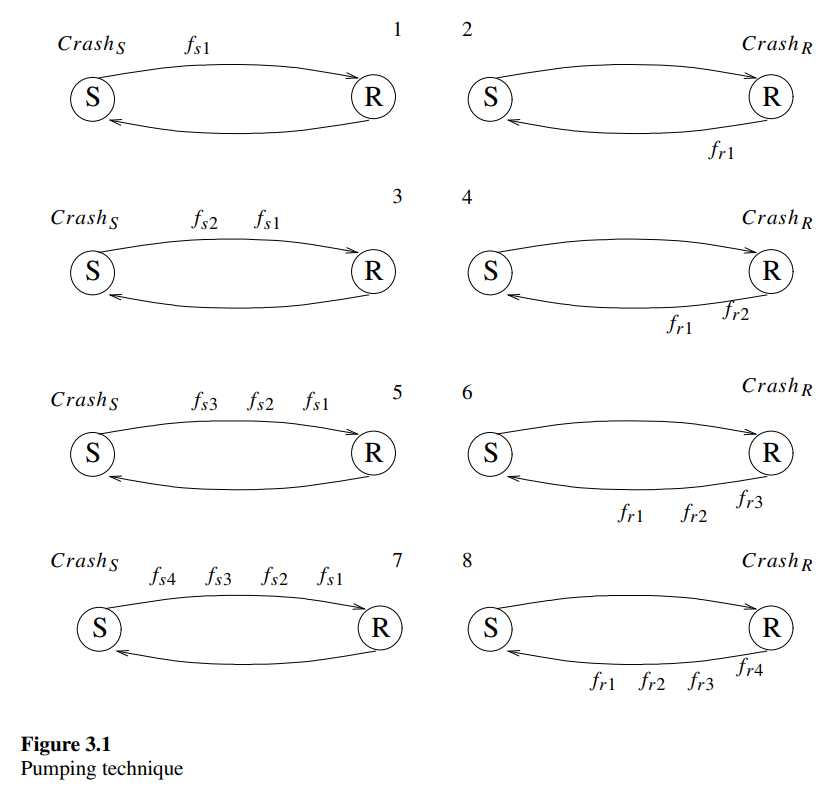

# 3.1 Initialization of a Data-Link Algorithm in the Presence of Faults

The data-link layer is responsible for delivering messages from a *sender* to a *receiver* that are directly connected. Recall that the communication channel connecting the sender and the receiver is not reliable; information sent from the sender to the receiver (and in the opposite direction) can be corrupted or even lost. In order to deliver a message, the sender sends sequences of bits (usually at a constant rate) to the receiver. Each sequence is called a frame. The sender stops sending bits for (at least) a short period between two consecutive frame transmissions.

Error-detection codes are used to identify and discard corrupted frames. Frame retransmission is used to cope with the possibility of frame corruption or loss. One retransmission strategy is the alternating-bit algorithm presented in figure 2.14, which can be used to implement a reliable data-link layer. Every message received by the sender from the network layer is repeatedly sent in a frame to the receiver until the receiver acknowledges receipt. The sender is then ready to receive and handle a new message of the network layer.

In more detail: when the system is initialized, there are no frames in transit. Thus, the sender uses the sequence number ${bit}_s = 1$, while the receiver uses the sequence number ${bit}_r = 0$. The sender repeatedly sends the frame $<m_1, 1>$ with the first message received from the network layer $m_1$ and a bit value 1, which is the value of bits. The receiver accepts every message from a frame with a bit value different from ${bit}_r$. In particular, the receiver accepts $m_1$ and delivers it to the network layer. At the same time, the receiver changes ${bit}_r$ to the value of the bit in the frame of the accepted message; i.e., ${bit}_r$ is assigned the value 1 when $m_1$ is delivered. In addition, every frame $<m, bit>$ that arrives at the receiver is acknowledged by the receiver by the transmission of a frame $<bit>$. Therefore, eventually the sender receives a frame $<1>$ from the receiver that indicates the acceptance of $m_1$ by the receiver.

The sender changes the value of ${bit}_s$ to 0 and is ready to send message $m_2$ by repeatedly transmitting the frame $<m_2, 0>$. Note that when the sender sends the frame $<m_2, 0>$, no frame with sequence number 0 is in the system. Therefore, the sender will receive an acknowledgment $<0>$ only after ${bit}_r$ is changed to 0; in other words, only after $m_2$ is delivered by the receiver to the network layer. Once the sender receives an acknowledgment $<0>$, no frame with sequence number 1 exists in the system.

Is there a data-link algorithm, such as the alternating-bit algorithm, that can tolerate crashes of the sender and the receiver? To answer this question, we must decide how a crash affects the system. It is usually assumed that a crash causes the sender and receiver to reach an initial state. Therefore, it is obvious that a sender crash occurring immediately after the sender fetches a message m from the network layer, and before any frame is actually sent to the receiver, may result in a message loss, since no information concerning m is available. With this in mind, we want to check whether it can be guaranteed that every message fetched by the sender following the last crash of either the sender or the receiver will arrive at its destination. One way to ensure this is by invoking an initialization procedure; for example, for the alternating-bit algorithm, the initialization procedure initializes ${bit}_s$ to hold 1 and ${bit}_r$ to hold 0, and ensures that no frame with label 0 or 1 is in transit. Then the initialization procedure signals the sender to start fetching messages.

Surprisingly, as we now show, no such initialization procedure exists.

Consider an execution in which crashes can also be possible steps; in particular, we denote the sender crash by ${Crash}_S$ and the receiver crash by ${Crash}_R$. The effect of a crash step ${Crash}_X$ is an initialization of the state of the processor $X$ to a special after-crash state. Thus, all the information that $X$ encoded in its state before the crash is totally lost.

We first consider an execution $E$ that starts in a system configuration in which no frames are in transit and in which both $S$ and $R$ are in the special after-crash state. No frame is lost during $E$ and every frame arrives at its destination before the next frame is sent. For example, if the first frame sent following the crash from the sender to the receiver is $f_{s1}$, then $f_{s1}$ arrives at its destination and the receiver sends $f_{r1}$ as a reaction. This nice "ping-pong" execution is executed until the sender fetches the second message to be sent from the network layer. We denote such an execution by: $E = {Crash}_S$, ${Crash}_R$, ${send}_S(f_{s1})$, ${receive}_R(f_{s1})$, ${send}_R(f_{r1})$, ${receive}_S(f_{r1})$, ${send}_S(f_{s2})$, ···, ${receive}_S(f_{rk})$. We use the term *reference execution* for $E$. The frame $f_{rk}$ received by the sender during $E$ is the one that convinces the sender in the reference execution to fetch the next message from the network layer.

The idea of the proof, which we call the *pumping technique*, is repeatedly to crash the sender and the receiver and to replay parts of the reference execution in order to construct a new execution $E'$. During the replay the sender fetches several messages that are identical to $m$. Note that it is possible for the network layer to use the services of the data-link layer to deliver several identical messages in a row. Figure 3.1 is used below to demonstrate the pumping technique, but first we describe the techniques in words. ${Crash}_S$ and ${Crash}_R$ occur at the beginning of our new execution $E$ ; then $f_{s1}$ is sent and arrives at the receiver, and $f_{r1}$ is sent as a reply exactly as in $E$. Now ${Crash}_S$ takes place, so we have ${Crash}_S$, ${Crash}_R$, ${send}_S(f_{s1})$, ${receive}_R(f_{s1})$, ${send}_R(f_{r1})$, ${Crash}_S$. At the end of the above execution, the sender is in an after-crash state and, according to $E$, is ready to send $f_{s1}$. We let the sender send $f_{s1}$ before it receives $f_{r1}$.

In this configuration, the content of the queue $q_{s,r}$ of frames transmitted over the link from the sender to the receiver is $f_{s1}$, and the content of the queue $q_{r,s}$ of frames transmitted over the link from the receiver to the sender is $f_{r1}$. Moreover, the sender is in a state in which $f_{s1}$ was already sent and is now ready to receive $f_{r1}$.

We let the sender receive the frame $f_{r1}$ that is in $q_{r,s}$ and, since the sender is deterministic, it sends frame $f_{s2}$ as a reaction, exactly as in the reference execution $E$. Up to this stage, we have constructed the execution ${Crash}_S$, ${Crash}_R$, ${send}_S(f_{s1})$, ${receive}_R(f_{s1})$, ${send}_R(f_{r1})$, ${Crash}_S$, ${send}_S(f_{s1})$, ${receive}_S(f_{r1})$, ${send}_S(f_{s2})$. The contents of $q_{s,r}$ in the configuration that is reached at the end of the above execution are $f_{s1}$, $f_{s2}$, where $f_{s1}$ is the first frame to reach the receiver. We extend the execution, crashing $R$ and letting it receive $f_{s1}$ and send $f_{r1}$, receive $f_{s2}$ and send $f_{r2}$. Now the execution is ${Crash}_S$, ${Crash}_R$, ${send}_S(f_{s1})$, ${receive}_R(f_{s1})$, ${send}_R(f_{r1})$, ${Crash}_S$, ${send}_S(f_{s1})$, ${receive}_S(f_{r1})$, ${send}_S(f_{s2})$, ${Crash}_R$, ${receive}_R(f_{s1})$, ${send}_R(f_{r1})$, ${receive}_R(f_{s2})$, ${send}_R(f_{r2})$. Thus, we reach a configuration in which the contents of $q_{r,s}$ are $f_{r1}$, $f_{r2}$.

Let $X$ denote either $S$ or $R$, where $Y$ denotes $S$ if $X$ denotes $R$ and $Y$ denotes $R$ if $X$ denotes $S$. In general, we start in a configuration in which all frames sent by $X$ in a prefix of the execution $E$ are in $q_{X,Y}$. We crash $Y$ and let it produce a sequence of frames that it produces in a prefix of $E$ while accepting the frames in $q_{X,Y}$. We then continue crashing $X$ and using the frames in $q_{Y,X}$ in a similar way. With the pumping technique, the length of the prefix of $E$ that is executed by the sender and the receiver grows with the number of crashes.

Continuing in the same way, we pump the contents of $q_{r,s}$ until it contains $f_{r1}, f_{r2}, ···, f_{rk}$. Then we crash both the sender and the receiver and let the sender receive all the frames in $q_{r,s}$; this, in turn, convinces the sender that the message was sent so that it fetches a new message from the network layer. Now if all frames sent from the sender to the receiver are lost, then no information concerning the first message exists in the system. Therefore, we conclude that the first message that was fetched following the last crash is lost, which proves the impossibility result.

In figure 3.1, we present the eight configurations to describe the pumping technique. Configuration 1 follows a crash of $S$ and the transmission of $f_{s1}$. Configuration 2 is derived from the first configuration by steps of $R$ in which $R$ receives $f_{s1}$, sends $f_{r1}$, and then crashes. Configuration 3 is derived from configuration 2 by steps of $S$ in the following order: a crash of $S$, a send of $f_{s1}$, a receive of $f_{r1}$, and a send of $f_{s2}$. In general, the even-numbered configurations are reached from the odd-numbered ones by a crash of $R$, then receipt of the pending frames of the previous odd-numbered configuration, while sending responses. The odd-numbered configurations are reached from the even-numbered ones by a crash of $S$, then a spontaneous send of frame $f_{s1}$, followed by receipt of the pending messages of the odd-numbered configuration while sending responses.

We note that the pumping technique can also be used when the first frame sent after the crashes in the reference execution is a frame sent by the receiver, or when several frames are sent by the sender (or the receiver) before an answer is sent by the other side. The details are left as an exercise to the reader.

By similar arguments, it is also possible to show that there is no guarantee that the kth message that is fetched following the last crash will be received. So if no specific guarantee can be given, we may want to require that eventually every message fetched by the sender reaches the receiver — in other words, to require that our data-link algorithm will be self-stabilizing.
