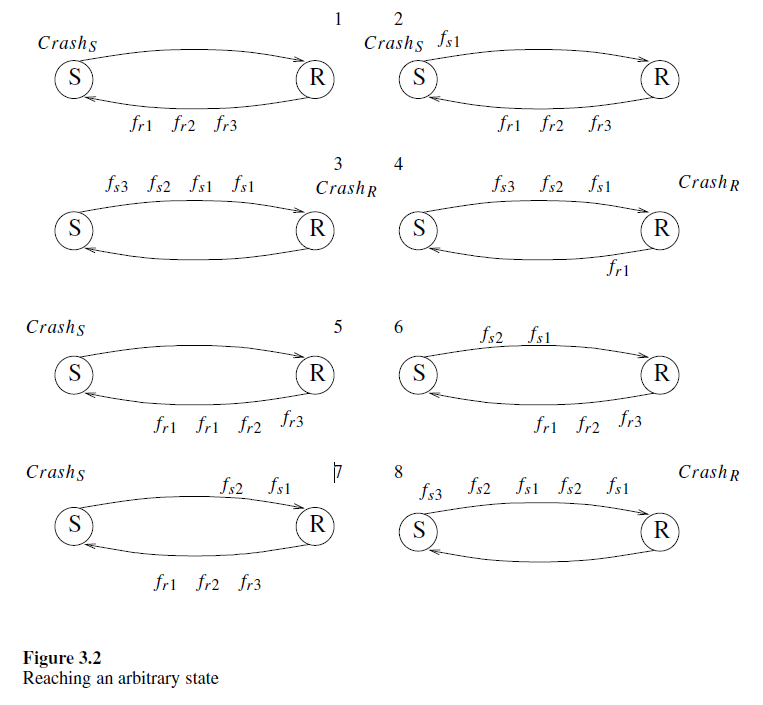

# 3.2 Arbitrary Configuration Because of Crashes

The above technique can be extended to prove that a configuration can be reached in which the states of the processors are any possible state in the execution $E$ described in the previous section, and the messages in the links are any possible sequence of messages sent during $E$. Before we describe the details, let us note that it is possible that corrupted frames will not be identified as being corrupted and will be accepted by the sender and the receiver, causing an undesired state change and frame transmission.

上述技术可以扩展，以证明可以达到一种配置，其中处理器的状态是上一节中描述的执行 $E$ 中的任何可能状态，链路中的消息是 $E$ 期间发送的任何可能的消息序列。在描述细节之前，让我们注意到，可能存在损坏的帧未被识别为损坏并被发送方和接收方接受，导致不希望的状态变化和帧传输。

The error-detection codes augmenting the frames ensure that the probability of such a scenario is small. Nevertheless, even if we assume that no undetected frame corruption is possible, it is still possible that a combination of crashes and frame losses will bring the system to an arbitrary configuration.

增强帧的错误检测码确保这种情况发生的概率很小。然而，即使我们假设不存在未检测到的帧损坏，崩溃和帧丢失的组合仍可能使系统进入任意配置。

Let $\mathcal{S}(\mathcal{R})$ be the set of states of the sender (receiver, respectively) during a reference execution $E$ (as defined in the previous section). Let $\mathcal{F_S}(\mathcal{F_R})$ be the set of frames sent by the sender (receiver, respectively) during $E$. Let $\mathcal{C}$ be a set of all configurations for which the state of the receiver is a state in $\mathcal{R}$, the state of the sender is a state in $\mathcal{S}$, and the contents of $q_{r,s}$ and $q_{s,r}$ are any finite possible sequence of frames in $\mathcal{F_R}$ and $\mathcal{F_S}$, respectively.

令 $\mathcal{S}(\mathcal{R})$ 为参考执行 $E$ 期间发送方（接收方，分别）的一组状态（如上一节所定义）。令 $\mathcal{F_S}(\mathcal{F_R})$ 为 $E$ 期间发送方（接收方，分别）发送的一组帧。令 $\mathcal{C}$ 为所有配置的集合，其中接收方的状态是 $\mathcal{R}$ 中的状态，发送方的状态是 $\mathcal{S}$ 中的状态，$q_{r,s}$ 和 $q_{s,r}$ 的内容是 $\mathcal{F_R}$ 和 $\mathcal{F_S}$ 中的任何有限可能帧序列，分别。

We will now show that any configuration in $\mathcal{C}$ can be reached from the first configuration of $E$ by a sequence of crashes of the sender and the receiver and frame losses. Intuitively, we use the pumping technique to accumulate a longer sequence of frames than was used in proving the impossibility of a crash-resilient data-link algorithm.

我们现在将展示，通过发送方和接收方的一系列崩溃和帧丢失，可以从 $E$ 的第一个配置到达 $\mathcal{C}$ 中的任何配置。直观地说，我们使用抽水技术来积累比证明抗崩溃数据链路算法不可能性时使用的更长的帧序列。

Once we have the entire sequence of frames sent from the receiver to the sender during $E$ in $q_{r,s}$, we can start a new replay of $E$ while keeping the frames sent during $E$ in the system. Let us start with the configuration reached by using the pumping technique to accumulate in $q_{r,s}$ all frames sent from the receiver to the sender during $E$.

一旦我们在 $q_{r,s}$ 中积累了 $E$ 期间从接收方发送到发送方的整个帧序列，我们可以在系统中保留 $E$ 期间发送的帧的同时，开始新的 $E$ 重放。让我们从使用抽水技术在 $q_{r,s}$ 中积累 $E$ 期间从接收方发送到发送方的所有帧的配置开始。

We continue from the configuration reached by the pumping technique in which the sequence of frames sent from the receiver to the sender during $E$ are accumulated in $q_{r,s}$. Our first goal is to have two such sequences in a row stored in $q_{r,s}$. To achieve this, we crash the sender, let the sender send the first frame $f_{s1}$ to the receiver, then crash the sender again and let the sender replay $E$, while accepting the frames stored in $q_{r,s}$. The sequence of frames stored in $q_{s,r}$ will be $f_{s1}$ and then $f_{s1}$ and the rest of the frames the sender sends during $E$. Now we use the above sequence as an input for the receiver: we crash the receiver, let the receiver accept $f_{s1}$ and send $f_{r1}$, crash the receiver again, and let it replay $E$, accepting the frames stored in $q_{s,r}$ while producing $f_{r1}$, $f_{r2}$, · · ·, $f_{rk}$.

我们从抽水技术达到的配置继续，其中在 $E$ 期间从接收方发送到发送方的帧序列积累在 $q_{r,s}$ 中。我们的第一个目标是在 $q_{r,s}$ 中连续存储两个这样的序列。为此，我们使发送方崩溃，让发送方将第一个帧 $f_{s1}$ 发送到接收方，然后再次使发送方崩溃，并让发送方重放 $E$，同时接受存储在 $q_{r,s}$ 中的帧。存储在 $q_{s,r}$ 中的帧序列将是 $f_{s1}$，然后是 $f_{s1}$ 和发送方在 $E$ 期间发送的其余帧。现在我们使用上述序列作为接收方的输入：我们使接收方崩溃，让接收方接受 $f_{s1}$ 并发送 $f_{r1}$，再次使接收方崩溃，并让它重放 $E$，接受存储在 $q_{s,r}$ 中的帧，同时生成 $f_{r1}$，$f_{r2}$，···，$f_{rk}$。

Our attention returns to the sender: the sender crashes, then sends $f_{s1}$, receives $f_{r1}$, and sends $f_{s2}$. Then we crash the sender again and let it replay $E$ using the rest of the sequence of frames stored in $q_{r,s}$. We obtain a configuration in which the sequence of frames in $q_{s,r}$ is $f_{s1}$, $f_{s2}$, $f_{s1}$, $f_{s2}$, $f_{s3}$, · · · $f_{sk}$. We continue in the same fashion, reaching a configuration in which $f_{s1}$, $f_{s2}$, $f_{s3}$, · · ·, $f_{sk}$, $f_{s1}$, $f_{s2}$, $f_{s3}$, · · ·, $f_{sk}$ appear in $q_{s,r}$. Let us denote $f_{s1}$, $f_{s2}$, $f_{s3}$, · · ·, $f_{sk}$ by $\mathcal{F}_{sE}$ and $f_{r1}$, $f_{r2}$, $f_{r3}$, · · ·, $f_{rk}$ by $\mathcal{F}_{rE}$. Once we reach a configuration in which $\mathcal{F}_{sE}$ appears twice in a row in $q_{s,r}$, we start accumulating one additional sequence to reach a configuration in which $\mathcal{F}_{sE}$ appears three times in a row in $q_{s,r}$. To do so, we will need to crash the sender (and the receiver) three times: once at the beginning of the replay and once before receiving either of the two $\mathcal{F}_{rE}$ ($\mathcal{F}_{sE}$, respectively), which are already stored in the system.

我们的注意力回到发送方：发送方崩溃，然后发送 $f_{s1}$，接收 $f_{r1}$，并发送 $f_{s2}$。然后我们再次使发送方崩溃，并让它使用存储在 $q_{r,s}$ 中的其余帧序列重放 $E$。我们得到一个配置，其中 $q_{s,r}$ 中的帧序列是 $f_{s1}$，$f_{s2}$，$f_{s1}$，$f_{s2}$，$f_{s3}$，···，$f_{sk}$。我们以同样的方式继续，达到一个配置，其中 $f_{s1}$，$f_{s2}$，$f_{s3}$，···，$f_{sk}$，$f_{s1}$，$f_{s2}$，$f_{s3}$，···，$f_{sk}$ 出现在 $q_{s,r}$ 中。我们用 $\mathcal{F}_{sE}$ 表示 $f_{s1}$，$f_{s2}$，$f_{s3}$，···，$f_{sk}$，用 $\mathcal{F}_{rE}$ 表示 $f_{r1}$，$f_{r2}$，$f_{r3}$，···，$f_{rk}$。一旦我们达到一个配置，其中 $\mathcal{F}_{sE}$ 在 $q_{s,r}$ 中连续出现两次，我们开始积累一个额外的序列，以达到一个配置，其中 $\mathcal{F}_{sE}$ 在 $q_{s,r}$ 中连续出现三次。为此，我们需要使发送方（和接收方）崩溃三次：一次在重放开始时，一次在接收存储在系统中的两个 $\mathcal{F}_{rE}$（分别为 $\mathcal{F}_{sE}$）之前。

Let us use the notation $\mathcal{F}^2_{sE}$ to denote the sequence $f_{s1}$, $f_{s2}$, · · ·, $f_{sk}$, $f_{s1}$, $f_{s2}$, · · ·, $f_{sk}$; in general, the notation $\mathcal{F}^i_{sE}$ denotes a sequence in which $\mathcal{F}_{sE}$ appears $i$ times in a row. For any finite $i$, this technique can be extended to reach a configuration in which $\mathcal{F}^i_{sE}$ appears in $q_{s,r}$.

我们用 $\mathcal{F}^2_{sE}$ 表示序列 $f_{s1}$，$f_{s2}$，···，$f_{sk}$，$f_{s1}$，$f_{s2}$，···，$f_{sk}$；一般来说，$\mathcal{F}^i_{sE}$ 表示一个序列，其中 $\mathcal{F}_{sE}$ 连续出现 $i$ 次。对于任何有限的 $i$，这种技术可以扩展到达到一个配置，其中 $\mathcal{F}^i_{sE}$ 出现在 $q_{s,r}$ 中。

Let $k_1$ ($k_2$) be the number of frames in $q_{s,r}$ ($q_{r,s}$, respectively) in the arbitrary configuration $c_a$ that we choose from $\mathcal{C}$, and let $i$ be $k_1 + k_2 + 2$. We use the above pumping technique to accumulate $\mathcal{F}^i_{sE}$ in $q_{s,r}$. Then we let the receiver replay $E$ $k_2+1$ times using the frames stored in $q_{s,r}$, reaching a configuration in which $q_{s,r}$ contains $\mathcal{F}^{k_1+1}_{sE}$ and $q_{r,s}$ contains $\mathcal{F}^{k_2+1}_{rE}$.

令 $k_1$ ($k_2$) 分别为我们从 $\mathcal{C}$ 中选择的任意配置 $c_a$ 中 $q_{s,r}$ ($q_{r,s}$) 中的帧数，并令 $i$ 为 $k_1 + k_2 + 2$。我们使用上述抽水技术在 $q_{s,r}$ 中积累 $\mathcal{F}^i_{sE}$。然后我们让接收方使用存储在 $q_{s,r}$ 中的帧重放 $E$ $k_2+1$ 次，达到一个配置，其中 $q_{s,r}$ 包含 $\mathcal{F}^{k_1+1}_{sE}$，$q_{r,s}$ 包含 $\mathcal{F}^{k_2+1}_{rE}$。

Now we replay $E$ until the desired states of the sender and the receiver are reached. To do this, we let the sender replay using the first copy of $\mathcal{F}_{rE}$ stored in $q_{r,s}$ until the sender reaches the desired state. We lose all frames produced by the sender at this stage and also the leftovers of the copy of $\mathcal{F}_{rE}$ that we used. The same is done for the receiver using the first copy of $\mathcal{F}_{sE}$. At this stage we have the sender and the receiver in the states they have in $c_a$, and we have to make sure only that the sequences of frames stored in the communication links are identical to the sequence in $c_a$. Let us consider the frames stored in $q_{s,r}$, since the case of $q_{r,s}$ is analogous. We have $k_1$ copies of $\mathcal{F}_{sE}$. We can use the first copy to ensure that the first frame $f_{s1a}$ that appears in $q_{s,r}$ of ca will exist — losing all frames from this copy of $\mathcal{F}_{sE}$ except $f_{s1a}$. The same can be done for the second frame $f_{s2a}$ that appears in $q_{s,r}$ of $c_a$, using the the second copy of $\mathcal{F}_{sE}$, and so on.

现在我们重放 $E$，直到达到发送方和接收方的期望状态。为此，我们让发送方使用存储在 $q_{r,s}$ 中的第一份 $\mathcal{F}_{rE}$ 重放，直到发送方达到期望状态。在此阶段，我们丢弃发送方产生的所有帧以及我们使用的 $\mathcal{F}_{rE}$ 剩余部分。接收方使用第一份 $\mathcal{F}_{sE}$ 也做同样的操作。在此阶段，发送方和接收方处于 $c_a$ 中的状态，我们只需确保存储在通信链路中的帧序列与 $c_a$ 中的序列相同。让我们考虑存储在 $q_{s,r}$ 中的帧，因为 $q_{r,s}$ 的情况是类似的。我们有 $k_1$ 份 $\mathcal{F}_{sE}$。我们可以使用第一份确保 $c_a$ 的 $q_{s,r}$ 中出现的第一个帧 $f_{s1a}$ 存在——丢弃 $\mathcal{F}_{sE}$ 的这一份中的所有帧，除了 $f_{s1a}$。对于 $c_a$ 的 $q_{s,r}$ 中出现的第二个帧 $f_{s2a}$，可以使用第二份 $\mathcal{F}_{sE}$，依此类推。

Figure 3.2 depicts how an additional copy of $\mathcal{F}_{sE}$ is accumulated in $q_{s,r}$. Eight configurations numbered 1 to 8 to are presented. In configuration 1, a single copy of $\mathcal{F}_{rE}$ is in transit from the receiver to the sender. Configuration 2 is derived from configuration 1 by steps of $S$ in which $S$ crashes and then spontaneously sends $f_{s1}$. Configuration 3 is derived from the second configuration by steps of $S$ in which $S$ crashes and spontaneously sends (an additional) $f_{s1}$, then $S$ receives $f_{r1}$, $f_{r2}$ and $f_{r3}$ and sends $f_{s2}$, and $f_{s3}$ in response (the sender sends a frame upon receiving $f_{r3}$). Configuration 4 is obtained from the third configuration by a crash of the receiver and then a receive of the first copy of $f_{s1}$ in $q_{s,r}$ and a following send of $f_{r1}$. Configuration 5 is reached from the fourth configuration by a crash of the receiver, then the acceptance of $f_{s1}$, $f_{s2}$, and $f_{s3}$ and send operations of $f_{r1}$, $f_{r2}$, and $f_{r3}$ in response.

图 3.2 描述了如何在 $q_{s,r}$ 中积累 $\mathcal{F}_{sE}$ 的额外副本。展示了编号为 1 到 8 的八种配置。在配置 1 中，一份 $\mathcal{F}_{rE}$ 正在从接收方传输到发送方。配置 2 是通过 $S$ 的步骤从配置 1 派生出来的，其中 $S$ 崩溃然后自发发送 $f_{s1}$。配置 3 是通过 $S$ 的步骤从配置 2 派生出来的，其中 $S$ 崩溃并自发发送（额外的）$f_{s1}$，然后 $S$ 接收 $f_{r1}$，$f_{r2}$ 和 $f_{r3}$ 并发送 $f_{s2}$ 和 $f_{s3}$ 作为响应（发送方在接收 $f_{r3}$ 时发送帧）。配置 4 是通过接收方崩溃然后接收 $q_{s,r}$ 中的第一份 $f_{s1}$ 并随后发送 $f_{r1}$ 从配置 3 获得的。配置 5 是通过接收方崩溃然后接受 $f_{s1}$，$f_{s2}$ 和 $f_{s3}$ 并发送 $f_{r1}$，$f_{r2}$ 和 $f_{r3}$ 作为响应从配置 4 达到的。

Crashes are not considered a severe type of fault (e.g., Byzantine faults are more severe, as explained in chapter 6). In this chapter we have proved that it is impossible to achieve a basic task when crashes cause the processors to change state to an after-crash state. One approach to proving correctness of a distributed algorithm is to show that consistency can be preserved by starting in a consistent configuration (a safe configuration) and proving that any step preserves the consistency. The above technique shows that this approach is doomed to failure when crashes are possible, since consistency may not be preserved in the presence of crashes.

崩溃不被认为是严重类型的故障（例如，拜占庭故障更严重，如第 6 章所述）。在本章中，我们证明了当崩溃导致处理器状态变为崩溃后状态时，无法完成基本任务。证明分布式算法正确性的一种方法是通过从一致配置（安全配置）开始并证明任何步骤都能保持一致性来证明一致性可以保持。上述技术表明，当可能发生崩溃时，这种方法注定会失败，因为在存在崩溃的情况下，一致性可能无法保持。

Finally, we remark that a crash-resilient data-link algorithm exists when a bound on the number of frames in transit is known. A crash-resilient data-link algorithm also exists when a bound on the transmission time is known. Let us describe a crash resilient data-link algorithm that uses a bound on the number of frames in transit. The algorithm uses an initialization procedure following the crash of the sender or the receiver. This initialization procedure ensures that the alternating-bit protocol presented in figure 2.14 is properly initialized, and that any message that is fetched by the sender following the last crash is delivered.

最后，我们指出，当已知在传输中的帧数有上限时，存在一种抗崩溃的数据链路算法。当已知传输时间有上限时，也存在一种抗崩溃的数据链路算法。让我们描述一种使用传输中帧数上限的抗崩溃数据链路算法。该算法在发送方或接收方崩溃后使用初始化程序。此初始化程序确保图 2.14 中介绍的交替位协议正确初始化，并且发送方在最后一次崩溃后获取的任何消息都能被传递。

Let $bound$ be the maximal number of frames that can be in transit in the links that connect both the sender to the receiver and the receiver to the sender. Whenever the sender recovers from a crash (starts in an after-crash state) it invokes a clean procedure. The sender repeatedly sends a frame $<clean, 1>$ until receiving $<ackClean, 1>$; then the sender repeatedly sends $<clean, 2>$ until receiving $<ackClean, 2>$. This procedure continues until the sender sends $<clean, bound + 1>$ and receives $<ackClean, bound+1>$.

令 $bound$ 为连接发送方和接收方的链路中可以传输的最大帧数。每当发送方从崩溃中恢复（从崩溃后状态开始）时，它会调用一个清理程序。发送方反复发送帧 $<clean, 1>$ 直到收到 $<ackClean, 1>$；然后发送方反复发送 $<clean, 2>$ 直到收到 $<ackClean, 2>$。此过程持续进行，直到发送方发送 $<clean, bound + 1>$ 并收到 $<ackClean, bound+1>$。

Once more the missing-label concept presented in section 2.6 is used. In any initial configuration at least one label $x$ in the range 1 to $bound+1$ does not exist. Thus, when the sender receives the first acknowledgment $<ackClean, x>$  there is no other label in transit. Moreover, when the sender receives the first acknowledgment $<ackClean, y>$, for any $y \geq x$, the only label in transit is $y$. The sender does not know the value $x$ of the missing label, but nevertheless when the sender receives the first acknowledgment $<ackClean, bound+1>$  it can be sure that the only label in transit is $bound+1$. It can therefore initialize the alternating algorithm, in particular assign 0 to ${bit}_s$ and fetch a new message to send to the receiver. Similarly, whenever the receiver receives a frame $<ackClean, bound+1>$ it initializes its alternating-bit algorithm, assigning 1 to ${bit}_r$. The above initialization procedure ensures that whenever the sender fetches a new message to be sent, all the frames in transit have the same label value.

再次使用第 2.6 节中介绍的缺失标签概念。在任何初始配置中，范围 1 到 $bound+1$ 内至少有一个标签 $x$ 不存在。因此，当发送方收到第一个确认 $<ackClean, x>$ 时，传输中没有其他标签。此外，当发送方收到第一个确认 $<ackClean, y>$ 时，对于任何 $y \geq x$，传输中的唯一标签是 $y$。发送方不知道缺失标签的值 $x$，但当发送方收到第一个确认 $<ackClean, bound+1>$ 时，它可以确定传输中的唯一标签是 $bound+1$。因此，它可以初始化交替算法，特别是将 0 分配给 ${bit}_s$ 并获取新消息发送给接收方。同样，每当接收方收到帧 $<ackClean, bound+1>$ 时，它会初始化其交替位算法，将 1 分配给 ${bit}_r$。上述初始化程序确保每当发送方获取要发送的新消息时，所有传输中的帧都具有相同的标签值。

The actions of the receiver starting from an after-crash state are yet to be defined. As a first try, let us assume that when the first frame $<FrameBit, msg>$ arrives at the receiver following a crash, the receiver assigns ${bit}_r := FrameBit$ and delivers the message $msg$ to the output queue. In such a case it is possible that the receiver delivers an extra copy of $msg$ — one before the crash and one after the crash. This is possible because the sender repeatedly sends the same frame until an acknowledgment arrives, possibly causing the accumulation of several copies of the same frame in the link that transfers messages from the sender to the receiver. Can such duplicate delivery be avoided? In other words, can we guarantee at most one delivery (i.e., no duplication but possibly omission) of messages, and still ensure that every message fetched by the sender following the last crash (of either the sender or the receiver) is delivered—i.e., can we guarantee exactly-once delivery following the last crash? A first try at satisfying this requirement is to change the actions of the receiver following a crash to exclude the output of the message that arrives in the first frame, but still to assign to ${bit}_r$ the $FrameBit$ of the first arriving frame. In this case it is possible that, following the crash of $R$, $S$ fetches a message that is not accepted by $R$ — violating the requirement of exactly once delivery following the last crash. ${bit}_r$ should be somehow initialized to make sure that a message fetched following the crash will be delivered. One solution that satisfies the requirements is to program the sender to send each message in frames with labels 0 until an acknowledgment is received and then to send the same message in frames with label 1 until an acknowledgment is received. The receiver will deliver a message only when the message arrives in a frame with label 1 immediately after it arrived in a frame with label 0. Thus, if the sender fetches a message msg following the crash of $R$, a frame with $<0, msg>$ must arrive at the receiver before the sender starts sending $<1, msg>$, ensuring that bi tr is set to 0 and then to 1.

接收方从崩溃后状态开始的操作尚未定义。作为第一次尝试，我们假设当第一个帧 $<FrameBit, msg>$ 在崩溃后到达接收方时，接收方将 ${bit}_r := FrameBit$ 并将消息 $msg$ 传递到输出队列。在这种情况下，接收方可能会传递 $msg$ 的额外副本——一个在崩溃前，一个在崩溃后。这是可能的，因为发送方反复发送相同的帧，直到收到确认，这可能导致在从发送方到接收方的链路中积累多个相同帧。可以避免这种重复传递吗？换句话说，我们能否保证最多一次传递（即不重复但可能遗漏）消息，并且仍然确保发送方在最后一次崩溃（无论是发送方还是接收方）后获取的每条消息都被传递——即，我们能否保证在最后一次崩溃后恰好一次传递？满足此要求的第一次尝试是更改接收方在崩溃后的操作，以排除到达第一个帧的消息的输出，但仍将第一个到达帧的 $FrameBit$ 分配给 ${bit}_r$。在这种情况下，可能会在 $R$ 崩溃后，$S$ 获取一条未被 $R$ 接受的消息——违反了最后一次崩溃后恰好一次传递的要求。${bit}_r$ 应该以某种方式初始化，以确保在崩溃后获取的消息将被传递。满足要求的一种解决方案是编程发送方在收到确认之前以标签 0 发送每条消息的帧，然后在收到确认之前以标签 1 发送相同的消息帧。接收方仅在消息以标签 0 的帧到达后立即以标签 1 的帧到达时才传递消息。因此，如果发送方在 $R$ 崩溃后获取消息 $msg$，则必须在发送方开始发送 $<1, msg>$ 之前，接收方收到带有 $<0, msg>$ 的帧，确保 ${bit}_r$ 先设置为 0 然后设置为 1。
