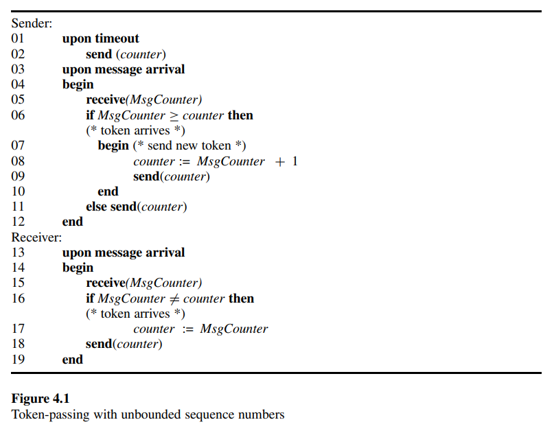
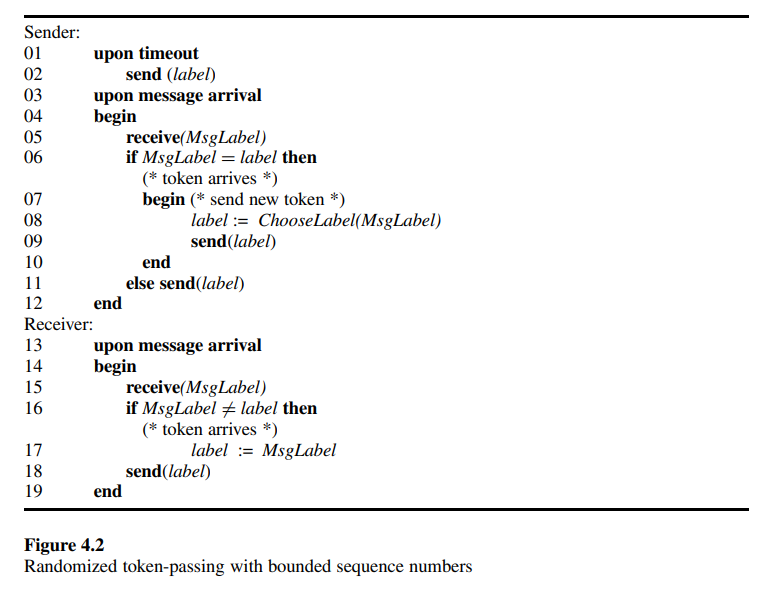

# 4.2 Data-Link Algorithms: Converting Shared Memory to Message Passing

In the study of fault-tolerant message passing systems, it is customarily assumed that messages may be corrupted over links; hence, processors may enter arbitrary states and link contents may be arbitrary. Self-stabilizing algorithms handle these problems as well, since they are designed to recover from inconsistent global states.

Designing a self-stabilizing algorithm for asynchronous message-passing systems can be even more subtle than designing a self-stabilizing algorithm for a system that supports read/write atomicity. The main difficulty is the messages stored in the communication links. A self-stabilizing system must cope with any possible initial state. When modeling asynchronous systems, it is commonly assumed that there is no bound on message delivery time, and the number of messages that can be in (transit and in the buffers of) a link is also unbounded. Thus, there are infinitely many initial configurations from which the system must stabilize. Again, one would like to design a self-stabilizing algorithm for the read/write atomicity model (or even the central daemon model) and then use a compiler that converts this algorithm into a self-stabilizing algorithm in the message-passing model. Our first goal in the design of such a compiler is a self-stabilizing data-link algorithm or token-passing algorithm. A self-stabilizing data-link algorithm will ensure that the unknown contents of the link are controlled, eliminating undesired messages from the link.

Recall that the data-link algorithm is designed for a system of two processors, one of which is the sender and the other the receiver. The task of the data-link algorithm is to use retransmissions in order to deliver messages from the sender to the receiver. The messages that have to be delivered are given to the sender by a higher-level algorithm of the network layer. The messages that are fetched by the sender from the network layer (at the sender side) should be delivered by the receiver to the network layer (at the receiver side) without duplications, omissions, or reordering. A message $m$ that is fetched by the sender from the network layer is sent repeatedly as part of (messages called) frames to the receiver until the sender receives an indication that $m$ was delivered by the receiver to the network layer (on the receiver side).

For instance, in the *stop-and-wait* data-link algorithm, each message sent by the sender is acknowledged by the receiver before the next message is sent. This behavior is similar to that of a token-passing algorithm, in which a single token is repeatedly sent from the sender to the receiver and back. First note that a stop-and-wait algorithm implements the token-passing task: each time the sender decides to fetch a new message, a token is present at the sender side; each time the receiver decides to deliver a message, a token is present at the receiver side. On the other hand, a token-passing algorithm implements the data-link task: the token is transferred from the sender to the receiver and back by sending frames between the sender and the receiver. Therefore, roughly speaking, the content of every message that the sender fetches can be attached to every frame sent for transferring the token. A new message is fetched whenever a token arrives at the sender. Once the receiver decides that a token has arrived, it delivers the message that is attached to the last arriving frame. Note that, in both these tasks, it is impossible for the sender and the receiver to hold the token (or fetch and deliver messages) simultaneously. In other words, there is no configuration in which there are two applicable steps $a_1$ and $a_2$ such that the sender sends a token (fetches a message) during $a_1$ and the receiver receives a token (delivers a message, respectively) during $a_2$.

We abstract the requirements of the data-link algorithm and the token-passing algorithm tasks in a set of executions $TP$. The task $TP$ of legitimate sequences is defined as the set of all configuration sequences in which no more than one processor holds the token and both the sender and the receiver hold the token in infinitely many configurations in every sequence in $TP$. In what follows we consider the $TP$ task. Thus, in the next three sections there is no need to use both the terms message and frame — and hence we use only the term message.

## Unbounded Solution

The first algorithm we propose uses an unbounded counter to achieve the $TP$ task. A timeout mechanism is assumed to ensure that the system is not started in a *communication-deadlock configuration* in which there is no message in transit in the communication links and neither the sender nor the receiver is about to send a message.

The code for this algorithm appears in figure 4.1. In this algorithm, each message has an integer label called $MsgCounter$ and both the sender and the receiver maintain a variable called $counter$. The sender repeatedly sends the value of its counter until it receives a message from the receiver with the same value. Once such a message arrives at the sender, the sender receives the token, increments the value of the counter and sends the new counter value in a message to the receiver. When the new counter is sent, the sender stops holding the token. For every message $m$ received by the receiver, the receiver sends a message $m'$ with a label identical to the label of $m$. In addition, the receiver stores in its counter variable the last counter value received in a message. Every time a message with a value different from the counter value of the receiver arrives at the receiver, the receiver receives the token, updates its counter value, and sends the message back to the sender. When this message is sent, the receiver stops holding the token.

Recall that a configuration of the system is a tuple $c = (s_s, s_r, q_{s,r}, q_{r,s})$, where $s_s$ ($s_r$) is the state of the sender (the receiver, respectively) and $q_{s,r}$ ($q_{r,s}$) is the queue of messages sent by the sender to the receiver (by the receiver to the sender, respectively) but not yet received. A computation step $a$ of a processor starts with a single communication operation, message send or message receive, then continues with internal computations, and ends just before the next communication operation. A computation step of the sender can also be started by a *timeout mechanism* instead of message arrival. The timeout mechanism is designed to cope with message loss. A ${timeout}_s$ event is an environment step (similar to $loss_{i,j}(m)$) that is executed whenever the system reaches a communication deadlock configuration. For example, a deadlock configuration can be reached due to message loss that eliminates all messages in transit while both the sender and the receiver are waiting to receive a message. An execution $E = (c_1, a_1, c_2, a_2, ···)$ is an alternating sequence of configurations and steps such that $c_{i−1} \xrightarrow{a_{i−1}} c_i$ ($i > 1$).

A safe configuration for $TP$ and the algorithm in figure 4.1 is a configuration in which the counter values of all the messages in $q_{s,r}$ and $q_{r,s}$, as well as the values of the counters maintained by the sender and the receiver, have the same value. Interestingly, the correctness proof of the first self-stabilizing datalink algorithm resembles the correctness proof of Dijkstra's mutual-exclusion algorithm presented in section 2.6. According to our definition, the $ME$ task and the $TP$ task are identical. Still in some cases (e.g., section 8.1), we use the $TP$ task to transfer information together with the token. The following lemma proves that, indeed, every fair execution that starts with such a safe configuration belongs to $TP$.

---

> LEMMA 4.1: A configuration $c$ in which all the counter variables of the messages and the processors are equal is a safe configuration for $TP$ and the algorithm in figure 4.1.

*Proof:*

Following $c$, the sender must receive a message with a counter value that is equal to its counter variable, because such a message either exists already in one of the queues or is sent due to a timeout. Once the sender receives a message with a counter value that is equal to its counter, the sender has the token. Then the sender increments its counter value and sends a message with the new counter value (releasing the token). Before a message with the new counter value reaches the sender, it must reach the receiver. Therefore, the receiver holds a token before the sender holds the token again. Once the sender receives a message with the value of its counter, a new configuration in which the value of all the counters is identical is reached, and the same arguments can be applied. (End)

---

We are now ready to prove the main theorem.

---

> THEOREM 4.1: For every possible configuration $c$, every fair execution that starts in $c$ reaches a safe configuration with relation to $TP$.

*Proof:*

First we claim that, in every fair execution, the value of the sender's counter is incremented infinitely often. Assume, by way of contradiction, that there exists a configuration after which the value of the sender's counter is not changed. Since the execution is fair, every computation step that is applicable infinitely often is executed; in particular, every message that is sent infinitely often is received. The timeout mechanism ensures that at least one message is sent repeatedly by the sender. This message is eventually received by the receiver, which forwards it back to the sender, causing the sender to increment its counter. We conclude that in every fair execution there is no configuration after which the sender does not increment its counter. Let $max$ be the maximal value of a counter in a message or in one of the counter variables in the first configuration of the execution $c$. When the sender assigns the value $max+1$ to its counter variable, the sender introduces a new counter value not existing in any previous configuration of the execution that starts in $c$. Thus, when the sender receives a message from the receiver with $MsgCounter = max+1$, the system is in a safe configuration. (End)

---

A question to ask at this stage is whether an algorithm that uses only bounded memory exists — in particular, whether the unbounded counter and label can be eliminated. We answer this question negatively, proving that the memory of the system must grow at a logarithmic rate, where the memory of the system is the number of bits required to encode the state of the sender, the state of the receiver, and the messages in transit (including the messages in the incoming and outgoing buffers of the links). The lower bound is proved on the *size* of the system configuration, where the size is the number of bits required to encode a configuration.

## Lower Bound

Before we present the lower bound, let us discuss issues concerning retransmission and timeouts. One can argue that there is no bound on the size of a configuration when a timeout mechanism is used. The number of messages in $q_{s,r}$ grows each time the timeout mechanism is invoked. Therefore, in an execution in which the sender sends a message at every step due to timeouts, the configuration size grows linearly with the number of steps of the sender. Recall that the timeout mechanism was introduced to cope with situations in which no message is in transit. Therefore, we choose to assume that the time it takes for the timeout mechanism to be triggered is long enough to guarantee that, indeed, no message is in transit in the system.

Can the assumption on the timeout mechanism be used by the algorithm designer? For example, one can propose an algorithm in which the sender waits every so often for a timeout, ignoring any arriving messages. It can be argued that such a technique can be used to eliminate pending messages with undesired labels from the system. However, as we show next, the timeout mechanism should be invoked repeatedly in order to ensure that a safe configuration is reached from every possible system state. This, in turn, implies a long delay in message transmission over the entire execution, not only during convergence. Moreover, it is possible that the timeout mechanism in certain systems does not guarantee that no message is in transit when a timeout is triggered. Therefore, one would prefer an algorithm that stabilizes without using an assumption on the contents of the links when a timeout occurs.

The lower bound presented in this section is proved for an arbitrary *weak-exclusion* task $WE$. A task is in the weak-exclusion set of tasks if, in every legal execution $E$, there exists a combination of steps, a step for each processor (the sender and the receiver), such that both steps appear in $E$ but are never applicable simultaneously. In other words, these steps are never executed concurrently. The $TP$ task does not allow two simultaneous steps in which the sender and the receiver receive the token. To simplify the proof of the lower bound, we assume in what follows that every computation step starts with a message receive followed by local computation and ending with a message send. Note that such a scheduling policy results in a possible execution.

For any configuration $c$ and any directed link $(x, y)$ from $P_x$ to $P_y$ (where $P_x$ is the sender and $P_y$ is the receiver or vice versa), let $q_{x,y}(c)$ be the sequence of messages pending on the link from $P_x$ to $P_y$ in $c$. For any execution $E$, let ${qs}_{x,y}(E)$ be the sequence of messages sent by $P_x$ on the link leading to $P_y$ during $E$. Similarly, let ${qr}_{x,y}(E)$ be the sequence of messages received by $P_y$ from the link $(x, y)$ during $E$. We use the notation $p \circ q$ for the concatenation of $p$ and $q$.

---

> LEMMA 4.2: For every execution $E = (c_1, a_1,··· , a_k, c_{k+1})$ in which no message is lost, it holds that $q_{x,y}(c_1) \circ {qs}_{x,y}(E) = {qr}_{x,y}(E) \circ q_{x,y}(c_{k+1})$.

*Proof:*

The left-hand side of the equation contains the messages on the link $(x, y)$ in $c_1$, concatenated with the messages sent during $E$ through $(x, y)$. The right-hand side of the equation contains the messages received during $E$ through $(x, y)$, concatenated with the messages left on $(x, y)$ in $c_{k+1}$. The proof is completed by a simple induction on $k$ to show that, if no message is lost during $E$, then both sides of the equation represent the same sequence of messages. (End)

---

An execution $E = (c_1, a_1, \ldots, c_{\mathscr{l}-1}, a_{\mathscr{l}-1})$ whose result configuration $c_1$ is equal to its initial configuration $c_1$ is called a *circular execution*. Repeating a circular execution $E$ forever yields an infinite execution $E^\infty$. Observe that an execution in which a certain configuration appears more than once has a circular sub-execution $\overline E = (c_i, a_i, ···, a_{i+\mathscr{l}−1}, c_{i+\mathscr{l}})$ $≡$ $(\overline c_1, \overline a_1, ···, \overline a_{\mathscr{l}−1}, \overline c_\mathscr{l})$, where $c_i = c_{i+\mathscr{l}} = \overline c_1 = \overline c_\mathscr{l}$.

Let $\mathcal{AL}$ be an arbitrary self-stabilizing algorithm for a $WE$ task. To show that, in every execution of $\mathcal{AL}$,  all the configurations are distinct, we assume that $\mathcal{AL}$ has a circular sub-execution $\overline E$ and reach a contradiction by showing that $\mathcal{AL}$ is not self-stabilizing. Using $\overline E$, we now construct an initial configuration $c_{init}$ by changing the list of messages in transit on the system's links. For each link $(x, y)$, the list of messages in transit on $(x, y)$ at $c_{init}$ is obtained by concatenating the list of messages in transit on $(x, y)$ at $\overline c_1$ with the list of all messages sent on $(x, y)$ during $\overline E$.

Roughly speaking, the effect of this change is to create an additional "padding layer" of messages that helps to decouple each *send* from its counterpart *receive* and achieve additional flexibility in the system, and this which enables us to prove the lower bound. Formally, $c_{init}$ is obtained from $\overline c_1$ as follows:

- The state of each processor in $c_{init}$ is equal to its state in $\overline c_1$.
- For any link $(x, y)$, $q_{x,y}(c_{init}) = q_{x,y}(c_1) \circ {qs}_x,y(\overline E)$.

Let $\mathcal{S}_x (\overline E)$ be the sequence of steps executed by $P_x$ during $\overline E$. Define $merge(\overline S)$ to be the set of sequences obtained by all possible merging of the sequences $\mathcal{S}_s(\overline E)$ and $\mathcal{S}_r (\overline E)$, while keeping the internal order in $\mathcal{S}_s (\overline E)$ and $\mathcal{S}_r (\overline E)$. Note that all the sequences in $merge(\overline S)$ have the same finite length and contain the same steps in different orders.

---

> LEMMA 4.3: Every $S \in merge(\overline S)$ is applicable to $c_{init}$, and the resulting execution is a circular execution of $\mathcal{AL}$.

*Proof:*

Let $S$ be an arbitrary sequence in $merge(\overline S)$ and let $P_x$ be an arbitrary processor of the system. Then we have: (1) The initial state of $P_x$ in $c_{init}$ is equal to its initial state in $\overline c_1$. (2) In $c_{init}$, all messages that $P_x$ receives during $\overline E$ are stored in $P_x$ 's incoming link in the right order. (3) The steps of $P_x$ appear in $S$ in the same order as they appear in  $S_x(\overline E)$. (1) — (3) imply that the sequence $S$ is applicable to $c_{init}$, and the application of $S$ to $c_{init}$ yields an execution $E_S$ with result configuration $c_{res}$ whose state vector is equal to the state vector of $c_{init}$ and in which, for every link $(x, y)$, ${qs}_{x,y}(E_S) = {qs}_{x,y}(\overline E)$ and ${qr}_{x,y}(E_S) = {qr}_{x,y}(\overline E)$.

To prove that the execution obtained is circular, it remains to show that the content of every link in the result configuration $c_{res}$ is equal to its content in $c_{init}$: in other words, that $q_{x,y}(c_{init}) = q_{x,y}(c_{res})$. For every link $(x, y)$, it holds that:

1. $q_{x,y}(c_{init}) \circ {qs}_{x,y}(\overline E) = {qr}_{x,y}(\overline E) \circ q_{x,y}(c_{res})$ (by lemma 4.2 above and the fact that ${qs}_{x,y}(E_S) = {qs}_{x,y}(\overline E)$ and ${qr}_{x,y}(E_S) = {qr}_{x,y}(\overline E)$).

2. $q_{x,y}(\overline c_1) \circ {qs}_{x,y}(\overline E) = {qr}_{x,y}(\overline E) \circ q_{x,y}(\overline c_1)$ (by lemma 4.2 and the circularity of $\overline E$).

Replacing $q_{x,y}(c_{init})$ in equation 1 with its explicit contents yields:

3. $q_{x,y}(\overline c_1) \circ {qs}_{x,y}(\overline E) \circ {qs}_{x,y}(\overline E) = {qr}_{x,y}(\overline E) \circ q_{x,y}(c_{res})$.

Using equation 2 to replace $q_{x,y}(\overline c_1) \circ {qs}_{x,y}(\overline E)$ by ${qr}_{x,y}(\overline E) \circ q_{x,y}(\overline c_1)$ in equation 3 gives:

4. ${qr}_{x,y}(\overline E) \circ q_{x,y}(\overline c_1) \circ q_{x,y}(\overline E) = {qr}_{x,y}(\overline E) \circ q_{x,y}(c_{res})$.

Eliminating ${qr}_{x,y}(\overline E)$ from both sides of equation 4 yields the desired result: $q_{x,y}(c_{init}) = q_{x,y}(\overline c_1) \circ {qs}_{x,y}(\overline E) = q_{x,y}(c_{res})$, which proves the lemma. (End)

---

Define $blowup(\overline E)$ as the set of executions whose initial state is $c_{init}$ and whose sequence of steps belongs to $merge(\overline S)$. Notice that, for every circular execution $\overline E$ and every execution $E \in blowup(\overline E)$, it holds that $\mathcal{S}_x(E) = \mathcal{S}_x(E)$.

---

> LEMMA 4.4: For any set of steps $B = \{a_1, a_2\}$, where $a_1 \in \mathcal{S}_s(\overline E)$ and $a_2 \in \mathcal{S}_r(\overline E)$, there is an execution $E \in blowup(\overline E)$ that contains a configuration for which the atomic steps in $B$ are concurrently applicable.

*Proof:*

Let $S \in merge(\overline S)$ be the sequence constructed as follows: first take all the steps in $\mathcal{S}_s(\overline E)$ that precede $a_1$; then take all the steps in $\mathcal{S}_r(\overline E)$ that precede $a_2$. Applying the sequence constructed so far to $c_{init}$ results in a configuration in which both $a_1$ and $a_2$ are applicable. This sequence is completed to a sequence $S$ in $merge(\overline S)$ by taking the remaining steps in an arbitrary order that keeps the internal order of each $\mathcal{S}_x (\overline E)$. (End)

---

> LEMMA 4.5: Let $\mathcal{AL}$ be a self-stabilizing algorithm for an arbitrary weak-exclusion task $WE$ in a system with a timeout mechanism. If $\mathcal{AL}$ has a circular execution $\overline E$, then $\mathcal{AL}$ has an infinite fair execution $E^\infty$, none of whose configurations is safe for $WE$.

*Proof:*

Let $E$ be an arbitrary execution in $blowup(\overline E)$. Define $E^\infty$ as the infinite execution obtained by repeating $E$ forever. We show that no configuration in $E^\infty$ is safe.

Assume by way of contradiction that some configuration $c_1$ in $E^\infty$ is safe. Now we construct a finite circular execution $E'$ whose sequence of steps $S'$ is obtained by concatenating sequences from $merge(\overline S)$, that is $\mathcal{S}_x(E') = \mathcal{S}_x(\overline E)$. Since $\mathcal{AL}$ is an algorithm for some weak-exclusion task, $E'$ should have some set of steps $B = \{a_1, a_2\}$, where $a_i \in \mathcal{S}_i$, that are never applicable to a single configuration $c$ during $E'$. We reach a contradiction by refuting this statement for $E'$. To do this we choose some arbitrary enumeration $\mathcal{B} = B_1, ···, B_e$ of all the sets containing two steps, one of $P_s$ and the other of $P_r$. Execution $E'$ is constructed by first continuing the computation from $c_1$ as in $E$ until configuration $c_{init}$ is reached. Then we apply lemma 4.4 to extend $E'$ by $s$ consecutive executions $E_1, ···, E_e$, where $E_k$, $1 \leq k \leq e$, contains a configuration in which the steps in $B_k$ are applicable and that ends with $c_{init}$. The proof follows. (End)

---

The proof at the lower bound is completed by the following theorem.

---

> THEOREM 4.2: Let $\mathcal{AL}$ be a self-stabilizing algorithm for an arbitrary weak-exclusion task in a system with a timeout mechanism. For every execution $E$ of $\mathcal{AL}$, all the configurations of $E$ are distinct. Hence, for every $t > 0$, the size of at least one of the first $t$ configurations in E is at least $\lceil \log2(t) \rceil$.

*Proof:*

Assume by way of contradiction that there exists an execution $E$ of $\mathcal{AL}$ in which not all the configurations are distinct; then $E$ contains a circular sub-execution $\overline E$. By lemma 4.5, there exists an infinite execution $E'$ of $\mathcal{AL}$ that is obtained by an infinite repetition of executions from $blowup(\overline E)$ and that never reaches a safe configuration— a contradiction. (End)

---

The implication of the above result is that no token-passing or stop-and-wait data-link algorithm exists with bounded memory resources. The memory of at least one of the system components must grow, either the memory of a processor or the number of bits in a message queue. In the next section we propose ways to cope in practice with the implications of the lower bound.

## Bounded-Link and Randomized Solutions

It is customarily assumed that a sixty-four-bit counter can implement an unbounded counter for every possible application. The time it takes to reach the largest possible value of this sixty-four-bit counter is enormous. However, in the context of self-stabilizing algorithms, a single transient fault may cause the counter to reach its upper limit instantly.

In light of the lower bound above, it is impossible to devise a selfstabilizing bounded solution for the token-passing task in a completely asynchronous system, where the number of messages in transit is not bounded. In this section we relax the assumptions on asynchronous systems to obtain a bounded self-stabilizing algorithm for the token-passing task $TP$. For our first algorithm, we assume that a bound on the number of messages in transit is known.

Let $cap$ be the bound on the total number of messages in both directions. Interestingly, a bounded version of the algorithm presented in figure 4.1, in which the counter of the sender is incremented modulo $cap+1$, is self-stabilizing. Roughly speaking, the reason is that the sender must eventually introduce a counter value not existing in any message in transit.

The second self-stabilizing bounded algorithm that we propose here does not assume any bound on the number of messages in transit. In this algorithm, the sender tosses a coin to decide on the label of messages, and hence the algorithm is randomized. A randomized algorithm requires an additional (hardware) device with random output. Moreover, the stabilization to a safe configuration is with *probability* 1. Thus, there can exist executions $E$ of any finite length such that no safe configuration is reached in $E$. The code of the algorithm appears in figure 4.2. At least three labels are used, {0, 1, 2}. The sender repeatedly sends a message with a particular label $l$ until a message with the same label $l$ arrives. Then the sender chooses randomly (by invoking the procedure *ChooseLabel*) the next label $l' \neq l$ from the remaining labels. The program of the receiver is the same as in the unbounded algorithm.

Now we present the main ideas for proving the self-stabilization property of the algorithm in figure 4.2 (similar ideas were presented in section 2.10 for proving that the alternating-bit algorithm is pseudo self-stabilizing). In configuration $c$, let $\mathcal{L}_{sr}(c) = l_1, l_2, l_3, ···, l_k$ be the sequence of the labels of the messages that are pending from the sender to the receiver, and let $\mathcal{L}_{rs}(c) = l_{k+1}, l_{k+2}, l_{k+3}, ···, l_{k+q}$ be the sequence of the labels of the messages that are pending from the receiver to the sender. The label $l_1 (l_{k+1})$ is the label of the last message sent by the sender (receiver, respectively) and the label $l_k (l_{k+q})$ is the label of the message that is the first to arrive at the receiver (sender, respectively). Let $\mathcal{L}(c) = l_1, l_2, ···, l_k, l_{k+1}, l_{k+2}, ···, l_{k+q}$ be the concatenation of $\mathcal{L}_{sr}(c)$ with $\mathcal{L}_{rs}(c)$.

A segment of labels $\mathcal{S}(c) = l_j, l_{j+1}, ···, l_{j+n}$ in $\mathcal{L}(c)$ is a maximal sequence of labels in $\mathcal{L}(c)$ such that all the labels in $\mathcal{S}(c)$ are identical. Let $SegmentsNumber(\mathcal{L}(c))$ be the number of segments in $\mathcal{L}(c)$.

We use the term *pseudo-stabilized configuration* for every configuration $c$ in which the value of $MsgLabel$ of the next (pending) message $m_{k+q}$ to arrive to the sender is equal to the label variable of the sender in $c$. Note that a pseudo-stabilized configuration $c$ is a safe configuration when $SegmentsNumber(\mathcal{L}(c)) = 1$. Let $c_1$ and $c_2$ be two successive pseudo-stabilized configurations in an arbitrary execution. We claim that $SegmentsNumber(\mathcal{L}(c_1))$ $≥$ $SegmentsNumber(\mathcal{L}(c_2))$. Moreover, if the number of segments in $c_1$ is greater than one, then, with probability 1/2, the number of segments in $c_2$ is less than the number of segments in $c_1$.

Starting in $c_1$, when the sender receives $m_{k+q}$, the sender chooses a new label — say 2 — that is not equal to the label of $m_{k+q}$, say $l_{k+q} = 0$. It is easy to see that the segment $\mathcal{S}$ to which $m_{k+q}$ belonged is eliminated before the next pseudo-stabilized configuration is reached. At the same time, a new segment with label 2 is introduced as the prefix of $\mathcal{L}$. Moreover, if the label of the segment $\mathcal{S'}$ that follows $\mathcal{S}$ is 1, $\mathcal{S'}$ is eliminated as well. In this latter case the number of segments is reduced. The schedule-luck game technique can be used to prove that the system reaches a safe configuration. Luck always chooses a label that is different from the label of the segment $\mathcal{S'}$. The combined probability of luck's strategy is no more than $2^{−(2·sn)}$, where $sn = SegmentsNumber(\mathcal{L}(c))$. Luck's strategy ensures that the number of segments is reduced by a factor of two in an execution that starts in $c$ and ends in $c'$, where $c'$ immediately follows a step in which the sender receives an acknowledgment for the first message it sent during the execution. The same holds for the execution that starts in $c'$. Thus, the number of choices until a safe configuration is reached is $sn + sn/2 + sn/4 + ··· = 2 · sn$. The number of rounds in the game is $O((k+q) · \log(k+q))$, where $k+q$ is the number of messages in the first configuration $c$. Thus, a safe configuration is reached within at most $O((k+q) · \log(k+q) · 2^{2·sn})$ expected number of rounds. We note that the expected number of rounds until a safe configuration is reached can be reduced when the number of labels used is greater than 3.

## Self-Stabilizing Simulation of Shared Memory

In this section we present a method for simulating self-stabilizing, shared memory algorithms by self-stabilizing, message passing algorithms. The simulated algorithms are assumed to be in the link-register model in which communication between neighbors $P_i$ and $P_j$ is carried out using a two-way link. The link is implemented by two shared registers that support read and write atomic operations. Processor $P_i$ reads from one register and writes in the other, while these functions are reversed for $P_j$. In the system that simulates the shared memory, every link is simulated by two directed links: one from $P_i$ to $P_j$ and the other from $P_j$ to $P_i$. The heart of the simulation is a self-stabilizing implementation of the read and write operations.

The proposed simulation implements these operations by using a self-stabilizing, token-passing algorithm. The token-passing algorithm may be chosen from the algorithms described in the previous section. For any pair of neighbors, we run the algorithm on the two links connecting them. In order to implement our self-stabilizing, token-passing algorithm, we need to define, for each link, which of the processors acts as the sender and which acts as the receiver.

We assume that the processors have distinct identifiers. Every message sent by each of the processors carries the identifier of that processor. Eventually each processor knows the identifier of all its neighbors. In each link, the processor with the larger identifier acts as the sender while the other processor acts as the receiver. Since each pair of neighbors uses a different instance of the algorithm, a separate timeout mechanism is needed for each such pair.

We now describe the simulation of some arbitrary link $\mathscr{e}$ connecting $P_i$ and $P_j$. In the shared memory model, $\mathscr{e}$ is implemented by a register $r_{ij}$ into which $P_i$ writes and from which $P_j$ reads, and by a register $r_{ji}$ for which the roles are reversed. In the simulating algorithm, processor $P_i$ ($P_j$) has a local variable called $R_{ij}$ ($R_{ji}$) that holds the values of $r_{ij}$ ($r_{ji}$, respectively). Every token has an additional field called $value$. Every time $P_i$ receives a token from $P_j$, $P_i$ writes the current value of $R_{ij}$ in the $value$ field of that token. A write operation of $P_i$ into $r_{ij}$ is simply implemented by locally writing into $R_{ij}$. A read operation of $P_i$ from $r_{ji}$ is implemented by the following steps:

1. $P_i$ receives the token from $P_j$, and then
2. $P_i$ receives the token again from $P_j$. The value the read operation returns is the value attached to the token (when it arrives at this second time).

Note that, during the simulation of a read operation from $r_{ji}$, $P_i$ does not proceed in its program until the simulated read step is finished. However, $P_i$ continues to send messages (and tokens) to each of its neighbors that serve any read requests.

The correctness of the simulation is proved by showing that every execution $E$ has a suffix in which it is possible to $linearize$ all the simulated read and write operations executed in $E$. Operations in an execution can be linearized if there is a total order of all the simulated operations in which the execution order of the simulated operations of every individual processor is preserved and the result of every read operation from a register $r$ is the last value (according to the total order) written in $r$, if such a write exists, or a constant value $x$ otherwise. We consider $x$ to be the value of $r$ prior to the first write operation.

Any execution of a simulated read operation by a processor $P_i$ starts in some particular configuration $c_r$ and ends in a later configuration $c_{r+k}$ for some $k$. $P_i$ does not proceed in executing steps of the simulated program until $c_{r+k}$ is reached; in particular, $P_i$ does not change the value of any $R_{i,l}$ between $c_r$ and $c_{r+k}$. Therefore, without influencing the operations of the other processors, we can choose any index between $r$ and $r+k$ as the index of the step in which the simulated read operation of $P_i$ occurs. Our simulation method, and in particular the requirement to wait for the second token, guarantees that the result obtained by the simulated read operation is a value of $R_{ji}$ between $c_r$ and $c_{r+k}$.

The above observations are used to map a time index for each simulated read and write operation. Define the time index of a simulated write operation to $r_{ij}$ to be the index of the step in $E$ in which the corresponding local write operation to $R_{ij}$ is executed. Define the time index of a simulated read operation of $P_j$ from $r_{ij}$ to be the index of the step in $E$ in which $P_i$ sends the value of its local variable $R_{ij}$ attached to the token that later reaches $P_j$ in step (2) of the simulated read.

Once each link holds a single token, all the operations to a register $R_{ij}$ are linearized to be executed in the step with the mapped index, where each read operation from $R_{ij}$ returns the last value written to $R_{ij}$.
