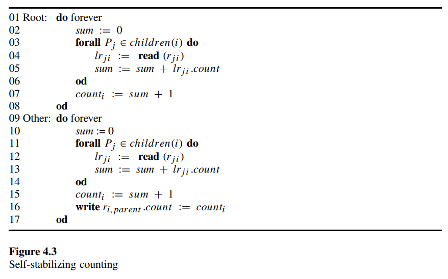
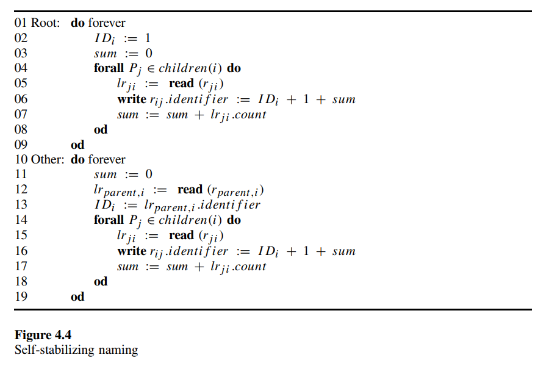
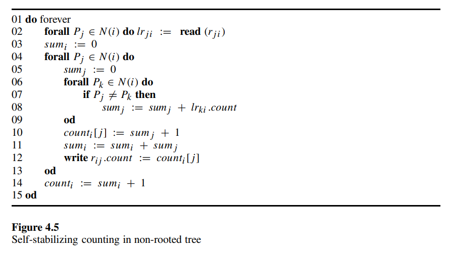

# 4.3 Self-Stabilizing Ranking: Converting an Id-based System to a Special-processor System

In this section we consider the following conversion: A given self-stabilizing algorithm for a system in which each processor has a unique identifier is converted to work in a system in which all the processors are identical except a single special processor. To do this, we design a self-stabilizing algorithm that assigns unique identifiers to the processors. The *ranking* task is to assign each of the $n$ processors in the system with a unique identifier in the range 1 to $n$.

The self-stabilizing spanning-tree construction of section 2.5 is composed with a self-stabilizing counting algorithm and a self-stabilizing naming algorithm to form the self-stabilizing ranking algorithm.

The self-stabilizing counting algorithm assumes a rooted spanning tree system in which every processor knows its parent and children in the tree. Each processor $P_i$ has a variable ${count}_i$ whose value is written by $P_i$ in the communication register that is shared with the parent of $P_i$ in the tree. The self-stabilizing counting algorithm reaches a safe configuration in which the value of ${count}_i$ is the number of processors in the subtree rooted at $P_i$ including $P_i$ itself. The algorithm appears in figure 4.3. A processor $P_i$ with no children repeatedly assigns 1 to ${count}_i$. Let the *height* of a processor $P_i$ in a rooted tree be the length of the longest path from $P_i$ to a leaf such that the path does not include the root. Once the value of the count variables of all the leaves is 1, we consider processors $P_j$ of height 1. Clearly, when $P_j$ finishes executing a complete iteration of the do forever loop, $P_j$ assigns ${count}_j$ by the correct number of processors in its subtree. The correctness proof continues by induction on the height of a processor.

The self-stabilizing counting algorithm is an example of the *self-stabilizing convergecast technique*. Intuitively, the *self-stabilizing convergecast* technique is based on the fact that the correct information is repeatedly communicated from the leaves of the tree toward the root.

The naming algorithm uses the value of the *count* fields to assign unique identifiers to the processors. The code for the naming algorithm appears in figure 4.4. The identifier of a processor is stored in the ${ID}_i$ variable. A processor that executes the do loop of lines 4 through 8 or lines 14 through 18 executes one iteration of the loop for each processor in $children(i)$. The order of the iteration is arbitrary but fixed, say according to the internal labels of the links attached to $P_i$.

The proof of the stabilization of the naming algorithm (given a safe configuration of the counting algorithm) is by induction on the distance of the processors from the root. The induction starts with the single processor that is at distance 0 from the root and continues with processors that are at a larger distance. The details are left as an exercise to the reader.

Before continuing to the next conversion method, we present an elegant self-stabilizing counting algorithm for a *non-rooted tree* $T$. Every processor in such a system knows which of its attached links belong to the tree $T$. Each processor $P_i$ has a variable ${count}_i[j]$ for every neighbor $P_j$. In a safe configuration, the value of every ${count}_i[j]$ is the number of processors in a subtree of $T$ that is obtained by removing the edge between $P_i$ and $P_j$. Each such removal of an edge splits the tree into two subtrees; $P_i$ belongs to one such subtree and $P_j$ to the other. The value ${count}_i[j]$ is related to the number of processors in the subtree to which $P_i$ belongs. The code of the algorithm appears in figure 4.5. Let the *height* of a communication register $r_{ij}$ be the depth of the tree rooted at $P_i$ upon removing the edge between $P_i$ and $P_j$, where the depth of a rooted tree is the maximal number of edges from the root to a leaf. The correctness proof is by induction on the height of the registers. In the first cycle of every fair execution, the $r_{ij}.count$ field of every register of height 0 (a register of a leaf) is assigned the value 1 by $P_i$. Clearly, every further assignment of the leaf processor $P_i$ in $r_{ij}.count$ does not change the value of $r_{ij}.count$. Now observe that the value of every register of height 2 is computed using only values of registers of height 1. In general, the value of every register of height $h$ is computed using the values of registers of smaller height. The height of the registers is bounded by the diameter of the system $d$; hence, it holds that a safe configuration is reached within $O(d)$ cycles. The counting algorithm can be used to elect a leader (or two leaders if symmetry cannot be broken) in the tree and assign unique identifiers to the processors (assuming that the symmetry in the two leaders case can be broken).
