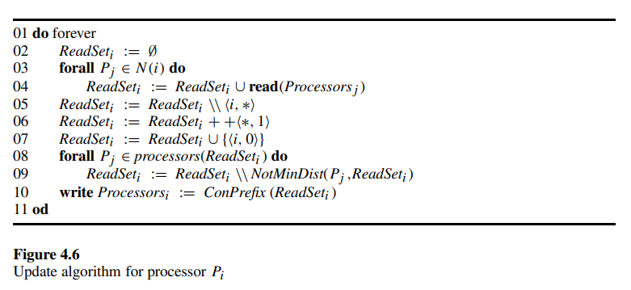

# 4.4 Update: Converting a Special Processor to an Id-based Dynamic System

<!-- TOC -->

- [4.4 Update: Converting a Special Processor to an Id-based Dynamic System](#44-update-converting-a-special-processor-to-an-id-based-dynamic-system)
  - [Self-Stabilizing Convergecast for Topology Update](#self-stabilizing-convergecast-for-topology-update)
  - [Self-Stabilizing Broadcast for Topology Update](#self-stabilizing-broadcast-for-topology-update)
  - [Adaptive Self-Stabilizing Algorithms](#adaptive-self-stabilizing-algorithms)

<!-- /TOC -->

In this section we present a self-stabilizing algorithm for the update task. The task of the most basic form of the update algorithm is to inform each processor of the identifiers of the processors that are in its *connected component*. Processors that can communicate directly or indirectly are in the same connected component. Therefore, every processor knows the maximal identifier in the system and a single leader is in fact elected. The self-stabilizing algorithm for the leader-election task given in section 2.9 can be used to convert self-stabilizing algorithms that are designed for systems with a unique leader to id-based systems.

在本节中，我们提出了一个用于更新任务的自稳定算法。更新算法最基本形式的任务是通知每个处理器其 *连接组件* 中的处理器标识符。能够直接或间接通信的处理器在同一个连接组件中。因此，每个处理器都知道系统中的最大标识符，并且实际上选出了一个领导者。第 2.9 节中给出的用于领导者选举任务的自稳定算法可以用于将为具有唯一领导者的系统设计的自稳定算法转换为基于标识符的系统。

The leader-election algorithm presented in section 2.9 stabilizes in $O(N)$ cycles, where $N$ is an upper bound on the number of processors in the entire system. This is a drawback in dynamic systems where link and processor failures can partition the system into several connected components, each with a small number of processors. A question to ask at this stage is whether there is a leader-election algorithm that stabilizes within $O(d)$ cycles, where $d$ is the actual diameter of the connected component. The self-stabilizing update algorithm that is presented here gives a positive answer to the above question.

第 2.9 节中提出的领导者选举算法在 $O(N)$ 周期内稳定，其中 $N$ 是整个系统中处理器数量的上限。这在动态系统中是一个缺点，因为链路和处理器故障可能会将系统划分为几个连接组件，每个组件的处理器数量较少。在这个阶段要问的问题是，是否存在一个在 $O(d)$ 周期内稳定的领导者选举算法，其中 $d$ 是连接组件的实际直径。这里提出的自稳定更新算法对上述问题给出了肯定的回答。

Before describing the update algorithm, let us gain some intuition about the importance of a special processor in many self-stabilizing systems. Dijkstra presented the first self-stabilizing mutual-exclusion algorithm for a ring of processors in which all processors are identical except a single special processor. **Dijkstra proved that, without this special processor, it is impossible to achieve mutual exclusion in a self-stabilizing manner**. In distributed systems, it is difficult to guarantee that a special processor will always exist. Moreover, the assumption that such a special processor exists contradicts the distributive nature of the system. Active paths of research were triggered by this impossibility result. Self-stabilizing randomized leader election algorithms can be used to ensure that a single special processor, namely the elected leader, acts as the special processor. Other self-stabilizing distributed algorithms, such as the update algorithm presented in this section, assume that each processor has a unique identifier. Unique identifiers exist in several distributed systems, for instance in the widespread Ethernet local communication network.

在描述更新算法之前，让我们直观地了解一下特殊处理器在许多自稳定系统中的重要性。Dijkstra 提出了第一个用于处理器环的自稳定互斥算法，其中所有处理器都是相同的，除了一个特殊处理器。**Dijkstra 证明了，如果没有这个特殊处理器，就不可能以自稳定的方式实现互斥**。在分布式系统中，很难保证特殊处理器始终存在。此外，假设存在这样的特殊处理器与系统的分布式性质相矛盾。这个不可能性结果引发了积极的研究路径。自稳定随机领导者选举算法可以确保一个特殊处理器，即选出的领导者，作为特殊处理器。其他自稳定分布式算法，例如本节中提出的更新算法，假设每个处理器都有一个唯一的标识符。唯一标识符存在于几个分布式系统中，例如广泛使用的以太网本地通信网络。

Dijkstra's proof is for **a composite (non-prime) number of processors connected in a ring and activated by the central daemon**. Recall that the central daemon activates a single processor at a time and that the activated processor then reads the state of its neighbors and changes its state accordingly. A processor $P_i$ can execute the critical section in a configuration $c$ if, and only if, $P_i$ changes its state when it is the first processor to be activated by the central daemon following $c$. Therefore, every fair execution of a self-stabilizing mutual-exclusion algorithm must have a suffix in which exactly one processor may change a state in every configuration.

Dijkstra 的证明适用于**连接成环并由中央守护进程激活的复合（非素数）数量的处理器**。回想一下，中央守护进程一次激活一个处理器，然后激活的处理器读取其邻居的状态并相应地改变其状态。处理器 $P_i$ 可以在配置 $c$ 中执行关键部分，当且仅当 $P_i$ 在 $c$ 之后由中央守护进程首先激活时改变其状态。因此，每次公平执行自稳定互斥算法都必须有一个后缀，其中每个配置中只有一个处理器可以改变状态。

To demonstrate the technique for proving the impossibility result, we consider a special case in which the system is an oriented ring of four processors. Let $P_1$, $P_2$, $P_3$, $P_4$ be the processors in the ring, where $P_i$ is connected to $P_{i+1}$ for every $1 \leq i \leq 3$ and $P_4$ is connected to $P_1$. The ring is oriented so that $P_1$ is the left neighbor of $P_2$, $P_2$ is the left neighbor of $P_3$, $P_3$ is the left neighbor of $P_4$, and $P_4$ is the left neighbor of $P_1$. A processor $P_j$ is the right neighbor of a processor $P_i$ if $P_j$ is connected to $P_i$ and $P_j$ is not the left neighbor of $P_i$.

为了展示证明不可能性结果的技术，我们考虑一个特殊情况，其中系统是由四个处理器组成的有向环。设 $P_1$、$P_2$、$P_3$、$P_4$ 为环中的处理器，其中每个 $1 \leq i \leq 3$ 的 $P_i$ 连接到 $P_{i+1}$，并且 $P_4$ 连接到 $P_1$。环的方向是 $P_1$ 是 $P_2$ 的左邻居，$P_2$ 是 $P_3$ 的左邻居，$P_3$ 是 $P_4$ 的左邻居，$P_4$ 是 $P_1$ 的左邻居。如果处理器 $P_j$ 连接到处理器 $P_i$ 并且 $P_j$ 不是 $P_i$ 的左邻居，则处理器 $P_j$ 是处理器 $P_i$ 的右邻居。

The proof considers **executions that start in a symmetric configuration $c$** in which $P_1$ and $P_3$ are in the same state $s_0$ and $P_2$ and $P_4$ are in the same state $s'_0$. We show that there is an execution in which symmetry (between $P_1$ and $P_3$, and between $P_2$ and $P_4$) is never broken. The specific execution in which symmetry is preserved is the execution in which the processors repeatedly execute steps in the following order: $P_1$, $P_3$, $P_2$, $P_4$. Since there is no special processor, all the processors have the same transition function, denoted $f(s_l, s, s_r)$. The transition function $f(s_l, s, s_r)$ of a processor $P_i$ is a function of $s_l$, the state of the processor to the left of $P_i$, $s$, the state of $P_i$, and $s_r$, the state of the processor to the right of $P_i$.

证明考虑了**从对称配置 $c$ 开始的执行**，其中 $P_1$ 和 $P_3$ 处于相同状态 $s_0$，$P_2$ 和 $P_4$ 处于相同状态 $s'_0$。我们展示了存在一个执行，其中对称性（$P_1$ 和 $P_3$ 之间，以及 $P_2$ 和 $P_4$ 之间）从未被打破。保持对称性的特定执行是处理器按以下顺序重复执行步骤的执行：$P_1$、$P_3$、$P_2$、$P_4$。由于没有特殊处理器，所有处理器具有相同的转换函数，记为 $f(s_l, s, s_r)$。处理器 $P_i$ 的转换函数 $f(s_l, s, s_r)$ 是 $s_l$（$P_i$ 左侧处理器的状态）、$s$（$P_i$ 的状态）和 $s_r$（$P_i$ 右侧处理器的状态）的函数。

In our execution,

$P_1$ is the first activated processor following $c$, changing state according to $f$ and the state $s_l = s'_0$ of $P_4$, state $s = s_0$ of $P_1$, and state $s_r = s'_0$ of $P_2$. Denote the new state of $P_1$ by $s_1 = f(s'_0, s_0, s'_0)$.

The second activated processor is $P_3$, which changes state according to the states $s_l = s'_0$ of $P_2$, $s = s_0$ of $P_3$ and $s_r = s'_0$ of $P_4$; therefore, $P_3$ changes its state to $s_1 = f(s'_0, s_0, s'_0)$.

Similarly, $P_2$ is activated next and changes state to $s'_1 = f(s_1, s'_0, s_1)$, and so does $P_4$.

Thus, in the configuration $c_4$ that follows the first activation of all the processors, $P_1$ and $P_3$ are in state $s_1$, while $P_2$ and $P_4$ are in state $s'_1$.

在我们的执行中，

$P_1$ 是 $c$ 之后第一个被激活的处理器，根据 $f$ 以及 $P_4$ 的状态 $s_l = s'_0$、$P_1$ 的状态 $s = s_0$ 和 $P_2$ 的状态 $s_r = s'_0$ 改变状态。将 $P_1$ 的新状态记为 $s_1 = f(s'_0, s_0, s'_0)$。

第二个被激活的处理器是 $P_3$，它根据 $P_2$ 的状态 $s_l = s'_0$、$P_3$ 的状态 $s = s_0$ 和 $P_4$ 的状态 $s_r = s'_0$ 改变状态；因此，$P_3$ 将其状态改变为 $s_1 = f(s'_0, s_0, s'_0)$。

类似地，接下来激活 $P_2$ 并将状态改变为 $s'_1 = f(s_1, s'_0, s_1)$，$P_4$ 也是如此。

因此，在所有处理器第一次激活之后的配置 $c_4$ 中，$P_1$ 和 $P_3$ 处于状态 $s_1$，而 $P_2$ 和 $P_4$ 处于状态 $s'_1$。

The proof is almost completed since, in the above execution, whenever $P_1$ may change a state from $s_m$ to $s_{m+1}$, $P_3$ may also change its state from $s_m$ to $s_{m+1}$. Analogously, the above holds for $P_2$ and $P_4$. Thus, **in every configuration in which $P_1$ has permission to execute the critical section, $P_3$ has permission as well**; and in every configuration in which $P_2$ may execute the critical section, $P_4$ may execute the critical section as well.

证明几乎完成，因为在上述执行中，每当 $P_1$ 可以将状态从 $s_m$ 改变为 $s_{m+1}$ 时，$P_3$ 也可以将其状态从 $s_m$ 改变为 $s_{m+1}$。类似地，上述情况适用于 $P_2$ 和 $P_4$。因此，**在每个 $P_1$ 有权执行临界区的配置中，$P_3$ 也有权执行**；在每个 $P_2$ 可以执行临界区的配置中，$P_4$ 也可以执行。

Note that when **no central daemon exists**, the impossibility result for the existence of a self-stabilizing mutual exclusion algorithm in a system of identical processors holds also for a ring of a **prime number** of processors.

When we start in a configuration $c_0$ in which all the processors are in the same state — say $s_0$ — and the contents of the communication registers are identical, symmetry can be preserved forever.

An execution that preserves symmetry is one in which every processor reads the communication registers of its neighbors **before** any processor writes a new value to its communication registers. Such a schedule guarantees that configurations in which all the states of the processors and the contents of registers are identical are reached infinitely often. Moreover, in the particular execution that we chose, each processor reads and writes the same values from/to the communication registers.

Therefore, if a processor $P_i$ enters the critical section following a particular read or write operation, so does every processor that executes the same operation just before or just after $P_i$. Thus, there is no suffix of the execution in which, in every configuration, only one processor is in the critical section.

请注意，当**不存在中央守护进程**时，在相同处理器系统中存在自稳定互斥算法的不可能性结果也适用于**素数数量**的处理器环。

当我们从配置 $c_0$ 开始，其中所有处理器都处于相同状态——例如 $s_0$——并且通信寄存器的内容相同，对称性可以永远保持。

保持对称性的执行是每个处理器在任何处理器向其通信寄存器写入新值**之前**读取其邻居的通信寄存器的执行。这样的调度保证了所有处理器的状态和寄存器内容相同的配置无限次地达到。此外，在我们选择的特定执行中，每个处理器从/向通信寄存器读取和写入相同的值。

因此，如果处理器 $P_i$ 在特定读或写操作后进入临界区，那么每个在 $P_i$ 之前或之后执行相同操作的处理器也会进入临界区。因此，没有一个执行的后缀，在每个配置中，只有一个处理器处于临界区。

It is good practice to design an algorithm that is as general as possible; such an algorithm will fit a large class of systems. **The impossibility results above motivate the restriction we make when designing the update algorithm: that each processor has a unique identifier**.

设计尽可能通用的算法是一个好的实践；这样的算法将适用于一大类系统。**上述不可能性结果促使我们在设计更新算法时做出限制：每个处理器都有一个唯一的标识符**。

In a distributed system, processors and communication links can fail and recover repeatedly. At any given time, a processor is connected directly or indirectly to a set of processors. Processors that can communicate directly or indirectly are in the same *connected component*. The update algorithm gathers information in a processor $P_i$ from all the processors in $P_i$'s connected component.

在分布式系统中，处理器和通信链路可以反复故障和恢复。在任何给定时间，处理器直接或间接连接到一组处理器。能够直接或间接通信的处理器在同一个 *连接组件* 中。更新算法从 $P_i$ 的连接组件中的所有处理器收集信息到处理器 $P_i$ 中。

We define the task $UP$ to be the set of executions in which every processor has a set of identifiers consisting of an identifier for every processor in its connected component. Our **update algorithm constructs $n$ directed *BFS* trees**. **For every processor $P_i$, the algorithm constructs a directed *BFS* tree rooted at $P_i$**. Roughly speaking, each *BFS* tree is a copy of the algorithm in section 2.5.

我们将任务 $UP$ 定义为每个处理器都有一组标识符的执行集合，这些标识符由其连接组件中的每个处理器的标识符组成。我们的**更新算法构建了 $n$ 个有向 *BFS* 树**。**对于每个处理器 $P_i$，该算法构建一个以 $P_i$ 为根的有向 *BFS* 树**。大致来说，每个 *BFS* 树都是第 2.5 节算法的副本。

The update algorithm constructs the *first BFS tree* that is rooted at each processor: a graph may have more than a single *BFS* tree rooted at the same node. We define the *first BFS tree* of $G$ relative to $P_i$ to be a *BFS* tree rooted at $P_i$. **When a node $P_j$ of distance $k+1$ from $P_i$ has more than one neighbor at distance $k$ from $P_i$, $P_j$ is connected to the neighbor with the maximal identifier among all its neighbors whose distance from $P_i$ is $k$** (other conventions such as the *last BFS tree* could be used as well, as long as the *BFS* tree is fixed).

更新算法构建了以每个处理器为根的 *第一 BFS 树*：一个图可能有多个以同一节点为根的 *BFS* 树。我们定义相对于 $P_i$ 的 $G$ 的 *第一 BFS 树* 为以 $P_i$ 为根的 *BFS* 树。**当距离 $P_i$ 为 $k+1$ 的节点 $P_j$ 有多个距离 $P_i$ 为 $k$ 的邻居时，$P_j$ 连接到其所有距离 $P_i$ 为 $k$ 的邻居中标识符最大的邻居**（也可以使用其他约定，例如 *最后 BFS 树*，只要 *BFS* 树是固定的）。

Denote the upper bound on the number of processors in the system by $N$. During the execution of the algorithm, each processor $P_i$ maintains a set ${Processors}_i$ of no more than $N$ tuples $<id, dis>$. Each tuple in ${Processors}_i$ represents a processor in the system, where $id$ is the identifier of the processor and $dis$ is the distance (i.e., the number of edges) from $P_i$ to the processor with the identifier $id$. The value of the $id$ and the $dis$ fields is in the range 0 to $N$.

$P_i$ communicates with any of its neighbors $P_j \in N(i)$ by writing (or sending) the value of ${Processors}_i$ and reading (or receiving, if message passing is used for communication) the value of ${Processors}_j$. In what follows, we describe the case when the processors communicate using shared memory. However, the same algorithm can be applied to message passing when each message arriving from $P_i$ to $P_j$ is written in an input buffer $r_{ij}$ of $P_j$.

将系统中处理器数量的上限记为 $N$。在算法执行期间，每个处理器 $P_i$ 维护一个不超过 $N$ 个元组 $<id, dis>$ 的集合 ${Processors}_i$。${Processors}_i$ 中的每个元组代表系统中的一个处理器，其中 $id$ 是处理器的标识符，$dis$ 是从 $P_i$ 到具有标识符 $id$ 的处理器的距离（即边的数量）。$id$ 和 $dis$ 字段的值在 0 到 $N$ 的范围内。

$P_i$ 通过写入（或发送）${Processors}_i$ 的值并读取（或接收，如果使用消息传递进行通信）${Processors}_j$ 的值与其任何邻居 $P_j \in N(i)$ 进行通信。以下描述了处理器使用共享内存进行通信的情况。然而，当每条从 $P_i$ 到 $P_j$ 的消息写入 $P_j$ 的输入缓冲区 $r_{ij}$ 时，同样的算法也可以应用于消息传递。

Let $n \leq N$ be the number of the processors in the system. After the system stabilizes, it holds that ${Processors}_i$ contains $n$ tuples — a tuple $<j, x>$ for every processor $P_j$ in the system — such that $P_j$ is at distance $x$ from $P_i$.

设系统中的处理器数量为 $n \leq N$。在系统稳定后，${Processors}_i$ 包含 $n$ 个元组——系统中每个处理器 $P_j$ 的一个元组 $<j, x>$——使得 $P_j$ 距离 $P_i$ 为 $x$。

A processor $P_i$ repeatedly reads the set ${Processors}_j$ of every neighbor $P_j$ and assigns ${Processors}_i$ by a set of tuples according to the sets $P_i$ reads. The tuples $P_i$ reads from its $\delta$ neighbors are stored in an internal set, ${ReadSet}_i$, of no more than $\delta N$ $<id, dis>$ tuples.

处理器 $P_i$ 反复读取每个邻居 $P_j$ 的集合 ${Processors}_j$，并根据 $P_i$ 读取的集合分配 ${Processors}_i$ 的元组。$P_i$ 从其 $\delta$ 个邻居读取的元组存储在一个内部集合 ${ReadSet}_i$ 中，该集合包含不超过 $\delta N$ 个 $<id, dis>$ 的元组。

The code of the algorithm appears in figure 4.6. $P_i$ repeatedly executes lines 2 through 10 of the code.

$P_i$ initializes ${ReadSet}_i$ in line 2, and then $P_i$ accumulates the tuples in the sets of its neighbors into ${ReadSet}_i$ (lines 3 and 4).

Note that the current contents of ${Processors}_i$ are not used for computing the new contents of ${Processors}_i$. The distance of $P_i$ to a processor $P_j \neq P_i$ is the distance of a processor $P_k$ to $P_j$, where $P_k$ is next to $P_i$, plus one; obviously, the distance of $P_i$ from itself is 0.

In line 5, $P_i$ removes every tuple with an identifier field that is equal to the identifier of $P_i$, and then $P_i$ increments by 1 the distance of every remaining tuple (line 6). The semantics of the operators $\backslash \backslash$ and $++$ are implied in a straightforward manner by the above description. Next, $P_i$ adds the tuple $<i, 0>$ to ${ReadSet}_i$.

In computing the distance from $P_i$ to $P_j$, $P_i$ believes a neighbor $P_k$ that is closest to $P_j$. In lines 8 and 9, for every processor $P_j$, $P_i$ removes each tuple with the identifier of $P_j$ except for the tuple with the smallest distance among these tuples.

算法的代码见图 4.6。$P_i$ 反复执行代码的第 2 到第 10 行。

$P_i$ 在第 2 行初始化 ${ReadSet}_i$，然后 $P_i$ 将其邻居集合中的元组累积到 ${ReadSet}_i$ 中（第 3 和第 4 行）。

注意，当前 ${Processors}_i$ 的内容不用于计算新的 ${Processors}_i$ 的内容。$P_i$ 到处理器 $P_j \neq P_i$ 的距离是处理器 $P_k$ 到 $P_j$ 的距离，其中 $P_k$ 紧邻 $P_i$，加一；显然，$P_i$ 到自身的距离是 0。

在第 5 行，$P_i$ 移除标识符字段等于 $P_i$ 标识符的每个元组，然后 $P_i$ 将每个剩余元组的距离加 1（第 6 行）。运算符 $\backslash \backslash$ 和 $++$ 的语义由上述描述直接推导。接下来，$P_i$ 将元组 $<i, 0>$ 添加到 ${ReadSet}_i$ 中。

在计算 $P_i$ 到 $P_j$ 的距离时，$P_i$ 选择一个最接近 $P_j$ 的邻居 $P_k$。在第 8 和第 9 行，对于每个处理器 $P_j$，$P_i$ 移除每个标识符为 $P_j$ 的元组，除了这些元组中距离最小的元组。

An important issue in the design of the self-stabilizing update algorithm is how the algorithm rapidly eliminates floating tuples; a *floating tuple* is a tuple with an identifier of a processor that does not exist in the system. The operation $ConPrefix({ReadSet}_i)$ is the core technique used to eliminate floating tuples. Let $y$ be the minimal missing distance value in ${ReadSet}_i$. $ConPrefix({ReadSet}_i$) eliminates every tuple with a distance greater than $y$ in ${ReadSet}_i$. Intuitively, $ConPrefix$ eliminates tuples of processors that cannot be reached via a closer processor. Note that, in line 10, $P_i$ assigns to ${Processors}_i$, which may contain no more than $N$ tuples, a subset of ${ReadSet}_i$, which may contain $\delta N$ tuples. When the number of tuples assigned to ${Processors}_i$ in line 10 is greater than $N$, $P_i$ chooses $N$ tuples with the smallest distances among the tuples in ${ReadSet}_i$.

自稳定更新算法设计中的一个重要问题是算法如何快速消除浮动元组；*浮动元组* 是指具有系统中不存在的处理器标识符的元组。操作 $ConPrefix({ReadSet}_i)$ 是用于消除浮动元组的核心技术。设 $y$ 为 ${ReadSet}_i$ 中最小的缺失距离值。$ConPrefix({ReadSet}_i)$ 消除 ${ReadSet}_i$ 中距离大于 $y$ 的每个元组。直观地说，$ConPrefix$ 消除无法通过更近的处理器到达的处理器的元组。注意，在第 10 行，$P_i$ 将 ${Processors}_i$ 分配为 ${ReadSet}_i$ 的一个子集，其中 ${Processors}_i$ 可能包含不超过 $N$ 个元组，而 ${ReadSet}_i$ 可能包含 $\delta N$ 个元组。当第 10 行分配给 ${Processors}_i$ 的元组数量超过 $N$ 时，$P_i$ 从 ${ReadSet}_i$ 中选择距离最小的 $N$ 个元组。

To prove the correctness of the algorithm, we define a *safe configuration*. A configuration is *safe* if, for every processor $P_i$, it holds that:

- ${Processors}_i$ includes $n$ tuples, a tuple $<j, y>$ for every processor $P_j$ in the system, where $y$ is the distance of $P_j$ from $P_i$, and
- the tuples that are included in ${ReadSet}_i$ will cause $P_i$ to rewrite exactly the same contents to ${Processors}_i$.

为了证明算法的正确性，我们定义了一个 *安全配置*。如果对于每个处理器 $P_i$，以下条件成立，则该配置是*安全的*：

- ${Processors}_i$ 包含 $n$ 个元组，即系统中每个处理器 $P_j$ 的一个元组 $<j, y>$，其中 $y$ 是 $P_j$ 到 $P_i$ 的距离，且
- ${ReadSet}_i$ 中包含的元组将导致 $P_i$ 将完全相同的内容重写到 ${Processors}_i$ 中。

According to our definition, in a safe configuration, every processor $P_i$ knows the set of processors in the system and the distance from each such processor. In addition, each tuple read by $P_i$ does not conflict with the knowledge of $P_i$. Therefore, in an execution that starts with a safe configuration, the value of ${Processors}_i$ is the same in every configuration.

根据我们的定义，在安全配置中，每个处理器 $P_i$ 都知道系统中的处理器集合及其到每个处理器的距离。此外，$P_i$ 读取的每个元组与 $P_i$ 的知识不冲突。因此，在从安全配置开始的执行中，每个配置中的 ${Processors}_i$ 的值都是相同的。

Recall that, in every asynchronous cycle of an execution $E$, each processor executes at least one complete iteration of its do forever loop.

回想一下，在执行 $E$ 的每个异步周期中，每个处理器至少执行一次其 do forever 循环的完整迭代。

---

> LEMMA 4.6: In every arbitrary execution following the $k$ th cycle, it holds for all processors $P_i$ and $P_j$ that are at distance $l < min(k, d+1)$ that:
>
> (1) a tuple $<j,l>$ appears in ${Processors}_i$.
>
> (2) if a tuple $<x, y>$, such that $y \leq l$ appears in ${Processors}_i$, then there exists a processor $P_x$ at distance y from $P_i$.
>
> 引理 4.6：在第 $k$ 个周期之后的每次任意执行中，对于所有距离 $l < min(k, d+1)$ 的处理器 $P_i$ 和 $P_j$：
>
> (1) 元组 $<j,l>$ 出现在 ${Processors}_i$ 中。
>
> (2) 如果元组 $<x, y>$ 出现在 ${Processors}_i$ 中，且 $y \leq l$，则存在一个距离 $P_i$ 为 $y$ 的处理器 $P_x$。

*Proof:*

The proof is by induction on $k$, the number of cycles in the execution.

*Base case:*

(Proof for $k = 1$) During the first cycle, each processor executes line 7 of the code, adding the tuple $<i, 0>$ to ${ReadSet}_i$. By the increment operation of line 6 of the code, the distance of every tuple that is different from $<i, 0>$ in ${ReadSet}_i$ is greater than 0; therefore the tuple $<i, 0>$ is not eliminated in lines 8, 9 and 10. Thus, in the last write of $P_i$ to ${Processors}_i$ during the first cycle, the tuple $<i, 0>$ is written in ${Processors}_i$. Moreover, each further write operation follows the execution of lines 5 through 9 and therefore results in writing the tuple $<i, 0>$ to ${Processors}_i$. The above completes the proof of assertion (1) of the lemma. To prove assertion (2), we note that the distance field of every tuple is positive. Therefore, once the increment of line 6 is executed, no tuple of distance 0, except for $<i, 0>$, is written in ${Processors}_i$.

*Induction Step:*

We assume that, following the first $k$ cycles of the execution, assertions (1) and (2) hold for $l < min(k, d+1)$. We prove that, after one additional cycle, assertions (1) and (2) hold for $l < min(k+1, d+1)$.

By the induction assumption, following the first $k$ cycles of the execution, each tuple of distance $l < min(k, d+1)$ that should appear in ${Processors}_i$ does indeed appear there. Moreover, no tuple with distance $l < min(k, d + 1)$ that should not appear in ${Processors}_i$ appears in ${Processors}_i$. In other words, the Processors variables are correct up to distance $l − 1$.

In the $k+1$ cycle, every processor reads the tuples of its neighbors — in particular, it reads all the correct tuples with distances up to $l−1$. Therefore, every tuple of distance $l$ that is computed during the $k+1$ cycle is a correct tuple — indeed, a processor at distance $l$ with the identifier of the tuple exists. Moreover, since every tuple of distance $l−1$ appears following $k$ cycles, no tuple of distance $l$ is missing following the $k+1$ cycle. (End)

*证明：*

证明是基于 $k$（执行中的周期数）的归纳法。

*基本情况：*

（证明 $k = 1$）在第一个周期中，每个处理器执行代码的第 7 行，将元组 $<i, 0>$ 添加到 ${ReadSet}_i$ 中。根据代码第 6 行的增量操作，${ReadSet}_i$ 中除 $<i, 0>$ 之外的每个元组的距离都大于 0；因此，$<i, 0>$ 元组不会在第 8、9 和 10 行中被消除。因此，在第一个周期中 $P_i$ 最后一次写入 ${Processors}_i$ 时，$<i, 0>$ 元组被写入 ${Processors}_i$ 中。此外，每次进一步的写操作都遵循第 5 到第 9 行的执行，因此会将 $<i, 0>$ 元组写入 ${Processors}_i$。上述内容完成了引理断言 (1) 的证明。为了证明断言 (2)，我们注意到每个元组的距离字段都是正数。因此，一旦执行了第 6 行的增量操作，除了 $<i, 0>$ 之外，没有距离为 0 的元组会被写入 ${Processors}_i$。

*归纳步骤：*

我们假设在执行的前 $k$ 个周期之后，对于 $l < min(k, d+1)$，断言 (1) 和 (2) 成立。我们证明，在一个额外的周期之后，对于 $l < min(k+1, d+1)$，断言 (1) 和 (2) 成立。

根据归纳假设，在执行的前 $k$ 个周期之后，应该出现在 ${Processors}_i$ 中的每个距离为 $l < min(k, d+1)$ 的元组确实出现在那里。此外，不应该出现在 ${Processors}_i$ 中的每个距离为 $l < min(k, d+1)$ 的元组不会出现在 ${Processors}_i$ 中。换句话说，处理器变量在距离 $l−1$ 以内是正确的。

在第 $k+1$ 个周期中，每个处理器读取其邻居的元组——特别是，它读取所有距离最多为 $l−1$ 的正确元组。因此，在第 $k+1$ 个周期中计算的每个距离为 $l$ 的元组都是正确的——确实存在一个距离为 $l$ 的处理器，其标识符与该元组的标识符相同。此外，由于在 $k$ 个周期之后出现了每个距离为 $l−1$ 的元组，因此在第 $k+1$ 个周期之后不会缺少任何距离为 $l$ 的元组。（完）

---

> LEMMA 4.7: In every arbitrary execution following $d+2$ cycles, it holds for every tuple $<x, y>$ in every ${Processors}_i$ variable that a processor $x$ exists in the system.
>
> 引理 4.7：在第 $d+2$ 个周期之后的每次任意执行中，对于每个 ${Processors}_i$ 变量中的每个元组 $<x, y>$，系统中存在一个处理器 $x$。

*Proof:*

In accordance with lemma 4.6, it holds that, following $d+1$ cycles, every tuple with distance $d$ or less is not a floating tuple; therefore, if a floating tuple $<x, y>$ (with a nonexistent identifier $x$) appears in a Processors variable, then $y > d$. During the cycle that follows the first $d+1$ cycle, every processor that reads the tuple $<x, y>$ increments $y$ (line 6 of the code) to be greater than $d+1$. The proof is complete, since no tuple of distance $d+1$ exists, and therefore the operation in line 10 of the code removes every floating tuple. (End)

*证明：*

根据引理 4.6，在第 $d+1$ 个周期之后，距离为 $d$ 或更小的每个元组都不是浮动元组；因此，如果在处理器变量中出现浮动元组 $<x, y>$（具有不存在的标识符 $x$），则 $y > d$。在第 $d+1$ 个周期之后的周期中，每个读取元组 $<x, y>$ 的处理器将 $y$ 增加（代码第 6 行）到大于 $d+1$。证明完成，因为不存在距离为 $d+1$ 的元组，因此代码第 10 行的操作会移除每个浮动元组。（完）

---

> COROLLARY 4.1: In any execution, any configuration that follows the first $d+3$ cycles is a safe configuration.
>
> 推论 4.1：在任何执行中，第一次 $d+3$ 周期之后的任何配置都是安全配置。

*Proof:*

In accordance with lemma 4.6, it holds that, in every configuration that follows the first $d+1$ cycles, every tuple with distance $d$ or less is not a floating tuple; and for every two processors $P_i$ and $P_j$ at distance $l \leq d$, a tuple $<j,l>$ appears in ${Processors}_i$. In accordance with lemma 4.7, in every configuration that follows the first $d+2$ cycles, no tuple of greater distance exists in the Processors variables. Therefore, during the $d+3$ cycle, a safe configuration is reached immediately after every processor reads the tuples of its neighbors. (End)

*证明：*

根据引理 4.6，在第一次 $d+1$ 周期之后的每个配置中，距离为 $d$ 或更小的每个元组都不是浮动元组；对于距离 $l \leq d$ 的每两个处理器 $P_i$ 和 $P_j$，元组 $<j,l>$ 出现在 ${Processors}_i$ 中。根据引理 4.7，在第一次 $d+2$ 周期之后的每个配置中，处理器变量中不存在更大距离的元组。因此，在第 $d+3$ 周期中，每个处理器读取其邻居的元组后立即达到安全配置。（完）

## Self-Stabilizing Convergecast for Topology Update

We now show how the convergecast technique is composed with our update algorithm to yield a topology-update algorithm that stabilizes within $O(d)$ cycles. In the topology-update algorithm, the information that is convergecast is the local topology, i.e., the identity of the neighbors of each descendant. The local topology information may be collected through every tree or only through the tree of the processor with the maximal identifier, which we call the leader.

我们现在展示如何将汇聚广播技术与我们的更新算法结合，以产生一个在 $O(d)$ 周期内稳定的拓扑更新算法。在拓扑更新算法中，汇聚广播的信息是本地拓扑，即每个后代的邻居身份。本地拓扑信息可以通过每棵树收集，也可以仅通过具有最大标识符的处理器（我们称之为领导者）的树收集。

The convergecast mechanism assumes that every processor knows its parent and children in $T$, the *BFS* tree of the leader. Note that this assumption is valid after $O(d)$ cycles. The convergecast uses for every processor $P_i$ a variable ${up}_i$ in which $P_i$ writes to its parent in $T$. When $P_i$ is a leaf in $T$, $P_i$ writes its own local topology in ${up}_i$. Otherwise $P_i$ concatenates the values of the ${up}_i$ variables of all its children in $T$ and its own local topology, and writes the result in ${up}_i$. The stabilization of the convergecast mechanism is based on the correct information in the leaves and the direction in which information is collected, namely from the leaves toward the root of the tree.

汇聚广播机制假设每个处理器都知道其在领导者的 *BFS* 树 $T$ 中的父节点和子节点。注意，这一假设在 $O(d)$ 周期后是有效的。汇聚广播为每个处理器 $P_i$ 使用一个变量 ${up}_i$，$P_i$ 将其写入 $T$ 中的父节点。当 $P_i$ 是 $T$ 中的叶节点时，$P_i$ 将其本地拓扑写入 ${up}_i$。否则，$P_i$ 将其在 $T$ 中所有子节点的 ${up}_i$ 变量的值与其本地拓扑连接起来，并将结果写入 ${up}_i$。汇聚广播机制的稳定性基于叶节点中的正确信息以及信息收集的方向，即从叶节点向树的根节点收集。

Let the *height* of a processor $P_i$ in a rooted tree be the length of the longest path from $P_i$ to a leaf such that the path does not include the root. Obviously, following one cycle, the value of ${up}_i$ of every leaf processor is fixed and consists of its local topology. Therefore, following the second cycle of the execution, every processor whose children are leaves has fixed and correct topology information about its subtree. Similarly, following $h$ cycles, every processor of height $h−1$ or less has the correct topology on its subtree.

设有根树中处理器 $P_i$ 的*高度*为从 $P_i$ 到叶节点的最长路径的长度，该路径不包括根节点。显然，在一个周期之后，每个叶节点处理器的 ${up}_i$ 的值是固定的，并且由其本地拓扑组成。因此，在执行的第二个周期之后，每个子节点为叶节点的处理器具有其子树的固定且正确的拓扑信息。同样地，在 $h$ 个周期之后，每个高度为 $h−1$ 或更小的处理器具有其子树的正确拓扑。

## Self-Stabilizing Broadcast for Topology Update

When the information concerning the topology is collected only on the tree of the leader, the convergecast results in correct data for the single leader. But, the rest of the processors do not know the topology. In order to inform every processor of the collected topology, we use a self-stabilizing broadcast mechanism. The broadcast uses for every processor $P_i$ a variable ${down}_i$ in which $P_i$ writes to its children. If $P_i$ is the leader, then $P_i$ repeatedly writes the value of ${up}_i$ in ${down}_i$. Otherwise, $P_i$ assigns the value of the $down$ variable of its parent to ${down}_i$. The stabilization of the broadcast mechanism is based on the fact that the (fixed) information that is broadcast is copied in a fixed direction from a parent to its children. Therefore, following the first cycle, after the root has the right information to broadcast, all of the root children have the correct information. Similarly, following the $i$ th cycle, every processor within distance $i$ from the root has the right information.

当有关拓扑的信息仅在领导者的树上收集时，汇聚广播会为单个领导者提供正确的数据。但是，其余的处理器不知道拓扑。为了通知每个处理器收集到的拓扑信息，我们使用自稳定广播机制。广播为每个处理器 $P_i$ 使用一个变量 ${down}_i$，$P_i$ 将其写入其子节点。如果 $P_i$ 是领导者，那么 $P_i$ 会反复将 ${up}_i$ 的值写入 ${down}_i$。否则，$P_i$ 将其父节点的 $down$ 变量的值赋给 ${down}_i$。广播机制的稳定性基于广播的（固定）信息以固定方向从父节点复制到子节点。因此，在第一个周期之后，当根节点有正确的信息进行广播时，所有根节点的子节点都有正确的信息。同样地，在第 $i$ 个周期之后，距离根节点为 $i$ 的每个处理器都有正确的信息。

## Adaptive Self-Stabilizing Algorithms

The update algorithm is one of the best examples of a *memory-adaptive*, *time-adaptive*, and *communication-adaptive* self-stabilizing algorithm. In dynamic systems, the parameters of the system, such as the diameter, the number of processors, and the number of bits required to store the largest identifier in the system, are not fixed. For example, a link failure can partition the system into two independent connected components. Each connected component should stabilize independently and achieve its task. A self-stabilizing algorithm is *time-adaptive* if the number of cycles necessary to converge to a safe configuration is proportional to the actual parameters of the system, such as the *actual* diameter or *actual* number of processors in the system. Hence, the self-stabilizing leader election algorithm of section 2.9, which stabilizes in $O(N)$ cycles, is not time-adaptive, while the self-stabilizing update algorithm is time-adaptive.

更新算法是 *内存自适应*、*时间自适应* 和 *通信自适应* 自稳定算法的最佳示例之一。在动态系统中，系统的参数（例如直径、处理器数量以及存储系统中最大标识符所需的位数）不是固定的。例如，链路故障可能会将系统划分为两个独立的连接组件。每个连接组件应独立稳定并完成其任务。如果收敛到安全配置所需的周期数与系统的实际参数（例如实际直径或系统中的实际处理器数量）成比例，则自稳定算法是 *时间自适应* 的。因此，第 2.9 节中的自稳定领导者选举算法在 $O(N)$ 周期内稳定，但不是时间自适应的，而自稳定更新算法是时间自适应的。

A self-stabilizing algorithm is *memory-adaptive* if the amount of memory used in the system after a safe configuration is reached is proportional to the *actual* parameters of the system, such as the *actual* diameter or the *actual* number of processors. In contrast, a self-stabilizing algorithm is not memory-adaptive if the amount of memory used by the algorithm is proportional to an upper bound on the parameters of the system.

如果在达到安全配置后系统中使用的内存量与系统的实际参数（例如实际直径或实际处理器数量）成比例，则自稳定算法是 *内存自适应* 的。相比之下，如果算法使用的内存量与系统参数的上限成比例，则自稳定算法不是内存自适应的。

Recall that a silent self-stabilizing algorithm (see section 2.9) is one for which the communication between processors is fixed. A silent self-stabilizing algorithm designed for shared memory systems guarantees that, once a safe configuration is reached, the contents of the registers are fixed. A silent self-stabilizing algorithm designed for message passing systems guarantees that the only communication between any two neighboring processors that communicate between themselves is a single message that is sent repeatedly. A silent self-stabilizing algorithm is *communication-adaptive* if the number of bits that are (repeatedly) communicated between neighbors is proportional to the actual parameters of the system.

回想一下，静默自稳定算法（见第 2.9 节）是处理器之间通信固定的算法。为共享内存系统设计的静默自稳定算法保证，一旦达到安全配置，寄存器的内容是固定的。为消息传递系统设计的静默自稳定算法保证，任何两个相互通信的邻居处理器之间的唯一通信是一条反复发送的消息。如果邻居之间反复通信的位数与系统的实际参数成比例，则静默自稳定算法是*通信自适应*的。

The self-stabilizing update algorithm stabilizes within $O(d)$ cycles and therefore is time-adaptive. The update algorithm repeatedly writes and reads $O(n)$ tuples in the communication registers, and is therefore memory-adaptive and communication-adaptive.

自稳定更新算法在 $O(d)$ 周期内稳定，因此是时间自适应的。更新算法在通信寄存器中反复写入和读取 $O(n)$ 个元组，因此是内存自适应和通信自适应的。
