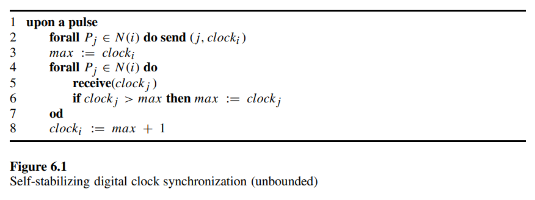
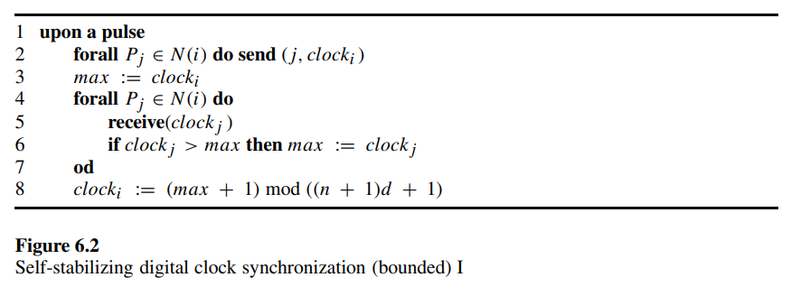
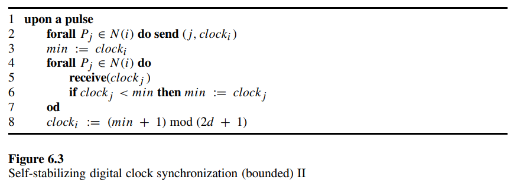
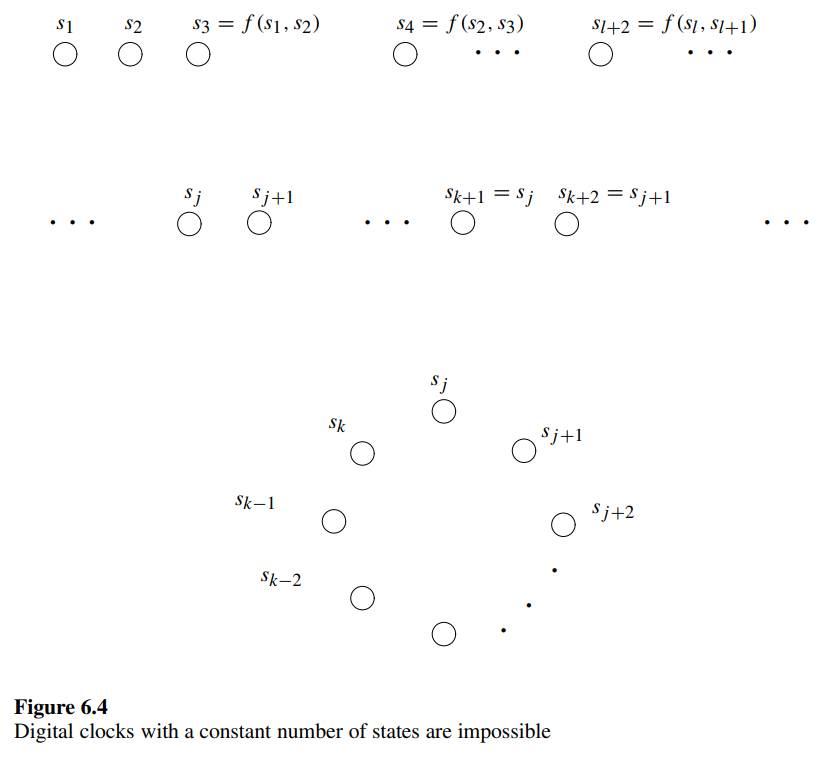

# 6.1 Digital Clock Synchronization

The digital clock-synchronization problem is defined for a system of $n$ identical processors connected to a global common clock pulse. Each processor maintains a digital clock value. In every pulse each processor executes a step in which it reads the value of its neighbors’ clocks and uses these values to calculate its new clock value. In other words, **a pulse triggers read operations by all the processors, and once the read operations by all the processors are finished, the processors choose new clock values and change state accordingly**. The term *lock-step* is sometimes used for such synchronous processor activation.

数字时钟同步问题是为一组由全局公共时钟脉冲连接的 $n$ 个相同处理器系统定义的。每个处理器维护一个数字时钟值。在每个脉冲中，每个处理器都会执行一个步骤，在此步骤中它读取邻居时钟的值，并使用这些值计算其新的时钟值。换句话说，**一个脉冲触发所有处理器的读取操作，并且一旦所有处理器的读取操作完成，处理器们就会选择新的时钟值并相应地改变状态**。*逐步锁定* 一词有时用于描述这种同步处理器激活。

Starting in a configuration in which every processor has an arbitrary clock value, the processors should reach a safe configuration $c$ in which:

(1) all the clock values are identical, and

(2) in every execution that starts in $c$, the clocks are incremented by one in every pulse.

Note that the fact that the processors are identical does not contradict the existence of a deterministic algorithm for the task, since we are interested in reaching a symmetric configuration in which all the clock values are identical (unlike, e.g., the leader-election task).

从每个处理器具有任意时钟值的配置开始，处理器应该达到一个安全配置 $c$，在该配置中：

(1) 所有时钟值都是相同的，

(2) 在从 $c$ 开始的每次执行中，时钟值在每个脉冲中递增 1。

注意，处理器是相同的这一事实并不与存在用于该任务的确定性算法相矛盾，因为我们感兴趣的是达到一个所有时钟值都相同的对称配置（不同于例如领导者选举任务）。

The first self-stabilizing algorithm for synchronizing digital clocks that we describe uses an unbounded number of clock values. The code for the algorithm appears in figure 6.1. **Let $max$ be the maximal clock value that a processor $P_i$ reads from a neighbor during a certain pulse. $P_i$ assigns the value $max+1$ to its own clock**. This simple algorithm is self-stabilizing, since from any initial configuration that follows at least $d$ pulses (where $d$ is the diameter of the system), the clocks are synchronized and incremented by one in any later pulse.

我们描述的第一个用于同步数字时钟的自稳定算法使用了无限数目的时钟值。该算法的代码如图 6.1 所示。**令 $max$ 为处理器 $P_i$ 在某一脉冲期间从邻居读取的最大时钟值。在这种情况下，$P_i$ 将值 $max+1$ 赋给自己的时钟**。这个简单的算法是自稳定的，因为从任何初始配置开始，经过至少 $d$ 个脉冲（其中 $d$ 是系统的直径）后，时钟将同步并在之后的任意脉冲中递增 1。

Let $P_m$ be a processor with the maximal clock value in the first configuration. The correctness of the algorithm can be easily proven by an induction on the distance from $P_m$; we assume that, following $i$ pulses, every processor of distance $i$ from $P_m$ holds the (current) maximal clock value.

The algorithm uses unbounded clocks, which is a serious drawback in self-stabilizing systems. Every implementation of the algorithm must use bounded memory for the clock (e.g., a sixty-four-bit register). As already remarked, the assumption that a sixty-four-bit digital clock is "unbounded" for every implementation because it will take $2^{64}$ time units to reach the upper bound (which is large enough for every possible application) does not hold in the design of self-stabilizing systems, where a single transient fault may cause the clock immediately to reach the maximal clock value.

令 $P_m$ 为初始配置中具有最大时钟值的处理器。该算法的正确性可以通过对从 $P_m$ 的距离进行归纳证明；我们假设在经过 $i$ 个脉冲后，从 $P_m$ 距离为 $i$ 的每个处理器都持有（当前的）最大时钟值。

该算法使用了无限制的时钟，这是自稳定系统中的一个严重缺陷。该算法的每个实现都必须使用有限的时钟内存（例如，六十四位寄存器）。如前所述，在每个实现中假定一个六十四位数字时钟是“无限的”，因为需要 $2^{64}$ 个时间单位才能达到上限（这对于每个可能的应用程序来说已经足够大了），这种假设在自稳定系统的设计中并不成立，因为单个瞬时故障可能会导致时钟立即达到最大值。

We discuss two self-stabilizing algorithms that use bounded clock values. The first bounded algorithm is almost identical to the unbounded algorithm, the only difference being that the clocks are incremented modulo $M$ where $M > (n+1)d$ (note that for ease of description the values we choose for $M$ are not the minimal possible value). The code of the algorithm appears in figure 6.2.

我们讨论了两种使用有限时钟值的自稳定算法。第一个有限算法与无限算法几乎相同，唯一的区别是时钟按 $M$ 取模递增，其中 $M > (n+1)d$（请注意，为了描述方便，我们选择的 $M$ 值不是最小可能值）。该算法的代码如图 6.2 所示。

Note that, if the system is initialized in a configuration in which the values of the clocks are less than $M-d$, then the clocks are synchronized before the modulo operation is applied. Once the clocks are synchronized, the value zero is assigned to the clocks simultaneously in the pulse immediately after a configuration in which the clock values are all $M-1$.

The correctness proof for the first algorithm uses the pigeonhole principle, showing that, in any configuration, there must be two clock values $x$ and $y$ such that $y-x \geq d+1$ and there is no other clock value between.

Furthermore, since each processor chooses an existing clock value and increments it by one, it holds at the first pulse of the execution that no clock can be assigned a value greater than the value of $x+1$ and less than the value of $y+1$. Similarly, until $y$ is incremented to $M$, it holds that, following the $i$ th pulse, no clock value is greater than $x+i$ and smaller than $y+i$.

Thus, after $M-y+1$ pulses, the system reaches a configuration in which there is no clock value that is greater than $M-d$.

In the next $d$ rounds, the maximal clock value propagates, and the system reaches a configuration in which all the clocks are synchronized.

请注意，如果系统初始化时时钟值小于 $M-d$，则在应用模运算之前时钟已经同步。一旦时钟同步，在时钟值都为 $M-1$ 的配置之后的脉冲中，时钟同时被赋值为零。

第一个算法的正确性证明使用了抽屉原理，表明在任何配置中，必须存在两个时钟值 $x$ 和 $y$，使得 $y-x \geq d+1$，且两者之间没有其他时钟值。

此外，由于每个处理器选择一个现有的时钟值并将其递增 1，故在执行的第一个脉冲中，任何时钟值都不会被赋值为大于 $x+1$ 且小于 $y+1$ 的值。同样，直到 $y$ 被递增到 $M$，在第 $i$ 个脉冲后，保持没有时钟值大于 $x+i$ 且小于 $y+i$。

因此，在 $M-y+1$ 个脉冲后，系统达到一种配置，其中没有时钟值大于 $M-d$。

在接下来的 $d$ 轮中，最大时钟值传播，系统达到所有时钟同步的配置。

The other bounded algorithm, in figure 6.3, uses the minimal, instead of the maximal, clock value read by a processor. For this version, it is sufficient to use $M > 2d$. As in previous algorithms, the number of distinct clock values can only be reduced during the execution. Actually, it is shown that the number of clock values is reduced to a single clock value. Two cases are considered.

- In the first, no processor assigns zero to its clock during the first $d$ pulses. A simple induction on the distance from a processor that holds the minimal clock value in the first configuration proves that, following $i \leq d$ pulses, all neighbors at distance $i$ from this processor have the minimal clock value in the system.
- In the other case, a processor assigns zero to its clock during the first d pulses. Here it is easy to see that, in $d$ pulses after this assignment, a configuration $c$ is reached such that there is no clock value in $c$, that is greater than $d$. In the first $d$ pulses that follow $c$, no processor assigns zero to its clock. Thus, the arguments for the first case hold.

另一个有限算法，如图 6.3 所示，使用处理器读取的最小时钟值代替最大时钟值。对于这个版本，使用 $M > 2d$ 就足够了。与前面的算法一样，在执行过程中可用的时钟值数目只能减少。实际上，证明表明，时钟值的数目减少到一个单一的时钟值。考虑两种情况。

- 在第一种情况下，在前 $d$ 个脉冲中，没有处理器将零赋值给它的时钟。通过对第一个配置中持有最小时钟值的处理器的距离进行简单的归纳证明表明，在 $i \leq d$ 个脉冲后，距离此处理器为 $i$ 的所有邻居都持有系统中的最小时钟值。
- 在另一种情况下，一个处理器在前 $d$ 个脉冲中将零赋值给其时钟。在这种情况下，很容易看到，在此赋值后的 $d$ 个脉冲内，系统达到配置 $c$，使得在 $c$ 中没有时钟值大于 $d$。在 $c$ 之后的前 $d$ 个脉冲中，没有处理器将零赋值给其时钟。因此，第一种情况的论点成立。

## Digital Clocks with a Constant Number of States

One may wonder whether the number of clock values be further reduced. Can this number be a fixed constant that is related to neither the diameter of the system nor the number of processors in the system? The following elegant lower bound on the number of states per processor proves that there is no uniform digital clock-synchronization algorithm that uses only a constant number of states per processor. To prove the lower bound, we restrict our attention to systems with ring communication graphs. This is a special case of general communication graph systems; therefore, a lower bound for this special case implies a lower bound for the general communication graph case.

有人可能会想，时钟值的数量是否可以进一步减少。这个数量是否可以是一个与系统直径或处理器数量无关的固定常数？以下关于每个处理器状态数的优雅下界证明表明，没有使用仅是常数量状态的统一数字时钟同步算法。为了证明这个下界，我们将注意力限制在具有环形通信图的系统上。这是一般通信图系统的一个特例，因此这个特例的下界意味着一般通信图情况的下界。

To present the main ideas of the lower bound, we start in a restricted case in which a processor can read only the clock of a subset of its neighbors, and we prove a lower bound for a unidirected ring. In a unidirected ring every processor has a left and a right neighbor. The left and right neighbor relation is global in the following sense: if $P_i$ is the left neighbor of $P_j$ then $P_j$ is the right neighbor of $P_i$. In a unidirected ring a processor can read the state of its left neighbor.

为了呈现这个下界的主要思想，我们从一个受限的情况开始，在这个情况下，处理器只能读取其邻居子集的时钟，并且我们为单向环证明一个下界。在单向环中，每个处理器都有一个左邻居和一个右邻居。左邻居和右邻居的关系在以下意义上是全局的：如果 $P_i$ 是 $P_j$ 的左邻居，那么 $P_j$ 就是 $P_i$ 的右邻居。在单向环中，处理器可以读取其左邻居的状态。

Given any self-stabilizing digital clock-synchronization algorithm for a unidirected ring, denote the transition function of every processor by $f$. Each transition is denoted by $s^{t+1}_i = f(s^t_{i-1},s^t_i)$, where $s^t_i$ and $s^t_{i-1}$ are the states of $P_i$ and its left neighbor, respectively, at time $t$, and $s^{t+1}_i$ is the state of $P_i$ at time $t+1$. Assume that the number of states of every processor is a constant; in other words, the number of possible states is not a function of the number of the processors in the ring. Let $|S|$ be the constant number of states of a processor. The idea is to choose a sufficiently large ring for which the given algorithm will never stabilize. The proof shows that a configuration exists for a sufficiently large ring such that the states of the processors rotate: in every step, the state of every processor is changed to the state of its right processor.

给定任何用于单向环的自稳定数字时钟同步算法，将每个处理器的状态转换函数记为 $f$。每个转换表示为 $s^{t+1}_i = f(s^t_{i-1},s^t_i)$，其中 $s^t_i$ 和 $s^t_{i-1}$ 分别表示时刻 $t$ 时 $P_i$ 和它的左邻居的状态，而 $s^{t+1}_i$ 表示时刻 $t+1$ 时 $P_i$ 的状态。假设每个处理器的状态数量是一个常数；换句话说，可能状态的数量不是环中处理器数量的函数。设处理器的常数状态数为 $|S|$。这个思路是选择一个足够大的环，对于给定的算法来说，它永远不会稳定。证明表明，对于一个足够大的环，存在一种配置，使得处理器的状态轮转：在每一步中，每个处理器的状态都变为其右侧处理器的状态。

Figure 6.4 depicts our next argument. Let $s_1$ and $s_2$ be two states in $S$; e.g., the first two states according to some arbitrary ordering of the states. Use $s_1$ and $s_2$ to construct an infinite sequence of states such that $s_{l+2} = f(s_l,s_{l+1})$ (the upper two lines of figure 6.4 are such a sequence). There must be a sequence of states $s_j$, $s_{j+1}$, ···, $s_{k-1}$, $s_k$ — that is, a subset of the above infinite sequence — such that $f(s_{k-1}, s_k) = s_j$ and $f(s_k , s_j) = s_{j+1}$ and $k \geq j+3$; or, equivalently, $s_{k+1} = s_j$ and $s_{k+2} = s_{j+1}$. Consider the sequence of pairs $(s_1, s_2)$, $(s_5,s_6)$, $(s_9, s_{10})$, ···, $(s_{4(i-1)+1}, s_{4(i-1)+2})$ ···. Any sequence of $|S|^2 + 1$ such pairs has at least one pair $(s_j , s_{j+1})$ that appears more than once. Thus, any segment of $2(|S|^2 + 1)$ states in the infinite sequence can be used in our proof.

图 6.4 展示了我们的下一个论点。设 $s_1$ 和 $s_2$ 是 $S$ 中的两个状态；例如，根据某种任意的状态排序，第一和第二状态。使用 $s_1$ 和 $s_2$ 构造一个无限状态序列，使得 $s_{l+2} = f(s_l,s_{l+1})$（图 6.4 的上两行便是这样的一个序列）。必须存在一段状态序列 $s_j$, $s_{j+1}$, ···, $s_{k-1}$, $s_k$——即上述无限序列的一个子集——使得 $f(s_{k-1}, s_k) = s_j$ 且 $f(s_k , s_j) = s_{j+1}$ 并且 $k \geq j+3$；或换句话说，$s_{k+1} = s_j$ 且 $s_{k+2} = s_{j+1}$。考虑状态对 $(s_1, s_2)$, $(s_5,s_6)$, $(s_9, s_{10})$, ···, $(s_{4(i-1)+1}, s_{4(i-1)+2})$ ···的序列。任何 $|S|^2 + 1$ 这样的状态对序列至少有一对 $(s_j , s_{j+1})$ 会出现多次。因此，无限序列中的任何 $2(|S|^2 + 1)$ 状态段都可用于我们的证明。

Now, we are convinced that there is a sequence $s_j, s_{j+1}, ··· , s_{k-1}, s_k$ in which the combination $s_{k+1}, s_{k+2}$ and the combination $s_j, s_{j+1}$ are identical. Therefore, it holds that $f(s_{k-1}, s_k) = s_j$ and $f(s_k, s_j) = s_{j+1}$. Now construct a unidirected ring of processors using the sequence $s_j, s_{j+1}, ···, s_{k-1}, s_k$, where the processor in state $s_k$ is the left neighbor of the processor in state $s_j$ (see the lower portion of figure 6.4). Each processor uses its own state and the state of its left neighbor to compute the next state; in accordance with our construction, the state $s_{j+i}$ is changed to $s_{j+i+1}$ for every $0 \leq i < k-j$, and the state $s_k$ is changed to $s_j$. We conclude that, in each pulse, the states are rotated one place to the left. Note that the above is true in an infinite execution starting in the configuration defined above.

现在，我们确信存在一个序列 $s_j, s_{j+1}, ··· , s_{k-1}, s_k$，其中组合 $s_{k+1}, s_{k+2}$ 和组合 $s_j, s_{j+1}$ 是相同的。因此，有 $f(s_{k-1}, s_k) = s_j$ 和 $f(s_k, s_j) = s_{j+1}$。现在，使用序列 $s_j, s_{j+1}, ···, s_{k-1}, s_k$ 构造一个单向环形处理器，在其中状态为 $s_k$ 的处理器是状态为 $s_j$ 的处理器的左邻居（见图 6.4 的下部分）。每个处理器使用自己的状态和左邻居的状态来计算下一个状态；按照我们的构造，对于每一个 $0 \leq i < k-j$，状态 $s_{j+i}$ 变为 $s_{j+i+1}$，状态 $s_k$ 变为 $s_j$。我们得出结论，在每个脉冲中，状态向左轮转一位。请注意，上述内容在从上述配置开始的无限执行中是正确的。

Is it possible that such an infinite execution will stabilize? Since the states of the processors encodes the clock value and the set of states is not changed during an infinite execution (it just rotates around the ring), we must assume that all the states encode the same clock value. On the other hand, the clock value must be incremented in every pulse. This is impossible, since the set of states is not changed during the infinite execution.

这种无限执行有可能稳定吗？由于处理器的状态编码了时钟值，并且在无限执行期间状态集合未改变（只是围绕环旋转），我们必须假设所有状态编码了相同的时钟值。另一方面，时钟值必须在每个脉冲中递增。这是不可能的，因为在无限执行期间状态集合未改变。

In the more complicated case of bidirectional rings, the lower-bound proof uses a similar approach. We denote a transition by $s^{t+1}_i = f(s^t_{i-1}, s^t_i, s^t_{i+1})$. In this case, there must exist a sequence of states $s_1, s_2, ···, s_k$ of length $O(|S|^3)$ such that, for every $i > 2$, $f(s_{i-1}, s_i, s_{i+1}) = s_{i+2}$ and $f(s_{k-2}, s_{k-1}, s_k) = s_1$, $f(s_{k-1}, s_k, s_1) = s_2$, $f(s_k, s_1, s_2) = s_3$, where $k \geq 3$. The reason is that the number of state combinations, $s_{i-1}, s_i, s_{i+1}$, is bounded by $|S|^3$. The proof is completed by the rotation argument, where every activation results in a double rotation.

在更复杂的双向环形中，下界证明使用了类似的方法。我们将转换表示为 $s^{t+1}_i = f(s^t_{i-1}, s^t_i, s^t_{i+1})$。在这种情况下，必须存在一个长度为 $O(|S|^3)$ 的状态序列 $s_1, s_2, ···, s_k$，使得对于每一个 $i > 2$，有 $f(s_{i-1}, s_i, s_{i+1}) = s_{i+2}$，且 $f(s_{k-2}, s_{k-1}, s_k) = s_1$，$f(s_{k-1}, s_k, s_1) = s_2$，$f(s_k, s_1, s_2) = s_3$，其中 $k \geq 3$。原因是状态组合 $s_{i-1}, s_i, s_{i+1}$ 的数量由 $|S|^3$ 限制。证明通过旋转论证完成，每次激活都会导致双重旋转。

Note that **a randomized self-stabilizing algorithm that uses a constant number of clocks** does exist. At each pulse, a processor $P_i$ randomly chooses a clock value $clock$ that is either its own clock value or the clock value of a neighbor. $P_i$ assigns $(clock+1) \mod M$ to ${clock}_i$. Again, this choice ensures that the number of distinct clock values can only be reduced during the execution. A simple *sl-game* winning strategy can be used. Choose a particular node $P_l$; if each processor repeatedly chooses a clock value of a neighbor in a shortest path to $P_l$, then the system reaches a safe configuration within $d$ pulses. Thus, in every *infinite* execution, the algorithm stabilizes with probability 1.

请注意，确实存在一种**使用常数量时钟的随机自稳定算法**。在每个脉冲中，处理器 $P_i$ 随机选择一个时钟值 $clock$，该值可以是其自身的时钟值或其邻居的时钟值。$P_i$ 将 $(clock+1) \mod M$ 赋给 ${clock}_i$。同样，这种选择确保在执行过程中可用的不同时钟值只能减少。可以使用一个简单的 *sl-game* 赢策略。选择一个特定的节点 $P_l$；如果每个处理器反复选择邻居的时钟值作为到 $P_l$ 的最短路径，则系统在 $d$ 个脉冲内达到安全配置。因此，在每一个 *无限* 执行中，算法稳定的概率为 1。

Until this point, we have studied self-stabilizing algorithms for digital clock synchronization. In the following sections, we present algorithms that cope with other types of faults in addition to transient faults.

到目前为止，我们已经研究了用于数字时钟同步的自稳定算法。在接下来的部分中，我们将介绍除了瞬态故障外，还可以应对其他类型故障的算法。
