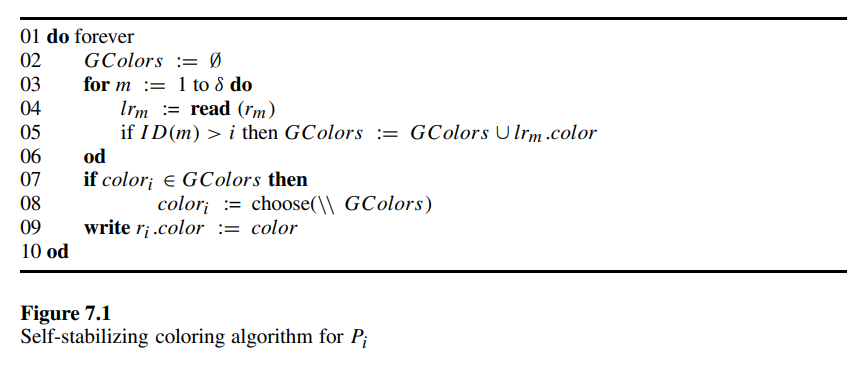
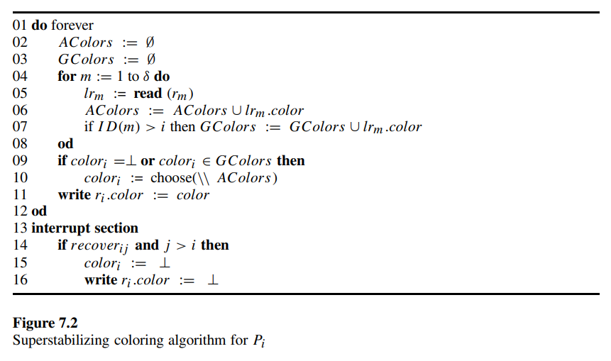

# 7.1 Superstabilization

Let us first study the combination of self-stabilization and dynamic systems. In a *dynamic* system, communication links and processors may fail and recover during normal operation. Algorithms for dynamic systems are designed to cope with such failures and to recover without global reinitialization. These algorithms consider only global states that are reachable from a predefined initial state under a *restrictive sequence of failures*; under such restrictions, the algorithms attempt to cope with failures with as few adjustments as possible. In contrast to self-stabilizing algorithms that were not designed to guarantee a particular behavior between the time of a transient fault and restoration to a legitimate state, dynamic algorithms make guarantees about behavior at all times (e.g., during the period between a failure event and the completion of necessary adjustments).

Superstabilizing algorithms combine benefits of both self-stabilizing and dynamic algorithms. Roughly speaking, an algorithm is superstabilizing if it is self-stabilizing and if, when started in a safe configuration and a topology change occurs, it converges to a new safe configuration in a graceful manner. In particular, it should preserve a passage predicate during the convergence to a new safe configuration and should exhibit a fast convergence rate.

The passage predicate is defined with respect to a class of topology changes. A topology change typically falsifies legitimacy. The passage predicate must therefore be weaker than legitimacy but strong enough to be useful; ideally, it should be the strongest predicate that holds when a legitimate state undergoes a topology change event. One example of a passage predicate is the existence of at most one token in the token-passing task; in a legitimate state, exactly one token exists, but a processor crash could lose the token but not falsify the passage predicate. Similarly, for the leader-election task, the passage predicate could specify that no more than one leader exists.

In addition to the complexity measures used to evaluate self-stabilizing algorithms, superstabilizing algorithms are also evaluated by their *superstabilizing time* and *adjustment measure*. The *superstabilizing time* is the maximum number of rounds it takes for an algorithm starting from a legitimate state, to undergo a single topology change and then reach a legitimate state. The *adjustment measure* is the maximum number of processors that must change their local states, upon a topology change from a legitimate state, so that the algorithm reaches a legitimate state.

Many distributed algorithms have been designed to cope with continuous dynamic changes. These algorithms make certain assumptions about the behavior of processors and links during failure and recovery; for instance, most of them do not consider all possible combinations of crashes, assume that every corrupted message is identified and discarded, and assume bounded link capacity. Recall, that according to our proof in section 3.2, when crashes are possible and the link capacity is not known, an arbitrary configuration can be reached.

The primary goal of self-stabilizing algorithms is to recover from transient faults, and this goal has influenced their design and analysis. For instance, for a correct self-stabilizing algorithm, there are no restrictions on the behavior of the system *during* the convergence period: the only guarantee is convergence to a legitimate state.

Self-stabilization’s treatment of a dynamic system differs from that of dynamic algorithms in how topology changes are modeled. Dynamic algorithms assume that topology changes are *events* signaling changes in incident processors. In particular, an initial state is defined for the processors executing a dynamic algorithm. When the system starts operating, each processor that joins the execution of the algorithm initializes its state.

Self-stabilizing algorithms take a necessarily more conservative approach that is entirely state-based: a topology change results in a new state from which convergence to a legitimacy is guaranteed, with no use of signals of events. Yet, when the system is in a legitimate state and a fault happens to be detected, can the behavior during the convergence be constrained to satisfy some desired safety property? For instance, is it possible in these situations for the algorithm to maintain a “nearly legitimate” state during convergence? A self-stabilizing algorithm that does not ignore the occurrence of events will perform better: it will be initialized in a predefined way and react better to dynamic changes during the execution.

The issue can be motivated by considering the problem of maintaining a spanning tree in a network. Suppose the spanning tree is used for virtual circuits between processors in the network. When a tree link fails, the spanning tree becomes disconnected, but, virtual circuits entirely within a connected component can continue to operate. In the superstabilizing approach, the system restores a spanning tree so that existing virtual circuits in the connected components remain operating; thus, a least-impact legitimate state can be realized by simply choosing a link to connect the components.

The time complexity of a self-stabilizing algorithm is the worst-case measure of the time spent to reach a legitimate state from an arbitrary initial state. But is this measure appropriate for self-stabilization for dynamic systems? Perhaps a better measure would be the worst case: starting from an arbitrary legitimate state, considering a topology change, and then measuring the time needed to reach a legitimate state again. This approach can be motivated by considering the probability of certain types of faults: while a transient fault is rare (but harmful), a dynamic change in the topology may be frequent. Note that the issue of time complexity is orthogonal to the issue of whether an algorithm converges while preserving a passage predicate.

We present a self-stabilizing and superstabilizing algorithm for the graph coloring task. The graph coloring task is to assign a $color$ value to each processor, such that no two neighboring processors are designated by the same color. The distributed coloring algorithms that are presented below do not cope with the theoretical difficulty of minimizing the number of colors. The algorithms use $\triangle+1$ colors, where $\triangle$ is an upper bound on a processor’s number of neighbors. The goal is to demonstrate the superstabilizing property and the complexity measures that are related to superstabilization. Each processor $P_i$ has a register field ${color}_i$.

A self-stabilizing coloring algorithm should ensure that, for every two neighboring processors $P_i$ and $P_j$, it eventually holds that ${color}_i \neq {color}_j$ and that no color variable changes value.

Let us first explain the code of the algorithm presented in figure 7.1. A processor $P_i$ has an internal variable $GColors$ that is used to store the set of colors of $P_i$'s neighbors. $GColors$ accumulates the colors of $P_i$'s neighbors that have an identifier greater than $i$ (this is done in lines 2 through 5 of the code).

Then $P_i$ checks whether its color is that of one of the processors with a greater identifier and, if so, chooses a new color different from the colors of these processors (this is done in lines 7 and 8 of the code). Finally, $P_i$ writes the value of ${color}_i$ to $r_i.color$.

Assume that a link between two processors is added or that a new processor is added to the system. Note that we assume that the above addition does not violate the restriction that each processor have no more than $\triangle$ neighbors. The new system state that is reached due to the dynamic change may not be a safe configuration for this system. For instance, it is possible that two processors that became neighbors due to the link addition have the same color. Clearly, a safe configuration is reached when each processor follows the algorithm presented in figure 7.1. However, it is possible that, during the convergence, almost every processor will change its color.

For example, consider a system in the form of a chain $P_1, P_2, ···, P_n$ where, for every $1 \leq i \leq n - 1$, $P_i$ is connected to $P_{i+1}$, and where the link between $P_{n-1}$ and $P_n$ is inoperative. If the link between $P_{n-1}$ and $P_n$ recovers while ${color}_n = {color}_{n-1}$, it is then possible that, during the execution of the algorithm in figure 7.1, every processor will change its color. Such a scenario can be avoided by using the topology change as a signal for $P_n$ and $P_{n-1}$ to change colors in a careful way. Figure 7.2 presents a superstabilizing algorithm for the coloring task. Each processor repeatedly reads the color of its neighbors and uses the variables $AColors$ and $GColors$ to store the set of colors it finds. In particular, $AColors$ stores the set of colors of all the neighbors and $GColors$ stores the set of colors of the neighbors that have a greater identifier (lines 2 through 8 of the code).

A special symbol $\perp$ is used by the superstabilizing algorithm to flag a nonexistent color. When a link connecting the processors $P_i$ and $P_j$ recovers, both $P_i$ and $P_j$ receive an interrupt signal, ${recover}_{ij}$ and ${recover}_{ji}$, respectively. Assume, without loss of generality, that $j > i$; in such a case, the interrupt ${recover}_{ij}$ triggers an assignment ${color}_i := \perp$ (lines 14 and 15 of the code). In our example $P_{n-1}$ assigns $\perp$ to ${color}_{n-1}$ and $r_{n-1}.color$. Then $P_{n-1}$ chooses a color different from the color of $P_n$ and $P_{n-2}$. Thus, a safe configuration is reached. To prove superstabilization of an algorithm, one needs first to prove that the algorithm is self-stabilizing. Consider an execution of the superstabilizing algorithm in figure 7.2 in which no topology change occurs. In every configuration that follows the first asynchronous cycle of the algorithm, the values of ${color}_i$ and $r_i.color$ of every processor $P_i$ are not equal to $\perp$. Moreover, processors execute only lines 1 to 12 of the code during the execution. Thus, following the first asynchronous cycle, the processor $P_n$ with the largest identifier has a fixed color. The proof continues by induction, proving that the processor $P_{n-1}$ with the second largest identifier chooses a color that is fixed through the entire execution during the next cycle. The proof uses the fact that the color of $P_n$ is already fixed, so that when $P_{n-1}$ is a neighbor of $P_n$, $P_{n-1}$ does not choose the color of $P_n$. The same argument is used repeatedly to prove that $P_i$ chooses a color that is different from the color of every neighbor $P_j$ with $j > i$ in the $j$ th cycle, and that this color remains fixed.

The terms *passage predicate*, *superstabilizing time complexity*, and *adjustment measure* can be demonstrated using the superstabilizing coloring algorithm in figure 7.2. The passage predicate ensures that the color of neighboring processors is always different in any execution that starts in a safe configuration and in which only a single edge may fail or recover before the next safe configuration is reached. Superstabilizing time complexity is measured by the number of cycles required to reach a safe configuration following a topology change. Clearly, the superstabilizing time complexity of the algorithm in figure 7.2 is one cycle (while the stabilizing complexity is $O(n)$ cycles). The adjustment measure for our algorithm is the number of processors that change color upon a topology change; this is only one processor, when the topology changes considered are link addition or removal.
