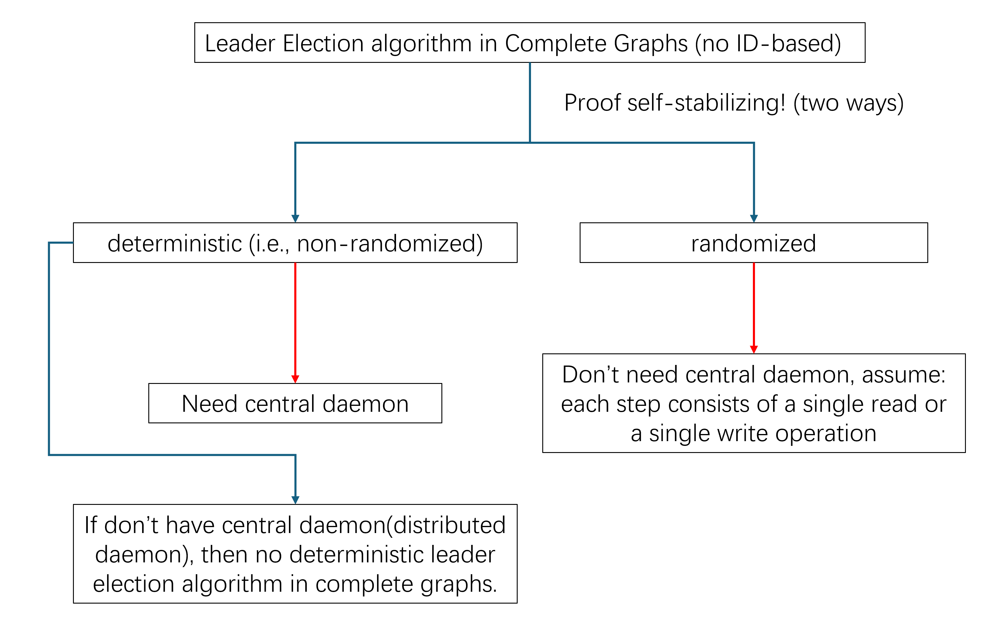

# note_2_7_完全图中的领导者选举

包含 2.9 章部分内容和 PPT 内容。

## Randomized Self-Stabilization

Assumptions and Definitions

- Processor activity is managed by a scheduler
- The scheduler's assumption
  - at most one atomic step is executed in every given time
  - Each atomic step includes a single read or write operation and a finite sequence of local computation.
- The scheduler is regarded as an adversary
  - It aims to increase the algorithm costs as much as possible
- The scheduler is assumed to be fair, yet it has unlimited resources and chooses the next activated processor in an on-line manner.

An algorithm is randomized self-stabilizing for task $LE$ if, starting with any system configuration and considering any fair scheduler, the algorithm reaches a safe configuration within a finite number of rounds.

**Randomized algorithms are often used to break symmetry in a system of totally identical processors.**

## Coarse（粗粒度原子性）vs. Fine Atomicity

Under coarse atomicity---less power to the adversary

- a coin toss is an internal operation that is not separable from the next read or write operation.
- the adversary is unaware to the algorithm random choices before its first read or write operation

Under fine atomicity---more power to the adversary

- a coin toss is a separate operation from the next read or write operation.
- **the adversary is aware to the algorithm random choices before its first read or write operation**

## Scheduler-Luck Game

> If, during this step, the activated processor uses a random function, then **luck may *intervene* — i.e., luck may determine the result (or some subset of the desired results) of the random function. If luck intervenes and fixes the result to be any of g values from the possible h results, then the probability of this intervention is $p = g/h$**.
>
> 如果在这一步中，激活的处理器使用了随机函数，那么**运气可能会 *干预* —— 即运气可以决定随机函数的结果（或期望结果的某个子集）。如果运气干预并将结果固定为可能的 $h$ 个结果中的任意 $g$ 个值，那么这种干预的概率为 $p = g/h$。**

在我第一次看的时候，我完全都没有注意到这一部分。他的意思就是，随机函数的结果本来有 $h$ 个，但是运气干预了这个结果，使得仅有其中的 $g$ 个结果，当然这种干预是有概率的，就是 $p = g/h$。

比较令人匪夷所思的是，这个运气的操作并没有包含在算法内，而这正是 *sl-game* 相当重要的一环。

## Self-Stabilizing Leader Election in Complete Graphs

### uniform, anonymous systems, symmetry, Randomization

An algorithm that solves the leader election task requires that, when its execution terminates, a single processor be designated as a $leader$, and every processor know whether it is a leader or not. By definition, whenever a leader election algorithm terminates successfully, the system is in a nonsymmetric configuration. Any leader-election algorithm that has a symmetric initial state requires some means of symmetry-breaking.

**In *id-based* systems, each processor has a unique identifier called its *id*; thus, the system has no symmetric configuration. In *uniform* (or *anonymous*) systems all processors are identical. Randomization is often used to break symmetry in such systems.**

解决领导者选举任务的算法要求在其执行终止时，单个处理器被指定为 $leader$，并且每个处理器都知道自己是否是领导者。根据定义，每当领导者选举算法成功终止时，系统处于非对称配置中。任何具有对称初始状态的领导者选举算法都需要某种对称性破坏手段。

**在 *基于标识符* 的系统中，每个处理器都有一个称为 *id* 的唯一标识符；因此，系统没有对称配置。在 *统一*（或 *匿名*）系统中，所有处理器都是相同的。随机化通常用于在此类系统中打破对称性。**

---

这里就凸现出本节中完全图和之前的一般图的区别了。一般图中处理器有唯一标识符 id，故而没有对称性；而完全图中，没有 id，所有处理器相同，那么就需要进入随机化来显示区别。

### 行文逻辑

本次提到的 Leader Election in Complete Graphs 和上次的 Leader Election in a General Communication Network，后者可被称为 ID-based，有原文为证：

> A self-stabilizing algorithm for this task assumes that every processor has a unique identifier in the range 1 to $N$, where $N$ is an upper bound on the number of processors in the system.

对于这个问题设计自稳定算法，有两种不同的思路，一种是非随机的，确定性的自稳定算法，一种是使用随机的自稳定算法。

对于前者，书中给出了在假设存在中央守护进程调度器的情况下的（确定性）自稳定算法。然而如果不存在这个中央守护进程（也即书中未提到的 distributed demon），所有人同时站起来，然后所有人同时坐下，这种行为可以永远重复，那么就会出现像（操作系统）哲学家就餐中的活锁问题。所以我们说，**没有中央守护进程就没有自稳定的统一领导者选举的（确定性）算法**。

- Under the central demon model: **exactly one among all processors** is arbitrarily selected by an adversarial scheduler to take a single atomic step.
- Under the distributed demon model: **an arbitrary number of processors** are selected by an adversarial scheduler to concurrently take atomic steps.

对于后者，书中给出了简单的**随机**自稳定领导者选举算法，并不假设中央守护进程的存在。假设本章第 2.1 节中提出的设置：每一步由单个读取或单个写入操作组成。

- 之后介绍算法（图 2.10），然后定义任务 $LE$。
- 然后证明算法的稳定时间的期望是 $2^{O(n)}$ 轮（LEMMA 2.6），这里才介绍了运气的机制。
- 最后说明在细粒度原子性下，算法不是自稳定的（LEMMA 2.7）。

所以实际这章介绍的是：

Randomized Self Stabilizing Leader Election in Complete Graphs under Coarse Atomicity

### 算法

### 运气

if some, processor $p_i$, tosses a coin (line 06), luck intervenes;

- if for all $j \neq i$, ${leader}_j = 0$, luck fixes the coin toss to be 1;
- otherwise, it fixes the toss to be 0.

### 证明 <- 观察

该策略的正确性来自以下观察。（概率计算略，不过其中”每个处理器 $P_i$ 最多可以掷一次硬币“还是值得一看）

---

在少于 $2n$ 连续轮次内，每个处理器 $P_i$ 读取所有 $leader$ 寄存器，然后在需要时掷硬币并将结果写入 ${leader}_i$。

> 观察 1：如果在前 $2n$ 轮内没有处理器掷硬币，系统达到安全配置。

证明过程：

怎样使处理器不掷硬币 -> 不要使得 if 条件成立：

- 对于 ${leader}_i = 0$ 的处理器，成立条件是任意其他处理器的寄存器的值为 0 -> 那也就是必须找到一个 ${leader}_j = 1$ 的处理器；
- 对于 ${leader}_j = 1$ 的处理器，成立条件是存在其他处理器的寄存器的值为 1 -> 那也就是必须发现他是唯一一个 ${leader}_j = 1$ 的处理器。

而这上面两个说法合起来就是安全配置的定义。故而我们说：如果在前 $2n$ 轮内没有处理器掷硬币，系统达到安全配置。

> 观察 2：如果有处理器掷硬币，最后也能到达一种配置：${leader}_k = 1$，对于 $j \neq k$，${leader}_j = 0$，也即安全配置。

证明过程（很绕，看不懂就跳过）：

**在第一次掷硬币后，至少有一个 $leader$ 寄存器的值为 1**：

- 只要掷了硬币，那么如果满足条件 for all $j \neq i$, ${leader}_j = 0$，那么结果 ${leader}_i = 1$；
- 否则结果虽然为 0，但是因为条件不满足，故而是存在 $j$ 使得 ${leader}_j = 1$ 的。
- 所以可以说，**在第一次掷硬币后，至少有一个 $leader$ 寄存器的值为 1。**

设 $S$ 为第一次掷硬币后 $leader$ 寄存器值为 1 的处理器集合。**如果存在一个处理器 $P_k \in S$ 再也不掷硬币，那么 ${leader}_k = 1$ 永远保持不变。**否则，$S$ 中的每个处理器都掷硬币；在这种情况下，我们将 $P_k$ 视为 $S$ 中最后一个掷硬币的处理器：

- 不掷硬币就不改变值，这是很正常的，故而一直是 1 保持不变；
- 本来 ${leader}_k = 1$ 是否保持不变是由算法和运气共同决定的，现在他不掷硬币，所以不用关注运气；看算法，不掷硬币说明不存在其他处理器的 $leader$ 寄存器是 1，也就是其他的处理器的 $leader$ 寄存器都是 0。
- 再进一步的说，在这最后一次掷硬币之后就达到了安全配置，这个最后掷硬币的 $P_k$ 就是领导者。

**运气的策略保证，在 $P_k$ 掷硬币期间，所有剩余的 $leader$ 值为 0，因此运气将 $P_k$ 的硬币结果设置为 1**：

- $P_k ({leader}_k = 1)$ 掷硬币了，且最后结果还是 1，那么说明他的结果是被运气干预的，故而可以知道满足了条件 for all $j \neq i$, ${leader}_j = 0$；
- 也就是说，在 $P_k$ 掷硬币期间，所有剩余的 $leader$ 值为 0（和上面一样印证了，或者你可以认为原书中这句话多余）。

从现在起，${leader}_k = 1$，对于 $j \neq k$，${leader}_j = 0$：

- ${leader}_k = 1$ 掷硬币期间已经有 for all $j \neq i$, ${leader}_j = 0$；掷硬币之后其值 ${leader}_k = 1$ 永远保持不变。
- 在这种情况下，所有 $leader$ 寄存器为 0 的处理器在算法和运气的处理下无法改变值而永远为 0；而前面也提到 ${leader}_k = 1$ 永远保持不变。
- 所以能说：从现在起，${leader}_k = 1$，对于 $j \neq k$，${leader}_j = 0$，也就是安全配置了。

### Coarse vs. Fine Atomicity

Under coarse atomicity - less power to the adversary

- **a coin toss is an internal operation that is not separable from the next read or write operation**.
- the adversary **is unaware to the algorithm random choices** before its first read or write operation

Under fine atomicity - more power to the adversary

- a coin toss is **a separate operation** from the next read or write operation.
- **the adversary is aware to the algorithm random choices before its first read or write operation**
