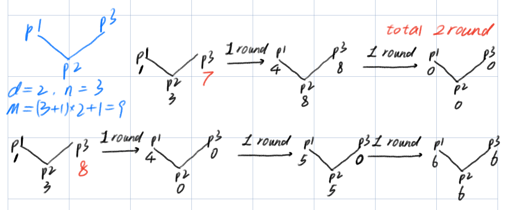

# note_6_1_时钟同步

包括 6.1 和 PPT 内容。注意  Digital Clocks with a Constant Number of States 的证明部分被跳过了。

<!-- TOC -->

- [note\_6\_1\_时钟同步](#note_6_1_时钟同步)
  - [Network Time Protocol (NTP)](#network-time-protocol-ntp)
  - [lock-step（逐步锁定）](#lock-step逐步锁定)
  - [任务](#任务)
  - [unbounded solution](#unbounded-solution)
  - [bounded clock solutions](#bounded-clock-solutions)
    - [MAX](#max)
    - [MIN](#min)
  - [Constant Number of States](#constant-number-of-states)

<!-- /TOC -->

## Network Time Protocol (NTP)

看 PPT 的时候注意哪些内容是没有被划线（不在学习范围内）的。

NTP is a critical protocol used for time synchronization in computer networks. Understanding its message format and parameters is essential for ensuring accurate timekeeping across networked devices.

**Message Format in NTP (RFC 1305)**:

1. **Packets are UDP/IP**: NTP operates over the User Datagram Protocol (UDP) and Internet Protocol (IP). This choice of transport protocol provides lightweight communication without the overhead of establishing a connection, making it suitable for time synchronization.
2. **Checksum-Based Error Detection**: NTP employs a checksum mechanism to detect errors in transmitted packets. The checksum is calculated over the entire NTP packet, allowing the recipient to verify packet integrity. If the checksum doesn't match, the packet is considered corrupted and is typically discarded.
3. **Simple Connectionless Service**: NTP operates as a connectionless protocol, meaning that no prior connection setup or teardown is required before exchanging time synchronization information. This simplicity helps reduce latency and overhead.
4. **No Guarantee of Delivery**: Like UDP, NTP does not provide any guarantee of packet delivery or order. This lack of reliability is acceptable for NTP because it is more important to have the most up-to-date time information rather than ensuring every packet is received.
5. **No Detection of Lost Packets**: NTP does not include mechanisms for detecting lost packets or requesting retransmission. Again, this is acceptable for time synchronization purposes because NTP relies on multiple exchanges and statistical algorithms to achieve accuracy.
6. **Message Authentication (Optional)**: NTP provides the option for message authentication to ensure that received time information is from a trusted source and hasn't been tampered with during transit.

**Authenticator Added to Message**: When message authentication is enabled, an authenticator field is added to NTP packets. The authenticator is computed using a cryptographic algorithm and a shared key between the NTP server and client. This authenticator is used to verify the integrity of the message and authenticate the sender. It helps prevent time spoofing and ensures that the time information received is from a trusted source.

NTP packets are sent as UDP/IP packets with a simple message format. They include error-checking through checksums, but they do not guarantee delivery or offer lost packet detection. Optionally, NTP supports message authentication to ensure the accuracy and authenticity of time information. This design allows NTP to efficiently and accurately synchronize time across networked devices while being flexible enough to accommodate various network conditions and security requirements.

---

**Independent of Physical Layer in Principle**:

NTP (Network Time Protocol) is designed to be independent of the physical layer in principle. This means that the protocol itself is agnostic to the specific hardware or physical network medium over which it operates. NTP primarily deals with the logical aspects of time synchronization, focusing on accurate timekeeping and network communication.
The independence from the physical layer allows NTP to be widely adaptable across various network infrastructures and technologies, including wired and wireless networks, different types of cables, and different transmission speeds. This flexibility is crucial because NTP is used in diverse environments, ranging from local area networks (LANs) to global-scale networks like the internet.

**Performance Depends on Physical Layer in Practice**:

While NTP is designed to be independent of the physical layer in principle, its performance can still be influenced by the characteristics of the underlying physical network. The speed, reliability, and latency of the physical network can impact the accuracy and precision of time synchronization achieved by NTP.

For instance, in high-latency or highly congested networks, NTP may take longer to exchange messages between clients and servers, potentially resulting in less precise time synchronization. Similarly, unreliable physical network connections can introduce packet loss or delays, which can affect the accuracy of NTP timekeeping.

In practice, network administrators need to consider the physical layer's characteristics and optimize network conditions to ensure NTP operates with the required level of accuracy and reliability. This may involve network optimization, such as reducing latency and minimizing packet loss, to enhance NTP performance.

**Support for IPv4 and IPv6**:

NTP is designed to work with both IPv4 (Internet Protocol version 4) and IPv6 (Internet Protocol version 6). IPv4 is the older and more widely used version of the Internet Protocol, while IPv6 is its successor, designed to address the limitations of IPv4, including the exhaustion of IPv4 addresses.

All versions of NTP can use the IPv4 protocol, making it compatible with the vast majority of existing networks and devices that use IPv4 addressing. However, as the transition to IPv6 has been underway to accommodate the growing number of connected devices and address space requirements, newer versions of NTP also support IPv6.

Support for IPv6 ensures that NTP remains relevant and compatible with modern network infrastructures and future-proof as the internet continues to evolve. It allows NTP to operate seamlessly on networks that use IPv6 addressing, offering time synchronization services to both IPv4 and IPv6-enabled devices.

NTP's independence from the physical layer in principle provides flexibility in its deployment across various network environments. However, its practical performance can be influenced by the characteristics of the physical layer. Additionally, NTP's support for both IPv4 and IPv6 ensures its compatibility with a wide range of network configurations and future network technologies.

---

**Reference Scale is Coordinated Universal Time (UTC)**:

The NTP Time Datum is based on the Coordinated Universal Time (UTC), which is the world's primary time standard. UTC is often referred to as the successor to Greenwich Mean Time (GMT) and is used as a global reference for timekeeping. UTC is maintained by a network of atomic clocks around the world and takes into account leap seconds to account for variations in the Earth's rotation.

**Time Parameters (64 bits long)**:

NTP represents time using 64-bit parameters. These parameters are divided into two parts:

1. **Seconds since 1900.0 (32 bits, unsigned)**: This part represents the number of seconds that have elapsed since January 1, 1900, at 00:00:00 UTC. It provides a wide dynamic range for representing time, allowing NTP to handle a span of 136+ years.
2. **Fraction of a Second (32 bits, unsigned)**: The fraction of a second field represents the fractional part of the time in seconds, with a resolution of approximately 232 picoseconds (ps). This high resolution is essential for achieving precise time synchronization.

**Dynamic Range and Rollover in 2036**:

The combination of 32-bit seconds since 1900.0 allows NTP to cover a dynamic range of more than 136 years. However, this also means that NTP has a rollover issue, which occurs approximately every 136 years. The next rollover is expected to happen in 2036 when the 32-bit field for seconds since 1900.0 wraps around.
The rollover issue needs to be carefully managed to ensure that NTP continues to provide accurate timekeeping after 2036. NTP has mechanisms in place to handle this rollover and maintain accurate time synchronization.

**Resolution (232 Picoseconds)**:

NTP provides very high time resolution, approximately equivalent to 232 picoseconds (ps). This level of precision is crucial for applications that require extremely accurate time synchronization, such as financial trading, scientific experiments, and telecommunications. To put this in perspective, it's roughly the time it takes for a common 3.0 GHz computer CPU to complete a processing cycle (330 ps).

**Treating a Time of 0.0 as an Error**:

In the NTP protocol, a time value of 0.0 is typically treated as an error. This is because it would imply that an event occurred at the start of the NTP epoch in 1900, which is not practically meaningful for most applications. It's essential to handle such erroneous time values to avoid potential issues with time-sensitive operations and calculations.

The NTP Time Datum is based on Coordinated Universal Time (UTC) and consists of 64-bit time parameters representing seconds since 1900.0 and fractions of a second. This setup allows NTP to offer a wide dynamic range, high resolution, and precise timekeeping. However, it faces a rollover issue in 2036, and it treats a time value of 0.0 as an error due to its impracticality.

---

Treating a time value of 0.0 as an error in the context of NTP (Network Time Protocol) is important to prevent potential issues in time-sensitive applications and calculations. Here's what can go wrong if a time of 0.0 is not treated as an error:

1. **Incorrect Time Calculations**: In many applications, time values are used for calculations related to scheduling, event sequencing, and data ordering. If a time of 0.0 were not treated as an error and was interpreted as a valid time, it could lead to incorrect time calculations and result in events or actions occurring out of sequence.
2. **Data Corruption**: NTP is commonly used for accurate time synchronization in distributed systems. In such systems, timestamps are often used to order data packets or log entries. If a time of 0.0 were considered valid, it could lead to data packets being processed or logged with incorrect timestamps, potentially causing data corruption and misinterpretation.
3. **Security Vulnerabilities**: Some security mechanisms and protocols rely on timestamps for various purposes, including replay attack prevention and certificate validation. Allowing a time value of 0.0 to be treated as valid could introduce vulnerabilities if an attacker manipulates timestamps to exploit security weaknesses.
4. **Unrealistic Event Timestamps**: Treating a time value of 0.0 as valid could lead to unrealistic event timestamps, as it implies that events occurred at the very beginning of the NTP epoch in 1900. Such timestamps do not reflect real-world scenarios accurately and can be misleading in debugging and analysis.
5. **Confusion in Logging and Debugging**: When debugging or troubleshooting network or system issues, timestamps are often crucial for determining the order of events and identifying the root causes of problems. If 0.0 were accepted as a valid time, it could make it challenging to trace and analyze issues accurately.
6. **Compatibility Problems**: Many systems and applications expect timestamps to conform to standard timekeeping practices, which exclude the possibility of a valid time at the start of the NTP epoch. Treating 0.0 as valid could lead to compatibility problems when interfacing with other systems that adhere to these standards.

Treating a time value of 0.0 as an error in NTP is a preventive measure to ensure the reliability and accuracy of time-related operations. It helps avoid a range of potential issues, including incorrect calculations, data corruption, security vulnerabilities, unrealistic timestamps, and difficulties in debugging and analysis. By designating 0.0 as an error, NTP maintains consistency and adherence to standard timekeeping practices.

---

The "rollover in 2036" issue in the Network Time Protocol (NTP) can potentially lead to several problems if not addressed appropriately. Here's what can go wrong if the NTP rollover in 2036 is not managed correctly:

1. **Time Synchronization Errors**: If the rollover is not handled correctly, NTP clients and servers may experience synchronization errors, causing time discrepancies between devices. This could lead to inaccurate timekeeping across networked systems.
2. **Security Vulnerabilities**: Some security protocols and mechanisms rely on precise timekeeping for authentication and authorization purposes. A rollover issue could disrupt the functioning of these security measures, potentially leading to security vulnerabilities or system breaches.
3. **Data Integrity and Order**: In distributed systems, timestamps are often used to order events or data packets. An incorrect rollover handling could result in incorrect ordering of events, leading to data corruption or out-of-sequence data processing.
4. **Certificate Validity**: Digital certificates, including SSL/TLS certificates, often include validity periods based on time. If the NTP rollover issue causes time discrepancies, certificates may be considered invalid or expired prematurely, disrupting secure communications.
5. **Log File Integrity**: Systems and applications often log events with timestamps. An incorrect rollover handling can result in log entries with inaccurate timestamps, making it challenging to analyze log files for troubleshooting and forensic purposes.
6. **Software Bugs and Compatibility Issues**: Not all NTP clients and servers may handle the rollover correctly. Some older or poorly maintained software may have bugs that manifest during the rollover event. This can lead to compatibility issues between different NTP implementations.
7. **Regulatory Compliance**: In some industries and applications, compliance with specific time-related regulations and standards is essential. An NTP rollover issue that affects time accuracy could result in non-compliance and legal or regulatory consequences.
8. **Financial Implications**: Financial institutions often rely on precise timekeeping for transaction processing and auditing. An incorrect rollover handling could result in financial losses or regulatory penalties in this sector.

To mitigate these potential issues, NTP has mechanisms in place to manage the rollover in 2036. The protocol can adjust for the rollover and continue to provide accurate time synchronization. Network administrators and operators should ensure that their NTP implementations are up to date and properly configured to handle the rollover seamlessly. This typically involves using NTP software versions that are rollover-aware and applying any necessary updates or patches as they become available. By proactively addressing the rollover issue, organizations can maintain the integrity and reliability of their time synchronization systems.

## lock-step（逐步锁定）

> A pulse triggers read operations by all the processors, and once the read operations by all the processors are finished, the processors choose new clock values and change state accordingly.
>
> **一个脉冲触发所有处理器的读取操作，并且一旦所有处理器的读取操作完成，处理器们就会选择新的时钟值并相应地改变状态**。

注意这里是先读取；然后等所有的处理器读取完成，这些处理器才会改变其状态。

## 任务

> Starting in a configuration in which every processor has an arbitrary clock value, the processors should reach a safe configuration $c$ in which:
>
> (1) all the clock values are identical, and
>
> (2) in every execution that starts in $c$, the clocks are incremented by one in every pulse.
>
> 从每个处理器具有任意时钟值的配置开始，处理器应该达到一个安全配置 $c$，在该配置中：
>
> (1) 所有时钟值都是相同的，
>
> (2) 在从 $c$ 开始的每次执行中，时钟值在每个脉冲中递增 1。

## unbounded solution

很简单的算法。

> Let $max$ be the maximal clock value that a processor $P_i$ reads from a neighbor during a certain pulse. $P_i$ assigns the value $max+1$ to its own clock.
>
> 令 $max$ 为处理器 $P_i$ 在某一脉冲期间从邻居读取的最大时钟值。在这种情况下，$P_i$ 将值 $max+1$ 赋给自己的时钟。

但是它的问题是使用了无限的时钟寄存器，而这对有限的内存（如 64 位寄存器）来说是不可行的。同时书中还反复强调，即使从实际角度上说，$2^{64}$ 是对每个应用程序来说足够大的时间，但是这种说法并不能在自稳定系统设计中成立，因为一个瞬时故障就能使得时钟值立刻达到最大值。

## bounded clock solutions

### MAX

和无限算法比起来区别就是时钟按 $M$ 的模递增。算法中它取 $(n+1)d+1$。

PPT 上的演示不够直接，下图是我自己画的：

同时还注意到，{1, 3 , 7} 的初始配置在 $d=2$ 个脉冲后同步，但是 {1, 3, 8} 的初始配置却在 3 个脉冲后同步。

这就是马上要说的：

> If the system is initialized in a configuration in which the values of the clocks are less than $M-d$, then the clocks are synchronized before the modulo operation is applied. Once the clocks are synchronized, the value zero is assigned to the clocks simultaneously in the pulse immediately after a configuration in which the clock values are all $M-1$.
>
> 如果系统初始化时时钟值小于 $M-d$，则在应用模运算之前时钟已经同步。一旦时钟同步，在时钟值都为 $M-1$ 的配置之后的脉冲中，时钟同时被赋值为零。

TODO：但是很不幸的是，我没看懂证明部分。

### MIN

使用处理器读取的最小时钟值代替最大时钟值。对于这个版本，使用 $M > 2d$ 就足够了。算法中它取 $2d+1$。

TODO：但是很不幸的是，我没看懂证明部分。

## Constant Number of States

Consider only deterministic algorithm: There is **no** uniform **digital clock-synchronization** algorithm that uses only a constant number of states per processor.

But note that **a randomized self-stabilizing algorithm that uses a constant number of clocks** does exist.

没有使用常数个状态的，确定性的数字时钟同步自稳定算法，但是有使用常数个状态的，随机自稳定算法。
