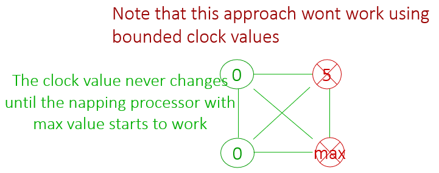

# note_6_2_即使打盹也能自稳定

<!-- TOC -->

- [note\_6\_2\_即使打盹也能自稳定](#note_6_2_即使打盹也能自稳定)
  - [背景和概念](#背景和概念)
    - [fault](#fault)
    - [wait-free self-stabilizing clock-synchronization algorithm](#wait-free-self-stabilizing-clock-synchronization-algorithm)
  - [unbounded clocks](#unbounded-clocks)
  - [bounded clock values](#bounded-clock-values)
    - [箭头、落后](#箭头落后)
    - [识别打盹处理器](#识别打盹处理器)
      - [特定的执行（包括 order 的算法）](#特定的执行包括-order-的算法)
      - [算法文字描述（包括 clock 的算法）](#算法文字描述包括-clock-的算法)
    - [算法（来自 PPT）](#算法来自-ppt)
    - [证明](#证明)

<!-- /TOC -->

## 背景和概念

### fault

- 收敛期间的故障（faults during convergence）
- 收敛之后的故障（faults during after convergence）

---

- 瞬时故障（transient faults）
- 永久故障（permanent faults）

---

打盹故障（napping faults）：很遗憾的是书中并没有解释 napping faults 的定义。我姑且认为：

系统在恢复正常运行时，会经历一段时间的“打盹”状态，即系统暂时停止响应或执行操作。这种状态可能由于系统在处理故障时需要一些时间来恢复到正常的工作状态。这种“打盹”状态并不意味着系统崩溃或永久性失效，而是系统在自我修复过程中的一个暂时性停滞。

书上的说法可印证：

> Napping faults are more severe than crash failures, since a crashed processor can be seen as a napping processor that does not resume operation.
>
> 打盹故障比崩溃故障更严重，因为崩溃的处理器可以看作是一个不再恢复操作的打盹处理器。

在书之后的部分，常常把瞬时故障和打盹故障并列，我认为这里可能省略了”永久“两个字，即永久打盹故障。

书上的说法可印证：

> A self-stabilizing clock synchronization algorithm copes with permanent *napping* faults if processors can repeatedly stop and (possibly) resume operation during and after the convergence of the algorithm to a safe configuration.
>
> 如果处理器可以在算法收敛到安全配置期间和之后反复停止和（可能）恢复操作，那么一个自稳定的时钟同步算法可以应对永久的 *打盹* 故障。

### wait-free self-stabilizing clock-synchronization algorithm

无等待自稳定时钟同步算法。有很长的一段介绍，没有多余的。

> **应对瞬时和打盹故障的时钟同步算法称为 *无等待自稳定* 时钟同步算法**。当所有其他 $n-1$ 个处理器都故障时，一个无故障处理器 $P_i$ 依然同步它的时钟；换句话说，$P_i$ 不等待其他处理器参与算法。
>
> 当 $n-1$ 个处理器故障时，同步的意义是什么？单个操作处理器如何与自己同步？这些问题的答案很简单：同步算法应确保**每个无故障操作的处理器忽略故障处理器，并在每个脉冲中将其时钟值增加一**。如果在某个步骤中时钟值没有增加一，则处理器 $P_i$ 会在该步骤调整其时钟。
>
> 一种既自稳定又能应对打盹故障的算法的要求称为 $adjustment$ 和 $agreement$。我们要求存在一个固定的整数 $k$，使得从任意配置开始，一旦处理器 $P_i$ 至少正确工作了 $k$ 个时间单位，并且只要 $P_i$ 继续工作，以下 $adjustment$ 和 $agreement$ 性质成立：
>
> - $adjustment$：$P_i$ 不调整其时钟，
> - $agreement$：$P_i$ 的时钟与其他所有至少正确工作了 $k$ 个时间单位的处理器的时钟一致。
>
> 因为一个工作处理器必须在固定时间内同步其时钟，而不管其他处理器的操作如何，并且因为系统可以从任意配置启动，所以这样的算法称为 *无等待自稳定* 算法。

需要注意的点“调整”：正常的操作就是时钟值加一，其他的操作都是调整。故而 $adjustment$ 所说的只是不调整，而非不改变。

## unbounded clocks

是什么：

- complete graph

- simple
- *wait-free self-stabilizing* algorithm
- $k=1$ (has been working correctly for at least $k$ time units)
- uses unbounded clocks

---

算法内容：

> A (non-crashed) processor reads the clocks of all the other processors in every step, chooses the maximal clock value in the system, denoted by $x$, and assigns $x+1$ to its clock.
>
> 每个（未崩溃的）处理器在每一步中读取所有其他处理器的时钟，选择系统中的最大时钟值，记为 $x$，然后将 $x+1$ 赋给其时钟。

能否应对瞬时故障（系统达到具有任意时钟值的配置 $c$）？能。

- 在这个任意配置 $c$ 之后，每个处理器 $P_i$ 在每次步骤执行后立即持有最大时钟值。

能否应对打盹故障？能。

- 从任意配置开始，处理器 $P_i$ 执行一步后，$P_i$ 的时钟持有最大时钟值。因此，只要 $P_i$ 不崩溃，它就不会调整其时钟；换句话说，$P_i$ 在每个脉冲中将其时钟增加一。
- 此外，$P_i$ 的时钟和所有其他未崩溃的处理器的时钟都持有系统中的最大时钟值。因此，所有执行了 $k=1$ 步骤的未崩溃处理器的时钟是一致的。

---

有什么缺点：使用了无限内存。

可能的修改方式以及问题：

- 修改方式：其他相同，通过模某个整数 $M$ 将时钟值增加一。
- 问题：持有 $M-1$，也就是最大值的休眠处理器可能导致所有活动处理器反复将其时钟赋值为零，从而违反每个可能整数 $k$ 的调整要求，如下图所示：

---

最后直观的思考：其实应该忽略掉故障处理器，而不像上面那样还要等待休眠处理器继续工作。但是这样就需要能够识别崩溃的处理器，就不是简单的算法足够解决的了。

## bounded clock values

- use a bounded clock value $M$ and a bounded number of states for a processor
- idea: use a mechanism for identifying crashed processors and ignoring their clock value

### 箭头、落后

> 每两个处理器 $P_i$ 和 $P_j$ 都有一个“箭头”指示它们中哪个最近处于活动状态。在每一步中，$P_i$ 确保它不落后于 $P_j$。使用箭头来类比，$P_i$ 通过**尝试将箭头指向自己来确保它不是箭头的尾部**，而 $P_j$ 则从另一侧做同样的事情。在两个处理器执行一步后，箭头没有方向；即 $P_i$ 不落后于 $P_j$，$P_j$ 也不落后于 $P_i$。
>
> 每个处理器 $P_i$ 对每个邻居 $P_j$ 有一个 ${order}_{ij}$ 变量，取值范围为 {0, 1, 2}。$P_i$ 在 ${order}_{ij}$ 中写入值，每个处理器都可以读取 ${order}_{ij}$。
>
> 当 ${order}_{ij}$ 的值等于 ${order}_{ji}$ 的值时，箭头没有方向。
>
> 当 ${order}_{ij}$ 不等于 ${order}_{ji}$ 时，箭头有方向。在这种情况下，我们通过缺失值 $x$ 定义**落后**关系，$x$ 是 {0, 1, 2} 中的值，使得 $x = {order}_{ij}$ 和 $x = {order}_{ji}$。我们使用的约定是，**顺时针方向跟随 $x$ 的值落后于另一个值**。换句话说，当且仅当 $({order}_{ij} + 1) \mod 3 = {order}_{ji}$ 时，$P_i$ 落后于 $P_j$。

图示：

| $P_i ({order}_{ij})$ |               | $P_j ({order}_{ji})$ |
| :------------------: | :-----------: | :------------------: |
|         $x$          |      $-$      |         $x$          |
|          0           | $\rightarrow$ |          1           |
|          1           | $\rightarrow$ |          2           |
|          2           | $\rightarrow$ |          0           |

### 识别打盹处理器

#### 特定的执行（包括 order 的算法）

> 这个执行过程从一个箭头没有方向的配置开始，并以 $P_i$ 和 $P_j$ 的一步开始继续执行。在每一步中，两个处理器都试图通过将箭头指向自己来向对方发出信号，表明他们正在执行一个步骤。
>
> 因此，$P_i$ 通过 3 的模数递增 ${order}_{ij}$ 1 次，$P_j$ 也同样递增。这导致了一个箭头没有方向的配置。只要两个处理器继续执行步骤，这种情况就会保持不变。
>
> 第一次只有两个处理器中的一个（设为 $P_i$）执行步骤之后，$P_j$ 就落后于 $P_i$。
>
> - 当 $P_j$ 恢复操作时，它发现自己落后于 $P_i$ 并以 3 的模数递增 ${order}_{ji}$ 1 次。
> - 注意，如果 $P_i$ 也执行步骤，那么 $P_i$ 将不会递增 ${order}_{ij}$，因为 $P_j$ 落后于 $P_i$。

#### 算法文字描述（包括 clock 的算法）

> 这种 order 的机制用于选择（有界的）时钟值。正在“打盹”的处理器的时钟值会被忽略。在每一次脉冲中，$P_i$ 会读取系统中每两个处理器 $P_j$ 和 $P_l$ 之间的 order 变量，$1 \leq j, l \leq n$。令 $\mathcal{NB}$ 为根据 $P_i$ 读取的 order 变量未落后于任何其他处理器的处理器集合。
>
> - 如果 $\mathcal{NB}$ 非空，则 $P_i$ 选择 $\mathcal{NB}$ 内处理器的最大时钟值 $x$ 并将 $(x+1) \mod M$ 赋值给它的时钟。
> - 否则，$P_i$ 不改变它的时钟值。

### 算法（来自 PPT）

书上的算法比较简陋。

### 证明

TODO：原因是 $P_i$ 在执行的每一步中都会递增每个 ${order}_{ij}$ 变量，使得 $P_j$ 不落后于 $P_i$。没看懂啊。
